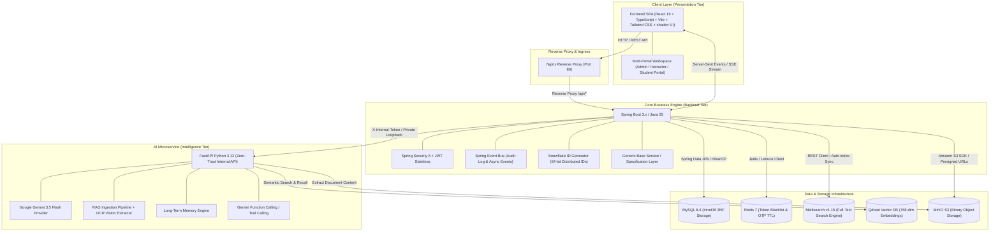
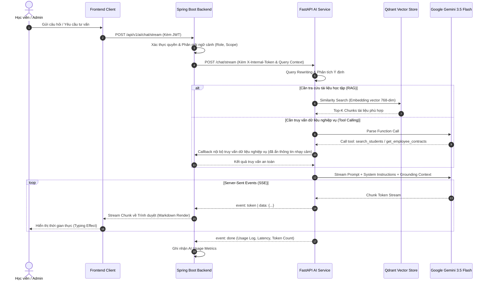
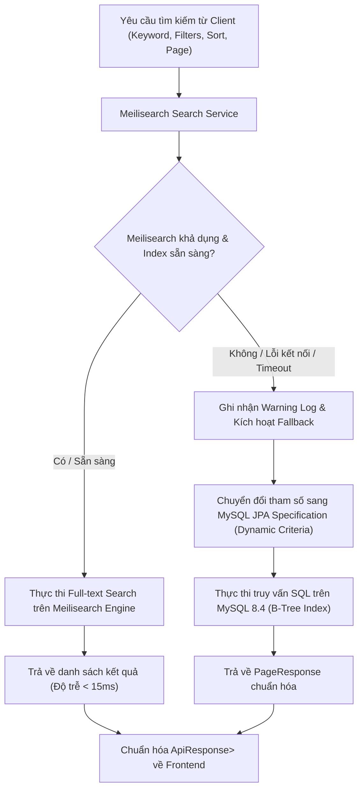
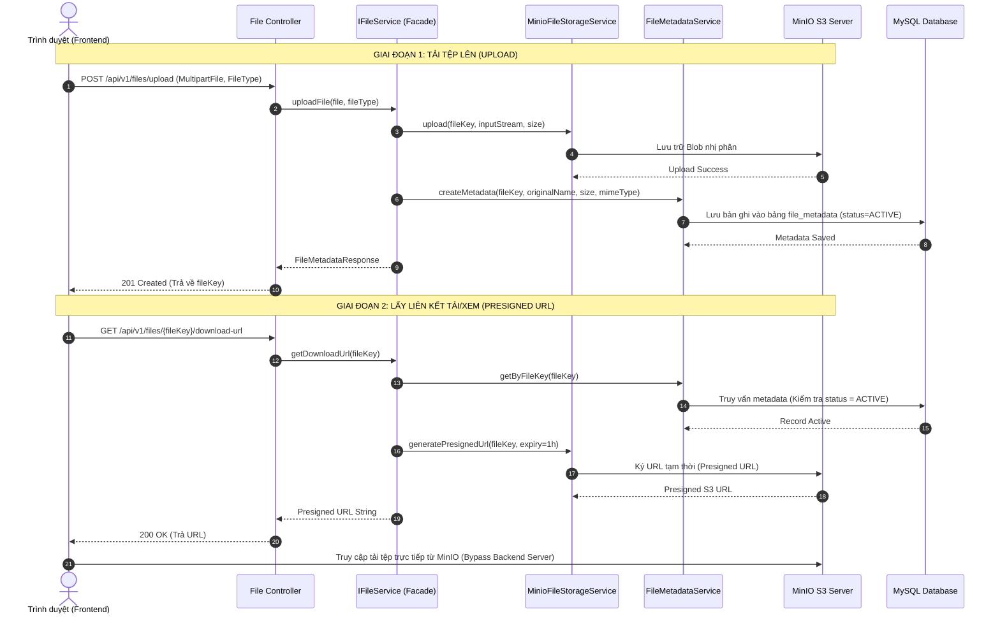
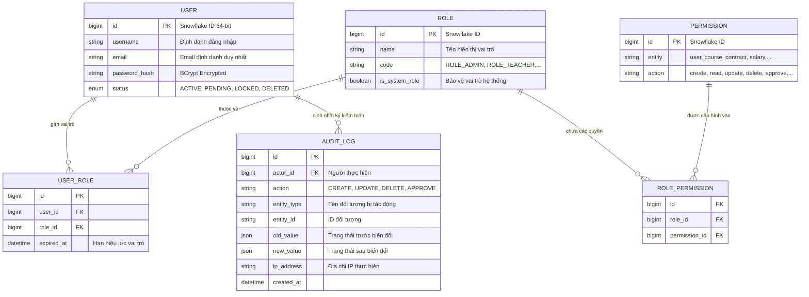
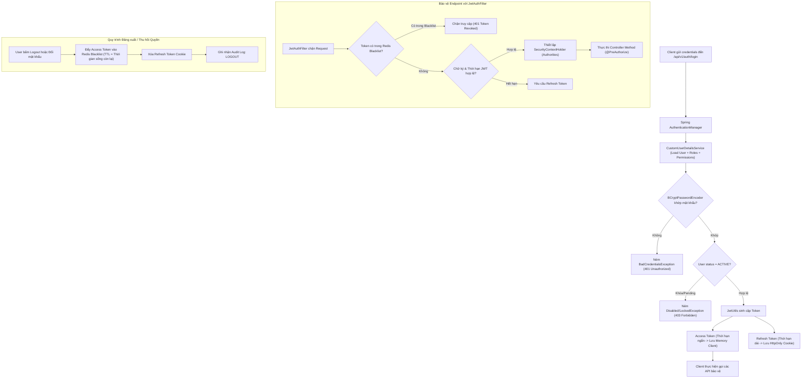
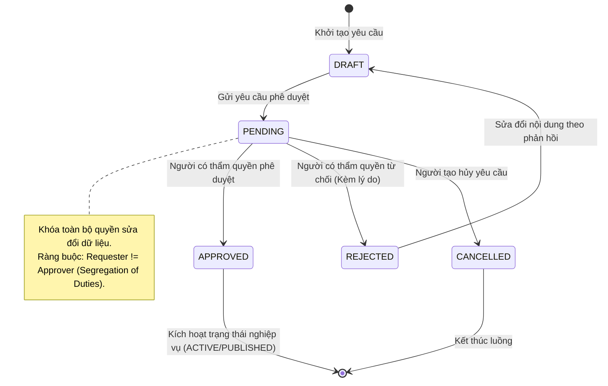
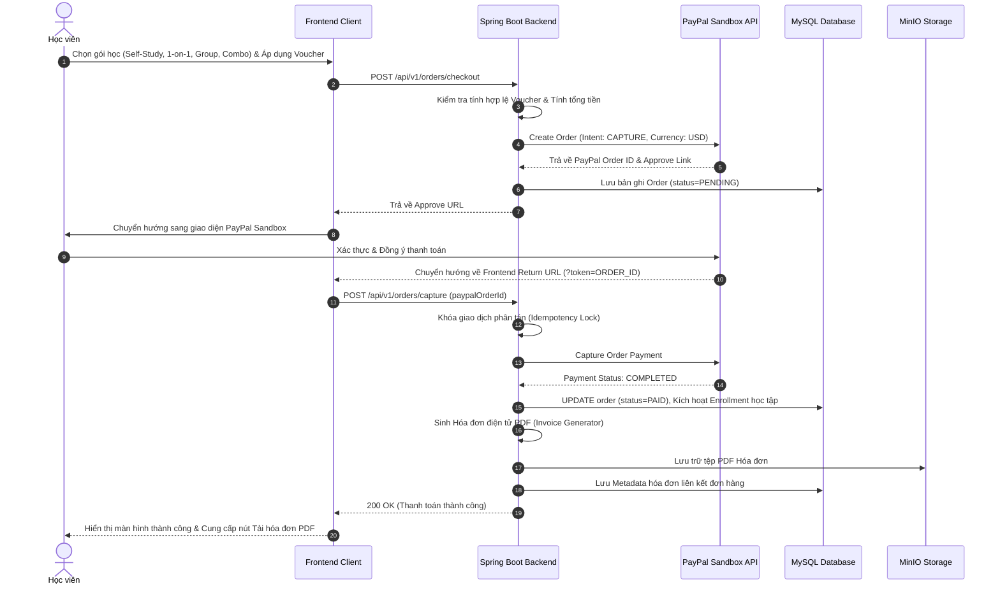

# 🎓 AI-Personalized LMS (Next-Gen Intelligent Learning Ecosystem)

<div align="center">


<p align="center">
  <b>Hệ thống Quản lý Học tập Thông minh Tích hợp Trí tuệ Nhân tạo Cá nhân hóa Lộ trình Học</b>
  <br />
  <i>Enterprise-grade Smart Learning Management System featuring Real-time AI Chat Streaming, RAG Engine, Multi-portal RBAC, Distributed Full-text Search, and S3-Compatible Object Storage.</i>
</p>

[Tổng quan kiến trúc](#-1-tổng-quan-kiến-trúc-hệ-thống) •
[Hạ tầng AI & RAG](#-2-hạ-tầng-ai--rag-engine-microservice) •
[Công cụ Tìm kiếm & Lưu trữ](#-3-hệ-thống-tìm-kiếm--lưu-trữ-phân-tán) •
[Bảo mật & Phân quyền](#-4-kiến-trúc-bảo-mật--quản-trị-dữ-liệu) •
[Nghiệp vụ cốt lõi](#-5-phân-hệ-nghiệp-vụ-doanh-nghiệp--lms) •
[Khởi chạy nhanh](#-6-hướng-dẫn-khởi-chạy-nhanh-với-docker) •
[Phát triển cục bộ](#-7-hướng-dẫn-phát-triển-cục-bộ-local-development)

</div>

---

## 1. Tổng quan Kiến trúc Hệ thống

Hệ thống được thiết kế theo mô hình **Microservices & Event-Driven Architecture**, phân tách độc lập giữa tầng giao diện (**Frontend SPA**), tầng điều phối nghiệp vụ lõi (**Backend Core**), và tầng trí tuệ nhân tạo chuyên biệt (**AI Microservice**). Toàn bộ hạ tầng phụ trợ (Cơ sở dữ liệu quan hệ, Bộ nhớ đệm phân tán, Vector Database, Search Engine và Object Storage) được điều phối đồng bộ qua Docker Container Network.



---

## 2. Hạ tầng AI & RAG Engine (Microservice)

Microservice AI vận hành hoàn toàn độc lập trên nền tảng **Python 3.12** và **FastAPI**, tuân thủ nguyên lý **Zero-Trust Security**: Không nhận kết nối trực tiếp từ Internet/Frontend và không truy cập trực tiếp MySQL nghiệp vụ; mọi giao tiếp đều phải đi qua Backend Core với header xác thực nội bộ `X-Internal-Token`.

### 2.1 Luồng Xử lý AI Chat Streaming & Dynamic Context (SSE)



### 2.2 Quy trình RAG Document Ingestion Pipeline

```mermaid
flowchart LR
    Doc["Tài liệu tải lên (PDF / DOCX / TXT / Scan Image)"] --> MinIO[("MinIO S3 Storage")]
    MinIO --> Trigger["Backend Event Trigger (Snowflake sourceId)"]
    Trigger --> Extractor["BaseExtractor Engine"]

    subgraph Extractors ["Multi-Modal Extractors"]
        PDF["PDF Extractor (PyMuPDF)"]
        DOCX["DOCX Extractor"]
        OCR["Gemini Vision OCR (Scan/Image Fallback)"]
    end

    Extractor --> Extractors
    Extractors --> Chunker["Contextual Chunker (Bảo toàn Heading & Metadata trang)"]
    Chunker --> Embedder["Gemini Embedding 2 (768-dim Vector)"]

    subgraph VectorCollections ["Qdrant Vector Database"]
        Col1[("management_knowledge")]
        Col2[("long_term_memory")]
        Col3[("public_catalog_local_*")]
    end

    Embedder --> VectorCollections
```



- **Idempotent Vector Management:** Sử dụng Snowflake ID từ MySQL làm `sourceId` trên Qdrant. Khi tài liệu được tái xuất bản hoặc cập nhật, pipeline tự động xóa các vector cũ trước khi upsert vector mới, ngăn ngừa triệt để dữ liệu trùng lặp.
- **Local Embedding cho Public Catalog:** Sử dụng mô hình `sentence-transformers/paraphrase-multilingual-MiniLM-L12-v2` cục bộ cho việc gợi ý và tìm kiếm ngữ nghĩa danh mục công khai, tối ưu chi phí và không phụ thuộc vào quota API bên ngoài.

---

## 3. Hệ thống Tìm kiếm & Lưu trữ Phân tán

### 3.1 Động cơ Tìm kiếm Toàn văn bản Meilisearch & High Availability Fallback

Hệ thống tích hợp **Meilisearch v1.15** làm Search Engine độc lập cho 4 index chính: `courses`, `categories`, `classes`, `files`. Để đảm bảo tính sẵn sàng cao (**High Availability**), toàn bộ các Service tìm kiếm được trang bị cơ chế **Fallback trong suốt** về MySQL JPA Specification.



### 3.2 Kiến trúc Lưu trữ Tệp Tin 3 Tầng (Object Storage + Presigned URLs)

Tách biệt hoàn toàn luồng dữ liệu nhị phân (Binary Streams) khỏi cơ sở dữ liệu quan hệ, giúp máy chủ Backend không bị nghẽn I/O khi người dùng tải/xem học liệu dung lượng lớn.



---

## 4. Kiến trúc Bảo mật & Quản trị Dữ liệu

### 4.1 Mô hình Phân quyền Hai tầng (RBAC 2-Tier Security)

Hệ thống kết hợp giữa **Role-Based Access Control** và **Fine-Grained Permissions** nhằm kiểm soát quyền truy cập chi tiết đến từng hành vi nghiệp vụ.



### 4.2 Vòng đời Xác thực JWT Stateless & Redis Token Blacklist



---

## 💼 5. Phân hệ Nghiệp vụ Doanh nghiệp & LMS

### 5.1 Quy trình Phê duyệt Đa cấp (Approval Workflow State Machine)

Áp dụng mô hình máy trạng thái quản lý việc phê duyệt: Xuất bản khóa học, Phê duyệt hợp đồng nhân sự, và Đơn xin nghỉ phép.



### 5.2 Chu trình Thanh toán Idempotent & Kích hoạt Học tập (PayPal Sandbox)



---

## 6. Hướng dẫn Khởi chạy Nhanh với Docker

Hệ thống cung cấp sẵn cấu hình **Docker Compose** hoàn chỉnh, tự động điều phối 7 dịch vụ độc lập trong cùng một mạng ảo an toàn.

### 6.1 Yêu cầu tiên quyết
- Đã cài đặt [Docker Desktop](https://www.docker.com/products/docker-desktop/) hoặc Docker Engine (24.0+) kèm Docker Compose v2.

### 6.2 Các bước thực hiện

```bash
# 1. Clone repository về máy
git clone https://github.com/vutiendat2302/ai-personalized-lms.git
cd ai-personalized-lms

# 2. Thiết lập biến môi trường từ mẫu
cp .env.example .env
```

Mở file `.env` và cập nhật các thông số cần thiết:
```dotenv
# Khóa API Google Gemini (Lấy từ https://aistudio.google.com/)
GEMINI_API_KEY=your_gemini_api_key_here

# Cấu hình tài khoản gửi Email thông báo (Gmail App Password)
EMAIL_USERNAME=your_email@gmail.com
EMAIL_PASSWORD=your_gmail_app_password

# Cấu hình PayPal Sandbox (Tùy chọn cho thanh toán trực tuyến)
PAYPAL_CLIENT_ID=your_paypal_client_id
PAYPAL_CLIENT_SECRET=your_paypal_client_secret
```

```bash
# 3. Khởi chạy toàn bộ hệ thống bằng Docker Compose
docker compose up --build -d

# 4. Kiểm tra trạng thái hoạt động của các container
docker compose ps
```

---

## 7. Hướng dẫn Phát triển Cục bộ (Local Development)

Trong trường hợp cần phát triển tính năng mới hoặc debug từng module độc lập:

### Bước 1: Khởi động các hạ tầng lưu trữ phụ trợ
```bash
docker compose up -d mysql redis minio minio-init meilisearch qdrant
```

### Bước 2: Chạy Microservice AI (Python FastAPI)
```bash
cd ai-service
python3 -m venv .venv
source .venv/bin/activate  # Trên Windows: .venv\Scripts\activate
pip install -r requirements.txt
uvicorn app.main:app --reload --port 8000
```

### Bước 3: Chạy Backend Core (Spring Boot - Java 25)
```bash
cd backend/ailms
./mvnw spring-boot:run
```

### Bước 4: Chạy Frontend SPA (React 19 + Vite)
```bash
cd frontend/ailms-frontend
npm install
npm run dev
```

---

## 8. Danh sách Dịch vụ & Cổng truy cập

| Thành phần | Cổng Container | Địa chỉ cục bộ / URL | Mô tả chức năng |
| :--- | :---: | :--- | :--- |
| **Frontend Web App** | `80` | `http://localhost` (Docker) / `http://localhost:5173` (Dev) | Single Page Application đa phân hệ giao diện |
| **Backend REST API** | `8080` | `http://localhost:8080/api/v1` | Cổng API trung tâm của toàn bộ hệ thống |
| **AI Microservice** | `8000` | `http://127.0.0.1:8000` *(Internal Only)* | Xử lý LLM Streaming, RAG và Vector Embedding |
| **MinIO Web Console** | `9001` | `http://localhost:9001` *(User: `minioadmin` / Pass: `minioadmin123`)* | Bảng điều khiển quản lý Object Storage S3 |
| **Meilisearch Engine** | `7700` | `http://localhost:7700` | REST API công cụ tìm kiếm toàn văn bản |
| **Qdrant Vector DB** | `6333` | `http://localhost:6333/dashboard` | Bảng điều khiển trực quan hóa Vector Collections |
| **MySQL Server** | `3306` | `localhost:3306` *(Database: `ailms`)* | Cơ sở dữ liệu quan hệ nghiệp vụ |
| **Redis Server** | `6379` | `localhost:6379` | Bộ nhớ đệm phân tán & Quản lý Token Blacklist |

---

## 9. Tài khoản Mặc định & Dữ liệu Phát triển (Seed Data)

Khi biến môi trường `SPRING_PROFILES_ACTIVE=seed` được kích hoạt, hệ thống tự động khởi tạo dữ liệu mẫu:

| Vai trò (Role) | Email tài khoản | Mật khẩu mặc định | Không gian truy cập tương ứng |
| :--- | :--- | :--- | :--- |
| **Super Admin** | `admin@ailms.com` | `Password@123` | Toàn quyền quản trị hệ thống (`/admin`) |
| **HR Manager** | `hr@ailms.com` | `Password@123` | Quản lý hồ sơ nhân sự, hợp đồng, chấm công |
| **Teacher / Giảng viên** | `teacher@ailms.com` | `Password@123` | Quản lý học liệu, soạn bài, nhận lớp (`/teacher`) |
| **Teaching Assistant** | `ta@ailms.com` | `Password@123` | Nhận lớp hỗ trợ, đánh giá buổi học trực tuyến |
| **Student / Học viên** | `student@ailms.com` | `Password@123` | Không gian học tập cá nhân hóa (`/student`) |

---

## 10. Kiểm thử & Đảm bảo Chất lượng Mã nguồn

```bash
# Kiểm thử Backend Spring Boot
cd backend/ailms
./mvnw test

# Kiểm thử AI Service Pytest
cd ai-service
pytest

# Kiểm tra cú pháp và build Frontend
cd frontend/ailms-frontend
npm run lint
npm run build
```

---

## 11. Quy chuẩn Đóng góp (Contributing) & Cam kết Mã nguồn

1. **Fork** repository trên GitHub.
2. Tạo nhánh làm việc: `git checkout -b feature/ten-tinh-nang`.
3. Tuân thủ chuẩn ghi nhận commit **Conventional Commits**:
   - `feat:` Bổ sung tính năng mới.
   - `fix:` Sửa lỗi phát sinh.
   - `refactor:` Tái cấu trúc mã nguồn tối ưu hiệu năng.
   - `config:` Thay đổi cấu hình môi trường / container.
   - `docs:` Cập nhật tài liệu kiến trúc.
   - `test:` Bổ sung kiểm thử tự động.
4. Đảm bảo toàn bộ test case đều pass trước khi tạo **Pull Request**.

---

## 12. Giấy phép (License)

Dự án được phân phối dưới giấy phép mã nguồn mở **MIT License**. Xem chi tiết tại tệp [LICENSE](LICENSE).

<div align="center">
  <sub>Được thiết kế và phát triển với các tiêu chuẩn công nghệ cao bởi <b>Vũ Tiến Đạt</b> và cộng sự.</sub>
</div>
