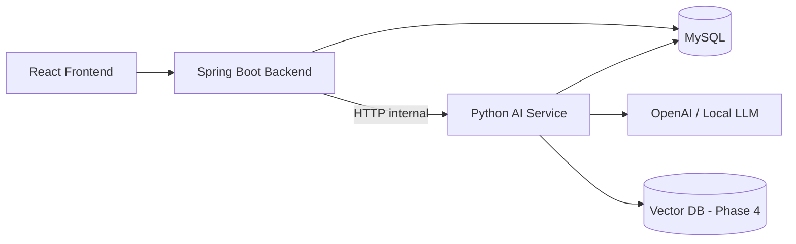
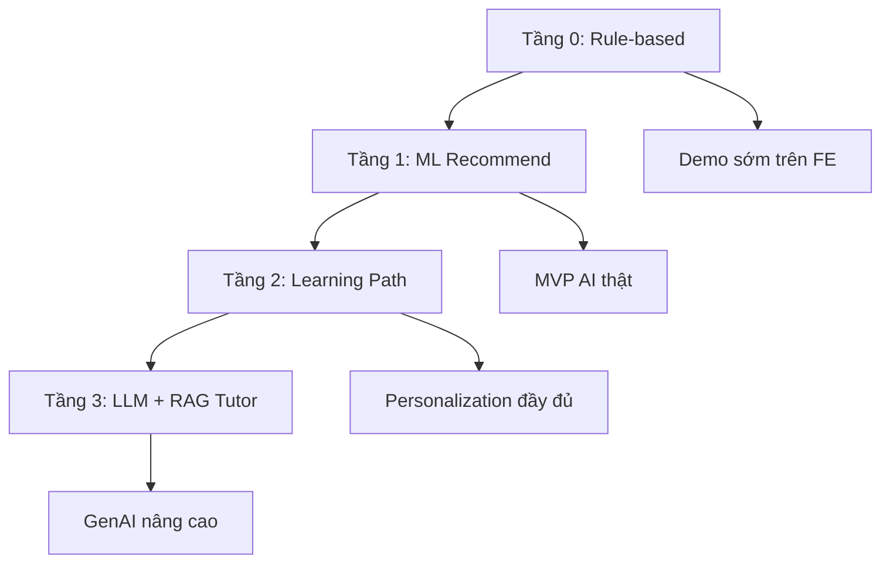
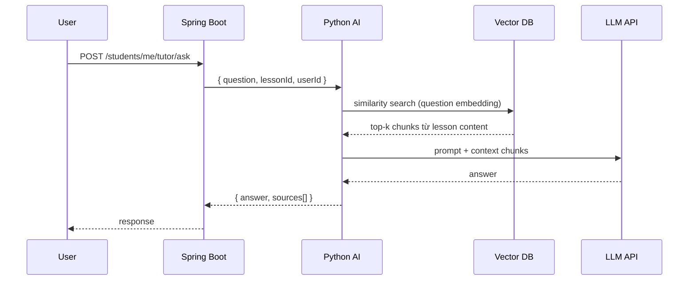

# Lộ trình phát triển AI Service — AI Personalized LMS

> Hướng dẫn thiết kế, triển khai và tích hợp AI Service (Python) với Backend Spring Boot.
>
> **Cập nhật:** 2026-07-11

---

## 1. Mục tiêu AI trong dự án

AI Service hỗ trợ LMS cá nhân hóa trải nghiệm học tập:

- Gợi ý bài học / quiz tiếp theo phù hợp với tiến độ
- Phát hiện chủ đề yếu, gợi ý ôn tập
- Xây lộ trình học (learning path) theo hành vi từng học sinh
- (Phase sau) AI Tutor — hỏi đáp, giải thích câu sai bằng LLM + RAG

**Nguyên tắc:** Đi từ **đơn giản → thông minh dần**. Không nhảy thẳng vào deep learning khi chưa có dữ liệu và luồng LMS ổn định.

---

## 2. Điều kiện tiên quyết (Backend phải có trước)

AI chỉ có ý nghĩa khi Backend đã thu được **dữ liệu hành vi thật** từ Phase 3–4 trong [DEVELOPMENT_ROADMAP.md](../backend/DEVELOPMENT_ROADMAP.md).

| Dữ liệu | Bảng / nguồn | Dùng cho |
|---|---|---|
| Tiến độ bài học | `lesson_progress`, `course_progress` | Next lesson, % hoàn thành |
| Điểm quiz, số lần làm | `quiz_attempt`, `quiz_answer` | Phát hiện yếu, ôn tập |
| Nộp bài / điểm | `submission` | Deadline, completion |
| Hành vi học | `learning_activity_log` | Pattern, streak, thời gian học |
| Cấu trúc khóa học | `course`, `course_section`, `lesson` | Thứ tự bài, prerequisite |
| Mục tiêu học | `study_goal` | Streak, target hàng ngày |

**Rule of thumb:** Có ít nhất vài chục event/user thật (hoặc synthetic data realistic) trước khi đánh giá model.

---

## 3. Kiến trúc tổng thể



### Vai trò từng thành phần

| Thành phần | Trách nhiệm |
|---|---|
| **Spring Boot** | Auth (JWT), business rules, gọi AI, cache, fallback |
| **Python AI Service** | Recommend, phân tích hành vi, scoring, (sau) RAG/LLM |
| **MySQL** | Source of truth — AI đọc qua BE hoặc read-only connection |
| **Redis** (optional) | Cache kết quả recommend 5–15 phút |
| **Vector DB** (Phase 4) | Lưu embedding nội dung lesson cho RAG |

### Nguyên tắc tách service

- **Không** nhét logic ML/LLM vào Java service — khó iterate model
- AI Service **internal only** — không expose public internet trực tiếp
- Mọi request từ FE đi qua Spring Boot (đã verify JWT + permission)

---

## 4. Cấu trúc thư mục đề xuất

```
ai-personalized-lms/
├── backend/                 # Spring Boot (đã có)
├── frontend/                # React
├── ai-service/              # ← Python service
│   ├── app/
│   │   ├── main.py                  # FastAPI entry
│   │   ├── config.py                # env, DB URL, LLM keys
│   │   ├── routers/
│   │   │   ├── health.py
│   │   │   ├── recommend.py         # Tầng 0–2
│   │   │   ├── learning_path.py
│   │   │   └── tutor.py             # Tầng 3 (LLM + RAG)
│   │   ├── services/
│   │   │   ├── rule_engine.py       # Tầng 0
│   │   │   ├── recommender.py       # Tầng 1–2
│   │   │   ├── profile_builder.py   # Gom features từ payload BE
│   │   │   └── rag_service.py       # Tầng 3
│   │   ├── models/
│   │   │   ├── request.py           # Pydantic schemas
│   │   │   └── response.py
│   │   └── utils/
│   ├── tests/
│   ├── requirements.txt
│   ├── Dockerfile
│   └── AI_DEVELOPMENT.md            # File này
└── database/
```

---

## 5. Lộ trình 4 tầng AI



---

### Tầng 0 — Rule-based Engine

**Thời gian:** ~1 tuần  
**Mục tiêu:** Demo “gợi ý học tập” trên FE mà chưa cần ML.

#### Logic cơ bản

```
IF lesson chưa complete:
    → recommend bài tiếp theo (theo orderIndex trong section)
ELIF quiz_score < pass_score:
    → recommend làm lại quiz / xem lại lesson liên quan
ELIF assignment chưa nộp AND sắp hết deadline:
    → nhắc nộp bài
ELSE:
    → recommend section / lesson kế tiếp trong course
```

#### Pseudocode

```python
def recommend_next(profile: LearningProfile) -> RecommendationResponse:
    if profile.incomplete_lessons:
        return next_by_order(profile.incomplete_lessons)
    if profile.weak_quizzes:
        return retake_quiz(profile.weak_quizzes[0])
    if profile.pending_assignments:
        return remind_assignment(profile.pending_assignments[0])
    return next_in_course_tree(profile)
```

#### Deliverable

- FastAPI service chạy được
- Endpoint `/recommend` trả JSON có `reason` giải thích
- Spring Boot proxy + fallback cùng logic rule trong Java (khi AI down)

---

### Tầng 1 — Recommendation Engine (ML cơ bản)

**Thời gian:** 2–3 tuần  
**Stack:** FastAPI + pandas + scikit-learn (hoặc thư viện `surprise`)

#### Input features

| Feature | Nguồn |
|---|---|
| `user_id` | JWT / payload BE |
| `lesson_id`, `section_id`, `course_id` | Course tree |
| `completed`, `progress_percent` | `lesson_progress` |
| `time_spent_sec`, `attempt_count` | `lesson_progress`, `quiz_attempt` |
| `quiz_score`, `is_passed` | `quiz_attempt` |
| `avg_quiz_score` | `course_progress` |

#### Mô hình gợi ý (chọn 1 để bắt đầu)

| Approach | Khi nào dùng | Độ phức tạp |
|---|---|---|
| **Content-based** | Ít user, nhiều course — so similarity nội dung + level | Thấp |
| **Collaborative filtering** | Nhiều user cùng course — “user giống bạn học gì” | Trung bình |
| **Hybrid** | Production — kết hợp cả hai | Cao hơn |

**Khuyến nghị cho đồ án:** Bắt đầu **content-based** (lesson cùng section, difficulty proxy từ quiz score).

#### Output

- Top 5 lesson/quiz nên học
- Danh sách topic yếu (score thấp + nhiều attempt)

#### Lưu model

```python
# Train offline → save
import joblib
joblib.dump(model, "models/recommender_v1.joblib")

# API load khi startup
model = joblib.load("models/recommender_v1.joblib")
```

---

### Tầng 2 — Learning Path cá nhân hóa

**Thời gian:** 2–3 tuần  
**Mục tiêu:** Trả về lộ trình có cấu trúc, không chỉ 1 bài gợi ý.

#### Signals → hành vi

| Signal | Suy luận | Hành động AI |
|---|---|---|
| Xem video nhiều hơn đọc text | Visual learner | Ưu tiên lesson dạng video |
| Quiz nhanh + điểm cao | Level cao | Skip bài intro, đẩy nhanh |
| Fail quiz nhiều lần | Gap kiến thức | Slow path, gợi ý prerequisite |
| Streak thấp, ít login | Mất động lực | Bài ngắn, nhắc nhẹ |
| Hoàn thành đúng deadline | Kỷ luật tốt | Giao bài nâng cao |

#### Response mẫu

```json
{
  "courseId": 1001,
  "pathType": "standard",
  "estimatedMinutes": 45,
  "nextLessons": [
    {
      "lessonId": 123,
      "title": "Giới thiệu Spring Security",
      "reason": "Bài tiếp theo trong section, chưa hoàn thành",
      "priority": 1
    }
  ],
  "reviewItems": [
    {
      "quizId": 45,
      "reason": "Điểm 55%, dưới pass score 70%",
      "priority": 2
    }
  ],
  "reminders": [
    {
      "assignmentId": 78,
      "dueInHours": 24,
      "reason": "Sắp hết hạn nộp bài"
    }
  ]
}
```

---

### Tầng 3 — LLM + RAG (GenAI)

**Thời gian:** 2+ tuần — **chỉ làm sau khi Tầng 0–2 ổn**

#### Use case phù hợp LMS

| Feature | Mô tả |
|---|---|
| **AI Tutor** | Hỏi đáp theo nội dung lesson |
| **Giải thích câu sai** | Sau quiz — giải thích vì sao đáp án sai |
| **Tóm tắt bài học** | Summary nội dung lesson |
| **Gợi ý bằng ngôn ngữ tự nhiên** | “Tuần này nên học gì?” |

#### RAG Pipeline



#### Stack gợi ý

| Thành phần | Lựa chọn |
|---|---|
| Embedding | OpenAI `text-embedding-3-small` hoặc `sentence-transformers` (local) |
| Vector DB | Chroma (dev) / pgvector (prod gắn MySQL) |
| LLM | OpenAI GPT / Google Gemini / Ollama (local) |
| Framework | LangChain hoặc LlamaIndex (optional) |

#### Guardrails bắt buộc

- Chỉ trả lời dựa trên context retrieved — không bịa ngoài syllabus
- System prompt: “Nếu không có trong tài liệu, nói không biết”
- Không expose API key LLM ra FE
- Log prompt/response để audit (không log PII nhạy cảm)

---

## 6. API Contract

### 6.1 Luồng gọi (FE → BE → AI)

```
Frontend  →  Spring Boot (/api/v1/students/me/...)  →  Python AI (internal)
```

FE **không** gọi trực tiếp Python service.

---

### 6.2 Endpoints Spring Boot (public cho FE)

| Method | Endpoint | Mô tả | Tầng |
|---|---|---|---|
| GET | `/api/v1/students/me/recommendations` | Gợi ý bài/quiz hôm nay | 0–2 |
| GET | `/api/v1/students/me/learning-path?courseId=` | Lộ trình học cá nhân | 2 |
| GET | `/api/v1/students/me/weak-topics?courseId=` | Chủ đề yếu cần ôn | 1–2 |
| POST | `/api/v1/students/me/tutor/ask` | Hỏi AI tutor (RAG) | 3 |

Query params tùy chọn: `courseId`, `limit` (default 5).

---

### 6.3 Endpoints Python AI (internal)

Base URL: `http://ai-service:8000` (Docker network) hoặc `http://localhost:8000` (dev)

#### `GET /health`

```json
{ "status": "ok", "version": "0.1.0", "model": "rule-engine-v1" }
```

#### `POST /recommend`

**Request** (BE gom từ DB, gửi sang AI):

```json
{
  "userId": 10001,
  "courseId": 2001,
  "enrollmentId": 3001,
  "progress": {
    "completedLessonIds": [101, 102],
    "incompleteLessonIds": [103, 104],
    "progressPercent": 40,
    "avgQuizScore": 72.5
  },
  "quizAttempts": [
    { "quizId": 501, "score": 55, "passScore": 70, "attemptNumber": 2 }
  ],
  "pendingAssignments": [
    { "assignmentId": 601, "dueDate": "2026-07-15T23:59:59", "submitted": false }
  ],
  "recentActivity": [
    { "eventType": "LESSON_VIEW", "entityId": 102, "occurredAt": "2026-07-11T10:00:00" }
  ],
  "courseTree": {
    "sections": [
      {
        "sectionId": 10,
        "lessons": [
          { "lessonId": 101, "orderIndex": 0, "title": "Intro" },
          { "lessonId": 102, "orderIndex": 1, "title": "Setup" }
        ]
      }
    ]
  },
  "limit": 5
}
```

**Response:**

```json
{
  "recommendations": [
    {
      "type": "LESSON",
      "entityId": 103,
      "title": "Spring Boot Basics",
      "reason": "Bài tiếp theo chưa hoàn thành trong section",
      "priority": 1,
      "estimatedMinutes": 15
    },
    {
      "type": "QUIZ",
      "entityId": 501,
      "title": "Quiz Section 1",
      "reason": "Điểm 55% — dưới pass score 70%",
      "priority": 2,
      "estimatedMinutes": 10
    }
  ],
  "engine": "rule-engine-v1",
  "generatedAt": "2026-07-11T17:00:00"
}
```

#### `POST /learning-path`

Request tương tự `/recommend` + thêm `horizonDays` (số ngày lên kế hoạch, default 7).

Response: object `LearningPathResponse` như mục Tầng 2.

#### `POST /tutor/ask` (Tầng 3)

**Request:**

```json
{
  "userId": 10001,
  "lessonId": 103,
  "question": "JWT và Session khác nhau thế nào?",
  "conversationId": "uuid-optional"
}
```

**Response:**

```json
{
  "answer": "JWT là token stateless...",
  "sources": [
    { "lessonId": 103, "chunkIndex": 2, "excerpt": "..." }
  ],
  "conversationId": "uuid"
}
```

---

## 7. Tích hợp Spring Boot

### 7.1 Service skeleton

```java
@Service
@RequiredArgsConstructor
public class AiRecommendationService {

    private final AiServiceClient aiClient;
    private final LearningProfileBuilder profileBuilder;

    public RecommendationResponse getRecommendations(Long userId, Long courseId) {
        LearningProfilePayload payload = profileBuilder.build(userId, courseId);
        try {
            return aiClient.post("/recommend", payload, RecommendationResponse.class);
        } catch (AiServiceException ex) {
            return ruleBasedFallback(payload); // Tầng 0 fallback trong Java
        }
    }
}
```

### 7.2 WebClient config

```yaml
# application.yml
ai:
  service:
    base-url: http://localhost:8000
    connect-timeout: 3s
    read-timeout: 10s
    cache-ttl: 10m
```

### 7.3 Best practices

| Practice | Lý do |
|---|---|
| Timeout ngắn (3–10s) | AI chậm không block UX |
| Fallback rule-based trong Java | AI down vẫn có gợi ý cơ bản |
| Cache Redis 5–15 phút | Recommend không cần realtime từng giây |
| BE verify JWT trước khi gọi AI | AI service trust internal network only |
| Không gửi password/email sang AI | Chỉ gửi learning profile cần thiết |

---

## 8. Data pipeline — chuẩn bị từ Backend (Phase 3–4)

Backend cần làm **trước khi** AI service đọc data có ý nghĩa:

### 8.1 Event logging tự động

`LearningActivityLog` **không** để FE tự POST. Ghi từ service layer:

| Event | Trigger |
|---|---|
| `LESSON_VIEW` | Student mở lesson |
| `LESSON_COMPLETE` | `progressPercent >= 100` hoặc explicit complete |
| `QUIZ_START` | Start attempt |
| `QUIZ_SUBMIT` | Submit attempt |
| `ASSIGNMENT_SUBMIT` | Nộp bài |
| `ASSIGNMENT_GRADED` | GV chấm xong |

### 8.2 Internal API cho AI (optional)

```
GET /internal/ai/users/{userId}/learning-profile?courseId=
```

Chỉ callable từ internal network / service account. Trả payload chuẩn cho Python (mục 6.3).

### 8.3 Batch aggregate (optional, scale lớn)

Job nightly tạo bảng `user_learning_summary`:

```sql
-- Ví dụ schema
user_id, course_id, completed_lessons, avg_quiz_score,
weak_topic_ids, last_active_at, streak_days, updated_at
```

AI query bảng summary thay vì join nhiều bảng mỗi request.

---

## 9. Tech stack đề xuất

| Thành phần | Dev | Production |
|---|---|---|
| API framework | FastAPI | FastAPI + Uvicorn |
| ML | scikit-learn, pandas | + joblib model files |
| LLM (Tầng 3) | OpenAI API / Ollama local | OpenAI / Azure OpenAI |
| Vector DB | Chroma (file-based) | pgvector / Pinecone |
| Container | Docker Compose | Docker / K8s |
| Monitoring | loguru / structlog | + Prometheus metrics |

### requirements.txt (starter)

```txt
fastapi>=0.110.0
uvicorn[standard]>=0.27.0
pydantic>=2.0.0
pandas>=2.0.0
scikit-learn>=1.4.0
joblib>=1.3.0
httpx>=0.27.0
python-dotenv>=1.0.0

# Phase 3
# openai>=1.0.0
# chromadb>=0.4.0
# langchain>=0.1.0
```

---

## 10. Docker Compose (dev)

```yaml
# docker-compose.ai.yml (snippet)
services:
  ai-service:
    build: ./ai-service
    ports:
      - "8000:8000"
    environment:
      - AI_ENGINE=rule-engine-v1
      - LOG_LEVEL=debug
    depends_on:
      - mysql
    networks:
      - ailms-internal

  backend:
    environment:
      - AI_SERVICE_BASE_URL=http://ai-service:8000
    networks:
      - ailms-internal
```

---

## 11. Lộ trình thời gian thực tế

| Giai đoạn | Song song BE | Output | Thời gian |
|---|---|---|---|
| **Chuẩn bị data** | Phase 3–4 BE (log + auto progress) | Event chuẩn, profile builder | 1–2 tuần |
| **Tầng 0** | Sau enrollment + lesson view | Rule-based + FastAPI + BE proxy | 1 tuần |
| **Tầng 1** | Sau quiz flow | ML recommend v1 | 2–3 tuần |
| **Tầng 2** | Dashboard FE | Learning path API | 2–3 tuần |
| **Tầng 3** | LMS ổn định | RAG tutor, giải thích câu sai | 2+ tuần |

---

## 12. Demo / đồ án — tối thiểu cần có

Để demo đủ “AI Personalized LMS” trong báo cáo:

1. **Rule-based recommend** — bài tiếp theo + ôn quiz yếu + nhắc deadline
2. **1 card trên FE** — “Gợi ý hôm nay” gọi `/students/me/recommendations`
3. **1 tính năng LLM nhỏ** (optional nhưng ấn tượng) — giải thích câu quiz sai qua RAG

Ba mục trên đủ minh chứng personalization mà không cần train model lớn.

---

## 13. Tiêu chí Done từng tầng

| Tầng | Done khi |
|---|---|
| **0** | FE hiển thị gợi ý có `reason`; BE fallback khi AI down |
| **1** | Recommend cải thiện so với rule-only (A/B hoặc metric offline) |
| **2** | Learning path 7 ngày theo course; weak-topics chính xác với quiz score |
| **3** | Tutor trả lời dựa trên nội dung lesson; có source citation |

---

## 14. Metrics đánh giá (khi có data)

| Metric | Công thức / ý nghĩa |
|---|---|
| **Completion rate** | % gợi ý được user hoàn thành trong 24h |
| **Quiz improvement** | Điểm lần 2 − lần 1 sau gợi ý ôn |
| **Click-through** | User click vào item gợi ý / tổng impression |
| **Fallback rate** | % request dùng Java rule fallback (AI down) |

---

## 15. Tài liệu liên quan

- [README.md](../README.md) — Tổng quan dự án
- [backend/DEVELOPMENT_ROADMAP.md](../backend/DEVELOPMENT_ROADMAP.md) — Lộ trình Backend (Phase 5 = AI)
- [backend/BACKEND.md](../backend/BACKEND.md) — Auth, JWT, RBAC
- [database/DATABASE.md](../database/DATABASE.md) — Schema database

---

## 16. Tóm tắt

> **AI = Python service riêng (FastAPI). Bắt đầu rule-based → ML recommend → learning path → LLM/RAG. Chỉ triển khai sau khi Backend thu được log và progress thật. Spring Boot làm gateway + fallback; FE không gọi AI trực tiếp.**
