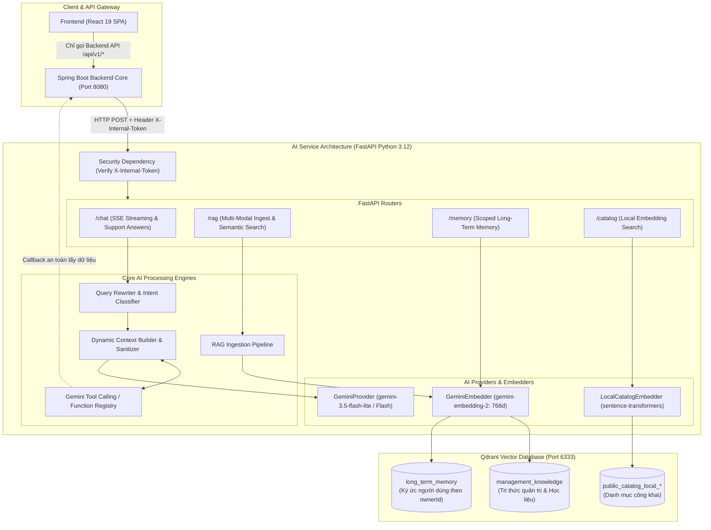
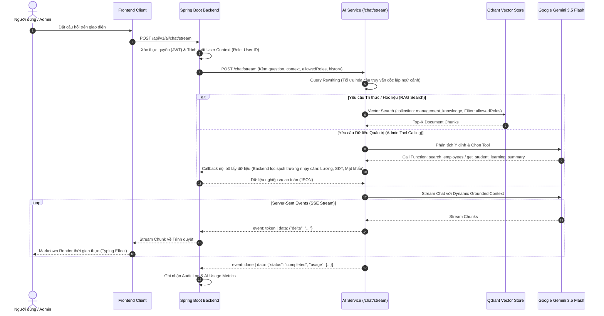
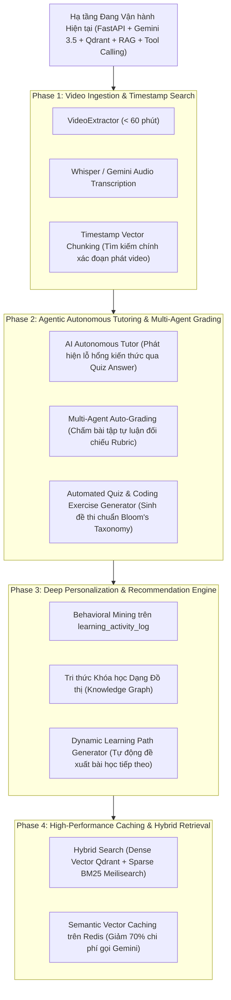

# 🤖 AILMS AI Service — Intelligent Engine & RAG Microservice

<div align="center">


<p align="center">
  <b>Microservice Trí tuệ Nhân tạo Độc lập Cung cấp Trợ lý AI, RAG Đa định dạng, Bộ nhớ Dài hạn và Truy vấn Nghiệp vụ Phân quyền</b>
  <br />
  <i>Enterprise AI Microservice powering Real-time SSE Chat Streaming, Multi-modal RAG (PDF/DOCX/OCR), Long-Term Memory, and Safe Function Calling.</i>
</p>

</div>

---

## 1. Kiến trúc Tổng thể & Nguyên lý Zero-Trust

`ai-service` được xây dựng như một **Microservice độc lập** phục vụ riêng cho Backend Spring Boot. Service áp dụng mô hình bảo mật **Zero-Trust & Data Isolation**:
- **Không công khai ra Internet:** Chỉ lắng nghe trên mạng nội bộ Docker (`ailms-network`) hoặc bind `127.0.0.1:8000` trên môi trường phát triển cục bộ.
- **Không truy cập trực tiếp MySQL nghiệp vụ:** Ngăn ngừa nguy cơ rò rỉ dữ liệu nhạy cảm (lương, mật khẩu, thông tin cá nhân). Dữ liệu nghiệp vụ chỉ được cấp phát theo ngữ cảnh an toàn từ Backend qua cơ chế Tool Calling.
- **Xác thực Token Nội bộ Bắt buộc:** Mọi endpoint (trừ `/test/health`) đều yêu cầu header `X-Internal-Token` khớp với `AI_INTERNAL_SECRET`.
- **Chuẩn hóa Định danh Dạng String:** Tất cả ID (Snowflake ID, Course ID, User ID) truyền qua biên API đều ở dạng `string` để bảo toàn độ chính xác 64-bit.



---

## 2. AI Chat Streaming Thời gian thực & Tool Calling (SSE)

### 2.1 Luồng Xử lý Trò chuyện Dạng dòng (Server-Sent Events)

Endpoint `/chat/stream` tiếp nhận yêu cầu từ Backend và sinh phản hồi dạng dòng theo chuẩn SSE:
- **`event: token`**: Gửi từng phần phản hồi (`{"delta": "..."}`) ngay khi LLM sinh token, tạo hiệu ứng gõ chữ mượt mà.
- **`event: error`**: Truyền tải thông báo lỗi có cấu trúc khi gặp sự cố mạng hoặc vượt quota.
- **`event: done`**: Kết thúc phiên truyền tải kèm metadata đo lường (`usage: {prompt_tokens, completion_tokens, latency_ms}`).



### 2.2 Danh mục Tool Calling An toàn Phân quyền RBAC

Hệ thống cung cấp các Tool nội bộ được kiểm soát quyền chặt chẽ tại Backend Core:

| Tool Name | Vai trò được phép gọi | Phạm vi dữ liệu truy vấn | Quy tắc bảo mật dữ liệu |
| :--- | :--- | :--- | :--- |
| `get_system_overview` | `ROLE_ADMIN`, `ROLE_HR` | Thống kê tổng quan số lượng nhân viên, học viên, hợp đồng | Không lộ thông tin định danh cá nhân |
| `search_employees` | `ROLE_ADMIN`, `ROLE_HR` | Tìm kiếm nhân sự theo tên, mã nhân viên, phòng ban | Ẩn hoàn toàn mức lương, số CMND/CCCD, SĐT cá nhân |
| `get_employee_contracts` | `ROLE_ADMIN`, `ROLE_HR` | Tra cứu trạng thái, ngày hiệu lực/hết hạn của hợp đồng | Ẩn chi tiết điều khoản tài chính & file nhị phân |
| `search_students` | `ROLE_ADMIN`, `ROLE_TEACHER` | Tra cứu hồ sơ học viên theo mã hoặc họ tên | Ẩn địa chỉ cá nhân & thông tin người giám hộ |
| `get_student_learning_summary` | `ROLE_ADMIN`, `ROLE_TEACHER` | Thống kê tiến độ khóa học, chuỗi học liên tục (streak) | Chỉ trả về chỉ số học tập tổng hợp |

---

## 3. Đường ống RAG Ingestion Pipeline & Multi-Modal Processing

Hệ thống hỗ trợ nạp tri thức từ đa dạng định dạng tệp tin, tự động làm sạch và chuyển hóa thành Vector 768 chiều lưu trữ trên **Qdrant**:

```mermaid
flowchart LR
    Upload["Tài liệu tải lên (PDF, DOCX, TXT, PNG/JPG)"] --> ExtractorFactory["ExtractorFactory (Lựa chọn Extractor phù hợp)"]

    subgraph Extractors ["Multi-Modal Extractors"]
        TextExt["TextExtractor (Plain text / Markdown)"]
        DocxExt["DocxExtractor (Bảo toàn Heading & Cấu trúc)"]
        PdfExt["PdfExtractor (PyMuPDF trích xuất Text & Trang)"]
        VisionOCR["Gemini Vision OCR (Fallback cho PDF Scan & Ảnh)"]
    end

    ExtractorFactory --> Extractors
    Extractors --> Chunker["Contextual Chunker (Chia nhỏ 500-1000 tokens kèm Metadata)"]
    Chunker --> Embedder["Gemini Embedding 2 (768-dim Embedding Model)"]

    subgraph VectorUpsert ["Idempotent Vector Upsert"]
        DeleteOld["Xóa Vector cũ có cùng sourceId"]
        InsertNew["Upsert Vector mới (ID = sourceId + chunkIndex)"]
    end

    Embedder --> DeleteOld --> InsertNew --> QdrantCol[("Qdrant: management_knowledge")]
```



### 3.1 Cơ chế Đảm bảo Tính Nhất quán (Idempotent Ingestion)
- **`sourceId` ổn định:** Mỗi tài liệu nghiệp vụ dùng chính Snowflake ID từ MySQL làm `sourceId`.
- **Cơ chế Re-ingest an toàn:** Khi tài liệu được cập nhật hoặc chỉnh sửa, pipeline thực hiện xóa toàn bộ các vector chunk cũ có cùng `sourceId` trước khi ghi dữ liệu mới, triệt tiêu hoàn toàn rủi ro trùng lặp ngữ cảnh.
- **Fail-Closed Security:** Trường `allowedRoles` bắt buộc phải được khai báo trong request nạp; nếu Backend bỏ trống, hệ thống lập tức từ chối để ngăn chặn rò rỉ tài liệu nội bộ.

### 3.2 Chiến lược Embedding Hai Tầng (Dual Embedding Strategy)
1. **Cloud Embeddings (`gemini-embedding-2`):** Tạo vector 768 chiều cho toàn bộ học liệu, tài liệu quy chế, chính sách và ký ức dài hạn.
2. **Local Embeddings (`sentence-transformers/paraphrase-multilingual-MiniLM-L12-v2`):** Chạy trực tiếp trên CPU container để lập chỉ mục và gợi ý danh mục khóa học công khai (`public_catalog_*`), xử lý batch lên tới 500 bản ghi với chi phí 0đ và không phụ thuộc kết nối Internet ngoài.

---

## 4. Bộ nhớ Dài hạn & Phân vùng Vector (Long-Term Memory)

Hệ thống phân tách không gian vector thành 3 Collection độc lập trong Qdrant để đảm bảo an toàn dữ liệu:

| Tên Collection | Chiều Vector | Mô tả dữ liệu lưu trữ | Cơ chế phân quyền & Filter |
| :--- | :---: | :--- | :--- |
| **`management_knowledge`** | 768 | Tài liệu quy chế doanh nghiệp, chính sách đào tạo, nội dung bài học | Payload filter bắt buộc theo danh sách vai trò (`allowedRoles`) |
| **`long_term_memory`** | 768 | Ký ức hội thoại, sở thích học tập, thói quen của từng người dùng | Bắt buộc gán nhãn theo `ownerId` và `scope` (ví dụ `student_study_habits`) |
| **`public_catalog_local_*`** | 384 | Tên khóa học, danh mục, mô tả ngắn phục vụ tìm kiếm ngữ nghĩa công khai | Công khai (Public), không yêu cầu xác thực người dùng |

---

## 5. Danh mục API Nội bộ (Internal API Endpoints)

Tất cả các endpoint dưới đây đều yêu cầu Header: `X-Internal-Token: <AI_INTERNAL_SECRET>` *(ngoại trừ endpoint `/test/health`)*.

```http
# 1. Health Check
GET /test/health

# 2. Test Sinh Văn Bản
POST /test/generate
Content-Type: application/json
{
  "prompt": "Giải thích ngắn gọn khái niệm OOP trong Java."
}

# 3. AI Chat Streaming (Server-Sent Events)
POST /chat/stream
Content-Type: application/json
Accept: text/event-stream
{
  "question": "Quy định về thời gian thử việc của nhân viên như thế nào?",
  "conversationId": "345050865599516672",
  "allowedRoles": ["ROLE_ADMIN", "ROLE_HR"]
}

# 4. Sinh Tiêu Đề Cuộc Trò Chuyện (Tự động tóm tắt 1 dòng)
POST /chat/title
Content-Type: application/json
{
  "firstMessage": "Hướng dẫn tôi cách làm bài thi trắc nghiệm Java nâng cao"
}

# 5. Phản Hồi Nhanh Hỗ Trợ Công Khai (Public Support Quick Answer)
POST /chat/support-answer
Content-Type: application/json
{
  "question": "Làm thế nào để đăng ký khóa học 1 kèm 1?",
  "visitorId": "visitor-uuid-123"
}

# 6. Nạp Tri Thức RAG (Multi-Modal Ingestion)
POST /rag/ingest
Content-Type: application/json
{
  "sourceId": "lesson-345050865599516672",
  "sourceType": "pdf",
  "fileBase64": "JVBERi0xLjQK...",
  "domain": "COURSE_CONTENT",
  "allowedRoles": ["ROLE_STUDENT", "ROLE_TEACHER"],
  "metadata": {"courseId": "1001", "lessonId": "2002"}
}

# 7. Tìm Kiếm Ngữ Nghĩa RAG (Semantic Search Only)
POST /rag/search
Content-Type: application/json
{
  "query": "Điều kiện để được cấp chứng chỉ hoàn thành khóa học",
  "roles": ["ROLE_STUDENT"],
  "limit": 5
}

# 8. Ghi Ký Ức Dài Hạn (Upsert Long-term Memory)
PUT /memory/{ownerId}/{memoryId}
Content-Type: application/json
{
  "content": "Học viên thường học bài hiệu quả vào khung giờ 20h - 22h tối",
  "scope": "STUDENT_PREFERENCES"
}

# 9. Truy Hồi Ký Ức Dài Hạn (Recall Long-term Memory)
POST /memory/recall
Content-Type: application/json
{
  "ownerId": "student-123456",
  "query": "thời gian học yêu thích",
  "scope": "STUDENT_PREFERENCES",
  "limit": 3
}

# 10. Tìm Kiếm Ngữ Nghĩa Danh Mục Công Khai (Local Embedding)
POST /catalog/search
Content-Type: application/json
{
  "query": "Lập trình web với Spring Boot và React",
  "entity_type": "course",
  "limit": 10
}
```

---

## 6. Lộ trình Phát triển Nâng cấp Dựa trên Hệ thống Hiện có (Future Roadmap)

Kiến trúc hiện tại của `ai-service` được thiết kế theo tính module hóa cao, sẵn sàng mở rộng các tính năng thông minh thế hệ tiếp theo:



1. **Phase 1 — Video RAG & Timestamp Indexing:** Đăng ký thêm `VideoExtractor` vào `ExtractorFactory` để trích xuất transcript từ video bài giảng, gắn nhãn mốc thời gian (timestamp) giúp học viên tìm kiếm và nhảy thẳng tới đoạn video giải thích kiến thức.
2. **Phase 2 — Multi-Agent Auto-Grading:** Xây dựng hệ thống đa tác tử (Multi-Agent): Tác tử chấm điểm sơ bộ, Tác tử đối chiếu barem điểm (Rubric), Tác tử tổng hợp phản hồi và góp ý chi tiết cho học viên.
3. **Phase 3 — Khai phá Hành vi & Lộ trình Tự thích ứng:** Khai phá dữ liệu chuỗi sự kiện từ bảng `learning_activity_log` để xây dựng ma trận gợi ý bài học cá nhân hóa theo tốc độ tiếp thu của từng học viên.
4. **Phase 4 — Hybrid Retrieval & Semantic Caching:** Kết hợp kết quả tìm kiếm ngữ nghĩa từ Qdrant với tìm kiếm từ khóa chính xác từ Meilisearch (Reciprocal Rank Fusion - RRF); bổ sung tầng Cache ngữ nghĩa trên Redis để tái sử dụng câu trả lời cho các câu hỏi trùng lặp.

---

## 7. Hướng dẫn Khởi chạy & Kiểm thử Cục bộ (Local Setup & Pytest)

### 1. Cấu hình Môi trường
Tạo và kích hoạt môi trường ảo Python 3.12:
```bash
cd ai-service

# Tạo Virtual Environment
python3 -m venv .venv
source .venv/bin/activate  # Trên Windows: .venv\Scripts\activate

# Cài đặt thư viện phụ thuộc
pip install -r requirements.txt
```

### 2. Cấu hình Biến Môi trường (`.env`)
Tạo file `.env` trong thư mục `ai-service/` hoặc sử dụng biến môi trường do Docker Compose cung cấp:
```dotenv
GEMINI_API_KEY=your_gemini_api_key_here
GEMINI_MODEL=gemini-3.5-flash-lite
GEMINI_EMBEDDING_MODEL=gemini-embedding-2
INTERNAL_SECRET=dev_internal_secret_123
QDRANT_URL=http://localhost:6333
QDRANT_API_KEY=
BACKEND_INTERNAL_BASE_URL=http://localhost:8080
```

### 3. Khởi chạy Máy chủ Phát triển (Development Server)
```bash
uvicorn app.main:app --reload --port 8000
```
*Tài liệu Swagger UI tương tác sẽ khả dụng tại `http://localhost:8000/docs`.*

### 4. Thực thi Kiểm thử Tự động (Automated Unit & Integration Tests)
```bash
# Chạy toàn bộ test suites với pytest
pytest

# Chạy kiểm thử chi tiết và xuất báo cáo
pytest -v
```

---

<div align="center">
  <sub>Kiến trúc Microservice AI của Hệ sinh thái <b>AI Personalized LMS</b> — Thiết kế và phát triển bởi <b>Vũ Tiến Đạt</b>.</sub>
</div>
