## 1. Tổng quan Tech Stack

- **Framework:** Spring Boot 4.x + Spring Security 6.x
- **Xác thực:** JWT (Access Token + Refresh Token)
- **Mã hóa mật khẩu:** BCrypt (`PasswordEncoder`)
- **Lưu trữ OTP / Reset Token:** Redis (TTL tự động, không cần cron dọn dẹp)
- **Gửi email:** Spring Mail (`JavaMailSender`)
- **Phân quyền:** RBAC (Role-Based Access Control) 2 tầng — Role (`ROLE_XXX`) + Permission chi tiết (`entity_action`)
- **Lưu trữ File:** MinIo/S3 
- **Id** Snowflake, ngoài ra có sử dụng thêm UUID trong việc tạo mã code, ... 

### 1.1 Quy ước viết Controller & Service

| Tầng | Nhiệm vụ |
|---|---|
| **Controller** | Nhận request, gọi Service, bọc kết quả vào `ApiResponse<T>`. Không chứa logic nghiệp vụ, không try/catch. |
| **Service** | Xử lý toàn bộ logic nghiệp vụ. Gặp lỗi thì ném exception. |
| **GlobalExceptionHandler** | Bắt mọi exception, map sang đúng HTTP status, trả `ErrorResponse` thống nhất. |
 
---

### 1.2 Generic Base Layer
- Tách phần CRUD thuần và find-sort-page thành lớp base generic, entity nào không có business logic đặc biệt thì kế thừa và dùng thẳng. Entity có rule riêng (enroll, publish, permission check...) thì override hoặc viết method riêng ngoài base.


- Audit log qua Event, không gọi trực tiếp, `@EventListener` riêng ghi `audit_log` — tách khỏi business logic chính.

- Patterns: 
1. Facade: Cung cấp một giao diện đơn giản và thống nhất để truy cập một hệ thống phức tạp gồm nhiều lớp hoặc service bên trong.
2. Strategy: Định nghĩa nhiều thuật toán có thể thay thế cho nhau
3. Factory: Đóng gói việc khởi tạo đối tượng
4. State: Cho phép đối tượng thay đổi hành vi dựa trên trạng thái hiện tại, đồng thời kiểm soát các quy tắc chuyển đổi giữa các trạng thái.
5. Decorator: Bổ sung chức năng cho đối tượng một cách linh hoạt mà không cần sửa đổi mã nguồn gốc
6. Observer: 1 hành động xảy ra cần kích hoạt nhiều việc khác, nhưng các việc đó không nên phụ thuộc cứng vào nhau. 

--- 

## 2. Module Security

### 2.1. Các thành phần bảo mật chính

- Spring Security: quản lý xác thực và phân quyền.
- JWT: xác thực request giữa client và server.
- BCrypt: mã hóa mật khẩu trước khi lưu vào database.
- Role/Permission: kiểm soát quyền truy cập theo vai trò.
- Redis: dùng để vô hiệu hóa token khi đổi mật khẩu hoặc reset mật khẩu.
- OTP qua email: bảo vệ quy trình đăng ký và khôi phục mật khẩu.

--- 
- Đăng nhập: user sẽ được cấp 2 loại token là AccessToken (thời gian ngắn) và RefreshToken (thời gian dài). Khi hết thời gian của AccessToken, hệ thống sẽ kiểm tra RefreshToken và cấp lại AccessToken và RefreshToken mới.

- Access Token lưu trong state/memory phía FE, Refresh Token lưu trong cookie `httpOnly Cookie`

--- 

- Xác thực request (JWT Filter)

- Mỗi request có kèm Access Token sẽ đi qua `JwtAuthFilter` trước khi tới Controller:

---
### 2.2. Quá trình đăng nhập
1. Client gửi yêu cầu đăng nhập đến endpoint `/api/auth/login`.
2. AuthController nhận request và chuyển cho AuthService xử lý.
3. AuthService sử dụng `AuthenticationManager` để xác thực username/email và mật khẩu.
4. Spring Security gọi `CustomUserDetailsService` để tải thông tin người dùng từ cơ sở dữ liệu.
5. Hệ thống kiểm tra role và permission của người dùng.
6. Nếu xác thực thành công, server tạo:
   - Access Token để gọi các API bảo vệ
   - Refresh Token để cấp lại access token mới
7. Server trả về token cho client.

### 2.3. Quá trình truy cập API bảo vệ
1. Client gửi request kèm Bearer Token trong header `Authorization`.
2. Request đi qua `JwtAuthFilter` trước khi đến controller.
3. `JwtAuthFilter` đọc token, kiểm tra tính hợp lệ và thời gian hết hạn.
4. Nếu token hợp lệ, hệ thống lấy thông tin người dùng từ JWT.
5. Hệ thống tải role và permission từ cơ sở dữ liệu.
6. Authentication được đặt vào `SecurityContext`.
7. Spring Security thực hiện kiểm tra phân quyền trước khi cho phép request tiếp tục.

### 2.4. Sơ đồ Sequence


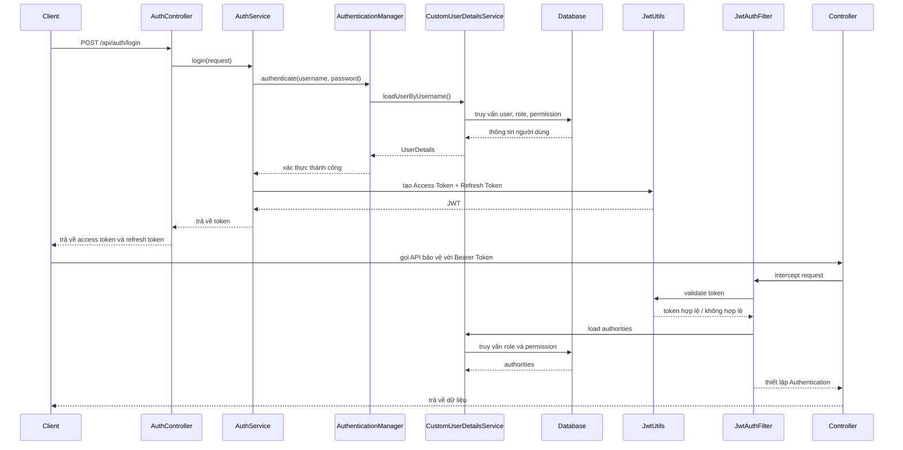


### 2.5. Flowchart

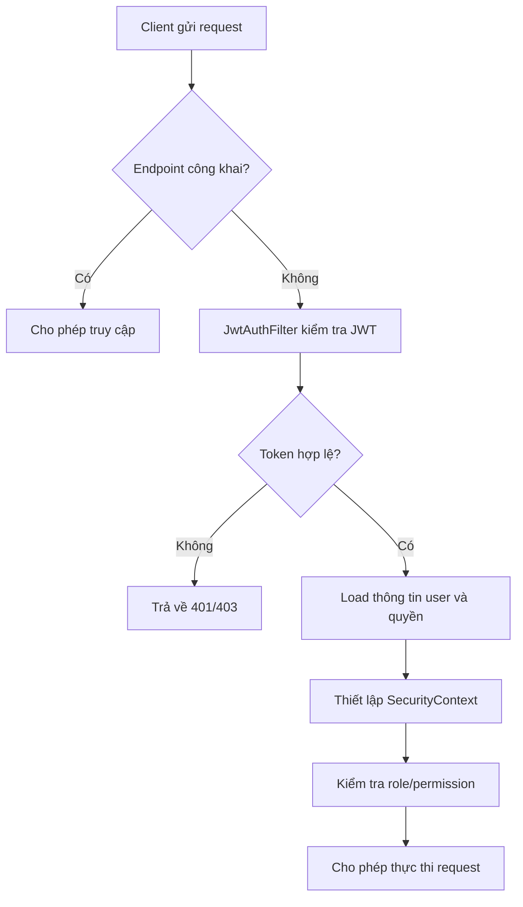

--- 

### 2.6. Đăng ký tài khoản (Student)
 
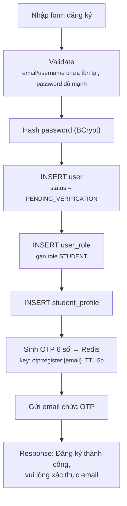
 
### 2.7. Xác thực OTP
 
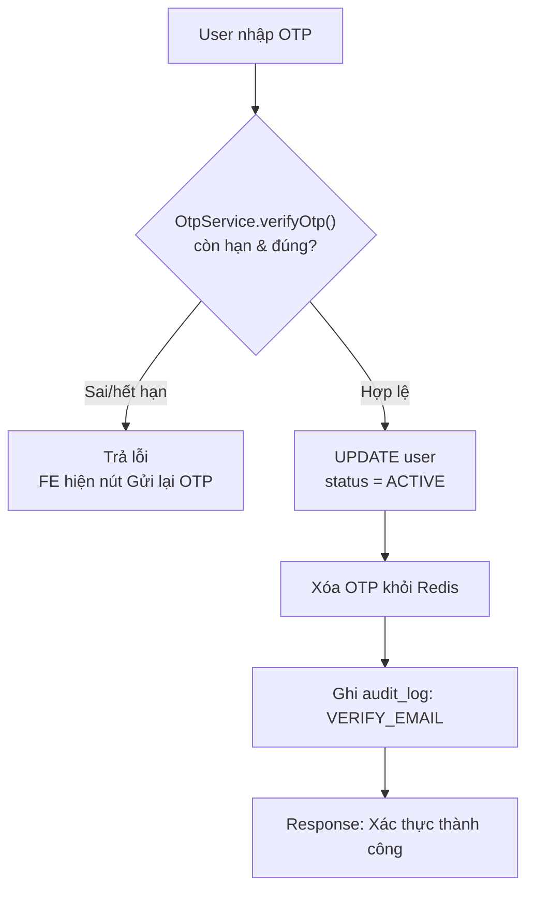
 
### 2.8. Đăng nhập
 
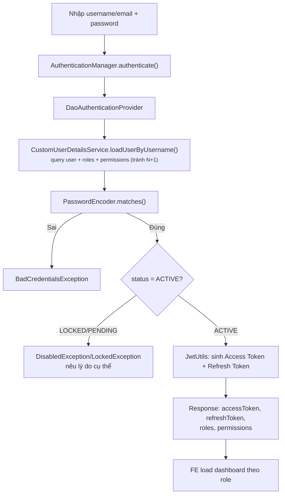
 
### 2.9. Đăng xuất
 
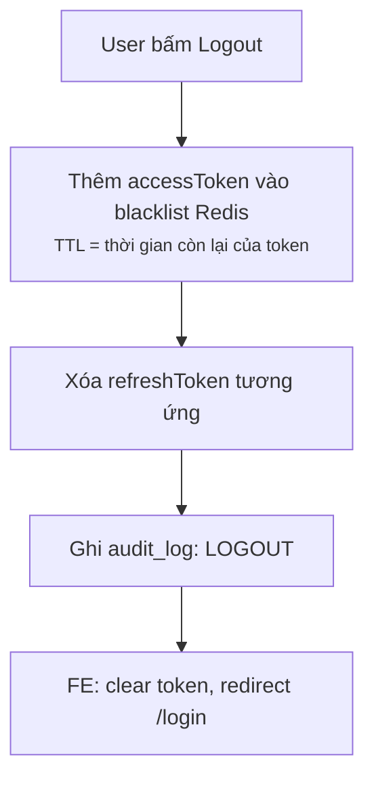
> JWT stateless nên không "xóa" token được — dùng **blacklist Redis**, `JwtAuthFilter` check thêm token có trong blacklist trước khi cho qua.
 
### 2.10. Quên mật khẩu
 
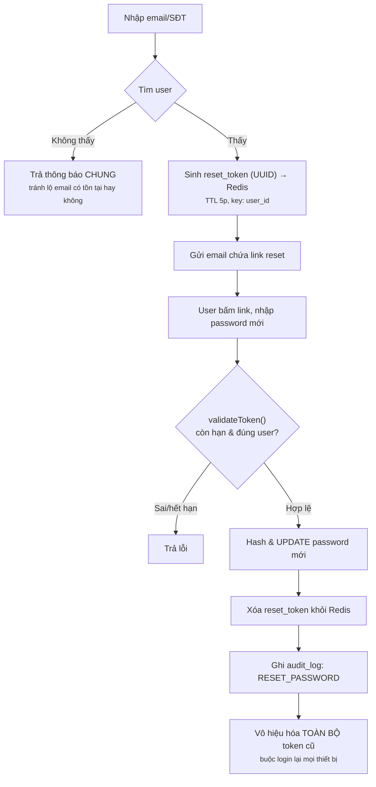
 
### 2.11. Đổi mật khẩu (đã đăng nhập)
 
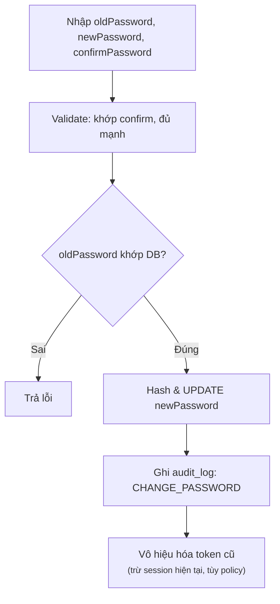
 
### 2.12. Xem / Cập nhật thông tin cá nhân
 
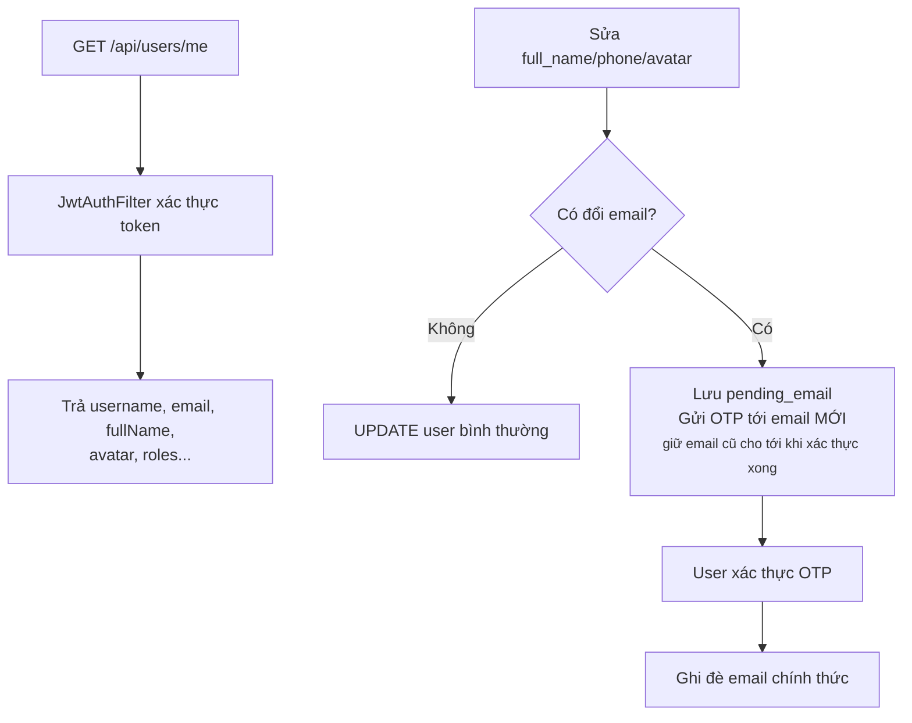

### 2.13. Invite User qua Email

### Flow

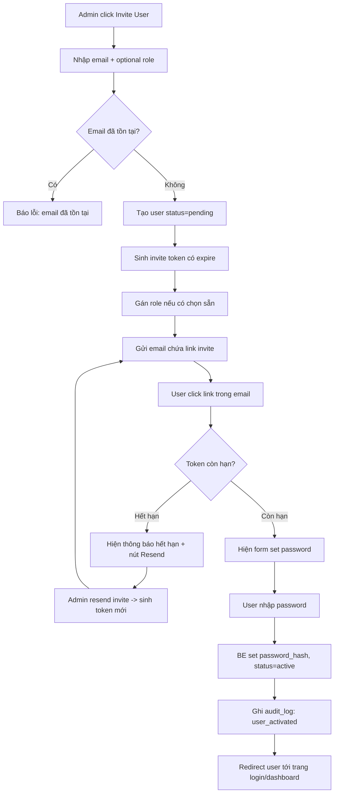
---

## 3. Module User-Role-Permission (RBAC)

### 3.1. Assign / Remove Role cho User

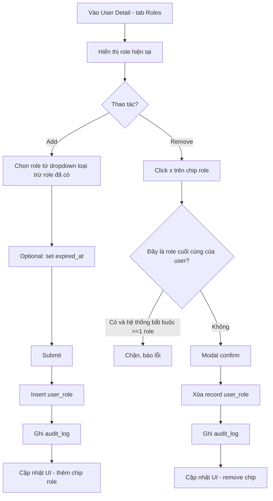


### 3.2. Bulk Action (Xóa / Gán Role hàng loạt)


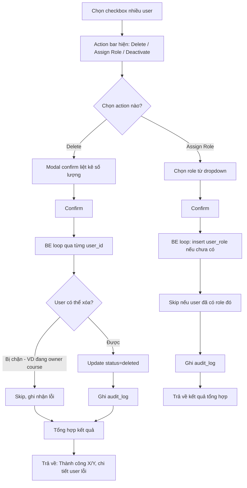

### 3.3. Clone Role

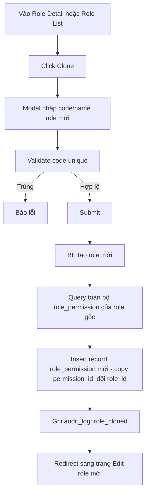

### 3.4. Xóa Role / Permission có ràng buộc


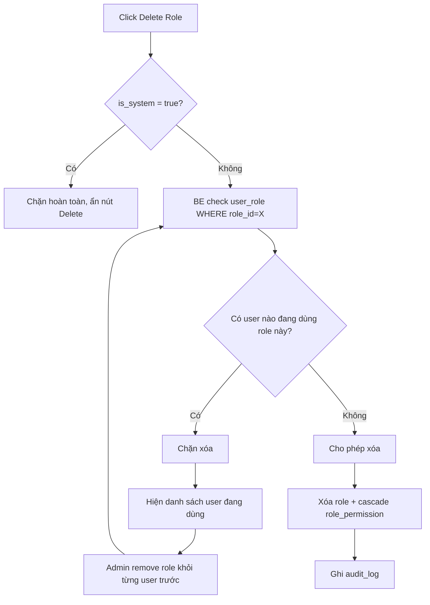

### 3.5. Gán nhiều Permission cho Role (Matrix)

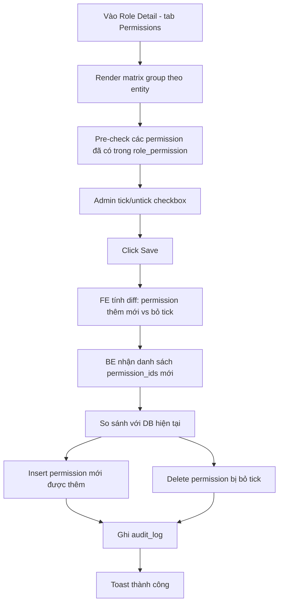

### 3.6. Effective Permissions (Tổng hợp quyền của 1 User)


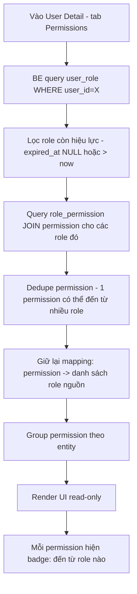


### 3.7. ERD mô hình bảo mật

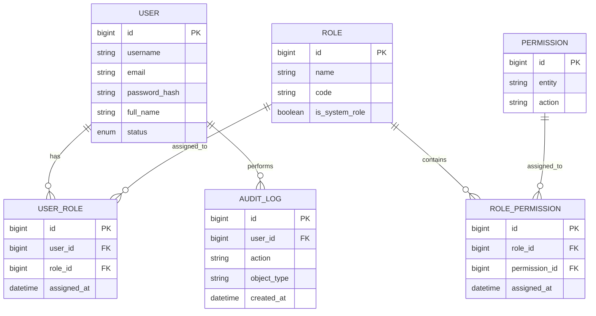

## 4. Moduel File Management (Storage + Metadata)


### 4.1 Kiến trúc 3 tầng

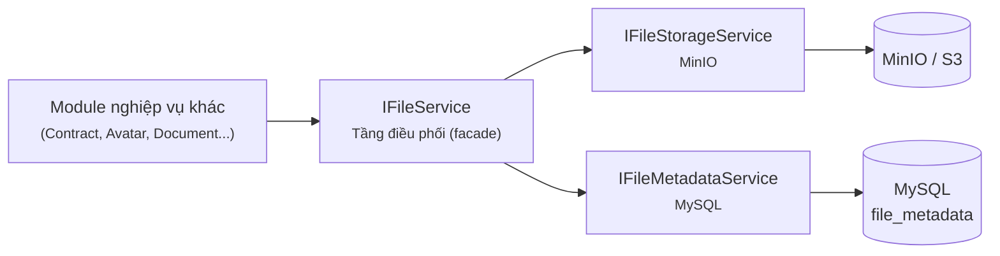

---

### 4.2. Luồng Upload File

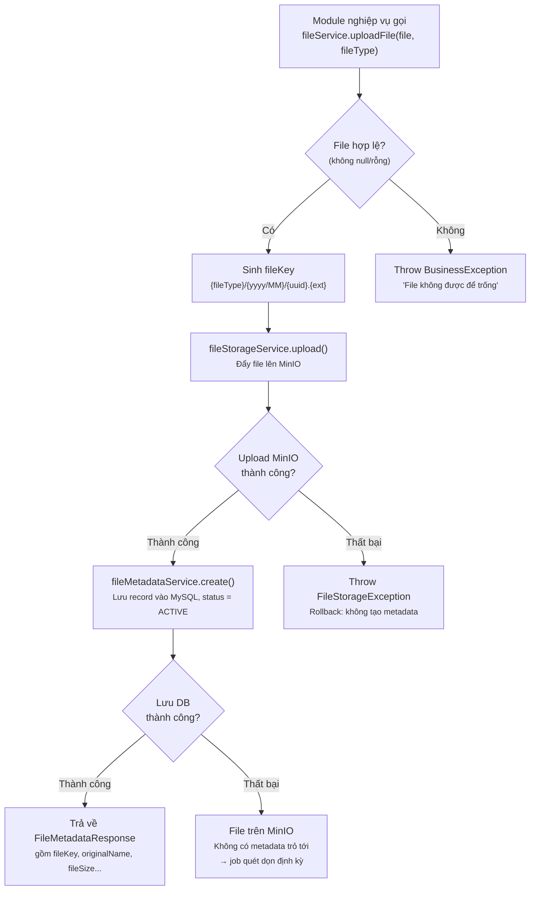


- Upload MinIO **trước**, ghi metadata DB **sau** — nếu DB fail, báo lỗi và rolback. 
- `fileKey` luôn do `IFileService` gen. 

---

### 4.3. Luồng Download / Lấy URL File

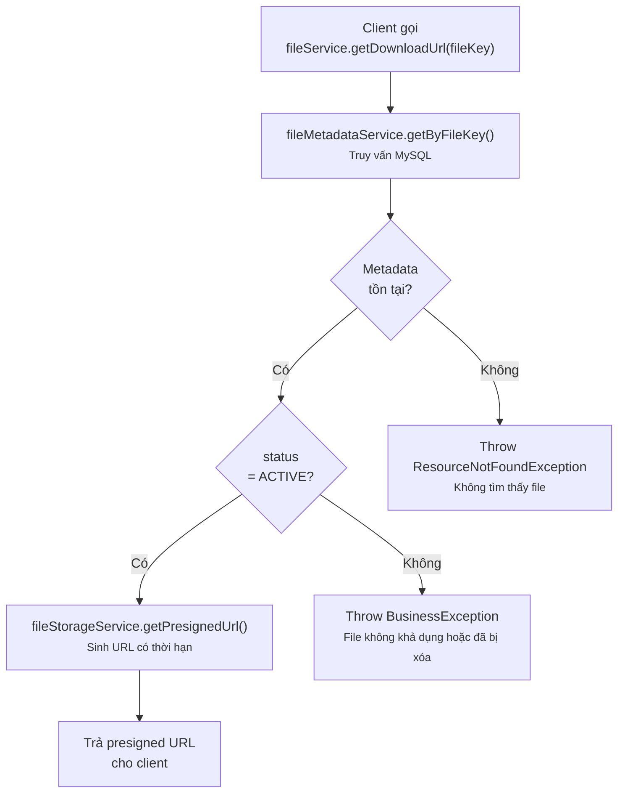

- Client (FE) tải file **trực tiếp từ MinIO** qua presigned URL, không proxy qua backend.
- Luôn check `status = ACTIVE` trước khi sinh URL, không cấp quyền truy cập file đã bị soft-delete.

---

### 4.4. Luồng Xóa Hard File và Soft File 

- Hard File 

```mermaid
flowchart TD
    A["Client gọi<br/>fileService.deleteHardFile(fileKey)"]
    B["fileStorageService.delete()<br/><small>Xóa file vật lý khỏi MinIO</small>"]
    C{"Xóa MinIO<br/>thành công?"}
    D["fileMetadataService.hardDelete()<br/><small>Xóa record khỏi MySQL</small>"]
    E["Hoàn tất xóa"]
    X1["Throw FileStorageException<br/><small>Dừng lại — KHÔNG xóa metadata</small>"]

    A --> B
    B --> C
    C -->|Thất bại| X1
    C -->|Thành công| D
    D --> E
```
--- 

- Soft File 

```mermaid
flowchart TD
    A["Client gọi<br/>fileService.deleteSoftFile(fileKey)"]
    B["fileMetadataService.softDelete()<br/><small>Cập nhật status -> Inactive</small>"]
    C{"Xóa thành công?"}
    D["Hoàn tất xóa"]
    X1["Throw FileStorageException<br/><small>Dừng lại</small>"]


    A --> B
    B --> C
    C -->|Thất bại| X1
    C -->|Thành công| D
```

---

### 4.5. Luồng Tìm kiếm / Phân trang File (Admin)

```mermaid
flowchart TD
    A["Admin gọi<br/>GET /admin/files?keyword=&fileTypes=&statuses=&page=&size=&sort="]
    B["Controller bind query param<br/>→ FileSearchRequest"]
    C["fileMetadataService.search(request)"]
    D["Build Specification động"]
    D1["keyword → LIKE originalName/fileKey"]
    D2["fileTypes → IN filter"]
    D3["statuses → IN filter<br/><small>(mặc định loại DELETED nếu không truyền)</small>"]
    D4["createdFrom/createdTo → range filter"]
    E["Apply Pageable<br/><small>(page, size, sort)</small>"]
    F["Query MySQL qua Specification"]
    G["Map Page<Entity> → Page<FileMetadataResponse>"]
    H["Trả về danh sách + thông tin phân trang<br/>cho FE hiển thị bảng quản lý file"]

    A --> B --> C --> D
    D --> D1 --> E
    D --> D2 --> E
    D --> D3 --> E
    D --> D4 --> E
    E --> F --> G --> H
```
--- 
## 5. Module HR Management
