# AILMS

## 1. Tổng quan Tech Stack

- **Framework:** Spring Boot 4.x + Spring Security 6.x
- **Xác thực:** JWT (Access Token + Refresh Token)
- **Mã hóa mật khẩu:** BCrypt (`PasswordEncoder`)
- **Lưu trữ OTP / Reset Token:** Redis (TTL tự động, không cần cron dọn dẹp)
- **Gửi email:** Spring Mail (`JavaMailSender`)
- **Phân quyền:** RBAC (Role-Based Access Control) 2 tầng — Role (`ROLE_XXX`) + Permission chi tiết (`entity_action`)
- **Lưu trữ File:** MinIo/S3 
- **Id** Snowflake, ngoài ra có sử dụng thêm UUID trong việc tạo mã code, ... 

Mục tiêu:
- Quản lý nhân viên
- Quản lý khóa học và lớp học
- Đánh giá trực tuyến và chấm điểm
- Theo dõi tiến độ học tập
- Tương tác giữa giáo viên và học sinh
- AI cá nhân hóa lộ trình học dựa trên hành vi người dùng

### 1.1 Quy ước viết Controller & Service

| Tầng | Nhiệm vụ |
|---|---|
| **Controller** | Nhận request, gọi Service, bọc kết quả vào `ApiResponse<T>`. Không chứa logic nghiệp vụ, không try/catch. |
| **Service** | Xử lý toàn bộ logic nghiệp vụ. Gặp lỗi thì ném exception. |
| **GlobalExceptionHandler** | Bắt mọi exception, map sang đúng HTTP status, trả `ErrorResponse` thống nhất. |
 
---

### 1.2 Generic Base Layer
- Tách phần CRUD thuần và find-sort-page thành lớp base generic, entity nào không có business logic đặc biệt thì kế thừa và dùng thẳng. Entity có rule riêng (enroll, publish, permission check...) thì override hoặc viết method riêng ngoài base.


- Audit log qua Event, không gọi trực tiếp, `@EventListener` riêng ghi `audit_log` — tách khỏi business logic chính.

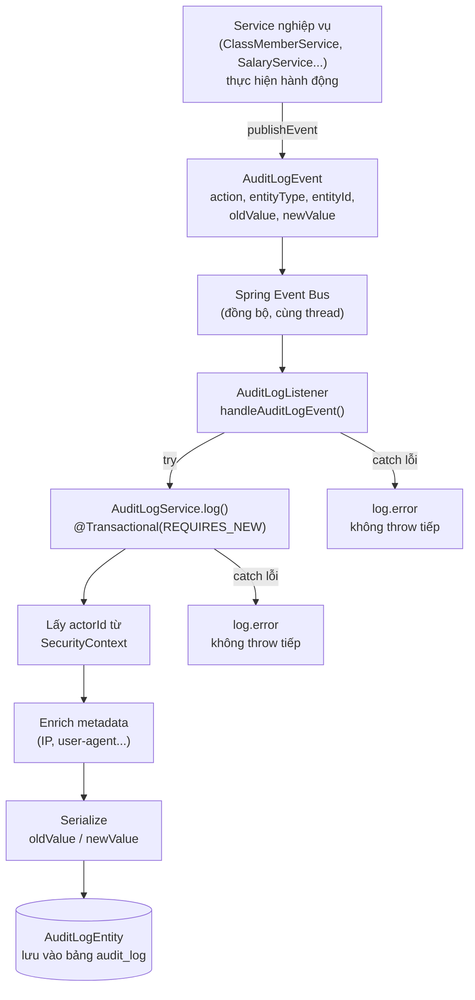

- Patterns: 
1. Facade: Cung cấp một giao diện đơn giản và thống nhất để truy cập một hệ thống phức tạp gồm nhiều lớp hoặc service bên trong.
2. Strategy: Định nghĩa nhiều thuật toán có thể thay thế cho nhau
3. Factory: Đóng gói việc khởi tạo đối tượng
4. State: Cho phép đối tượng thay đổi hành vi dựa trên trạng thái hiện tại, đồng thời kiểm soát các quy tắc chuyển đổi giữa các trạng thái.
5. Decorator: Bổ sung chức năng cho đối tượng một cách linh hoạt mà không cần sửa đổi mã nguồn gốc
6. Observer: 1 hành động xảy ra cần kích hoạt nhiều việc khác, nhưng các việc đó không nên phụ thuộc cứng vào nhau. 

--- 

## 2. Module Security

### 2.1. Các thành phần bảo mật chính

- Spring Security: quản lý xác thực và phân quyền.
- JWT: xác thực request giữa client và server.
- BCrypt: mã hóa mật khẩu trước khi lưu vào database.
- Role/Permission: kiểm soát quyền truy cập theo vai trò.
- Redis: dùng để vô hiệu hóa token khi đổi mật khẩu hoặc reset mật khẩu.
- OTP qua email: bảo vệ quy trình đăng ký và khôi phục mật khẩu.

--- 
- Đăng nhập: user sẽ được cấp 2 loại token là AccessToken (thời gian ngắn) và RefreshToken (thời gian dài). Khi hết thời gian của AccessToken, hệ thống sẽ kiểm tra RefreshToken và cấp lại AccessToken và RefreshToken mới.

- Access Token lưu trong state/memory phía FE, Refresh Token lưu trong cookie `httpOnly Cookie`

--- 

- Xác thực request (JWT Filter)

- Mỗi request có kèm Access Token sẽ đi qua `JwtAuthFilter` trước khi tới Controller:

---
### 2.2. Quá trình đăng nhập
1. Client gửi yêu cầu đăng nhập đến endpoint `/api/auth/login`.
2. AuthController nhận request và chuyển cho AuthService xử lý.
3. AuthService sử dụng `AuthenticationManager` để xác thực username/email và mật khẩu.
4. Spring Security gọi `CustomUserDetailsService` để tải thông tin người dùng từ cơ sở dữ liệu.
5. Hệ thống kiểm tra role và permission của người dùng.
6. Nếu xác thực thành công, server tạo:
   - Access Token để gọi các API bảo vệ
   - Refresh Token để cấp lại access token mới
7. Server trả về token cho client.

### 2.3. Quá trình truy cập API bảo vệ
1. Client gửi request kèm Bearer Token trong header `Authorization`.
2. Request đi qua `JwtAuthFilter` trước khi đến controller.
3. `JwtAuthFilter` đọc token, kiểm tra tính hợp lệ và thời gian hết hạn.
4. Nếu token hợp lệ, hệ thống lấy thông tin người dùng từ JWT.
5. Hệ thống tải role và permission từ cơ sở dữ liệu.
6. Authentication được đặt vào `SecurityContext`.
7. Spring Security thực hiện kiểm tra phân quyền trước khi cho phép request tiếp tục.

### 2.4. Sơ đồ Sequence


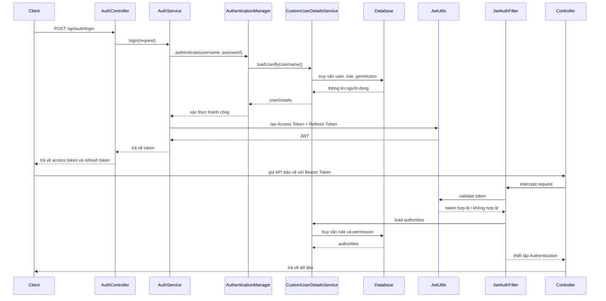


### 2.5. Flowchart

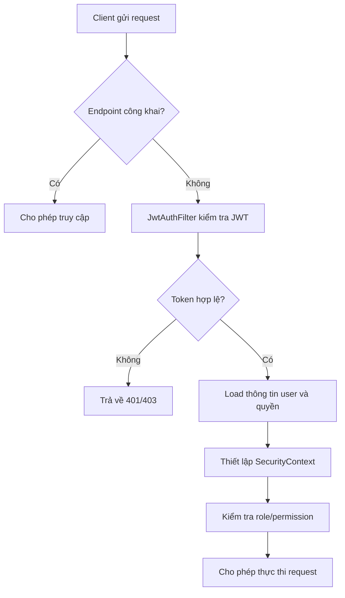

--- 

### 2.6. Đăng ký tài khoản (Student)
 
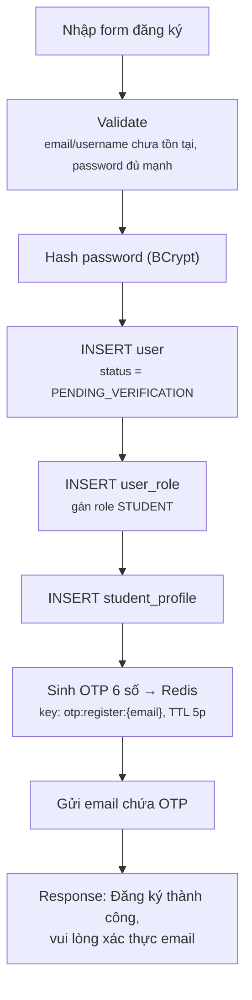
 
### 2.7. Xác thực OTP
 
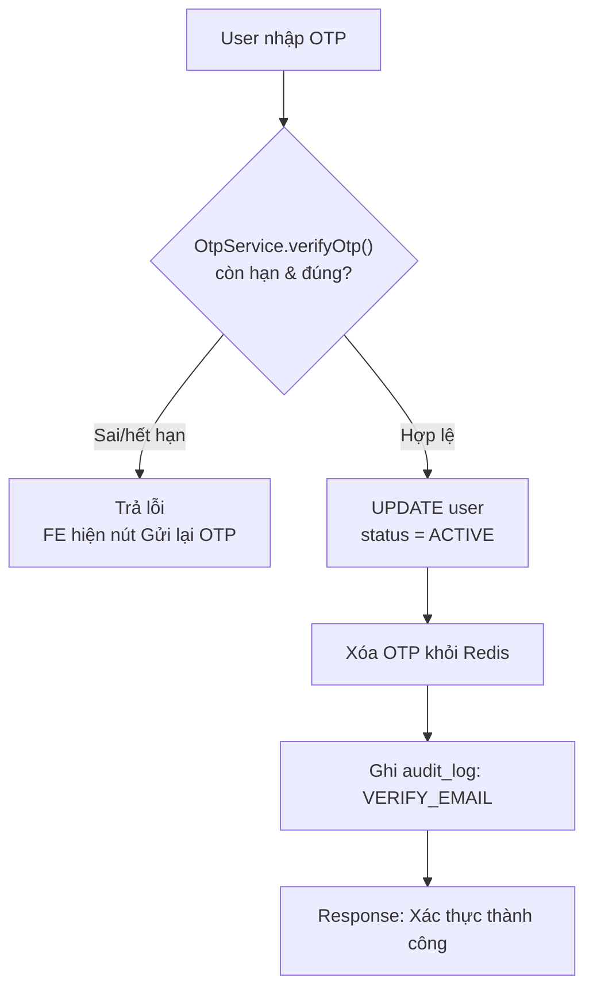
 
### 2.8. Đăng nhập
 
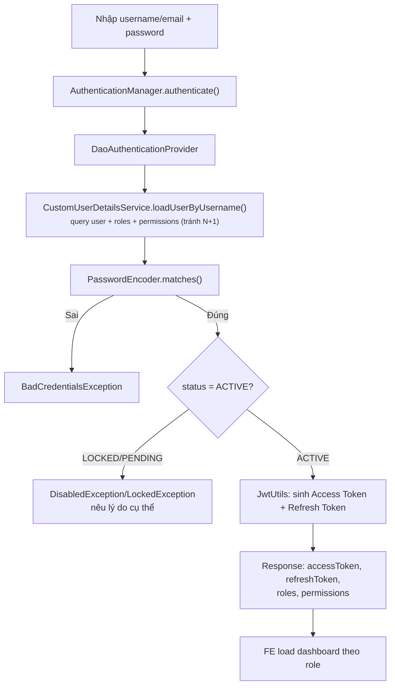
 
### 2.9. Đăng xuất
 
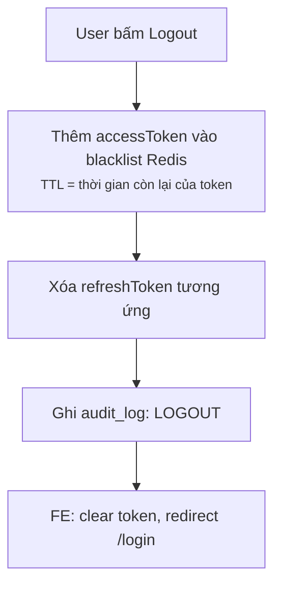
> JWT stateless nên không "xóa" token được — dùng **blacklist Redis**, `JwtAuthFilter` check thêm token có trong blacklist trước khi cho qua.
 
### 2.10. Quên mật khẩu
 
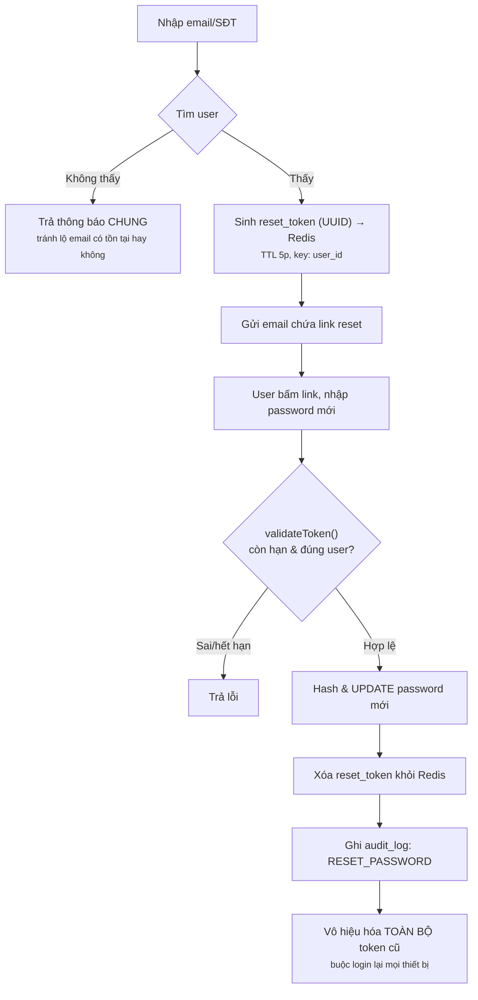
 
### 2.11. Đổi mật khẩu (đã đăng nhập)
 
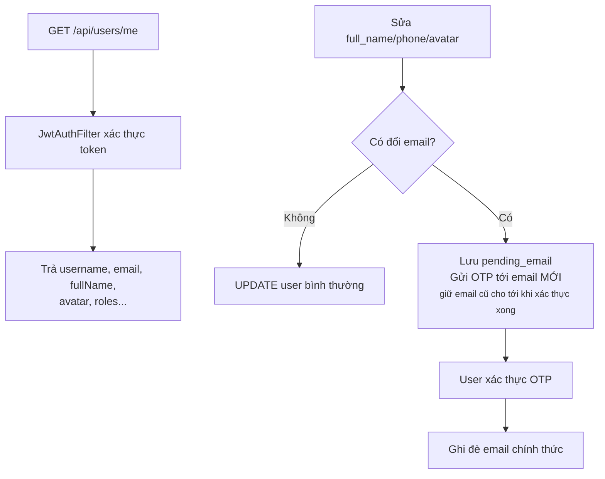
 
### 2.12. Xem / Cập nhật thông tin cá nhân
 


### 2.13. Invite User qua Email

### Flow

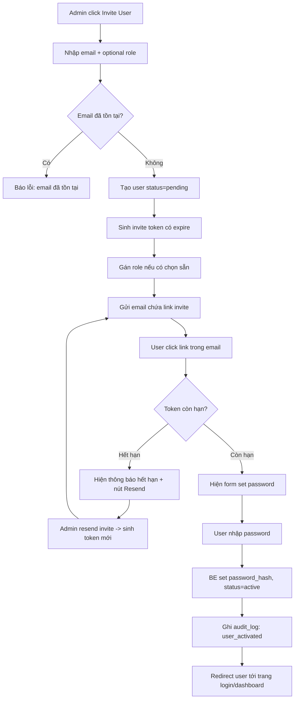
---

## 3. Module User-Role-Permission (RBAC)

### 3.1. Assign / Remove Role cho User

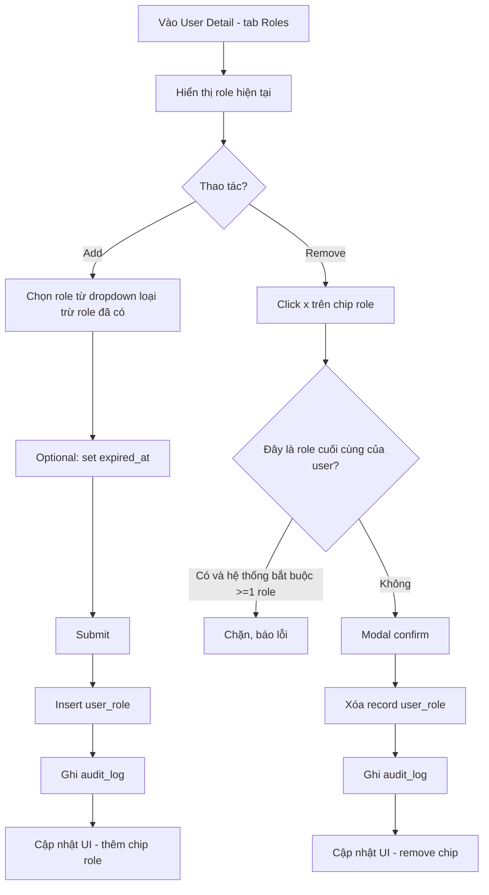


### 3.2. Bulk Action (Xóa / Gán Role hàng loạt)


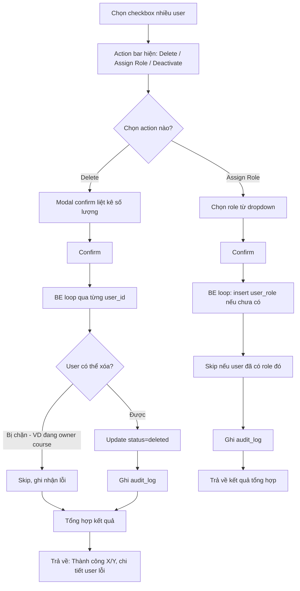

### 3.3. Clone Role

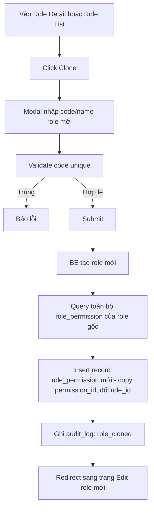

### 3.4. Xóa Role / Permission có ràng buộc


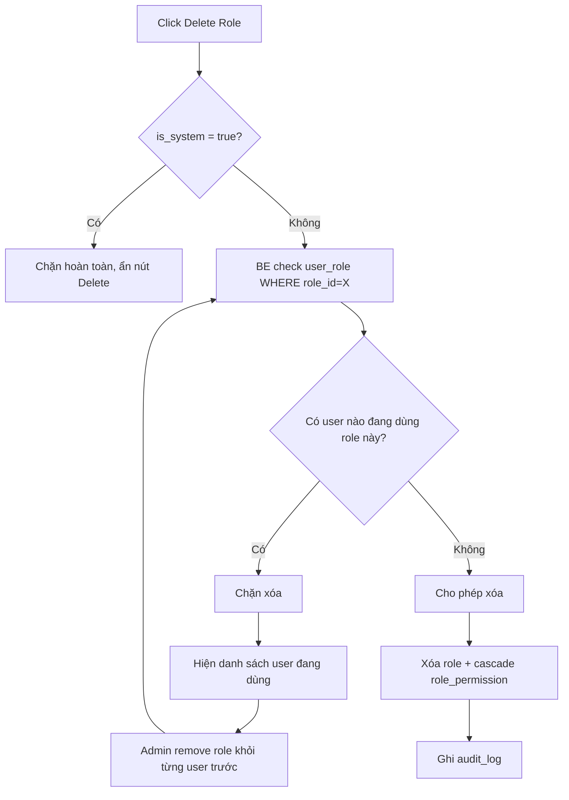

### 3.5. Gán nhiều Permission cho Role (Matrix)

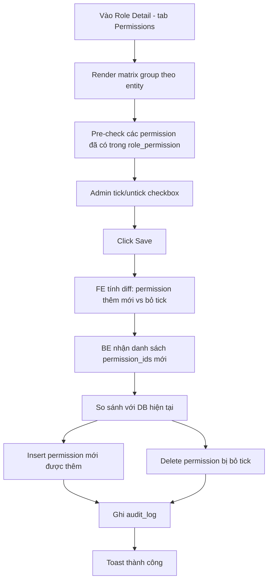

### 3.6. Effective Permissions (Tổng hợp quyền của 1 User)


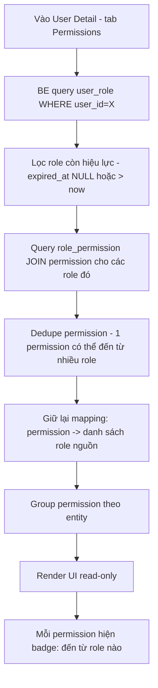


### 3.7. ERD mô hình bảo mật

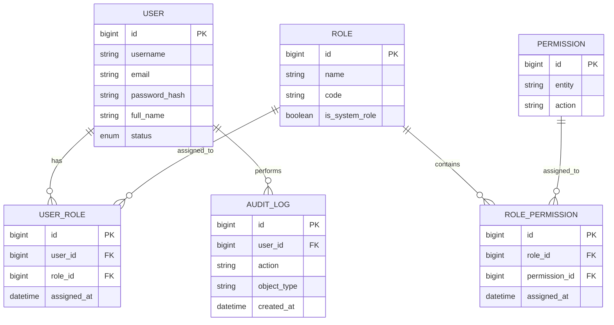

## 4. Moduel File Management (Storage + Metadata)


### 4.1 Kiến trúc 3 tầng

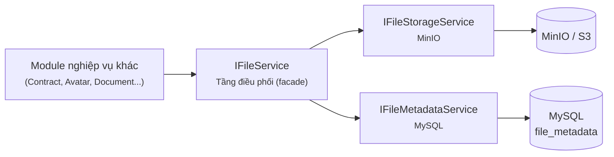

---

### 4.2. Luồng Upload File

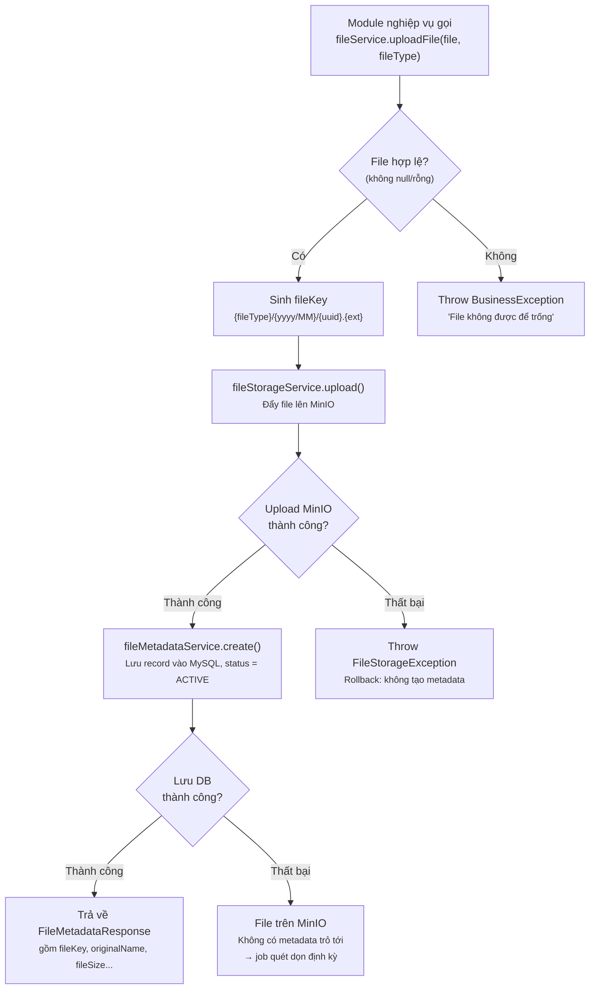


- Upload MinIO **trước**, ghi metadata DB **sau** — nếu DB fail, báo lỗi và rolback. 
- `fileKey` luôn do `IFileService` gen. 

---

### 4.3. Luồng Download / Lấy URL File

```mermaid
flowchart TD
    A["Client gọi<br/>fileService.getDownloadUrl(fileKey)"]
    B["fileMetadataService.getByFileKey()<br/><small>Truy vấn MySQL</small>"]
    C{"Metadata<br/>tồn tại?"}
    D{"status<br/>= ACTIVE?"}
    E["fileStorageService.getPresignedUrl()<br/><small>Sinh URL có thời hạn</small>"]
    F["Trả presigned URL<br/>cho client"]
    X1["Throw ResourceNotFoundException<br/><small>Không tìm thấy file</small>"]
    X2["Throw BusinessException<br/><small>File không khả dụng hoặc đã bị xóa</small>"]

    A --> B
    B --> C
    C -->|Không| X1
    C -->|Có| D
    D -->|Không| X2
    D -->|Có| E
    E --> F
```

- Client (FE) tải file **trực tiếp từ MinIO** qua presigned URL, không proxy qua backend.
- Luôn check `status = ACTIVE` trước khi sinh URL, không cấp quyền truy cập file đã bị soft-delete.

---

### 4.4. Luồng Xóa Hard File và Soft File 

- Hard File 

```mermaid
flowchart TD
    A["Client gọi<br/>fileService.deleteHardFile(fileKey)"]
    B["fileStorageService.delete()<br/><small>Xóa file vật lý khỏi MinIO</small>"]
    C{"Xóa MinIO<br/>thành công?"}
    D["fileMetadataService.hardDelete()<br/><small>Xóa record khỏi MySQL</small>"]
    E["Hoàn tất xóa"]
    X1["Throw FileStorageException<br/><small>Dừng lại — KHÔNG xóa metadata</small>"]

    A --> B
    B --> C
    C -->|Thất bại| X1
    C -->|Thành công| D
    D --> E
```
--- 

- Soft File 

```mermaid
flowchart TD
    A["Client gọi<br/>fileService.deleteSoftFile(fileKey)"]
    B["fileMetadataService.softDelete()<br/><small>Cập nhật status -> Inactive</small>"]
    C{"Xóa thành công?"}
    D["Hoàn tất xóa"]
    X1["Throw FileStorageException<br/><small>Dừng lại</small>"]


    A --> B
    B --> C
    C -->|Thất bại| X1
    C -->|Thành công| D
```

---

### 4.5. Luồng Tìm kiếm / Phân trang File (Admin)

```mermaid
flowchart TD
    A["Admin gọi<br/>GET /admin/files?keyword=&fileTypes=&statuses=&page=&size=&sort="]
    B["Controller bind query param<br/>→ FileSearchRequest"]
    C["fileMetadataService.search(request)"]
    D["Build Specification động"]
    D1["keyword → LIKE originalName/fileKey"]
    D2["fileTypes → IN filter"]
    D3["statuses → IN filter<br/><small>(mặc định loại DELETED nếu không truyền)</small>"]
    D4["createdFrom/createdTo → range filter"]
    E["Apply Pageable<br/><small>(page, size, sort)</small>"]
    F["Query MySQL qua Specification"]
    G["Map Page<Entity> → Page<FileMetadataResponse>"]
    H["Trả về danh sách + thông tin phân trang<br/>cho FE hiển thị bảng quản lý file"]

    A --> B --> C --> D
    D --> D1 --> E
    D --> D2 --> E
    D --> D3 --> E
    D --> D4 --> E
    E --> F --> G --> H
```
--- 
## 5. Module HR Management

Có 2 nhóm nhân sự với luồng tính công/lương khác nhau:

- **FULL_TIME** (HR, Accountant, Manager, Director...): chấm công qua `attendance` (check-in/check-out) → tính lương theo `base_salary` trong hợp đồng, trừ phạt đi muộn/nghỉ.
- **PART_TIME** (giảng viên, trợ giảng dạy theo buổi): chấm công qua `teaching_session_payment` tính lương qua số buổi dạy, số giờ dạy.

---

### 5.1. Tạo Employee:

1. HR tạo tài khoản `user` → tạo `employee` gắn `user_id`, sinh `employee_code` tự động (unique).
2. HR tạo `employee_contract` và upload CV:
   - Upload `file_url` hợp đồng scan/ký số, `signed_at` = thời điểm ký, `status = ACTIVE`.
   - Tạo xong hợp đồng thì phải gửi mail  thông báo tới user cùng với hợp đồng.
3. Khi hết hạn thử việc, hệ thống phải thông báo cho admin, hr trước 1 tuần → HR tạo hợp đồng mới `contract_type = OFFICIAL`, hoặc không nhận nhân viên này, đồng thời set hợp đồng cũ `status = EXPIRED`. Tạo xong thì gửi thông báo tới email + hợp đồng cho user. 

- 1 employee có thể có **nhiều `employee_contract` theo thời gian** nhưng chỉ **1 hợp đồng `ACTIVE` tại 1 thời điểm**.
- `base_salary` dùng để tính lương FULL_TIME lấy từ **hợp đồng đang ACTIVE**.

- `employeeCode` phải **unique tuyệt đối** trong toàn hệ thống, định dạng: `{PREFIX}-{yyMM}{sequence}` (VD: `EP-26070001`).
- `employeeCode` phân biệt với `studentCode`. Employee (EP), Student (ST). EmployeeCode: EP + '-' {yyMM}{sequence}, sequence thì 'UUID(random(6 số)).
---

```mermaid
flowchart TD
    A["HR or Admin tạo tài khoản user, mật khẩu tạm thời, gán role, permission<br/><small>fullName, email, role, department, employmentType...</small>"]
    B{"Validate<br/><small>email chưa tồn tại, department hợp lệ...</small>"}
    C["Tạo Employeee<br/>"]
    D["Sinh employeeCode<br/><small>(sơ đồ dưới)</small>"]
    E["Tạo EmployeeEntity<br/><small>@MapsId → userId = user.id</small>"]
    G{"Upload<br/>hợp đồng, cv"}
    H["Upload file lên MinIO<br/>→ Tạo EmployeeContractEntity"]
    I["Lưu metadata hợp đồng, cv"]
    J["[AFTER COMMIT]<br/>Gửi email chào mừng + hợp đồng"]
    K["Trả EmployeeResponse"]
    X["Throw BusinessException<br/><small>Trả lỗi validate cho HR</small>"]
 
    A --> B
    B -->|Không hợp lệ| X
    B -->|Hợp lệ| C
    C --> D
    D --> E
    E --> G
    G --> H
    H --> I
    I --> J
    J --> K
```
 
---

- Gen `employeeCode`
 
 
```mermaid
flowchart TD
    A["Prefix = EP"]
    B["Lấy yyMM hiện tại<br/>VD: 2607"]
    C["Sinh RANDOM_6 từ UUID<br/>VD: A3F9C1"]
    D["Ghép code<br/>EP-2607A3F9C1"]
    E{"Đã tồn tại?"}
    F["Sinh lại"]
    G["Trả employeeCode"]

    A --> B --> C --> D --> E
    E -->|Có| F
    F --> C
    E -->|Không| G
```

---
 
- Sequence diagram — Toàn bộ luồng tạo Employee
  
```mermaid
sequenceDiagram
    actor HR
    participant EmployeeService as EmployeeService
    participant CodeGenerator as EmployeeCodeGenerator
    participant DB as MySQL
 
    HR->>EmployeeService: createEmployee(request)
    EmployeeService->>EmployeeService: validate(request)
 
    EmployeeService->>DB: INSERT INTO user (...)
    DB-->>EmployeeService: user_id
 
    EmployeeService->>CodeGenerator: generate()
    loop Tối đa 5 lần (thực tế thường chỉ 1 lần)
        CodeGenerator->>CodeGenerator: sinh RANDOM_6 từ UUID
        CodeGenerator->>CodeGenerator: ghép "EP-" + yyMM + "-" + RANDOM_6
        CodeGenerator->>DB: SELECT EXISTS(...) WHERE employee_code = candidateCode
        DB-->>CodeGenerator: false (không trùng)
    end
    CodeGenerator-->>EmployeeService: "EP-2607-A3F9C1"
 
    EmployeeService->>DB: INSERT INTO employee (employee_code = 'EP-2607-A3F9C1', ...)
    EmployeeService->>DB: INSERT INTO user_role (user_id, role = HR)
 
    opt Có upload hợp đồng
        EmployeeService->>DB: INSERT INTO employee_contract (...)
    end
 
    EmployeeService->>DB: COMMIT transaction
    EmployeeService->>EmployeeService: publishEvent(EmployeeCreatedEvent)
 
    Note over EmployeeService: [AFTER COMMIT]
    EmployeeService->>HR: Gửi email chào mừng (async, không chặn response)
 
    EmployeeService-->>HR: EmployeeResponse (employeeCode = EP-2607-A3F9C1)
```
---

- Mối quan hệ giữa file và employee contrac 

```mermaid
sequenceDiagram
    autonumber
    actor Admin as Người Quản trị (Client)
    participant Ctrl as File & Contract Controller
    participant FileSvc as FileService (Điều phối)
    participant Storage as MinioFileStorageService
    participant MetaSvc as FileMetadataService
    participant ContractSvc as EmployeeContractService
    participant Repo as Database (MySQL)

    Note over Admin,Storage: GIAI ĐOẠN 1: TẢI FILE PDF HỢP ĐỒNG LÊN HỆ THỐNG
    Admin->>Ctrl: POST /api/v1/files/upload (file, fileType=CERTIFICATION)
    Ctrl->>FileSvc: uploadFile(file, CERTIFICATION)
    FileSvc->>Storage: upload(inputStream, fileKey, contentType, size)
    Note over Storage: Lưu file vật lý vào MinIO
    Storage-->>FileSvc: Trả về fileKey thành công
    FileSvc->>MetaSvc: create(CreateFileMetadataRequest)
    MetaSvc->>Repo: Lưu bản ghi metadata vào bảng file_metadata
    Repo-->>MetaSvc: Trả về FileMetadataEntity
    MetaSvc-->>FileSvc: Trả về FileMetadataResponse
    FileSvc-->>Ctrl: Trả về FileMetadataResponse
    Ctrl-->>Admin: HTTP 201 Created (Chứa fileKey)

    Note over Admin,Repo: GIAI ĐOẠN 2: LƯU HỢP ĐỒNG KÈM FILE LIÊN KẾT
    Admin->>Ctrl: POST /api/v1/employee-contracts (CreateEmployeeContractRequest gồm fileKey)
    Ctrl->>ContractSvc: create(CreateEmployeeContractRequest)
    ContractSvc->>Repo: Tìm kiếm file_metadata theo fileKey (Qua default method findByFileKey)
    Repo-->>ContractSvc: Trả về FileMetadataEntity (Nếu có)
    ContractSvc->>ContractSvc: Thiết lập liên kết: contract.setFileMetadata(metadata)
    ContractSvc->>Repo: Lưu hợp đồng vào bảng employee_contract
    Repo-->>ContractSvc: Trả về EmployeeContractEntity đã lưu
    ContractSvc-->>Ctrl: Trả về EmployeeContractResponse (Mapper sinh url download động)
    Ctrl-->>Admin: HTTP 200 OK (Hợp đồng đã tạo thành công kèm file)
```

---

### 5.2 Probation Review (Đánh giá thử việc, hợp đồng)

 
```mermaid
flowchart TD
    E["Trước 1 tuần hết hạn thử việc, hoặc hết hợp đồng<br/><small>Thông báo Admin + HR</small>"]
    F{"Đạt thử việc, hoàn thành tốt?"}
    G["Tạo hợp đồng OFFICIAL<br/><small>Hợp đồng cũ → EXPIRED, gửi email + hợp đồng mới</small>"]
    H["Không nhận nhân viên, kết thúc hợp đồng<br/><small>employee.status = TERMINATED,  hết thời gian thử việc sẽ gửi mail thông báo. </small>"]
    I["Nhân viên nghỉ việc<br/><small>employee & hợp đồng hiện hành → TERMINATED</small>"]
 

    E --> F
    F -->|"Đạt"| G
    F -->|"Không đạt"| H
    G -.->|"Có thể xảy ra bất kỳ lúc nào"| I
```
 
---


### 5.3 Chấm công nhân viên FULL_TIME

- Áp dụng cho nhân viên `employment_type = FULL_TIME`

1. Mỗi ngày làm việc, hệ thống ghi nhận `check_in_time`, `check_out_time`.
2. Hệ thống tự động tính `status` dựa trên giờ check-in/check-out:
   - `PRESENT`: đi làm đủ giờ, đúng giờ. (check in: 8:00, checkout: 17:00)
   - `LATE`: check-in trễ so với giờ quy định. (muộn quá 1h ko tính buổi đấy, đi muộn trừ lương-100k)
   - `HALF_DAY`: chỉ làm nửa ngày. (làm >= 4, <=8)
   - `ABSENT`: không có bản ghi check-in/check-out trong ngày làm việc. (ko check in)
   - `ON_LEAVE`: nghỉ phép có đơn. (có đơn nghỉ phép được duyệt)
3. Cuối kỳ lương, hệ thống tổng hợp số ngày `LATE`/`ABSENT` trong `period` để tính khấu trừ (`salary.deduction`).

--- 

```mermaid
flowchart TD
    A[Nhân viên check-in/check-out hàng ngày] --> B{Có bản ghi check-in?}
    B -->|Không| C[status = ABSENT]
    B -->|Có| D{Có đơn nghỉ phép được duyệt?}
    D -->|Có| E[status = ON_LEAVE]
    D -->|Không| F{Check-in đúng giờ 8:00?}
    F -->|Trễ nhưng ≤ 1h| G[status = LATE<br/>Trừ lương 100k]
    F -->|Trễ > 1h| H[Không tính công buổi đó]
    F -->|Đúng giờ| I{Số giờ làm trong ngày}
    I -->|"4h ≤ giờ làm ≤ 8h"| J[status = HALF_DAY]
    I -->|Đủ 8h 8:00-17:00| K[status = PRESENT]
 
    C --> L[Cuối kỳ lương]
    E --> L
    G --> L
    J --> L
    K --> L
    L --> M[Tổng hợp số ngày LATE/ABSENT<br/>trong period]
    M --> N[Tính khấu trừ salary.deduction]
```
---

### 5.4 — Thiết lập đơn giá dạy

- Áp dụng cho giảng viên (`position = Teacher`, `Trợ giảng`).

1. HR/ADMIN thiết lập đơn giá cho **từng giảng viên + từng lớp học**
   - `rate` = đơn giá áp dụng theo giờ.
   - `effective_from` / `effective_to` = khoảng thời gian áp dụng
2. Khi cần tăng lương cho giảng viên ở 1 lớp, HR **không sửa trực tiếp `rate` cũ** mà:
   - Set `effective_to` của rate cũ = ngày hiện tại, `status = INACTIVE`.
   - Tạo `teaching_rate` mới với `effective_from` = ngày áp dụng mới, `rate` mới, `status = ACTIVE`.

--- 

```mermaid
flowchart TD
    A[HR/ADMIN thiết lập đơn giá cho<br/>giảng viên + lớp học] --> B[Tạo teaching_rate<br/>rate, effective_from, effective_to]
    B --> C{Cần tăng lương cho<br/>giảng viên ở lớp đó?}
    C -->|Không| D[Giữ nguyên rate hiện tại]
    C -->|Có| E[Set effective_to = ngày hiện tại<br/>status = INACTIVE cho rate cũ]
    E --> F[Tạo teaching_rate mới<br/>effective_from = ngày áp dụng mới<br/>rate mới, status = ACTIVE]
```
---

### 5.5 — Ghi nhận thanh toán & chấm công theo buổi dạy (`teaching_session_payment`)
Áp dụng cho nhân viên `employment_type = PART_TIME`

1. Sau khi 1 buổi học online (`class_online`) kết thúc, hệ thống tự động tạo bản ghi `teaching_session_payment`:
   - `class_online_id` (unique — mỗi buổi dạy chỉ tính lương 1 lần).
   - `employee_id` = giảng viên dạy buổi đó.
   - `rate_id` = tra cứu `teaching_rate` đang hiệu lực tại thời điểm buổi học diễn ra (theo `class_id` của buổi học + `effective_from/to`).
   - `rate_applied` = **snapshot** giá trị `rate` tại thời điểm tính (lưu lại để không bị ảnh hưởng nếu sau này `teaching_rate` gốc bị sửa).
   - `actual_duration_min` = thời lượng thực tế của buổi dạy (dùng khi `payment_type = PER_HOUR`).
   - `amount`:
   - `status = Draft` (bản nháp).
2. TA của buổi đó vào nhận xét buổi học, đánh giá học viên (thời gian cho nhận xét là 24h, sau 24h sẽ xóa bản nháp, không tính lương buổi dạy đó). Sau khi nhận xét, `status=Pending`
2. HR/TEACHER review buổi dạy (Kiểm tra chất lượng) → chuyển `status = CONFIRMED`.
3. Đến kỳ trả lương, các bản ghi `CONFIRMED` được tổng hợp vào `salary` → sau khi trả lương thành công, chuyển `status = PAID`.

--- 
```mermaid
flowchart TD
    A[Buổi học online kết thúc] --> B[Hệ thống tự tạo<br/>teaching_session_payment<br/>status = Draft]
    B --> C[Tra cứu teaching_rate hiệu lực<br/>tại thời điểm buổi học]
    C --> D[Snapshot rate_applied<br/>+ actual_duration_min]
    D --> E{TA nhận xét buổi học<br/>trong vòng 24h?}
    E -->|Không, quá 24h| F[Xóa bản nháp<br/>Không tính lương buổi đó]
    E -->|Có| G[status = Pending]
    G --> H[HR/TEACHER review<br/>chất lượng buổi dạy]
    H --> I[status = CONFIRMED]
    I --> J[Đến kỳ trả lương]
    J --> K[Tổng hợp vào salary]
    K --> L{Trả lương thành công?}
    L -->|Có| M[status = PAID]
```

---

### 5.6 — Tính lương cuối kỳ (`salary`)

1. Đầu mỗi kỳ lương, hệ thống chạy job tổng hợp lương cho từng `employee_id`, chia theo `employment_type`:

2. Kế toán/HR review bảng lương (`status = DRAFT`) → nếu đúng, chuyển `status = APPROVED`.
3. Sau khi chi trả (chuyển khoản/tiền mặt), cập nhật `status = PAID`, ghi nhận `paid_at`.
4. Đồng thời, các bản ghi `teaching_session_payment` liên quan chuyển từ `CONFIRMED` → `PAID`.

--- 
```mermaid
flowchart TD
    A[Đầu kỳ lương: job tổng hợp lương<br/>theo employee_id] --> B{employment_type?}
    B -->|FULL_TIME| C[Lấy dữ liệu chấm công<br/>LATE/ABSENT/ON_LEAVE]
    B -->|PART_TIME| D[Lấy teaching_session_payment<br/>status = CONFIRMED]
 
    C --> E[Tính Gross = lương cơ bản<br/>+ phụ cấp + thưởng]
    E --> F[Tính thu nhập đóng BH<br/>= lương + phụ cấp<br/>trừ BHXH/BHYT/BHTN]
    F --> G[Thu nhập chịu thuế<br/>= Gross − bảo hiểm]
    G --> H[Tính thuế TNCN<br/>theo biểu lũy tiến]
    H --> I[Thực lãnh = Gross − BH − thuế<br/>− khoản trừ khác]
 
    D --> J[Cộng vào bảng lương]
    I --> K[status = DRAFT]
    J --> K
 
    K --> L[Kế toán/HR review]
    L --> M{Đúng?}
    M -->|Có| N[status = APPROVED]
    M -->|Không| K
    N --> O[Chi trả lương<br/>chuyển khoản/tiền mặt]
    O --> P[status = PAID<br/>ghi nhận paid_at]
    P --> Q[teaching_session_payment liên quan:<br/>CONFIRMED → PAID]
```
 
---


### 5.7 Phụ cấp, thuế, bảo hiểm trong bảng lương - áp dụng với fulltime
- Cộng: Lương cơ bản, phụ cấp, thưởng
- Trừ: Bảo hiểm, thuế thu nhập cá nhân, khoản trừ khác 
1. Tính **thu nhập gộp** (Gross) = lương cơ bản + tất cả phụ cấp + thưởng.
2. Tính **thu nhập đóng bảo hiểm**  (lương + phụ cấp) → trừ BHXH/BHYT/BHTN theo %.
3. Tính **thu nhập chịu thuế** = Gross − bảo hiểm đã trừ.
4. Tính **thuế TNCN** theo biểu lũy tiến trên thu nhập chịu thuế.
5. **Thực lãnh - Total** = Gross − bảo hiểm − thuế TNCN − các khoản trừ khác (tạm ứng, phạt...).

---

### 5.8 — Nghỉ phép
-  `LeaveRequestEntity`: bảng lưu thông tin nghỉ phép

1. Tạo đơn nghỉ phép:

- Kiểm tra số ngày phép còn lại trong năm, vượt quá thì `status = unpaid`
- Không cho đơn nghỉ có thời gian nằm ngoài khoảng hợp đồng có hiệu lực

2. Admin xác nhận đơn nghỉ, cập nhận trạng thái, gửi mail phản hồi đến user.

3. Sửa / Hủy đơn nghỉ phép khi status = pending. Nếu đã confirm mà yêu cầu hủy thì phải cần người duyệt xác nhận hủy.


--- 
```mermaid
flowchart TD
    A[Nhân viên tạo đơn nghỉ phép] --> B{Nằm trong khoảng<br/>hợp đồng hiệu lực?}
    B -->|Không| C[Từ chối tạo đơn]
    B -->|Có| D{Vượt quá số ngày<br/>phép còn lại trong năm?}
    D -->|Có| E[status = unpaid]
    D -->|Không| F[status = pending]
    E --> G[Admin xác nhận đơn nghỉ]
    F --> G
    G --> H[Cập nhật trạng thái<br/>+ gửi mail phản hồi user]
 
    F --> I{Sửa/Hủy khi status = pending?}
    I -->|Có| J[Cho phép sửa/hủy trực tiếp]
    H --> K{Yêu cầu hủy sau khi đã confirm?}
    K -->|Có| L[Cần người duyệt xác nhận hủy]
```
---

### 5.9 Phê duyệt
- Bảng `ApprovalRequestEntity` dùng chung cho nhiều loại đối tượng
- Quy tắc xác định ai là người duyệt: theo cấp bậc cố định. 
- Khi ở trạng thái pending: không được sửa nội dung. Nếu cần sửa, phải hủy request hiện tại, tạo lại từ đầu.
- Người tạo request ko được duyệt request của chính mình. 
- Khi rejected bản request -> thông báo đến user, cùng lý do. 
- Auditlog cho mọi hành động. 

---  
```mermaid
flowchart TD
    A[Người dùng tạo ApprovalRequest] --> B{Người tạo = người duyệt?}
    B -->|Trùng| C[Không cho phép tự duyệt]
    B -->|Khác nhau| D[Xác định người duyệt<br/>theo cấp bậc cố định]
    D --> E[status = pending]
    E --> F{Cần sửa nội dung<br/>khi đang pending?}
    F -->|Có| G[Không cho sửa trực tiếp<br/>Phải hủy request → tạo lại từ đầu]
    E --> H[Người duyệt xem xét]
    H --> I{Quyết định}
    I -->|Duyệt| J[status = approved]
    I -->|Từ chối| K[status = rejected<br/>Thông báo user kèm lý do]
    J --> L[Ghi Audit log]
    K --> L
    G --> L
```
--- 

### 5.10 ERD

```mermaid
erDiagram
    employee ||--o{ attendance : "chấm công"
    employee ||--o{ teaching_rate : "được thiết lập đơn giá"
    employee ||--o{ teaching_session_payment : "dạy buổi"
    employee ||--o{ salary : "nhận lương"
    employee ||--o{ leave_request : "tạo đơn nghỉ"
    employee ||--o{ approval_request : "yêu cầu duyệt"
    employee ||--o{ teacher_category : "thuộc lĩnh vực"
    category ||--o{ teacher_category : "được chọn"
 
    teaching_rate ||--o{ teaching_session_payment : "áp dụng cho"
    class_online ||--o| teaching_session_payment : "phát sinh"
    salary ||--o{ teaching_session_payment : "tổng hợp vào"
    department ||--o{ employee : "thuộc phòng ban"
 
    employee {
        bigint id PK
        varchar full_name
        tinyint position
        tinyint employment_type
    }
 
    attendance {
        bigint id PK
        bigint employee_id FK
        date work_date
        tinyint status
    }
 
    teaching_rate {
        bigint id PK
        bigint employee_id FK
        bigint class_id FK
        decimal rate
        tinyint status
    }
 
    teaching_session_payment {
        bigint id PK
        bigint class_online_id FK
        bigint employee_id FK
        bigint rate_id FK
        decimal amount
        bigint salary_id FK
        tinyint status
    }
 
    salary {
        bigint id PK
        bigint employee_id FK
        varchar period
        decimal total_actual
        tinyint status
    }
 
    leave_request {
        bigint id PK
        bigint employee_id FK
        date start_date
        date end_date
        tinyint status
    }
 
    approval_request {
        bigint id PK
        varchar object_type
        bigint object_id
        bigint requester_id FK
        bigint approver_id FK
        tinyint status
    }

    department {
        bigint id PK
        varchar name
        varchar code
    }

     teacher_category {
        bigint id PK
        bigint employee_id FK
        bigint category_id FK
        tinyint status
    }
 
```
--- 

## 6. Module Student Management


### 6.1. Tổng quan các bảng liên quan
 
- `student_profile` — hồ sơ học viên
- `guardian` — người giám hộ (áp dụng khi học viên là minor)
- `study_goal` — mục tiêu học tập
- `interest` / `student_interest` — sở thích / lĩnh vực quan tâm
- `learning_activity_log` — nhật ký hoạt động học tập

--- 
### 6.2. Đăng ký tài khoản học viên

```mermaid
sequenceDiagram
    actor S as Học viên
    participant FE as Frontend
    participant BE as Backend
 
    S->>FE: Đăng nhập lần đầu
    FE->>BE: GET /profile
    BE-->>FE: profile { has_onboarding_goal_prompt: false }
    FE->>S: Hiển thị popup Nhập mục tiêu / Bỏ qua
 
    alt Học viên chọn "Nhập mục tiêu"
        S->>FE: Điền goal_type, target_value, start_date, end_date...
        FE->>BE: POST /study-goals (kèm dữ liệu goal)
        Note over BE: Transaction: tạo study_goal<br/>+ set has_onboarding_goal_prompt = true
        BE-->>FE: 200 OK
    else Học viên chọn "Bỏ qua"
        S->>FE: Bấm "Bỏ qua"
        FE->>BE: POST /onboarding/skip-goal
        Note over BE: Chỉ set has_onboarding_goal_prompt = true
        BE-->>FE: 200 OK
    end
 
    FE->>S: Ẩn popup, vào trang chủ
 
    S->>FE: Đăng nhập lần 2 trở đi
    FE->>BE: GET /profile
    BE-->>FE: profile { has_onboarding_goal_prompt: true }
    FE->>S: Không hiện popup, vào thẳng trang chủ
```
---
### 6.3 Mục tiêu + sở thích:

1. Flow
```mermaid
flowchart TD
    A[Học viên đăng nhập] --> B[BE trả về profile,<br/>kèm has_goal]
    B --> C{has_goal = false?}
    C -->|Không| D[FE không hiện gì,<br/>vào thẳng trang chủ]
    C -->|Có| E[FE hiển thị popup onboarding<br/>gồm 2 phần: Mục tiêu học tập + Sở thích]
    E --> F[Học viên nhập goal<br/>có thể bỏ qua]
    F --> G[Học viên chọn interest<br/>có thể bỏ qua]
    G --> H[Học viên bấm Hoàn tất / Đóng popup]
    H --> I[Gọi 1 API duy nhất, gửi kèm:<br/>- goal data nếu có<br/>- danh sách interest_id nếu có]
    I --> J[BE trong 1 transaction:<br/>- Tạo study_goal nếu có dữ liệu<br/>- Tạo student_interest nếu có dữ liệu<br/>- Set has_goal = true]
    J --> D
```
--- 
2. Sequence 

```mermaid
sequenceDiagram
    actor S as Học viên
    participant FE as Frontend
    participant BE as Backend
 
    S->>FE: Đăng nhập lần đầu
    FE->>BE: GET /profile
    BE-->>FE: profile { has_goal: false }
    FE->>S: Hiển thị popup onboarding (Goal + Interest)
 
    S->>FE: Nhập goal (hoặc bỏ qua)<br/>Chọn interest (hoặc bỏ qua)<br/>Bấm "Hoàn tất"
    FE->>BE: POST /onboarding/complete<br/>{ goal?: {...}, interest?: [...] }
 
    Note over BE: Transaction:<br/>1. Nếu có goal → tạo study_goal<br/>2. Nếu có interest → tạo student_interest<br/>3. Set has_goal = true (luôn thực hiện,<br/>kể cả khi cả 2 đều bị bỏ qua)
 
    BE-->>FE: 200 OK
    FE->>S: Ẩn popup, vào trang chủ
 
    S->>FE: Đăng nhập lần 2 trở đi
    FE->>BE: GET /profile
    BE-->>FE: profile { has_goal: true }
    FE->>S: Không hiện popup, vào thẳng trang chủ
```
---
3. Các lần sau muốn chỉnh sửa, tạo study_goal và interest phải vào trang study_goal và interest. 
---

### 6.4. Mục tiêu học tập 

1. Flow 
---
```mermaid
flowchart TD
    A[Học viên đăng nhập] --> B[BE trả về profile,<br/>kèm has_goal]
    B --> C{has_goal = false?}
    C -->|Có| D[FE hiển thị: <br/>Nhập mục tiêu học tập / Bỏ qua]
    C -->|Không| E[FE không hiện popup,<br/>vào thẳng trang chủ]
    D --> F{Học viên chọn?}
    F -->|Nhập mục tiêu| G[Gọi API tạo study_goal + set has_goal = true]
    F -->|Bỏ qua| H[Gọi API skip-goal vào trang trủ + set has_goal = true]
    G --> E
    H --> E
```
---
2. `current_streak`/`longest_streak` được tính lại mỗi khi có `learning_activity_log` mới phát sinh liên quan đến `user_id`, hiển thị real-time.
3. Khi goal `status = COMPLETED`, hệ thống gửi thông báo/khen thưởng (badge, điểm thưởng...).

4. Sequence tính streak
---
```mermaid
sequenceDiagram
    actor S as Học viên
    participant App as Ứng dụng học
    participant Log as learning_activity_log
    participant Goal as study_goal Service
 
    S->>App: Hoàn thành 1 hoạt động học (VD: học xong bài)
    App->>Log: Ghi event_type, entity_type, entity_id, occurred_at
    App-->>Goal: Event (async, không chặn UI)
    Goal->>Log: Query các log của user_id trong ngày occurred_at
    Goal->>Goal: Kiểm tra log có thỏa điều kiện goal_type không
    alt Thỏa điều kiện
        Goal->>Goal: current_streak += 1, longest_streak = max(current_streak)
    else Không thỏa / bị đứt streak
        Goal->>Goal: Hết ngày, reset current_streak = 0
    end
    Goal->>Goal: Kiểm tra target_value & end_date → cập nhật status
    Goal-->>App: Trả kết quả streak mới
```
 
---


### 6.5 Sở thích / lĩnh vực quan tâm

1. Flow 
---
```mermaid
flowchart TD
    A[Học viên đăng nhập] --> B[BE trả về profile,<br/>kèm has_goal]
    B --> C{has_goal = false?}
    C -->|Có| D[FE hiển thị popup:<br/>Chọn sở thích / Bỏ qua]
    C -->|Không| E[FE không hiện popup,<br/>vào thẳng trang chủ]
    D --> F{Học viên chọn?}
    F -->|Chọn 1 hoặc nhiều interest| G[Gọi API tạo student_interest + set has_goal = true]
    F -->|Bỏ qua| H[Gọi API skip-goal + set has_goal = true]
    G --> E
    H --> E
```

---


### 6.6. Nhật ký hoạt động học tập

- Có nhiều loại `goal_type` cần đọc dữ liệu khác nhau:
---
```mermaid
classDiagram
    class StudyGoalProgressCalculator {
        <<interface>>
        +getType() StudyGoalTypeEnum
        +calculateProgress(goal, asOfDate) GoalProgress
    }
 
    class DailyStreakCalculator {
        +getType() DAILY_STREAK
        +calculateProgress()
    }
    class WeeklyStudyDaysCalculator {
        +getType() WEEKLY_STUDY_DAYS
        +calculateProgress()
    }
    class CourseCompletionCalculator {
        +getType() COURSE_COMPLETION
        +calculateProgress()
    }
    class LessonCompletionCalculator {
        +getType() LESSON_COMPLETION
        +calculateProgress()
    }
    class StudyHoursCalculator {
        +getType() STUDY_HOURS
        +calculateProgress()
    }
 
    StudyGoalProgressCalculator <|.. DailyStreakCalculator
    StudyGoalProgressCalculator <|.. WeeklyStudyDaysCalculator
    StudyGoalProgressCalculator <|.. CourseCompletionCalculator
    StudyGoalProgressCalculator <|.. LessonCompletionCalculator
    StudyGoalProgressCalculator <|.. StudyHoursCalculator
 
    class StudyGoalService {
        -Map~StudyGoalTypeEnum, StudyGoalProgressCalculator~ calculators
        +evaluate(goal) GoalProgress
    }
    StudyGoalService --> StudyGoalProgressCalculator : dùng đúng calculator theo goal_type
```
--- 
```mermaid
sequenceDiagram
    participant Job as Scheduler / Trigger event
    participant Svc as StudyGoalService
    participant Map as calculators (Map theo type)
    participant Calc as Calculator cụ thể (VD: StudyHoursCalculator)
    participant Log as learning_activity_log
 
    Job->>Svc: evaluate(goal)
    Svc->>Map: get(goal.goal_type)
    Map-->>Svc: trả về đúng Calculator
    Svc->>Calc: calculateProgress(goal, asOfDate)
    Calc->>Log: Query dữ liệu tương ứng (đếm event / sum duration...)
    Log-->>Calc: kết quả thô
    Calc->>Calc: Tính progress, so với target_value
    Calc-->>Svc: GoalProgress { currentValue, isAchieved }
    Svc->>Svc: Cập nhật current_streak/longest_streak/status
```
--- 

```mermaid
flowchart TD
    A[goal_type] --> B[DAILY_STREAK]
    A --> C[WEEKLY_STUDY_DAYS]
    A --> D[COURSE_COMPLETION]
    A --> E[LESSON_COMPLETION]
    A --> F[STUDY_HOURS]
 
    B --> B1["Đếm số ngày liên tiếp có<br/>≥1 hoạt động hợp lệ trong learning_activity_log"]
    C --> C1["Đếm số ngày khác nhau (distinct date)<br/>có hoạt động, trong tuần hiện tại"]
    D --> D1["Số bài LESSON_COMPLETE đã hoàn thành<br/>/ tổng số bài của course_id → %"]
    E --> E1["Đếm event LESSON_COMPLETE<br/>trong khoảng period, so target_value"]
    F --> F1["SUM metadata.duration_seconds<br/>của event LEARNING_SESSION_END trong ngày"]
```
--- 

1. learning_activity_log và Learning_session
- learning_activity_log: log sự kiện học tập rời rạc. Chỉ chứa kết quả cuối, đã chốt
- learning_session: theo dõi phiên học đang diễn ra, ghi tổng hợp vào learning_activity_log
---

```mermaid
flowchart TD
    A[Học viên thực hiện hành động<br/>login, xem bài, nộp bài, tham gia lớp...] --> B[Client gửi event lên hệ thống]
    B --> C[Ghi bản ghi learning_activity_log]
    C --> D[Log lưu append-only]
    D --> E[Các module khác tiêu thụ log]
    E --> F[study_goal: tính streak]
    E --> G[Dashboard/BI: phân tích hành vi học tập]
    E --> H[Cảnh báo: học viên không hoạt động<br/>quá N ngày]
```
---

2. Page visibility api, xử lý study_goal theo thời gian.

```mermaid
flowchart TD
    A[Học viên đang học, tab đang visible] --> B[Client gửi heartbeat mỗi 30s or 60s]
    B --> C{Tab bị chuyển sang tab khác /<br/>minimize / khóa màn hình?}
    C -->|Có, visibilitychange → hidden| D[Client DỪNG gửi heartbeat ngay lập tức]
    C -->|Không| B
    D --> E{Học viên quay lại tab?}
    E -->|Có, visibilitychange → visible| B
    E -->|Không quay lại| F[Server không nhận heartbeat mới<br/>→ thời gian ẩn không được cộng]
```

--- 

```mermaid
flowchart TD
    A[Mỗi lần có tương tác: mousemove/keydown/scroll] --> B[Client cập nhật last_interaction_at]
    B --> C[Trước khi gửi heartbeat mỗi 30s,<br/>kiểm tra: now - last_interaction_at]
    C --> M[10p không có tương tác]
    M --> H[Gửi thông báo yêu cầu tương tác với màn hình, khoảng 20s]
    H --> D{Quá 12p không tương tác?}
    D -->|Chưa quá| E[Gửi heartbeat bình thường<br/>→ server cộng active_seconds]
    D -->|Đã quá 10 phút| F[NGỪNG gửi heartbeat<br/>coi như session đã idle]
    F --> G[Server: quá 90s không nhận heartbeat<br/>→ tự đóng session, close_reason = IDLE_TIMEOUT]
```

---
- Thời gian dừng tính ngay tại thời điểm hết tương tác thực sự, không tính thêm n (s) chờ.

3. Đóng tab. 

```mermaid
sequenceDiagram
    actor S as Học viên
    participant Client as Client (browser)
    participant Server as Server

    Client->>Server: heartbeat mỗi 30s (bình thường)
    Server->>Server: active_seconds += 30, last_heartbeat_at = now

    S->>Client: Bấm đóng tab
    Client->>Client: Bắt event beforeunload/pagehide
    Client->>Server: navigator.sendBeacon(gửi tín hiệu "session end")
    Note over Client,Server: sendBeacon đảm bảo gửi được<br/>dù tab đã đóng
    Server->>Server: Nhận được → đóng session

    alt Trường hợp xấu nhất: sendBeacon không kịp gửi<br/>(mất mạng, sập trình duyệt đột ngột)
        Note over Server: Không có cơ chế nào bắt được<br/>sự kiện phía client
        Server->>Server:  Quét các session<br/>ACTIVE nhưng last_heartbeat_at quá 90s<br/>→ tự đóng
    end
```


---

### 6.7 ERD

```mermaid
erDiagram
    student_profile ||--o{ guardian : "có nhiều"
    student_profile ||--o{ study_goal : "đặt nhiều"
    student_profile ||--o{ student_interest : "chọn nhiều"
    interest ||--o{ student_interest : "được chọn bởi"
    student_profile ||--o{ learning_session : "phát sinh phiên học"
    learning_session ||--o| learning_activity_log : "khi CLOSED, ghi tổng hợp"
    student_profile ||--o{ learning_activity_log : "phát sinh event khác"
 
    student_profile {
        bigint user_id PK
        varchar student_code
        boolean is_minor
        boolean has_goal
    }
 
    guardian {
        bigint id PK
        bigint student_user_id FK
        varchar full_name
        varchar phone
    }
 
    study_goal {
        bigint id PK
        bigint user_id FK
        tinyint goal_type
        int target_value
        int current_streak
        tinyint status
    }
 
    interest {
        bigint id PK
        varchar name
        tinyint status
    }
 
    student_interest {
        bigint id PK
        bigint student_user_id FK
        bigint interest_id FK
    }
 
    learning_session {
        bigint id PK
        bigint user_id FK
        bigint entity_id
        int active_seconds
        tinyint status
    }
 
    learning_activity_log {
        bigint id PK
        bigint user_id FK
        bigint session_id FK
        varchar event_type
        datetime occurred_at
    }
```


## 7. Course Management


- Teacher quản lý, phát triển theo danh mục khóa học. Lúc tạo employee, xét theo role, nếu role là TEACHER, TA sẽ có phần thêm categories.
- Sau khi thuộc category: teacher được tạo course mới, tự định giá khóa học. Management duyệt. Teacher cũng có thể nhận lớp/dạy online. 
- TA: được gợi ý các class thuộc category, có thể nhận lớp dạy online.
- 
- (Feature: tách teacher, ta khỏi employee, teacher + lương % hoa hồng doanh thu khóa học)
---

### 7.1 Gán / Hủy gán Giảng viên (Assign / Unassign Instructor)

- Gắn giảng viên, teacher
---
```mermaid
flowchart TD
    A["Admin: POST /categories/:id/teachers {employee_id}"] --> B["Verify role = admin"]
    B --> C{"category tồn tại?"}
    C -->|Không| C1["404 Not Found"]
    C -->|Có| D{"employee tồn tại &<br/>position IN (TEACHER, TA)?"}
    D -->|Không| D1["404 / 400 - employee không hợp lệ"]
    D -->|Có| E{"Đã tồn tại teacher_category<br/>ACTIVE cho cặp employee+category này?"}
    E -->|Có| F["409 Conflict - đã gán"]
    E -->|Chưa| G["INSERT teacher_category<br/>status = ACTIVE, assigned_by = admin"]
    G --> H["Gửi thông báo/email cho teacher, ta"]
    H --> I["201 Created"]
```
---

- Hủy gán 

---

```mermaid
flowchart TD
    A["Admin: DELETE /categories/:id/teachers/:employee_id"] --> B["Verify role = admin"]
    B --> C["Query course/class thuộc category này<br/>đang do employee_id phụ trách, còn ACTIVE"]
    C --> D{"Còn course/class đang dạy dở?"}
    D -->|Có| E["400 - cảnh báo, cần xử lý<br/>course/lớp trước khi hủy gán"]
    D -->|Không| F["UPDATE teacher_category<br/>status = UNASSIGNED, unassigned_at = now"]
    F --> G["204 No Content"]
```

---

### 7.2 Sau khi được gán category

```mermaid
flowchart TD
    A[Teacher đã thuộc category X] --> B[Teacher tạo course mới, upload tài liệu, lesson, thiết lập giá]
    B --> C[course.status = PENDING_APPROVAL]
    C --> D[Admin xem danh sách course chờ duyệt]
    D --> E{Admin quyết định?}
    E -->|Duyệt| F[course.status = ACTIVE<br/>hiển thị công khai để bán]
    E -->|Từ chối| G[course.status = REJECTED<br/>kèm lý do, thông báo cho Teacher]
    G --> H[Teacher sửa lại theo góp ý]
    H --> C
```

---

### 7.3 Nhận lớp 

```mermaid
flowchart TD
    A["Có class mới cần giáo viên/TA<br/>class.category_id = X<br/>class.package_type = 1-1 hoặc GROUP"] --> B["Hệ thống tìm employee<br/>có teacher_category.category_id = X, status ACTIVE"]
    B --> C["Hiển thị 'Gợi ý lớp phù hợp'<br/>trên trang của Teacher/TA đó", thông báo tới email của các ta thuộc category đó]
    C --> D{"Teacher/TA bấm Nhận lớp?"}
    D -->|Không quan tâm| E["Bỏ qua, lớp vẫn hiển thị<br/>cho giáo viên khác cùng category"]
    D -->|Có| F{"class.package_type?"}
 
    F -->|"GROUP<br/>(nhiều học viên/lớp)"| G{"Đã đủ số lượng<br/>TEACHER/TA cần thiết chưa?"}
    F -->|"1-1<br/>(1 kèm 1)"| H{"class_member đã có<br/>employee role=TEACHER/TA chưa?"}
 
    G -->|Chưa đủ| I["INSERT class_member<br/>employee_id, class_id, role_in_class"]
    G -->|Đã đủ| J["Từ chối, ẩn lớp này<br/>khỏi danh sách gợi ý"]
 
    H -->|Chưa có ai| I
    H -->|"Đã có 1 người rồi"| K["Từ chối nhận lớp<br/>'Lớp 1-1 đã có giáo viên phụ trách'"]
 
    I --> L{"Lớp đã đủ giáo viên/TA<br/>theo package_type chưa?"}
    L -->|Đủ rồi| M["Lớp sẵn sàng dạy online theo lịch<br/>+ tự động ẩn khỏi gợi ý cho người khác"]
    L -->|Chưa đủ| C
```

---

### 7.4 Lesson Preview (Free / Locked)

```mermaid
flowchart TD
    Start([User truy cập lesson]) --> A[GET lesson]
    A --> B[Fetch lesson record]
    B --> C{preview_type?}

    C -- free --> D[Trả full content\n200 OK]
    D --> End1([Kết thúc])

    C -- locked --> E{User đã đăng nhập?}
    E -- Không --> F[Trả teaser content\n+ locked: true\n+ CTA enroll]
    F --> End2([Kết thúc])

    E -- Có --> G[Kiểm tra enrollment\nSELECT FROM enrollments]
    G --> H{Đã enroll?}
    H -- Có --> I[Trả full content\n200 OK]
    H -- Không --> J[Trả teaser content\n+ locked: true\n+ link thanh toán]
    I --> End3([Kết thúc])
    J --> End4([Kết thúc])
```

---


### 7.5 Chứng chỉ hoàn thành & Review/Rating

- Thêm `course.certificate_condition_type`: `COMPLETION_RATE` (VD ≥ 80% lesson) và `FINAL_EXAM_PASS` (điểm bài kiểm tra cuối ≥ ngưỡng).
---

```mermaid
flowchart TD
    A["Học viên hoàn thành lesson cuối cùng<br/>và nộp bài exam cuối"]
    B["Tính completion_rate = lesson đã học / tổng lesson"]
    C{"course.certificate_condition_type?"}
    D{"completion_rate >= threshold?"}
    E{"exam_score >= pass_score?"}
    F["Generate certificate<br/><small>certificate_code >"]
    G["enrollment.status = COMPLETED, completed_at=now"]
    H["Gửi email + link tải chứng chỉ"]
    X["Chưa đủ điều kiện, không làm gì thêm"]

    A --> B --> C
    C -->|COMPLETION_RATE| D
    C -->|FINAL_EXAM_PASS| E
    D -->|Có| F
    D -->|Không| X
    E -->|Có| F
    E -->|Không| X
    F --> G --> H
```
---

### 7.6 Review / Rating

```mermaid
flowchart TD
    A["Học viên có enrollment (đã mua/học course)<br/>gửi review"]
    B{"Đã review course này chưa?"}
    X1["Chặn, chỉ cho sửa review cũ<br/><small>UNIQUE(course_id, user_id)</small>"]
    C["Tạo review status=PENDING"]
    D["Auto-check từ khóa nhạy cảm/spam"]
    E{"Sạch?"}
    F["status=APPROVED, cập nhật course.avg_rating/review_count"]
    G["status chờ Admin/HR duyệt thủ công"]

    A --> B
    B -->|Rồi| X1
    B -->|Chưa| C --> D --> E
    E -->|Có| F
    E -->|Không, nghi ngờ| G
```

---

- Xác thực cert công khai 

---
```mermaid
flowchart TD
    A["Bên thứ 3 truy cập /verify/:certificate_code<br/>(không cần đăng nhập)"] --> B{"certificate_code tồn tại?"}
    B -->|Không| C["Báo không hợp lệ"]
    B -->|Có| D{"status?"}
    D -->|ISSUED| E["Hiển thị: tên học viên, course,<br/>ngày cấp — xác thực thật"]
    D -->|REVOKED| F["Hiển thị: chứng chỉ đã bị thu hồi"]
```

---

### 7.7 Sơ đồ ERD


```mermaid
erDiagram
    category ||--o{ course : "thuộc lĩnh vực"
    course ||--o{ course_section : "gồm nhiều chương"
    course_section ||--o{ lesson : "gồm nhiều bài"
    lesson ||--o{ lesson_resource : "tài liệu đính kèm"
    course ||--o{ course_package : "có nhiều gói bán"
    course_package ||--o| class_ : "GROUP_CLASS gắn 1 lớp cố định"
    class_ ||--o{ class_member : "thành viên"
    class_ ||--o{ waitlist : "hàng chờ"
    course ||--o{ course_teacher : "phụ trách"
    course ||--o{ review : "được đánh giá"
    course ||--o{ certificate : "cấp chứng chỉ"
 
    category {
        bigint id PK
        varchar name
    }
    course {
        bigint id PK
        bigint category_id FK
        varchar name
        decimal suggested_price "chỉ tham khảo"
        tinyint status
        decimal avg_rating "cache"
        int review_count "cache"
        tinyint certificate_condition_type
    }
    course_section {
        bigint id PK
        bigint course_id FK
    }
    lesson {
        bigint id PK
        bigint section_id FK
        tinyint preview_type "FREE/LOCKED"
    }
    lesson_resource {
        bigint id PK
        bigint lesson_id FK
    }
    course_package {
        bigint id PK
        bigint course_id FK
        bigint class_id FK "chỉ có nếu GROUP_CLASS"
        tinyint delivery_mode "SELF_STUDY/GROUP_CLASS/ONE_ON_ONE/COMBO"
        decimal price "GIÁ BÁN CUỐI CÙNG"
        int duration_days
    }
    class_ {
        bigint id PK
        int max_members
        int current_member_count
    }
    class_member {
        bigint id PK
        bigint class_id FK
        bigint employee_id FK "nullable, role=TEACHER/TA"
        bigint user_id FK "nullable, role=STUDENT"
        tinyint role_in_class
    }
    waitlist {
        bigint id PK
        bigint class_id FK
        bigint user_id FK
    }
    course_teacher {
        bigint course_id FK
        bigint employee_id FK
    }
    review {
        bigint id PK
        bigint course_id FK
        bigint user_id FK
        tinyint rating
        tinyint status
    }
    certificate {
        bigint id PK
        bigint enrollment_id FK
        bigint course_id FK
        varchar certificate_code UK
        tinyint status
    }
```

---


## 8. Order Management

### 8.1 Luồng mua khóa học (Purchase Flow)

```mermaid
flowchart TD
    A["Học viên chọn courses + course_packages sẽ thêm vào giỏ  hàng"]
    B["Chọn các course cần, Tạo order status=PENDING<br/>+ order_item"]
    C{"Có coupon_code?"}
    D["Validate coupon"]
    E["Tính discount_amount, final_amount"]
    X1["Throw BusinessException<br/>Coupon không hợp lệ/hết hạn"]
    F["Redirect user sang cổng thanh toán<br/><small>PayPal/...</small>"]
    G["Cổng thanh toán callback webhook"]
    H{"Thanh toán thành công?"}
    I["payment_transaction.status = SUCCESS"]
    J["order.status = PAID, paid_at = now"]
    K["Tăng coupon.used_count (nếu có)"]
    L["Trigger tạo enrollment tự động<br/><small>theo delivery_mode của package</small>"]
    M["Tiếp luồng Enroll → Xếp lớp → class_member<br/><small>(đã thiết kế ở tài liệu trước)</small>"]
    N["Gửi email xác nhận + hóa đơn"]
    X2["payment_transaction.status = FAILED<br/>order giữ PENDING, cho phép thử lại"]
    O["Job quét order PENDING quá hạn<br/>→ order.status = EXPIRED"]

    A --> B --> C
    C -->|Có| D --> E
    C -->|Không| F
    D -->|Không hợp lệ| X1
    E --> F
    F --> G --> H
    H -->|Có| I --> J --> K --> L --> M --> N
    H -->|Không| X2
    B -.->|"quá thời gian chưa thanh toán"| O
```

---

### 8.2 Luồng mua thêm

Học viên đã mua `SELF_STUDY`, giờ muốn thêm gói `ONE_ON_ONE` (gia sư) cho cùng course.

--- 

```mermaid
flowchart TD
    A["Học viên đang có enrollment ACTIVE (SELF_STUDY)<br/>chọn mua thêm package ONE_ON_ONE"]
    B["Tạo order + order_item<br/>item_type = UPGRADE, related_enrollment_id = enrollment cũ"]
    C["... (thanh toán như luồng mua mới) ..."]
    D{"Thanh toán thành công?"}
    E["INSERT enrollment_package MỚI<br/>enrollment_id = enrollment cũ (giữ nguyên, không tạo mới)<br/>course_package_id = ONE_ON_ONE<br/>order_item_id, activated_at = now<br/>expires_at = now + duration_days"]
    F["Chạy luồng matching giáo viên/TA<br/>cho package ONE_ON_ONE vừa kích hoạt"]
    G["Ghi audit_log"]
 
    A --> B --> C --> D
    D -->|Có| E --> F --> G
    D -->|Không/Hết hạn| H["order.status = CANCELLED/EXPIRED<br/>Không tạo enrollment_package"]
```

---

### 8.3 Luồng hoàn tiền

```mermaid
flowchart TD
    A["Học viên yêu cầu hoàn tiền<br/><small>trong X ngày kể từ activated_at</small>"]
    B{"Còn trong hạn refund?<br/><small>policy: VD 7 ngày, chưa học quá N% nội dung</small>"}
    X1["Từ chối, thông báo lý do"]
    C["Tính số tiền hoàn<br/><small>full nếu chưa học gì, tỷ lệ theo % tiến độ nếu đã học 1 phần</small>"]
    D["order.status = REFUNDED"]
    E["enrollment_package liên quan: expires_at = now<br/><small>ngưng quyền truy cập ngay</small>"]
    F{"Còn enrollment_package khác đang active?"}
    G["enrollment vẫn ACTIVE (chỉ mất quyền lợi gói vừa refund)"]
    H["enrollment.status = DROPPED nếu đây là gói duy nhất"]
    I["Ghi audit_log: ORDER_REFUNDED<br/><small>amount, reason, approved_by</small>"]

    A --> B
    B -->|Không| X1
    B -->|Có| C --> D --> E --> F
    F -->|Có| G --> I
    F -->|Không| H --> I
```

---

### 8.4 Giảm giá

```mermaid
flowchart TD
    A["User nhập coupon_code khi checkout"]
    B{"code tồn tại & status=ACTIVE?"}
    C{"Còn trong valid_from - valid_to?"}
    D{"used_count < max_usage?"}
    E{"applicable_course_id khớp (hoặc NULL = toàn hệ thống)?"}
    F["Tính discount theo discount_type<br/><small>PERCENT: total * value/100; FIXED: value</small>"]
    G["final_amount = total_amount - discount_amount<br/><small>không cho âm, chặn tại 0</small>"]
    X["Từ chối, hiện lý do cụ thể"]

    A --> B
    B -->|Không| X
    B -->|Có| C
    C -->|Không| X
    C -->|Có| D
    D -->|Không| X
    D -->|Có| E
    E -->|Không| X
    E -->|Có| F --> G
```

---


### 8.5 Giỏ hàng

```mermaid
flowchart TD
    A["Học viên chọn 1 hoặc nhiều cart_item<br/>tại trang Giỏ hàng, bấm Checkout"]
    B["Tạo order status=PENDING<br/>+ order_item cho từng cart_item đã chọn<br/>(giá lấy course_package.price hiện tại)"]
    C{"Có nhập coupon_code?"}
    D["Validate coupon<br/>(atomic UPDATE used_count, xem mục Coupon)"]
    E["Tính discount_amount, phân bổ<br/>xuống từng order_item.price_snapshot"]
    X1["Coupon không hợp lệ/hết lượt<br/>→ báo lỗi, không tạo order"]
    F["Redirect sang cổng thanh toán<br/>PayPal/..."]
    G["Cổng thanh toán callback webhook<br/>(check idempotent theo transaction_ref)"]
    H{"Thanh toán thành công?"}
    I["payment_transaction.status = SUCCESS"]
    J["order.status = PAID, paid_at = now"]
    K["Xóa cart_item đã mua khỏi giỏ"]
    L["Với mỗi order_item:<br/>tạo enrollment (nếu course_id chưa từng enroll)<br/>+ enrollment_package mới"]
    M["Theo delivery_mode: SELF_STUDY xong ngay /<br/>GROUP_CLASS gắn class có sẵn /<br/>ONE_ON_ONE vào hàng chờ matching giáo viên-TA"]
    N["Tạo teacher_commission nếu course<br/>có payment_type = REVENUE_SHARE"]
    O["Gửi email xác nhận + hóa đơn"]
    X2["payment_transaction.status = FAILED<br/>order giữ PENDING, cho phép thử lại"]
    P["Job quét order PENDING quá hạn<br/>→ order.status = EXPIRED<br/>→ hoàn coupon.used_count nếu có"]
 
    A --> B --> C
    C -->|Có| D --> E
    C -->|Không| F
    D -->|Không hợp lệ| X1
    E --> F
    F --> G --> H
    H -->|Có| I --> J --> K --> L --> M --> N --> O
    H -->|Không| X2
    B -.->|"quá thời gian chưa thanh toán"| P
```
 
--- 

### 8.6  Nâng cấp gói

```mermaid
flowchart TD
    A["Học viên đang có enrollment ACTIVE<br/>chọn mua thêm/gia hạn 1 course_package<br/>cho cùng course"]
    B["Thêm vào cart (hoặc mua ngay)<br/>order_item.item_type = UPGRADE/RENEWAL<br/>related_enrollment_id = enrollment hiện có"]
    C["... thanh toán như luồng mua mới (mục 2) ..."]
    D{"Thanh toán thành công?"}
    E{"item_type?"}
    F["UPGRADE: INSERT enrollment_package MỚI<br/>enrollment_id = enrollment cũ (giữ nguyên)<br/>activated_at = now<br/>expires_at = now + duration_days"]
    G["RENEWAL: kiểm tra enrollment_package cũ<br/>còn hạn hay đã hết"]
    G1["Chưa hết hạn: activated_at = expires_at cũ<br/>(nối tiếp, không mất ngày còn dư)"]
    G2["Đã hết hạn: activated_at = now"]
    H["Chạy luồng matching giáo viên. /TA<br/>nếu delivery_mode cần (GROUP/1-1)"]
    I["Ghi audit_log"]
    J["order.status = CANCELLED/EXPIRED<br/>Không tạo enrollment_package"]
 
    A --> B --> C --> D
    D -->|Có| E
    E -->|UPGRADE| F --> H --> I
    E -->|RENEWAL| G
    G -->|Chưa hết hạn| G1 --> H
    G -->|Đã hết hạn| G2 --> H
    D -->|Không| J
```
--- 

### 8.7 Sơ đồ ERD


```mermaid
erDiagram
    user ||--o{ cart_item : "giỏ hàng"
    course_package ||--o{ cart_item : "được thêm vào giỏ"
    user ||--o{ order : "đặt hàng"
    order ||--o{ order_item : "gồm nhiều item"
    course_package ||--o{ order_item : "được mua qua"
    order ||--o{ payment_transaction : "thanh toán qua"
    coupon ||--o{ order : "áp dụng giảm giá"
    order_item ||--o{ enrollment_package : "kích hoạt thành"
    enrollment ||--o{ enrollment_package : "có nhiều gói theo thời gian"
    course ||--o{ enrollment : "ghi danh"
    enrollment ||--o{ class_member : "được xếp vào lớp"
 
    cart_item {
        bigint id PK
        bigint user_id FK
        bigint course_package_id FK
    }
    order {
        bigint id PK
        bigint user_id FK
        tinyint status "PENDING/PAID/CANCELLED/EXPIRED/REFUNDED"
        decimal final_amount
    }
    order_item {
        bigint id PK
        bigint order_id FK
        bigint course_package_id FK
        decimal price_snapshot
        tinyint item_type "NEW_PURCHASE/UPGRADE/RENEWAL"
    }
    payment_transaction {
        bigint id PK
        bigint order_id FK
        varchar transaction_ref UK
        tinyint status
    }
    coupon {
        bigint id PK
        varchar code UK
        tinyint scope "COURSE_SPECIFIC/ORDER_LEVEL"
        bigint applicable_course_id FK
        int used_count
        int max_usage
    }
    enrollment {
        bigint id PK
        bigint user_id FK
        bigint course_id FK
        tinyint status
    }
    enrollment_package {
        bigint id PK
        bigint enrollment_id FK
        bigint course_package_id FK
        bigint order_item_id FK
        datetime expires_at
    }
```

---


### 8.8 Tính nhất quán

- Concurrency khi check sức chứa

    1. Pessimistic lock
    - Trong transaction: `SELECT ... FROM class WHERE id = :classId FOR UPDATE` trước khi đếm `class_member` và insert.
    - Lock giữ tới hết transaction, request thứ 2 phải chờ, đọc số liệu mới nhất sau khi request 1 commit.

---

- Idempotency cho webhook thanh toán

    - Mỗi request callback từ cổng thanh toán mang `transaction_ref` duy nhất.
    - Trước khi xử lý: check `payment_transaction WHERE transaction_ref = :ref` đã tồn tại và `status = SUCCESS` chưa → nếu có rồi, **trả về ok, không xử lý lại** 

---


- Tổng hợp các việc định kỳ
 

    ```mermaid
    flowchart TD
        A["Quét order PENDING quá hạn<br/>mỗi 5-15 phút"] --> A1["order.status → EXPIRED<br/>+ hoàn coupon.used_count nếu có"]
    
        B["Quét enrollment_package<br/>sắp hết hạn — hằng ngày"] --> B1["Gửi email/thông báo<br/>nhắc gia hạn trước N ngày"]
    
        C["Quét installment_schedule<br/>đến hạn — hằng ngày"] --> C1["Gửi nhắc thanh toán /<br/>đánh dấu OVERDUE"]
    
        E["Sau khi remove 1 class_member<br/>(event-driven, không định kỳ)"] --> E1["Promote học viên đầu waitlist<br/>vào chỗ vừa trống, chạy ngay"]
    
        F["Sau mỗi review APPROVED<br/>(event-driven, hoặc batch đêm<br/>nếu traffic thấp)"] --> F1["Recompute course.avg_rating<br/>+ review_count bằng aggregate query"]
    ```
 
    --- 
    | Job | Tần suất | Trigger kiểu gì |
    |---|---|---|
    | Quét order PENDING quá hạn | 5-15 phút | Scheduled |
    | Quét enrollment_package sắp hết hạn | Hằng ngày | Scheduled |
    | Quét installment_schedule đến hạn | Hằng ngày | Scheduled |
    | Promote waitlist | Ngay khi có chỗ trống | Event-driven |
    | Recompute avg_rating | Ngay sau review APPROVED | Event-driven|

---

## 9.Class Management


### 9.1 Phân loại hình thức học (delivery mode)

| Mode | Mô tả | Cách kiểm soát sức chứa |
|---|---|---|
| `SELF_STUDY` | Học tự học qua video/tài liệu, không thuộc class cụ thể | Kiểm soát ở **course level** — đếm `enrollment.status = ACTIVE` theo `course.max_students` (nếu có giới hạn) |
| `GROUP_CLASS` | Học viên học chung 1 lớp nhóm | Kiểm soát ở **class level** — đếm `class_member.status = ACTIVE` theo `class.max_members` |
| `ONE_ON_ONE` | Gia sư kèm riêng 1-1 | Mỗi học viên có **1 class riêng** (`type = ONE_ON_ONE`, `max_members = 1`), không có khái niệm "đầy chỗ" theo nghĩa nhóm, mà là **matching giáo viên** |

Một course vẫn có thể **vừa có GROUP_CLASS vừa có ONE_ON_ONE** (VD: khóa học có gói học nhóm và gói học kèm riêng). 

---

### 9.2 Admin tạo group class

```mermaid
flowchart TD
    A["Admin/HR chọn: course_id, category"] --> B["Nhập thông tin lớp:<br/>name, max_members, start_date, end_date, nhập class_schedule"]
    B --> C["Chọn giáo viên/TA phụ trách<br/>(chỉ hiện người có teacher_category<br/>khớp category của course)"]
    C --> D{"Giáo viên/TA đã có lớp khác<br/>trùng khung giờ chưa?"}
    D -->|Trùng| E["Cảnh báo, chọn người khác<br/>hoặc đổi khung giờ"]
    D -->|Không trùng| F["INSERT class<br/>type=GROUP_CLASS, status=DRAFT"]
    F --> H["class.status = READY<br/>(sẵn sàng để gắn vào course_package)"]
```
---


### 9.3 Tạo gói khóa học - bán 
 
```mermaid
flowchart TD
    A["Admin chọn course đã ACTIVE<br/>(nội dung đã duyệt)"] --> B["Nhập thông tin gói:<br/>name, price, duration_days, delivery_mode"]
    B --> C{"delivery_mode?"}
 
    C -->|SELF_STUDY| D["INSERT course_package<br/>class_id = NULL"]
 
    C -->|GROUP_CLASS| E["Chọn 1 class có status=READY<br/>thuộc đúng course_id (đã tạo group class trước đó)"]
    E --> F{"Có class READY phù hợp không?"}
    F -->|Không| G["Chặn tạo gói,<br/>yêu cầu tạo class trước (mục 1)"]
    F -->|Có| H["INSERT course_package<br/>class_id = class đã chọn"]
 
    C -->|ONE_ON_ONE| I["INSERT course_package<br/>class_id = NULL<br/>(class sẽ tạo động lúc học viên mua<br/>và matching thành công — mục 3)"]
 
    D --> J["course_package.status = ACTIVE<br/>hiển thị công khai để bán"]
    H --> J
    I --> J
```

---
### 9.4 Enroll → Xếp lớp → Class Member


```mermaid
flowchart TD
    A["order.status → PAID<br/>(sau webhook thanh toán thành công)"] --> B["Với mỗi order_item:<br/>tạo enrollment (nếu course_id chưa từng enroll)<br/>+ enrollment_package"]
    B --> C{"course_package.delivery_mode?"}
 
    C -->|SELF_STUDY| D["enrollment.status = ACTIVE ngay<br/>Không cần class_member"]
 
    C -->|GROUP_CLASS| E["Lấy class đã gắn sẵn với course_package<br/>(class.class_id, tạo từ trước bởi Admin)"]
    E --> F{"class đã có giáo viên/TA<br/>trong class_member chưa?"}
    F -->|Chưa có| G["Chạy TeacherMatchingService<br/>lọc: teacher_category → teacher_availability<br/>→ tải hiện tại → xếp hạng"]
    G --> H["INSERT class_member giáo viên<br/>role=TEACHER, status=ACTIVE"]
    H --> I
    F -->|"Đã có rồi<br/>(học viên sau của cùng lớp)"| I{"class còn chỗ?<br/>đếm class_member ACTIVE vs max_members"}
    I -->|Có chỗ| J["INSERT class_member học viên<br/>status=ACTIVE, role=STUDENT"]
    I -->|Hết chỗ| K["INSERT class_member học viên<br/>status=WAITLISTED"]
 
    C -->|ONE_ON_ONE| L["Lấy requested_schedule<br/>học viên đã chọn lúc mua (order_item)"]
    L --> M["Chạy TeacherMatchingService<br/>lọc theo khung giờ đã chọn"]
    M --> N{"Tìm được giáo viên rảnh đúng giờ?"}
    N -->|Có| O["TỰ ĐỘNG INSERT class mới<br/>type=ONE_ON_ONE, max_members=1"]
    O --> P["INSERT class_member<br/>giáo viên (TEACHER) + học viên (STUDENT)<br/>cả 2 đều status=ACTIVE"]
    N -->|Không| Q["enrollment.status = PENDING_MATCHING<br/>HR can thiệp thủ công"]
 
    D --> R["enrollment.status = ACTIVE"]
    J --> R
    P --> R
    K --> S["enrollment.status giữ PENDING<br/>(đang chờ trong waitlist)"]
 
    R --> T["Ghi audit_log: ENROLLMENT_CREATED,<br/>CLASS_MEMBER_ADDED"]
    S --> T
    Q --> T
    T --> U["Gửi thông báo hoàn tất cho học viên"]
```
---

### 9.5 Waitlist & tự động promote khi có chỗ trống

```mermaid
flowchart TD
    A["1 class_member ACTIVE bị REMOVED<br/><small>(học viên hủy/nghỉ/bị xóa khỏi lớp)</small>"]
    B["set class_member.status = REMOVED, left_at = now"]
    C{"Class có WAITLISTED nào không?"}
    D["Lấy waitlisted_at sớm nhất (FIFO)"]
    E["Promote: status WAITLISTED → ACTIVE<br/>joined_at = now"]
    F["Đồng bộ enrollment.status = ACTIVE (nếu đang PENDING)"]
    G["Gửi thông báo cho học viên được promote"]
    H["Ghi audit_log: CLASS_MEMBER_REMOVED,<br/>CLASS_MEMBER_PROMOTED"]
    I["Không có ai chờ → chỉ giảm số lượng ACTIVE"]

    A --> B --> C
    C -->|Có| D --> E --> F --> G --> H
    C -->|Không| I --> H
```

---

### 9.6 Học viên yêu cầu lớp học gia sư 1-1

```mermaid
flowchart TD
    A["Học viên xem course_package ONE_ON_ONE"] --> B["Học viên CHỌN khung giờ mong muốn<br/>(1 hoặc nhiều slot: thứ mấy, giờ nào)"]
    B --> C["Lưu TẠM vào order_item.requested_schedule (JSON)<br/>— CHƯA phải class_schedule thật,<br/>vì class chưa tồn tại lúc này"]
    C --> D["Thanh toán thành công"]
    D --> E["TeacherMatchingService lọc teacher_availability<br/>khớp với requested_schedule vừa lưu"]
    E --> F{"Tìm được giáo viên rảnh<br/>đúng toàn bộ slot yêu cầu?"}
    F -->|Có| G["INSERT class mới (type=ONE_ON_ONE), gửi thông báo email"]
    G --> H["INSERT class_schedule<br/>CHÍNH THỨC — copy y hệt từ<br/>order_item.requested_schedule đã duyệt"]
    H --> I["Từ đây, class_schedule này<br/>dùng để sinh class_online<br/>giống hệt cơ chế GROUP_CLASS + Giáo viên có thể tự đặt lịch"]
    F -->|"Không tìm được ai<br/>rảnh đủ TẤT CẢ slot yêu cầu"| J["enrollment.status = PENDING_MATCHING<br/>thông báo cho HR/Manager can thiệp thủ công"]
```

---

### 9.7 Đổi giờ học, thêm buổi học cho gia sư 1-1.

```mermaid
flowchart TD
    A["Teacher/TA bấm đặt lịch học <br/>cho 1 class_online sắp tới"] --> B["Chọn giờ"]
    B --> C["Gửi thông báo email cho học viên'"]
    C --> D["Ghi audit_log: CLASS_ONLINE_RESCHEDULED<br/>(để lưu vết, không phải để chờ duyệt)"]
```


### 9.8. Đổi lớp (group-class)

```mermaid
flowchart TD
    A["Học viên bấm 'Yêu cầu đổi lớp'<br/>chọn Class B muốn chuyển tới"] --> B["Bắt buộc nhập lý do<br/>(lịch trùng, muốn đổi ca học...)"]
    B --> C["Tạo approval_request<br/>object_type = CLASS_TRANSFER_REQUEST<br/>object_id = enrollment_id<br/>metadata = {old_class_id, new_class_id}<br/>status = PENDING"]
    C --> D["HR/Admin xem yêu cầu chờ duyệt"]
    D --> E{"HR quyết định?"}
    E -->|Từ chối| F["status = REJECTED<br/>reject_reason, thông báo học viên"]
    E -->|Duyệt| G{"Class B còn chỗ?<br/>(check lại tại thời điểm duyệt,<br/>vì có thể đã đầy từ lúc học viên yêu cầu)"}
    G -->|Hết chỗ| H["status = APPROVED nhưng<br/>không thực hiện được — báo học viên<br/>chọn lớp khác hoặc vào waitlist"]
    G -->|Còn chỗ| I["class_member (A): status=REMOVED, left_at=now"]
    I --> J["class_member (B): tạo mới status=ACTIVE, joined_at=now"]
    J --> K["enrollment.class_id cập nhật → class B"]
    K --> L["Trigger promote waitlist cho Class A<br/>(vừa trống 1 chỗ)"]
    L --> M["Thông báo học viên hoàn tất"]
    F --> N["Ghi audit_log: CLASS_TRANSFER_REJECTED"]
    M --> O["Ghi audit_log: CLASS_TRANSFER_APPROVED"]
```
 
---

### 9.9. Học viên yêu cầu đổi giáo viên (gia sư 1-1)
 
```mermaid
flowchart TD
    A["Học viên bấm 'Yêu cầu đổi giáo viên'"] --> B["Bắt buộc nhập lý do<br/>(VD: không hợp phong cách dạy,<br/>lịch không phù hợp, chuyên môn chưa đáp ứng...)"]
    B --> C["Tạo approval_request<br/>object_type = TEACHER_CHANGE_REQUEST<br/>object_id = enrollment_id (hoặc class_member_id)<br/>requester_id = student, status = PENDING"]
    C --> D["HR/Admin xem danh sách yêu cầu chờ duyệt"]
    D --> E{"HR quyết định?"}
    E -->|Từ chối| F["approval_request.status = REJECTED<br/>reject_reason, thông báo học viên"]
    E -->|Duyệt| G["approval_request.status = APPROVED"]
    G -->|ONE_ON_ONE| J["Chạy lại TeacherMatchingService<br/>loại trừ giáo viên cũ khỏi kết quả<br/>tìm giáo viên mới phù hợp"]
    J --> K{"Tìm được không?"}
    K -->|Có| L["Thay đổi teacher trong bảng enrollmnent"]
    K -->|Không| M["Báo học viên: chưa tìm được<br/>giáo viên thay thế phù hợp,<br/>HR liên hệ tư vấn thêm"]
    L --> N["Gửi thông báo email cho học viên và gia sư"]
    F --> O["Ghi audit_log"]
    N --> P["Ghi audit_log"]
    M --> P
```
---

### 9.10 Matching Học viên — Gia sư

```mermaid
flowchart TD
    A["Học viên mua course_package<br/>delivery_mode=ONE_ON_ONE<br/>+ chọn khung giờ mong muốn học"] --> B["TeacherMatchingService bắt đầu"]
 
    B --> C["Lọc theo chuyên môn<br/>teacher_category.category_id = category của course"]
    C --> D{"Còn giáo viên nào không?"}
    D -->|Không| Z1["enrollment.status = PENDING_MATCHING<br/>Báo HR can thiệp thủ công"]
 
    D -->|Có| E[" Lọc ra danh sách gia sư theo lịch rảnh<br/>teacher_availability khớp khung giờ<br/>học viên yêu cầu"]
    E --> F{"Còn ai không?"}
    F -->|Không| Z1
 
    F -->|Có| I["Gửi thông báo đến email các gia sư, hiển thị lớp học trong trang học viên của các gia sư. Từ đây gia sư có thể nhận lớp hoặc bỏ qua"]
 
    I --> |Có| K["Tạo lớp"]
    I --> |Không| Z1
    K --> N["Gửi thông báo cho cả 2 bên"]
    N --> O["Ghi audit_log: TEACHER_MATCHED"]
```
---

### 9.11 Xử lý khi không match được ai
 
```mermaid
flowchart TD
    A["enrollment.status = PENDING_MATCHING"] --> B["Hiện trong danh sách<br/>'Chờ ghép giáo viên' cho HR/Admin"]
    B --> C["HR chọn thủ công 1 giáo viên<br/>(bỏ qua ràng buộc lịch rảnh nếu cần,<br/>liên hệ trực tiếp thỏa thuận giờ)"]
    C --> E{"Không tìm được ai suốt X ngày?"}
    E --> F["Thông báo HR, liên hệ thủ công"]
```
---

### 9.12 Giáo viên nghỉ dạy

```mermaid
flowchart TD
    A["Gia sư hiện tại không dạy tiếp được"] --> M["Tạo yêu cầu, lý do đến HR"]
    M --> |Chấp nhận| B["class_member giáo viên cũ:<br/>status = REMOVED, left_at = now"]
    M --> |Hủy| H["Thông báo lý do cho gia sư (vi phạm hợp đồng...)"]
    B --> C["Chạy lại TeacherMatchingService<br/>(bước 3.2) cho đúng class đó,<br/>KHÔNG tạo class mới"]
    C --> D["INSERT class_member giáo viên mới<br/>role=TEACHER, status=ACTIVE"]
    D --> E["Lịch học class_online cũ giữ nguyên<br/>chỉ đổi người dạy các buổi tiếp theo"]
    E --> F["Ghi audit_log: CLASS_TEACHER_REASSIGNED"]
```
 
---


### 9.13 Sơ đồ ERD

```mermaid
erDiagram
    course ||--o{ class_ : "có nhiều lớp"
    class_ ||--o{ course_package : "được bán qua gói"
    class_ ||--o{ class_member : "thành viên (STUDENT/TEACHER/TA)"
    class_ ||--o{ class_online : "gồm nhiều buổi học"
    class_online ||--o| teaching_session_payment : "phát sinh khi kết thúc"
    employee ||--o{ teacher_availability : "khai báo lịch rảnh"
    employee ||--o{ teacher_category : "thuộc lĩnh vực"
    class_ ||--o{ class_schedule : "có lịch lặp hàng tuần"
    class_schedule ||--o{ class_online : "sinh ra từng buổi cụ thể"
 
    class_ {
        bigint id PK
        bigint course_id FK
        varchar name
        tinyint type "GROUP_CLASS/ONE_ON_ONE"
        int max_members
        tinyint status "OPEN/READY/CLOSED"
    }
 
    course_package {
        bigint id PK
        bigint course_id FK
        bigint class_id FK "nullable nếu SELF_STUDY"
        tinyint delivery_mode
        decimal price
    }
 
    class_member {
        bigint id PK
        bigint class_id FK
        bigint employee_id FK "nullable, TEACHER/TA"
        bigint user_id FK "nullable, STUDENT"
        tinyint role_in_class
        tinyint status "ACTIVE/WAITLISTED/REMOVED"
    }
 
    class_online {
        bigint id PK
        bigint class_id FK
        datetime start_time
        datetime end_time
        tinyint status
    }
 
    teaching_session_payment {
        bigint id PK
        bigint class_online_id FK
        bigint employee_id FK "TA hoặc Teacher nhận xét"
        tinyint status "Draft/Pending/CONFIRMED/PAID"
    }
 
    teacher_availability {
        bigint id PK
        bigint employee_id FK
        tinyint day_of_week
        time start_time
        time end_time
        tinyint status
    }
 
    teacher_category {
        bigint id PK
        bigint employee_id FK
        bigint category_id FK
        tinyint status
    }

    class_schedule {
        bigint id PK
        bigint class_id FK
        tinyint day_of_week
        time start_time
        time end_time
        tinyint status
    }
```

## 10. Assessment

### 10.1 Learning Progress Update Workflow
```mermaid
flowchart TD
    A["learning_session đóng<br/>(học viên xem xong 1 lesson)"] --> B["Publish LearningSessionClosedEvent<br/>"]
    B --> C["Listener 1: ghi learning_activity_log<br/>"]
    B --> D["Listener 2: cập nhật lesson_progress"]
    D --> E["Nếu progress_percent đạt ngưỡng<br/>(VD video xem >= 80%)<br/>→ lesson_progress.status = COMPLETED"]
    E --> F["Publish LessonCompletedEvent"]
    F --> G["Listener 3: Tính toán lại tiến độ của khóa học<br/>(mục 10.3)"]
```

--- 


### 10.2 Lesson Progress — cập nhật tiến độ từng bài học

```mermaid
flowchart TD
    A["Học viên mở lesson"] --> B{"Đã có lesson_progress?"}
    B -->|Chưa| C["INSERT lesson_progress<br/>status=IN_PROGRESS, started_at=now, attempt_count=1"]
    B -->|Rồi| D["UPDATE attempt_count += 1<br/>last_accessed_at = now"]
    C --> E{"content_type?"}
    D --> E
 
    E -->|VIDEO| F["Học viên xem video"]
    F --> G["learning_session đóng → cập nhật<br/>time_spent_sec, last_position_sec,<br/>progress_percent (% thời lượng đã xem)"]
    G --> H{"progress_percent >= 80%?"}
    H -->|Có| K["status = COMPLETED, completed_at = now"]
    H -->|Chưa| L["Giữ IN_PROGRESS"]
 
    E -->|"TEXT / PDF"| I["Học viên đọc tài liệu"]
    I --> M{"Có 2 cách kích hoạt hoàn thành"}
    M -->|"Cuộn hết nội dung<br/>(client detect scroll >= 80% chiều cao trang)"| N["Client tự động gọi<br/>POST /lessons/:id/complete<br/>KHÔNG cần học viên bấm gì thêm"]
    M -->|"Học viên tự bấm nút<br/>'Đánh dấu hoàn thành'"| O["Học viên chủ động gọi<br/>POST /lessons/:id/complete<br/>"]
    N --> P{"lesson_progress.status<br/>đã COMPLETED trước đó chưa?"}
    O --> P
    P -->|Chưa| K
    P -->|"Rồi"| L2["Không ghi đè, không gọi thêm"]
 
    K --> J["Thông báo LessonCompletedEvent và recompute course_progress"]
    L --> Q["Chưa hoàn thành, chờ tiếp"]

```

---

### 10.3 Course Progress - cập nhật tiến độ khóa học

```mermaid
flowchart TD
    A["Trigger: LessonCompletedEvent /<br/>QuizGradedEvent / SubmissionGradedEvent"] --> B["Recompute course_progress bằng aggregate:"]
    B --> C["completed_lessons = COUNT lesson_progress"]
    B --> D["progress_percent = completed_lessons / total_lessons * 100"]
    B --> E["avg_quiz_score = AVG(score) từ quiz_attempt, lấy điểm CAO NHẤT<br/>mỗi quiz"]
    B --> F["completed_assignments = COUNT submission"]
    C --> G["UPDATE course_progress"]
    D --> G
    E --> G
    F --> G
    G --> H{"progress_percent >= threshold<br/>certificate_condition_type?"}
    H -->|Đạt| I["Trigger cấp Certificate"]
    H -->|Chưa| J["Không làm gì thêm"]
```

---

### 10.4 Bắt đầu làm bài 

```mermaid
flowchart TD
    A["Học viên bấm 'Làm bài'"] --> B{"Quiz đã mở & học viên<br/>có quyền học course này?"}
    B -->|Không| C["Báo lỗi, không cho làm"]
    B -->|Có| D{"Còn lượt làm không?<br/>(so với max_attempts)"}
    D -->|Hết lượt| E["Báo đã hết lượt làm bài"]
    D -->|Còn| F["Tạo attempt mới, bắt đầu tính giờ"]
    F --> G["Trả câu hỏi cho học viên<br/>(xáo trộn nếu quiz yêu cầu)"]
```

---
 
### 10.5 Hết giờ làm bài

```mermaid
flowchart TD
    A["Job quét định kỳ (mỗi 1 phút)"] --> B["Tìm quiz_attempt<br/>status=IN_PROGRESS<br/>AND started_at + time_limit_min < now"]
    B --> C["UPDATE status = EXPIRED"]
    C --> D["Tự động chấm điểm với các câu<br/>ĐÃ trả lời tính tới thời điểm hết giờ<br/>(quiz_answer đã có), câu chưa trả lời<br/>tính 0 điểm"]
    D --> E["Cập nhật score, is_passed<br/>giống luồng submit bình (mục 10.7)"]
```

---

### 10.6 Nộp bài & chấm điểm quizz

 
```mermaid
flowchart TD
    A["Học viên nộp bài<br/>(tự bấm Submit, HOẶC job hệ thống<br/>tự chuyển EXPIRED khi hết giờ)"] --> B["UPDATE quiz_attempt<br/>status = SUBMITTED, submitted_at = now"]
    B --> C["Duyệt qua từng quiz_answer<br/>học viên đã lưu trong lúc làm bài"]
    C --> D{"question_type của câu này?"}
 
    D -->|"SINGLE_CHOICE / TRUE_FALSE"| E["Hệ thống TỰ ĐỘNG so sánh<br/>selected_option_id với<br/>question_option.is_correct<br/>→ is_correct, points_earned"]
 
    D -->|MULTIPLE_CHOICE| F["Hệ thống TỰ ĐỘNG chấm:<br/>chọn ĐÚNG hết các option đúng<br/>VÀ không chọn nhầm option sai nào<br/>mới tính điểm (all-or-nothing)"]
 
    D -->|FILL_BLANK| G["KHÔNG tự động chấm được<br/>(câu trả lời dạng chữ tự do)<br/>→ đánh dấu chờ GIÁO VIÊN/TA chấm tay"]
 
    E --> H["Cộng dồn points_earned<br/>của các câu đã auto-chấm"]
    F --> H
 
    G --> I{"Quiz này có câu FILL_BLANK không?"}
    I -->|"Có ít nhất 1 câu"| J["quiz_attempt.status = SUBMITTED<br/>(giữ nguyên, CHƯA tính score/is_passed)<br/>Hiện trong danh sách<br/>'Bài chờ chấm' cho Giáo viên/TA"]
    I -->|"Không có câu nào<br/>(toàn trắc nghiệm)"| H
 
    H --> K["score = SUM(points_earned)<br/>is_passed = score >= pass_score"]
    K --> L["quiz_attempt.status = GRADED"]
    L --> M["Publish QuizGradedEvent<br/>→ recompute course_progress.avg_quiz_score"]
 
    J --> N["Giáo viên/TA (người phụ trách course/class)<br/>vào chấm từng câu FILL_BLANK:<br/>nhập is_correct + points_earned"]
    N --> O["Sau khi chấm HẾT các câu FILL_BLANK<br/>của attempt đó → tính lại:<br/>score = SUM toàn bộ points_earned<br/>(cả câu auto-chấm lẫn câu vừa chấm tay)"]
    O --> K
```
 
---

### 10.7 Nộp bài và chấm điểm bài kiểm tra 


```mermaid
flowchart TD
    A["Học viên nộp bài<br/>(content_text và/hoặc file_url)"] --> B{"now > assignment.due_date?"}
    B -->|Chưa quá hạn| C["is_late = false"]
    B -->|Đã quá hạn| D{"assignment.allow_late = true?"}
    D -->|"Không cho phép"| D1["Chặn nộp bài,<br/>báo học viên đã hết hạn"]
    D -->|"Cho phép nộp trễ"| E["is_late = true<br/>vẫn cho nộp bình thường"]
 
    C --> F["INSERT submission<br/>status = SUBMITTED"]
    E --> F
 
    F --> G["Hiện trong danh sách<br/>'Bài chờ chấm' cho Giáo viên/TA<br/>của course/class đó"]
    G --> H["Giáo viên/TA đọc content_text<br/>hoặc tải file_url về xem"]
    H --> I["Nhập score (so với max_score),<br/>nhập feedback nhận xét"]
    I --> J["UPDATE submission<br/>score, feedback, graded_by, graded_at = now<br/>status = GRADED"]
    J --> K{"Điểm chưa đạt,<br/>muốn học viên nộp lại?"}
    K -->|Có| L["status = RETURNED thay vì GRADED<br/>(học viên nộp lại — cần chốt: tạo<br/>submission mới hay update bản cũ)"]
    K -->|Không, giữ nguyên| M["Giữ GRADED"]
 
    M --> N["Publish SubmissionGradedEvent<br/>→ recompute course_progress.completed_assignments"]
    L --> O["Thông báo học viên nộp lại"]
```

--- 

### 10.8 Teacher tạo Quiz + Câu hỏi

```mermaid
flowchart TD
    A["Teacher (course_teacher của course này)<br/>vào 1 lesson, bấm 'Thêm Quiz'"] --> B["Nhập thông tin quiz:<br/>title, time_limit_min, pass_score,<br/>max_attempts, shuffle_questions"]
    B --> C["INSERT quiz, status = DRAFT"]
    C --> D["Thêm từng question:<br/>content, question_type, points"]
    D --> E{"question_type?"}
    E -->|"SINGLE/MULTIPLE_CHOICE/TRUE_FALSE"| F["Thêm question_option,<br/>đánh dấu is_correct cho đáp án đúng"]
    E -->|FILL_BLANK| G["Không cần option,<br/>chỉ cần content câu hỏi<br/>(và đáp án mẫu nếu muốn hỗ trợ auto-grade)"]
    F --> H["Lặp lại cho các câu tiếp theo"]
    G --> H
    H --> I{"Teacher xem lại, bấm 'Xuất bản'?"}
    I -->|Chưa, lưu nháp| J["Giữ status = DRAFT<br/>học viên KHÔNG thấy quiz này"]
    I -->|Có| K{"Validate: có ít nhất 1 câu hỏi?<br/>Mỗi câu trắc nghiệm có ít nhất<br/>1 option is_correct=true?"}
    K -->|Không hợp lệ| L["Báo lỗi cụ thể, chưa cho publish"]
    K -->|Hợp lệ| M["quiz.status = PUBLISHED<br/>Học viên bắt đầu làm được"]
```

---

### 10.9 Teacher tạo bài kiểm tra (Assignment)

```mermaid
flowchart TD
    A["Teacher vào 1 lesson,<br/>bấm 'Thêm Assignment'"] --> B["Nhập: title, description,<br/>max_score, due_date, allow_late"]
    B --> C["INSERT assignment, status = DRAFT"]
    C --> D{"Teacher bấm 'Xuất bản'?"}
    D -->|Có| E["status = PUBLISHED<br/>Học viên thấy và nộp bài được"]
    D -->|Chưa| F["Giữ DRAFT"]
    E --> G{"Đến due_date?"}
    G -->|"Có, và allow_late=false"| H["status = CLOSED<br/>Không nhận bài nộp mới nữa"]
    G -->|"Có, và allow_late=true"| I["Vẫn PUBLISHED, nhận bài trễ<br/>(is_late=true), Teacher tự đóng thủ công<br/>khi muốn dừng hẳn"]
```

---

### 10.10 Teacher/TA xem báo cáo tiến độ học viên

```mermaid
flowchart TD
    A["Teacher/TA vào 'Tiến độ học viên'<br/>chọn 1 class hoặc course mình phụ trách"] --> B["Hệ thống check quyền:<br/>employee có course_teacher/class_member<br/>cho course/class này không?"]
    B -->|Không có quyền| C["403 Forbidden"]
    B -->|Có quyền| D["Query course_progress<br/>JOIN enrollment WHERE class_id/course_id = ?"]
    D --> E["Hiển thị bảng: mỗi học viên —<br/>progress_percent, avg_quiz_score,<br/>completed_assignments, last_accessed_at"]
    E --> F{"Lọc học viên 'có nguy cơ'?<br/>VD: progress_percent thấp<br/>+ lâu không truy cập"}
    F -->|Có| G["Highlight/cảnh báo các học viên này<br/>để Teacher/TA chủ động nhắn nhở"]
```

---

### 10.11 Admin/HR xem báo cáo tổng quan (toàn hệ thống / theo category)

```mermaid
flowchart TD
    A["Admin/HR vào Dashboard báo cáo học tập"] --> B["Chọn phạm vi: toàn hệ thống /<br/>theo category / theo course cụ thể"]
    B --> C["Aggregate từ course_progress:<br/>tỷ lệ hoàn thành trung bình,<br/>điểm quiz trung bình, tỷ lệ bỏ học"]
    C --> D["So sánh giữa các course/giáo viên<br/>(course nào tỷ lệ hoàn thành thấp bất thường?)"]
    D --> E["Xuất báo cáo (Excel/PDF)<br/>hoặc xem trực tiếp dashboard"]
```
---

### 10.12 Sơ đồ ERD


```mermaid
erDiagram
    course ||--o{ course_section : "gồm"
    course_section ||--o{ lesson : "gồm"
    lesson ||--o{ quiz : "có thể có"
    lesson ||--o{ assignment : "có thể có"
    course ||--o{ enrollment : "ghi danh"
 
    quiz ||--o{ question : "gồm"
    question ||--o{ question_option : "có đáp án"
    quiz ||--o{ quiz_attempt : "làm nhiều lần"
    quiz_attempt ||--o{ quiz_answer : "câu trả lời"
    enrollment ||--o{ quiz_attempt : "thuộc về"
 
    assignment ||--o{ submission : "nộp bài"
    enrollment ||--o{ submission : "thuộc về"
 
    course {
        bigint id PK
        varchar name
    }
    course_section {
        bigint id PK
        bigint course_id FK
    }
    lesson {
        bigint id PK
        bigint section_id FK
    }
    enrollment {
        bigint id PK
        bigint user_id FK
        bigint course_id FK
    }
    quiz {
        bigint id PK
        bigint lesson_id FK
        varchar title
        int max_attempts
        decimal pass_score
    }
    question {
        bigint id PK
        bigint quiz_id FK
        tinyint question_type
        decimal points
    }
    question_option {
        bigint id PK
        bigint question_id FK
        boolean is_correct
    }
    quiz_attempt {
        bigint id PK
        bigint quiz_id FK
        bigint user_id FK
        bigint enrollment_id FK
        decimal score
        tinyint status
    }
    quiz_answer {
        bigint id PK
        bigint attempt_id FK
        bigint question_id FK
        boolean is_correct
    }
    assignment {
        bigint id PK
        bigint lesson_id FK
        datetime due_date
        decimal max_score
    }
    submission {
        bigint id PK
        bigint assignment_id FK
        bigint user_id FK
        bigint enrollment_id FK
        decimal score
        tinyint status
    }
```

---
## 11. Progress & Analytics

### 11.1 Analytics cho Học viên 

```mermaid
flowchart TD
    A["Dashboard cá nhân"] --> B["Tiến độ từng khóa đang học<br/>(progress_percent, completed_lessons/total_lessons)"]
    A --> C["Điểm trung bình quiz theo từng khóa<br/>(avg_quiz_score)"]
    A --> D["Bài tập/quiz sắp đến hạn<br/>(due_date gần nhất chưa nộp/chưa làm)"]
    A --> E["Streak học tập hiện tại<br/>(study_goal.current_streak, longest_streak)"]
    A --> F["So sánh với mục tiêu đã đặt<br/>(study_goal.target_value vs thực tế)"]
    A --> G["Lịch sử học tập gần đây<br/>(learning_activity_log — 7-14 ngày gần nhất)"]
```

---

### 11.2 Analytics cho Teacher/TA 

```mermaid
flowchart TD
    A["Dashboard giáo viên"] --> B["Bảng tiến độ từng học viên trong lớp/course<br/>(progress_percent, avg_quiz_score,<br/>last_accessed_at) — mục đã thiết kế trước"]
    A --> C["Học viên 'có nguy cơ' (at-risk)<br/>— cảnh báo tự động"]
    A --> D["Phân tích độ khó câu hỏi quiz<br/>(% trả lời sai mỗi question)"]
    A --> E["Tỷ lệ hoàn thành từng lesson/section<br/>trong course — lesson nào học viên<br/>hay bỏ dở/rớt tại đó (drop-off point)"]
    A --> F["Điểm trung bình assignment theo từng đề<br/>— đề nào điểm thấp bất thường"]
    A --> G["Thời gian trung bình hoàn thành<br/>1 buổi/1 khóa — so với dự kiến"]

    C --> C1["Tiêu chí: last_accessed_at > N ngày<br/>VÀ progress_percent thấp hơn kỳ vọng<br/>theo % thời gian khóa đã trôi qua"]
    E --> E1["VD: 80% học viên bỏ ngang<br/>đúng lesson 5 → có thể nội dung<br/>lesson 5 có vấn đề (khó hiểu, dài,...)"]
```

---

### 11.3 Analytics cho HR


### 11.4 Analytics cho Admin


```mermaid
flowchart LR
    A["Dashboard quản trị"] --> L["1. Học tập"]
    A --> H["2. Nhân sự"]
    A --> C["3. Doanh thu"]
    A --> F["4. Học viên"]
    A --> M["5. Khóa học"]
    A --> R["6. Xuất báo cáo định kỳ"]
```
---

1. Học tập
---
```mermaid
flowchart TD
    A["Dashboard quản trị"] --> B["Tỷ lệ hoàn thành trung bình<br/>theo course/category/giáo viên"]
    A --> C["So sánh hiệu suất giữa các course<br/>cùng category (course nào tốt/kém hơn)"]
    A --> D["Funnel: Enrollment → bắt đầu học →<br/>hoàn thành → nhận Certificate<br/>(tỷ lệ rơi rớt ở từng bước)"]
    A --> E["Xếp hạng giáo viên theo<br/>tỷ lệ học viên hoàn thành khóa<br/>của lớp họ dạy"]
    A --> F["Tổng hợp doanh thu × tiến độ học<br/>(course giá cao nhưng tỷ lệ<br/>hoàn thành thấp → cần review nội dung)"]
    A --> G["Xuất báo cáo định kỳ<br/>(Excel/PDF, gửi email hằng tuần/tháng)"]
```

---
2. Nhân sự


---
3. Doanh thu
---

```mermaid
flowchart TD
    C["Dashboard doanh thu"] --> C1["Doanh thu theo thời gian<br/>(ngày/tuần/tháng), theo course_package"]
    C --> C2["Tỷ lệ chuyển đổi: cart → order → PAID<br/>(bao nhiêu % giỏ hàng thực sự chốt đơn)"]
    C --> C3["Tỷ lệ hoàn tiền (refund rate)<br/>theo course — course nào bị refund nhiều bất thường"]
    C --> C4["Hiệu quả coupon: coupon nào<br/>dùng nhiều nhất, tỷ lệ tăng doanh thu thực"]
    C --> C5["Gói bán chạy nhất<br/>(SELF_STUDY/GROUP_CLASS/ONE_ON_ONE — loại nào<br/>được ưa chuộng theo category)"]
    C --> C6["Học viên upsell:<br/>tỷ lệ mua thêm/nâng cấp gói (UPGRADE)<br/>sau khi mua SELF_STUDY ban đầu"]
```

---
## 12. Policy Document

Quản lý các văn bản, chính sách, quy định và hướng dẫn nội bộ của tổ chức.

### 12.1 Mục đích

Lưu trữ tập trung các tài liệu nghiệp vụ như:

* Nội quy công ty
* Quy định chấm công
* Quy định nghỉ phép
* Chính sách hoàn tiền
* Chính sách lương thưởng
* Hướng dẫn giảng dạy
* Quy trình onboarding
* Các văn bản nội bộ khác

--- 

* `code` là duy nhất trong hệ thống.
* Mỗi lần cập nhật chính sách quan trọng nên tạo phiên bản mới (`version + 1`).

---

### 12.2 Database Schema


```mermaid
erDiagram
    policy_document {
        bigint id PK
        varchar code UK "định danh duy nhất, VD: ATTENDANCE_POLICY"
        varchar title
        varchar category "COMPANY_REGULATION/ATTENDANCE_POLICY/LEAVE_POLICY/REFUND_POLICY/SALARY_POLICY/TEACHING_GUIDELINE/ONBOARDING_GUIDE/OTHER"
        text summary
        text content "Markdown, nội dung chắt lọc"
        int version "tăng dần mỗi lần sửa, update in-place"
        bigint file_metadata_id FK "PDF đính kèm"
        datetime effective_from
        datetime effective_to
        tinyint status "DRAFT/PUBLISHED/ARCHIVED"
        datetime published_at
        datetime created_at
        bigint created_by
        datetime updated_at
        bigint updated_by
    }
```

---

## 13.  Learning Log

### 13.1 


```mermaid
sequenceDiagram
    autonumber
    actor Student as Học viên / Client
    participant API as LearningActivityLogController
    participant Session as LearningSessionService
    participant Scheduler as SessionTimeoutScheduler
    participant LogRepo as LearningActivityLogRepository
    participant GoalService as StudyGoalService

    alt 1. Ghi Log Trực Tiếp (Direct Event Logging)
        Student->>API: POST /api/v1/learning-activity-logs (Event: LESSON_COMPLETE, QUIZ_SUBMIT...)
        API->>LogRepo: Save LearningActivityLogEntity
        LogRepo-->>API: Saved
    else 2. Ghi Log Tự Động Từ Phiên Học (Session-based Logging)
        Student->>Session: startSession() / heartbeat()
        Note over Student,Session: Học viên tương tác, gửi Heartbeat định kỳ
        alt Học viên chủ động kết thúc hoặc Timeout
            Session->>Session: closeSessionInternal()
            Session->>LogRepo: Save LearningActivityLogEntity (eventType = LEARNING_SESSION_END)
            Session->>GoalService: evaluateUserGoals(userId) [Async]
        else Stale Session Timeout (Sau 90s không heartbeat)
            Scheduler->>Scheduler: cleanupStaleSessions() (Cron 30s)
            Scheduler->>LogRepo: Save LearningActivityLogEntity (eventType = LEARNING_SESSION_END)
            Scheduler->>GoalService: evaluateUserGoals(userId)
        end
    end
```


### 13.2 

```mermaid
classDiagram
    class LearningActivityLogEntity {
        +Long id
        +Long userId
        +String eventType
        +String entityType
        +Long entityId
        +String metadata
        +String device
        +LocalDateTime occurredAt
    }

    class ILearningActivityLogService {
        <<interface>>
        +search(request) PageResponse
        +getAll() List
        +getById(id) LearningActivityLogResponse
        +getByUserId(userId) List
        +getByEntity(type, id) List
        +create(request) LearningActivityLogResponse
        +update(id, request) LearningActivityLogResponse
        +delete(id) void
    }

    class LearningActivityLogService {
        -LearningActivityLogRepository repository
        -LearningActivityLogMapper mapper
    }

    class LearningActivityLogController {
        -ILearningActivityLogService service
    }

    class DailyStreakCalculator {
        -LearningActivityLogRepository repository
        +calculateProgress(goal, asOfDate) GoalProgress
    }

    class WeeklyStudyDaysCalculator {
        -LearningActivityLogRepository repository
        +calculateProgress(goal, asOfDate) GoalProgress
    }

    ILearningActivityLogService <|.. LearningActivityLogService
    LearningActivityLogController --> ILearningActivityLogService
    LearningActivityLogService --> LearningActivityLogEntity
    DailyStreakCalculator --> LearningActivityLogEntity
    WeeklyStudyDaysCalculator --> LearningActivityLogEntity
```


---

## 14. Gen data

```mermaid
flowchart TD
    A["Bước 1: user (student, employee, admin)"] --> B["Bước 2: student_profile, guardian,<br/>employee, teacher_category"]
    B --> C["Bước 3: category, course<br/>(cần category_id, employee tạo course)"]
    C --> D["Bước 4: course_section, lesson,<br/>quiz+question+option, assignment"]
    D --> E["Bước 5: class (trống, chưa gán GV)<br/>course_package (gắn class nếu GROUP_CLASS)"]
    E --> F["Bước 6: coupon (độc lập, sinh sớm hay muộn đều được)"]
    F --> G["Bước 7: cart_item, order, order_item,<br/>payment_transaction (giả lập PAID)"]
    G --> H["Bước 8: enrollment, enrollment_package<br/>(trigger matching GV cho GROUP_CLASS/1-1)"]
    H --> I["Bước 9: class_member (giáo viên+học viên),<br/>class_schedule, class_online"]
    I --> J["Bước 10: learning_session, learning_activity_log,<br/>lesson_progress, course_progress"]
    J --> K["Bước 11: quiz_attempt, quiz_answer,<br/>submission (giả lập học viên làm bài)"]
    K --> L["Bước 12: teaching_session_payment, salary,<br/>attendance, leave_request"]
    L --> M["Bước 13: review, certificate<br/>(chỉ sinh cho enrollment có progress cao)"]
```

---

## 15. AI

---

## 16. Student portal API

Các API bên dưới yêu cầu JWT có `ROLE_STUDENT`. Backend luôn suy ra học viên từ JWT, không nhận `userId` từ client.

| Method | Endpoint | Chức năng |
|---|---|---|
| `GET` | `/api/v1/student/activities/learning?page=0&size=20&action=LESSON_VIEW&from=2026-01-01T00:00:00&to=2026-01-31T23:59:59` | Lịch sử learning phân trang, lọc theo hành động/khoảng thời gian và trả tên đối tượng |
| `GET` | `/api/v1/student/activities/learning/{id}` | Chi tiết lịch sử learning thuộc học viên |
| `DELETE` | `/api/v1/student/activities/learning/{id}` | Xóa lịch sử learning thuộc học viên |
| `GET` | `/api/v1/student/activities/system?page=0&size=20&action=LOGIN&from=2026-01-01T00:00:00&to=2026-01-31T23:59:59` | Lịch sử hệ thống phân trang và lọc theo hành động/khoảng thời gian |
| `GET` | `/api/v1/student/activities/system/{id}` | Chi tiết lịch sử hệ thống thuộc học viên |
| `DELETE` | `/api/v1/student/activities/system/{id}` | Xóa lịch sử hệ thống thuộc học viên |
| `GET` | `/api/v1/student/dashboard/metrics` | Streak, số khóa học, điểm quiz và bài tập đến hạn trong 14 ngày |
| `GET` | `/api/v1/student/catalog?page=0&size=12&keyword=java` | Catalog chỉ gồm khóa học mở bán thuộc danh mục khớp sở thích thật của học viên; không có kết quả thì trả trang rỗng |
| `GET` | `/api/v1/student/catalog/all?page=0&size=12&keyword=java` | Tất cả khóa học đủ điều kiện bán công khai, tách khỏi catalog cá nhân hóa |
| `GET` | `/api/v1/student/courses?status=ACTIVE` | Khóa học học viên đã ghi danh kèm tiến độ, lọc `ACTIVE`, `COMPLETED` hoặc `EXPIRED` |
| `GET` | `/api/v1/student/courses/{courseId}` | Cây nội dung và tiến độ cá nhân của khóa học |
| `GET` | `/api/v1/classes/enrolled/me` | Các lớp mà JWT hiện tại là học viên `ACTIVE` |
| `GET` | `/api/v1/student/schedule` | Lịch hợp nhất buổi học, hạn bài tập và hạn quiz của đúng enrollment/lớp |
| `GET` | `/api/v1/student/assignments` | Bài tập và trạng thái bài nộp của khóa/lớp hiện tại |
| `GET` | `/api/v1/student/quizzes` | Quiz cần làm, deadline, số lượt và kết quả của học viên |
| `POST` | `/api/v1/student/quizzes/{quizId}/attempts` | Tạo một lượt làm quiz sau khi kiểm tra enrollment, lớp, deadline và số lượt |
| `POST` | `/api/v1/student/quiz-attempts/{attemptId}/submit` | Nộp câu trả lời của attempt thuộc chính học viên để backend chấm |
| `POST` | `/api/v1/student/assignments/{assignmentId}/submissions` | Nộp nội dung/tệp bài tập sau khi kiểm tra enrollment, lớp và deadline |
| `GET` | `/api/v1/student/certificates` | Chứng chỉ đã cấp |
| `GET` | `/api/v1/student/progress` | Phân tích hoạt động 30 ngày và tiến độ khóa học |
| `GET` | `/api/v1/student/goals` | Mục tiêu học tập |
| `POST` | `/api/v1/student/goals` | Tạo mục tiêu cho học viên hiện tại |
| `PUT` | `/api/v1/student/goals/{goalId}` | Cập nhật mục tiêu chung hiện tại |
| `GET` | `/api/v1/student/cart` | Các gói học trong giỏ hàng |
| `DELETE` | `/api/v1/student/cart/{cartItemId}` | Xóa dòng giỏ thuộc học viên |
| `GET` | `/api/v1/student/vouchers` | Ví voucher đã được cấp cho học viên |
| `POST` | `/api/v1/student/cart/coupon` | Kiểm tra và tính tiền giảm từ coupon trên đúng danh sách `coursePackageIds` đang được chọn |
| `GET` | `/api/v1/student/orders` | Lịch sử đơn hàng và chi tiết sản phẩm |
| `GET` | `/api/v1/student/orders/{orderId}` | Chi tiết đơn hàng có kiểm tra chủ sở hữu |
| `GET` | `/api/v1/student/orders/{orderId}/invoice.pdf` | Tải hóa đơn PDF của đơn PAID/REFUNDED |
| `POST` | `/api/v1/student/cart` | Thêm gói học đang mở bán vào giỏ |
| `POST` | `/api/v1/student/orders/{orderId}/refund` | Hoàn tiền đơn thuộc học viên hiện tại |
| `POST` | `/api/v1/student/onboarding` | Hoàn tất mục tiêu và sở thích ban đầu |
| `GET` | `/api/v1/student/profile` hoặc `/api/v1/student/profile/personalization` | Trình độ học vấn, mục tiêu đến AILMS, nền tảng, trường học, mục tiêu học tập và chủ đề/sở thích đã chọn |

Streak được tính từ các ngày có `learning_activity_log`. Job `StudentStreakRefreshJob` chạy lúc `00:05` theo múi giờ `Asia/Bangkok` để đánh giá và đồng bộ lại các mục tiêu học tập. Catalog cá nhân hóa không trộn khóa học ngoài sở thích; học viên chưa có sở thích hoặc chưa có danh mục khớp sẽ nhận trang rỗng và có thể dùng endpoint `catalog/all`. Trường `deliveryMode` giữ nguyên enum backend: `SELF_STUDY`, `GROUP_CLASS`, `ONE_ON_ONE`, `COMBO`.

Các thao tác mua hàng quan trọng phát sinh audit log, gồm thêm/xóa/xóa toàn bộ giỏ, tạo checkout PayPal, capture thành công, hủy/hết hạn/hoàn tiền order và vòng đời reserve/use/release/restore voucher.

---

## 17. Course detail, PayPal Sandbox và matching 1-1

### 17.1 Course detail và quyền bài học

`GET /api/v1/courses/{courseId}/detail` là response tổng hợp cho trang công khai: khóa học, danh mục, người tạo/biên soạn, curriculum, gói đang hoạt động, lớp của gói nhóm, enrollment và quyền mua thêm. Gói `GROUP_CLASS` hoặc `COMBO` có sĩ số nhóm nhưng thiếu `classId` được trả `purchasable=false` để frontend chặn trước checkout. Một khóa chỉ công khai khi `ACTIVE`, có gói hoạt động và có ít nhất một `SELF_STUDY` hoạt động. Backend từ chối publish nếu thiếu gói tự học và không cho vô hiệu hóa gói tự học cuối cùng của khóa đang bán.

| Method | Endpoint | Chức năng |
|---|---|---|
| `GET` | `/api/v1/courses/{courseId}/detail` | Dữ liệu tổng hợp cho `CourseDetail` |
| `GET` | `/api/v1/courses/{courseId}/curriculum` | Tên toàn bộ chương/bài và cờ `preview`, `accessible`, `locked` |
| `GET` | `/api/v1/course-packages/{packageId}/class-detail` | Lớp, staff, lịch và sức chứa của gói nhóm |
| `GET` | `/api/v1/learning/courses/{courseId}` | Không gian học tập với nội dung bị lọc theo quyền |
| `GET` | `/api/v1/learning/lessons/{lessonId}` | Trả nội dung nếu có gói còn hiệu lực hoặc bài `FREE`; trường hợp còn lại trả `403` |

### 17.2 Checkout PayPal Sandbox

Frontend gọi `POST /api/v1/orders/tutor-schedule/check` để đối chiếu từng cặp thứ/giờ học 1-1 mong muốn với lịch các lớp ACTIVE của học viên trước khi thêm giỏ hoặc thanh toán. Endpoint này chỉ đọc dữ liệu và luôn trả `200` cho kết quả kiểm tra hợp lệ với `data.conflict` cùng `data.message`; frontend dùng thông tin này để hiển thị dialog xác nhận khi trùng lịch.

Frontend gọi `POST /api/v1/orders/checkout` cho một gói trực tiếp hoặc nhiều dòng `items` từ giỏ. Backend đọc lại giá/trạng thái, kiểm tra sở hữu và trùng lịch, reserve voucher của đúng học viên, phân bổ `discount_snapshot`, tạo `Order`, `OrderItem`, `PaymentTransaction` ở `PENDING`, rồi trả PayPal approval URL. Backend kiểm tra lại cả lịch lớp nhóm/COMBO lẫn lịch 1-1 mong muốn tại checkout; response yêu cầu học viên xác nhận bằng `acceptScheduleConflict=true` trước khi tiếp tục nếu có xung đột.

Sau redirect, frontend dùng `orderId` để khôi phục ngữ cảnh và query `token` như tín hiệu PayPal đã quay về, rồi gọi `POST /api/v1/payments/paypal/capture?orderId={orderId}`. Backend lấy PayPal order ID từ database, kiểm tra chủ đơn, capture qua Orders API, kiểm tra `COMPLETED`, capture ID, amount và currency trước khi chuyển đơn sang `PAID` và cấp quyền. Không dùng query redirect để tự cấp quyền. `paypal_request_id`, gateway order ID, `paypal_capture_id` và `EnrollmentPackage.orderItemId` có unique constraint; xử lý lặp không tạo lại enrollment, class member hay matching request.

Refund là refund toàn phần số tiền thực trả sau voucher về đúng nguồn thanh toán PayPal ban đầu, không yêu cầu tài khoản ngân hàng. Sau PayPal `COMPLETED`, backend thu hồi quyền học và trả voucher về `AVAILABLE` nếu còn hiệu lực, đồng thời giảm `coupon.used_count` đúng một lần. Hóa đơn được sinh động từ snapshot order qua API học viên hoặc API quản lý `GET /api/v1/orders/{orderId}/invoice.pdf`.

Quản lý cấp voucher bằng `POST /api/v1/coupons/{couponId}/users/{userId}` và xem ví của người dùng bằng `GET /api/v1/coupons/users/{userId}`. Giáo viên/trợ giảng ACTIVE của lớp giao nội dung có hạn qua `POST /api/v1/classes/{classId}/assignments` và `POST /api/v1/classes/{classId}/quizzes`; `classAccess.canManage` chặn người không phụ trách lớp. Học viên bắt đầu/nộp quiz và nộp assignment qua các endpoint `/api/v1/student/...`, backend lấy user ID từ JWT và kiểm tra enrollment, class membership cùng deadline.

Biến môi trường bắt buộc:

```text
PAYPAL_CLIENT_ID
PAYPAL_CLIENT_SECRET
PAYPAL_API_BASE_URL=https://api-m.sandbox.paypal.com
PAYPAL_RETURN_URL=http://localhost/payment/result
PAYPAL_CANCEL_URL=http://localhost/payment/result?cancelled=1
PAYPAL_CURRENCY=USD
PAYPAL_VND_PER_UNIT=26000
```

Luồng capture này dùng browser redirect rồi backend gọi trực tiếp PayPal nên local Sandbox không cần ngrok. `PAYPAL_CLIENT_SECRET` không được log hoặc commit. Khi dùng production, cần thay base URL, thiết kế nguồn tỷ giá có kiểm soát và triển khai webhook PayPal riêng.

Postman collection và environment test thủ công nằm tại `docs/postman/AILMS-PayPal-Sandbox.postman_collection.json` và `docs/postman/AILMS-Local.postman_environment.json`; xem `docs/postman/README.md` để chạy checkout, approve trong browser, capture và kiểm tra idempotency.

### 17.3 Cấp quyền theo gói

- `SELF_STUDY`: tạo/tái sử dụng enrollment và tạo `EnrollmentPackage`, không tạo `ClassMember`.
- `GROUP_CLASS`: khóa bản ghi lớp, kiểm tra lớp hoạt động/nhận học viên/đăng ký muộn/sức chứa, sau đó thêm student member và gửi thông báo cho học viên, giáo viên, trợ giảng.
- `ONE_ON_ONE`: lưu nhu cầu vào order item; chỉ sau PayPal capture thành công mới tạo matching request `WAITING_INSTRUCTOR`. Chưa tạo lớp ở bước thanh toán.
- `COMBO`: nếu có sĩ số nhóm thì kiểm tra/gắn lớp như `GROUP_CLASS`; nếu có số buổi gia sư thì bắt buộc nhu cầu và tạo matching request như `ONE_ON_ONE`. Hai quyền lợi được cấp độc lập sau capture thành công.

### 17.4 State machine 1-1

```text
WAITING_INSTRUCTOR -> INSTRUCTOR_ACCEPTED -> CONTACTED
-> TRIAL_SCHEDULED -> TRIAL_COMPLETED -> MATCHED
                                      \-> REMATCHING -> INSTRUCTOR_ACCEPTED
                     \-> HR_REJECTS_CONNECTION -> REMATCHING
```

| Vai trò | API chính |
|---|---|
| Học viên | `GET /api/v1/students/one-on-one/requests`, `POST .../{id}/trial-result` |
| Giáo viên/TA | `GET /api/v1/instructors/one-on-one/suggestions`, `POST .../{id}/accept`, `trial-class`, `trial-session`, `trial-review` |
| HR | `GET /api/v1/hr/one-on-one/requests`, `POST .../{id}/mark-contacted`, `reject-connection`, `notify-instructors`, `cancel`, `refund`; `GET .../{id}/instructor-candidates` |

Accept và mọi state transition dùng row lock. HR có thể phê duyệt kết nối để chuyển sang `CONTACTED`, hoặc từ chối người vừa nhận: người này được ghi vào danh sách không nhận lại, request quay về `REMATCHING`, học viên/người bị từ chối nhận thông báo và hệ thống gửi lại cho Teacher/TA ACTIVE khác cùng danh mục. Ở `WAITING_INSTRUCTOR`/`REMATCHING`, HR có thể lấy danh sách ứng viên hợp lệ và gửi thông báo tới một tập người dạy tùy chọn. Chỉ assignee được tạo/hoàn tất buổi thử. Lớp thử có `classKind=ONE_ON_ONE_TRIAL`, buổi thử có `sessionKind=TRIAL`, `countsTowardPackage=false`, `payable=false`. Khi học viên đồng ý, cùng lớp chuyển thành `ONE_ON_ONE/ACTIVE`; khi từ chối sau học thử, lớp thử đóng, assignee được ghi vào danh sách không nhận lại và request tự quay về `REMATCHING`.
