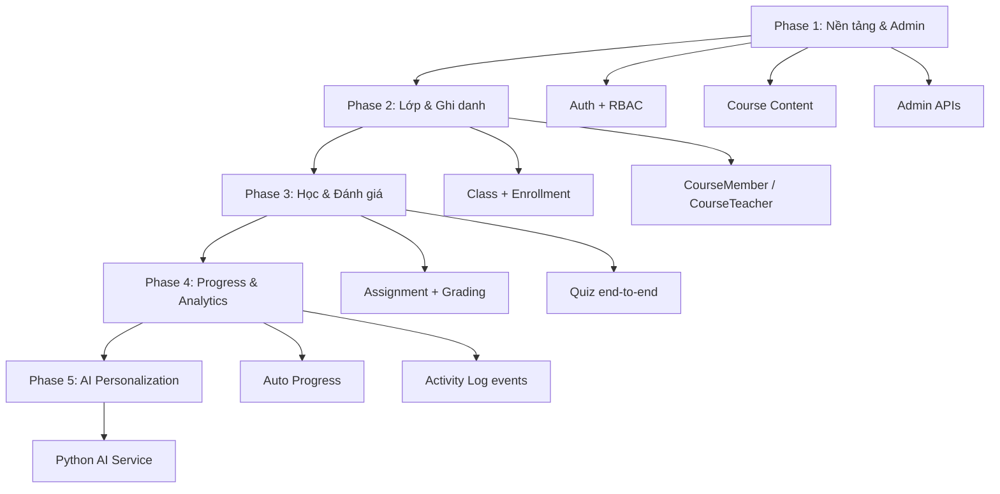

# Lộ trình phát triển Backend — AI Personalized LMS

> Tài liệu hướng dẫn thứ tự ưu tiên phát triển backend để hoàn thiện toàn bộ chức năng hệ thống.
>
> **Cập nhật:** 2026-07-11

---

## 1. Mục tiêu dự án

Xây dựng LMS thông minh hỗ trợ:

- Quản lý khóa học và lớp học
- Đánh giá trực tuyến và chấm điểm
- Theo dõi tiến độ học tập
- Tương tác giữa giáo viên và học sinh
- AI cá nhân hóa lộ trình học dựa trên hành vi người dùng

**Kiến trúc:**

| Thành phần | Công nghệ |
|---|---|
| Frontend | React |
| Backend | Spring Boot |
| Database | MySQL |
| AI Service | Python (Phase cuối) |

---

## 2. Hiện trạng Backend

### 2.1 Đã có (tương đối hoàn chỉnh)

| Nhóm | Module | Ghi chú |
|---|---|---|
| **Xác thực & phân quyền** | Auth, User, Role, Permission, AuditLog | JWT, OTP, invite user, RBAC 2 tầng |
| **Nội dung khóa học** | Category, Course, CourseSection, Lesson, LessonResource | Slug, reorder, search, pagination |
| **Nhân sự (HR)** | Employee, EmployeeContract, Salary, Attendance, Guardian, StudentProfile, TeachingRate, TeachingSessionPayment | CRUD + service layer |

### 2.2 Vừa scaffold (CRUD cơ bản, chưa có luồng nghiệp vụ)

| Nhóm | Module |
|---|---|
| **Lớp học** | Class, ClassOnline, Enrollment, CourseMember, CourseTeacher |
| **Đánh giá** | Assignment, Submission, Quiz, Question, QuestionOption, QuizAttempt, QuizAnswer |
| **Tiến độ & phân tích** | LessonProgress, CourseProgress, LearningActivityLog, StudyGoal |

### 2.3 Chưa có

- Luồng nghiệp vụ end-to-end (enroll → học → nộp bài → chấm điểm → cập nhật progress)
- RBAC trên hầu hết API learning mới
- API composite (course tree, student dashboard)
- Tích hợp AI (Phase 3 theo README gốc)


## 3. Nguyên tắc ưu tiên

1. **Luồng nghiệp vụ trước, CRUD sau** — Không thêm entity mới khi chưa nối được flow end-to-end.
2. **Phụ thuộc dữ liệu** — Module sau cần dữ liệu thật từ module trước (AI cần activity log, progress cần quiz/submission).
3. **FE có thể demo sớm** — Ưu tiên API mà frontend gắn được và demo được tính năng.
4. **Bảo mật sớm** — Gắn RBAC trước khi mở rộng tích hợp frontend.

---

## 4. Lộ trình 5 Phase



---

## Phase 1 — Nền tảng & Admin

**Thời gian ước tính:** 1–2 tuần

**Mục tiêu:** Admin/Teacher quản lý được hệ thống; Frontend gắn API ổn định.

### 1.1 Auth + RBAC

- [ ] Gắn `@PreAuthorize` / permission cho toàn bộ API learning mới
- [ ] Định nghĩa rõ role: `ADMIN`, `TEACHER`, `STUDENT`
- [ ] Thống nhất prefix API → `/api/v1/...`
- [ ] Kiểm tra permission theo entity: `course_read`, `assignment_create`, ...

### 1.2 Hoàn thiện Course Content

- [ ] Publish / unpublish khóa học
- [ ] API **course tree** (1 call): Course → Sections → Lessons → Resources
- [ ] Upload file/media cho LessonResource (nếu chưa có storage layer)
- [ ] Validate FK khi tạo Section/Lesson (course tồn tại, teacher có quyền)

### 1.3 Admin Management

- [ ] User CRUD + assign role (đang làm ở branch `feature/frontend/admin-management`)
- [ ] Category / Course management
- [ ] Xem AuditLog thao tác admin

**Deliverable Phase 1:** Admin đăng nhập → quản lý user/role → tạo và publish khóa học có đầy đủ nội dung.

---

## Phase 2 — Lớp học & Ghi danh

**Thời gian ước tính:** 1–2 tuần

**Mục tiêu:** Học sinh vào được lớp; giáo viên quản lý được lớp và thành viên.

### 2.1 Class + Enrollment (nâng từ CRUD → business flow)

- [ ] `POST /enrollments` → tự tạo bản ghi `CourseProgress` ban đầu
- [ ] Validate: `maxMembers`, enrollment trùng, course/class tồn tại
- [ ] Trạng thái enrollment: `pending` / `active` / `completed` / `dropped`
- [ ] API: `GET /students/me/enrollments` — danh sách khóa học của học sinh đang đăng nhập

### 2.2 CourseMember / CourseTeacher

- [ ] Teacher được assign course → mới được tạo Assignment/Quiz
- [ ] Student chỉ truy cập course đã enroll
- [ ] Phân quyền theo `CourseMember.roleInClass` (TEACHER / STUDENT / TA)

### 2.3 ClassOnline (nếu có học trực tuyến)

- [ ] Quản lý link meeting, lịch buổi học
- [ ] Trạng thái buổi học: scheduled / ongoing / ended

**Deliverable Phase 2:** Teacher tạo lớp → thêm học sinh → học sinh thấy khóa học trên dashboard.

---

## Phase 3 — Học & Đánh giá (CORE LMS)

**Thời gian ước tính:** 2–3 tuần

**Mục tiêu:** Học sinh học, làm bài, được chấm điểm — đây là phần quan trọng nhất.

### 3.1 Assignment Flow

```
Teacher tạo Assignment
  → Student submit (file / text)
  → Teacher grade + feedback
  → Cập nhật điểm + completedAssignments
```

**API đề xuất (orchestration, không CRUD rời):**

| Method | Endpoint | Mô tả |
|---|---|---|
| POST | `/api/v1/assignments/{id}/submit` | Học sinh nộp bài |
| POST | `/api/v1/submissions/{id}/grade` | Giáo viên chấm điểm + feedback |
| GET | `/api/v1/assignments/{id}/submissions` | GV xem danh sách bài nộp |

**Checklist:**

- [ ] Validate deadline, `allowLate`
- [ ] Gắn `enrollmentId` + `userId` từ token (không tin FE gửi)
- [ ] Cập nhật `CourseProgress.completedAssignments` sau khi graded

### 3.2 Quiz Flow

```
Teacher tạo Quiz + Questions + Options
  → Student start attempt (check maxAttempts, timeLimit)
  → Student submit answers
  → Auto-grade (trắc nghiệm)
  → Tính score, isPassed
  → Cập nhật avgQuizScore
```

**API đề xuất:**

| Method | Endpoint | Mô tả |
|---|---|---|
| POST | `/api/v1/quizzes/{id}/start` | Bắt đầu làm bài, tạo QuizAttempt |
| POST | `/api/v1/quiz-attempts/{id}/submit` | Nộp đáp án, auto-grade |
| GET | `/api/v1/quizzes/{id}/result` | Xem kết quả (ẩn đáp án đúng khi đang làm) |

**Checklist:**

- [ ] Kiểm tra `maxAttempts`, `timeLimitMin`
- [ ] Auto-grade cho câu trắc nghiệm (`QuestionOption.isCorrect`)
- [ ] Cập nhật `CourseProgress.avgQuizScore`
- [ ] Ẩn `isCorrect` khi student đang làm bài

**Deliverable Phase 3:** Học sinh enroll → xem bài → nộp assignment → làm quiz → nhận điểm.

---

## Phase 4 — Progress & Analytics

**Thời gian ước tính:** 1–2 tuần

**Mục tiêu:** Tiến độ học tập tự cập nhật; có dữ liệu cho dashboard và AI.

> **Quan trọng:** Không để FE gọi CRUD `LessonProgress` / `CourseProgress` trực tiếp. Chuyển sang service tự cập nhật từ sự kiện.

### 4.1 Auto Progress

| Sự kiện | Cập nhật |
|---|---|
| Xem lesson / đạt % xem | `LessonProgress` |
| Hoàn thành lesson | `CourseProgress.completedLessons`, `progressPercent` |
| Nộp assignment (graded) | `CourseProgress.completedAssignments` |
| Submit quiz | `CourseProgress.avgQuizScore` |
| Mọi hành vi học tập | `LearningActivityLog` |

**API đề xuất:**

| Method | Endpoint | Mô tả |
|---|---|---|
| POST | `/api/v1/lessons/{id}/progress` | Cập nhật tiến độ xem bài (position, %) |
| POST | `/api/v1/lessons/{id}/complete` | Đánh dấu hoàn thành lesson |
| GET | `/api/v1/students/me/courses/{courseId}/progress` | Tiến độ khóa học |
| GET | `/api/v1/students/me/dashboard` | Tổng hợp: progress, bài chưa làm, deadline |

### 4.2 LearningActivityLog

- [ ] Ghi log tự động từ service layer (không để FE tự POST log giả)
- [ ] Event types: `LESSON_VIEW`, `LESSON_COMPLETE`, `QUIZ_SUBMIT`, `ASSIGNMENT_SUBMIT`, ...

### 4.3 StudyGoal

- [ ] Làm sau khi progress + activity log ổn định
- [ ] Tính streak từ `LearningActivityLog`

**Deliverable Phase 4:** Dashboard học sinh/giáo viên hiển thị tiến độ thật; log hành vi đầy đủ.

---

## Phase 5 — AI Personalization

**Thời gian ước tính:** 2+ tuần (song song hoặc sau Phase 4)

**Điều kiện tiên quyết:** Phase 1–4 đã có dữ liệu thật từ người dùng.

### Input cho AI Service (Python)

- `LearningActivityLog` — hành vi học tập
- `LessonProgress` — bài đã học / chưa học
- Quiz scores, thời gian học, tần suất

### Backend (Spring Boot)

- [ ] Endpoint proxy: `GET /api/v1/students/me/recommendations`
- [ ] Endpoint: `GET /api/v1/students/me/learning-path`
- [ ] Retry / fallback khi AI service không available

**Deliverable Phase 5:** Gợi ý bài học tiếp theo, nhắc ôn tập, lộ trình cá nhân hóa.

---

## 5. Module HR — Làm khi nào?

| Hướng dự án | Ưu tiên HR |
|---|---|
| LMS trung tâm đào tạo / trường học (có nhân sự, lương, chấm công) | Song song Phase 1–2, ưu tiên thấp hơn core học tập |
| LMS online course platform (Udemy-style) | **Hoãn HR**, tập trung Phase 1–4 trước |

---

## 6. Kế hoạch hành động tuần này

| # | Việc | Phase | Lý do |
|---|---|---|---|
| 1 | RBAC cho API mới | 1 | Bảo mật trước khi FE tích hợp |
| 2 | API course tree (nested) | 1 | FE cần render khóa học |
| 3 | Enrollment flow + auto CourseProgress | 2 | Mở luồng học sinh |
| 4 | Assignment submit + grade | 3 | Demo feature sớm |
| 5 | Quiz start + submit + auto-grade | 3 | Core assessment |
| 6 | Auto progress từ events | 4 | Thay CRUD thủ công |
| 7 | Dashboard APIs | 4 | Gắn FE student/teacher |
| 8 | AI integration | 5 | Cuối cùng |

---

## 7. Sơ đồ phụ thuộc module

```
Auth / User / Role / Permission
         │
         ▼
Category → Course → Section → Lesson → Resource
         │
         ▼
Class ← → Enrollment ← → CourseMember / CourseTeacher
         │
         ├─→ Assignment → Submission (grade)
         ├─→ Quiz → Question → Option → Attempt → Answer (auto-grade)
         ├─→ ClassOnline
         │
         ▼
LessonProgress ──→ CourseProgress
         │
         ▼
LearningActivityLog ──→ StudyGoal
         │
         ▼
AI Recommendation Service (Python)
```

---

## 8. Tiêu chí "Done" cho từng Phase

| Phase | Done khi |
|---|---|
| **1** | Admin tạo khóa học publish được; API có RBAC; FE admin gắn xong |
| **2** | Học sinh enroll và thấy khóa học; teacher quản lý lớp |
| **3** | Nộp assignment + làm quiz + nhận điểm end-to-end |
| **4** | Progress tự cập nhật; dashboard có data thật |
| **5** | AI gợi ý bài học dựa trên hành vi thực tế |

---

