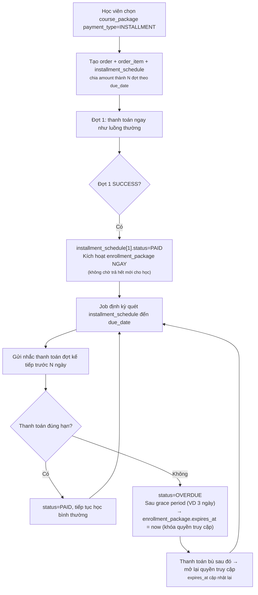
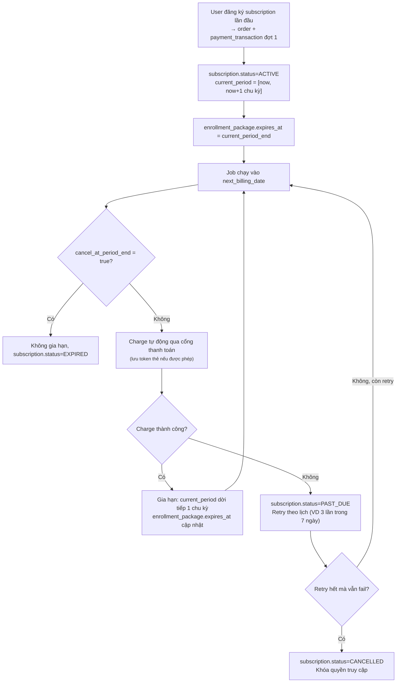
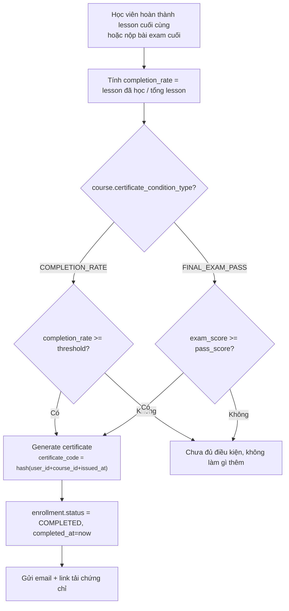
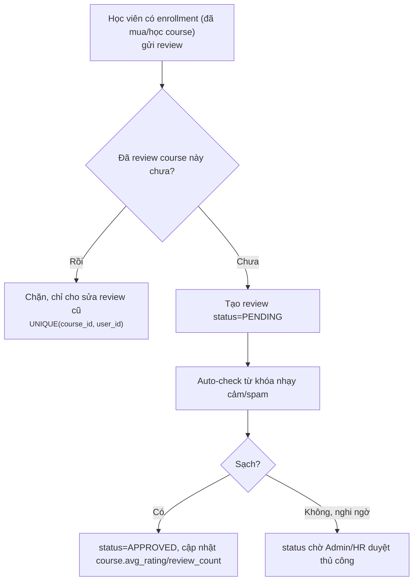
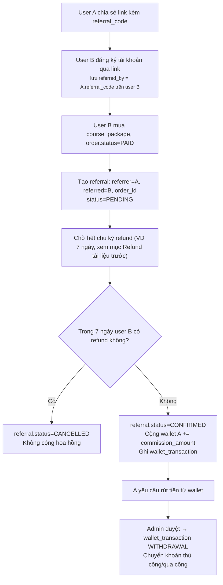
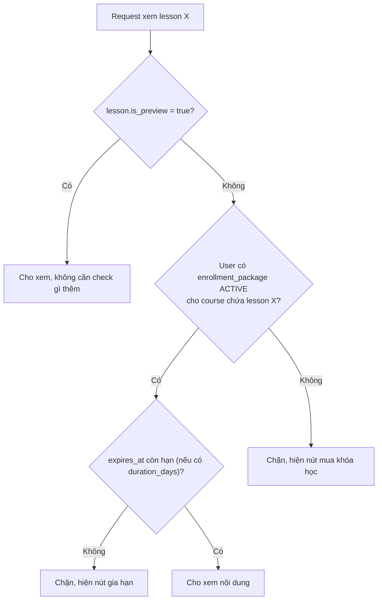

# Module 2/3 (mở rộng phần 2) — Subscription, Chứng chỉ/Review, Cart/Affiliate & Đào sâu chi tiết

> Nối tiếp 2 tài liệu trước (`class-member-capacity-nghiep-vu.md` và `course-package-ecommerce-nghiep-vu.md`). Dùng chung entity đã có: `course_package`, `order`, `order_item`, `payment_transaction`, `enrollment`, `enrollment_package`, `class_member`.

---

# A. Subscription / Trả góp học phí

## A.1. Vấn đề

Hiện tại `order` giả định thanh toán **1 lần, đủ tiền**. Thực tế cần thêm 2 mô hình:
- **Trả góp (installment)**: mua 1 course_package nhưng chia làm nhiều đợt thanh toán.
- **Subscription**: thu định kỳ (VD gói học không giới hạn theo tháng), không phải mua đứt.

## A.2. Schema bổ sung

### `course_package` (bổ sung field)

| Column | Type | Description |
|---|---|---|
| payment_type | TINYINT | ONE_TIME / INSTALLMENT / SUBSCRIPTION |
| installment_count | INT | Số đợt trả góp (nếu INSTALLMENT) |
| billing_cycle | TINYINT | MONTHLY / QUARTERLY (nếu SUBSCRIPTION) |

### `installment_schedule`

| Column | Type | Description |
|---|---|---|
| id | BIGINT | |
| order_item_id | BIGINT NN, FK → order_item.id | |
| installment_no | INT | Đợt số mấy (1, 2, 3...) |
| amount | DECIMAL | |
| due_date | DATETIME | |
| status | TINYINT | PENDING / PAID / OVERDUE |
| paid_transaction_id | BIGINT | FK → payment_transaction.id (nullable) |

### `subscription`

| Column | Type | Description |
|---|---|---|
| id | BIGINT | |
| user_id | BIGINT NN, FK → user.id | |
| course_package_id | BIGINT NN, FK → course_package.id | |
| status | TINYINT | ACTIVE / PAST_DUE / CANCELLED / EXPIRED |
| current_period_start | DATETIME | |
| current_period_end | DATETIME | |
| next_billing_date | DATETIME | |
| cancel_at_period_end | BOOLEAN | User đã bấm hủy, chờ hết chu kỳ mới ngưng hẳn |
| created_at / updated_at | | |

## A.3. Luồng trả góp

**Business rule:**
- Trả góp **không chờ đủ tiền mới học** — kích hoạt ngay từ đợt 1, các đợt sau chỉ là ràng buộc duy trì quyền truy cập. Đây là quyết định kinh doanh cần chốt rõ (khác với mô hình "trả đủ mới giao hàng").
- Quá hạn quá lâu (VD 30 ngày không trả) → coi như hủy hợp đồng, `order.status = CANCELLED`, không hoàn lại phần đã học.

## A.4. Luồng subscription (thu định kỳ)

**Business rule:** User bấm "Hủy" → không cắt ngay, set `cancel_at_period_end = true`, vẫn dùng hết chu kỳ đã trả tiền (giống thông lệ Netflix/Spotify).

---

# B. Chứng chỉ hoàn thành & Review/Rating

## B.1. Chứng chỉ (Certificate)

### Schema

| Column | Type | Description |
|---|---|---|
| id | BIGINT | |
| enrollment_id | BIGINT NN, FK → enrollment.id | |
| course_id | BIGINT NN, FK → course.id | |
| user_id | BIGINT NN, FK → user.id | |
| certificate_code | VARCHAR | Unique, dùng để tra cứu/xác thực công khai |
| issued_at | DATETIME | |
| file_url | VARCHAR | PDF đã generate, lưu qua Module File Management đã có |
| status | TINYINT | ISSUED / REVOKED |

### Điều kiện cấp (cần chốt trong `course`)

Thêm `course.certificate_condition_type`: `COMPLETION_RATE` (VD ≥ 80% lesson) hoặc `FINAL_EXAM_PASS` (điểm bài kiểm tra cuối ≥ ngưỡng).

**Business rule:**
- `certificate_code` phải **verify công khai được** (trang `/verify/{code}` không cần đăng nhập) — nhà tuyển dụng/bên thứ 3 xác thực chứng chỉ thật/giả.
- `status = REVOKED` dùng khi phát hiện gian lận (thi hộ, học hộ) — không xóa cứng record, giữ lịch sử.

## B.2. Review / Rating

### Schema

| Column | Type | Description |
|---|---|---|
| id | BIGINT | |
| course_id | BIGINT NN, FK → course.id | |
| user_id | BIGINT NN, FK → user.id | |
| enrollment_id | BIGINT NN, FK → enrollment.id | Bằng chứng đã mua/học, chống review ảo |
| rating | TINYINT | 1-5 |
| comment | TEXT | |
| status | TINYINT | PENDING / APPROVED / HIDDEN |
| created_at / updated_at | | |

### `course` (bổ sung field denormalize)

| Column | Type | Description |
|---|---|---|
| avg_rating | DECIMAL | Cache trung bình, recompute khi có review mới |
| review_count | INT | Cache tổng số review APPROVED |

**Business rule:**
- Bắt buộc `enrollment_id` tồn tại mới cho review — chặn review dạo từ người chưa từng học.
- `UNIQUE (course_id, user_id)` — 1 người chỉ review 1 lần/course, sửa thì update record cũ (giữ `created_at` gốc, thêm `updated_at`).

---

# C. Giỏ hàng (Cart) & Affiliate/Giới thiệu

## C.1. Giỏ hàng

### Schema

| Column | Type | Description |
|---|---|---|
| cart_item.id | BIGINT | |
| cart_item.user_id | BIGINT NN, FK → user.id | |
| cart_item.course_package_id | BIGINT NN, FK → course_package.id | |
| cart_item.added_at | DATETIME | |

**Business rule:**
- `UNIQUE (user_id, course_package_id)` — không cho thêm trùng.
- Checkout: chọn nhiều `cart_item` → tạo **1 `order`** với nhiều `order_item` tương ứng (đúng thiết kế combo nhiều course đã có ở tài liệu trước) → xóa `cart_item` đã checkout thành công, giữ lại cái chưa chọn.
- Giỏ hàng **không giữ chỗ/giữ giá** — giá lấy lại đúng `course_package.price` tại thời điểm checkout (không phải lúc thêm vào giỏ).

## C.2. Affiliate / Giới thiệu bạn bè

### Schema

**`user` (bổ sung field)**

| Column | Type | Description |
|---|---|---|
| referral_code | VARCHAR | Unique, tự sinh khi tạo tài khoản |
| referred_by | VARCHAR | referral_code của người giới thiệu (nullable, set 1 lần) |

**`referral`**

| Column | Type | Description |
|---|---|---|
| id | BIGINT | |
| referrer_user_id | BIGINT NN, FK → user.id | Người giới thiệu |
| referred_user_id | BIGINT NN, FK → user.id | Người được giới thiệu (đăng ký mới) |
| order_id | BIGINT | FK → order.id (đơn hàng đầu tiên phát sinh hoa hồng) |
| commission_amount | DECIMAL | |
| status | TINYINT | PENDING / CONFIRMED / PAID / CANCELLED |
| created_at | DATETIME | |

**`wallet`**

| Column | Type | Description |
|---|---|---|
| user_id | BIGINT PK, FK → user.id | |
| balance | DECIMAL | |
| updated_at | DATETIME | |

**`wallet_transaction`**

| Column | Type | Description |
|---|---|---|
| id | BIGINT | |
| user_id | BIGINT NN, FK → user.id | |
| type | TINYINT | AFFILIATE_COMMISSION / WITHDRAWAL / REFUND_CREDIT |
| amount | DECIMAL | |
| reference_id | BIGINT | Trỏ tới `referral.id` hoặc `order.id` tùy `type` |
| created_at | DATETIME | |

### Luồng

**Business rule:**
- `referral.status` **chỉ CONFIRMED sau khi qua thời hạn refund** — tránh trả hoa hồng cho đơn hàng bị hủy/hoàn tiền sau đó.
- `commission_amount` tính trên `order.final_amount` (sau khi trừ coupon), không tính trên `total_amount` gốc — tránh double-discount (vừa giảm giá cho khách vừa trả hoa hồng như giá gốc).
- 1 user chỉ có **1 người giới thiệu** (`referred_by` set 1 lần khi đăng ký, không đổi được sau) — tránh tranh chấp nhiều người claim giới thiệu cùng 1 user.

---

# D. Đào sâu chi tiết các luồng đã thiết kế

## D.1. Concurrency khi check sức chứa `class_member`

Vấn đề: nhiều request enroll cùng lúc vào 1 class còn 1 chỗ trống → có thể cả 2 cùng đọc "còn chỗ" trước khi cùng insert, dẫn tới vượt `max_members`.

**2 cách xử lý, chọn 1:**

1. **Pessimistic lock (khuyến nghị cho hệ thống vừa/nhỏ):**
   - Trong transaction: `SELECT ... FROM class WHERE id = :classId FOR UPDATE` trước khi đếm `class_member` và insert.
   - Lock giữ tới hết transaction, request thứ 2 phải chờ, đọc số liệu mới nhất sau khi request 1 commit.
   - Trade-off: dễ implement, an toàn tuyệt đối, nhưng giảm throughput nếu 1 class có lượt enroll đồng thời rất cao (hiếm khi xảy ra ở quy mô trung tâm đào tạo).

2. **Optimistic lock bằng `version` + đếm lại:**
   - Thêm `class.version` (hoặc dùng `current_member_count` denormalize + `@Version`).
   - Update `current_member_count = current_member_count + 1 WHERE id=:id AND current_member_count < max_members` — nếu update trả về 0 row nghĩa là hết chỗ hoặc bị đụng độ, retry hoặc báo lỗi.
   - Trade-off: nhanh hơn, nhưng cần thêm cột denormalize `current_member_count` và đồng bộ cẩn thận mỗi khi remove/promote member (dễ lệch nếu code sai sót).

→ Khuyến nghị bắt đầu bằng pessimistic lock cho đơn giản, chỉ chuyển sang optimistic nếu đo được nghẽn thực tế.

## D.2. Idempotency cho webhook thanh toán

- Mỗi request callback từ cổng thanh toán mang `transaction_ref` duy nhất.
- Trước khi xử lý: check `payment_transaction WHERE transaction_ref = :ref` đã tồn tại và `status = SUCCESS` chưa → nếu có rồi, **trả về 200 OK ngay, không xử lý lại** (cổng thanh toán hay gửi lại webhook nhiều lần do timeout).
- Toàn bộ chuỗi "cập nhật order → tạo enrollment_package → trigger enrollment" nên nằm trong **1 transaction**, hoặc dùng **outbox pattern** (ghi event vào bảng `outbox_event` cùng transaction với update order, 1 job riêng đọc outbox và xử lý phần còn lại) nếu cần gọi thêm service ngoài (gửi email, tạo lớp 1-1) mà không muốn block transaction chính.

## D.3. Thứ tự check quyền truy cập nội dung (permission cho `lesson`)

Thứ tự check này nên là 1 **method dùng chung** (`ContentAccessChecker`) gọi ở mọi nơi cần hiển thị nội dung (API lesson detail, API download resource, API stream video) — tránh mỗi chỗ tự viết check riêng dẫn tới lệch rule.

## D.4. Job định kỳ cần có (tổng hợp toàn bộ tài liệu)

| Job | Tần suất | Việc làm |
|---|---|---|
| Quét `order.status=PENDING` quá hạn | Mỗi 5-15 phút | Chuyển `EXPIRED` |
| Quét `enrollment_package.expires_at` sắp hết | Hằng ngày | Gửi nhắc gia hạn trước N ngày |
| Quét `installment_schedule` đến hạn | Hằng ngày | Gửi nhắc / đánh dấu OVERDUE |
| Charge subscription đến `next_billing_date` | Hằng ngày | Thu tiền định kỳ, xử lý retry |
| Promote waitlist khi có chỗ trống | Event-driven (sau khi remove member) | Không cần chạy định kỳ, chạy ngay sau commit |
| Recompute `course.avg_rating/review_count` | Event-driven (sau mỗi review APPROVED) | Hoặc batch job hằng đêm nếu traffic review thấp |

---

## E. Bảng ưu tiên tổng hợp (phần 2)

| Ưu tiên | Hạng mục | Lý do |
|---|---|---|
| 🔴 Cao | Idempotency webhook + concurrency lock `class_member` | Sai ở đây là mất tiền/lệch dữ liệu, phải chắc chắn ngay từ đầu |
| 🟡 Trung bình | Chứng chỉ hoàn thành | Giá trị thương hiệu, học viên mong đợi nhưng không chặn vận hành |
| 🟡 Trung bình | Trả góp | Chỉ cần nếu mô hình kinh doanh thực sự bán gói giá trị lớn |
| 🟢 Thấp | Review/Rating | Cần traffic đủ lớn mới có ý nghĩa, làm sau |
| 🟢 Thấp | Cart | Tiện lợi UX, không thiếu vẫn bán được (mua thẳng từng course) |
| 🟢 Thấp | Subscription | Mô hình kinh doanh khác hẳn mua đứt, cân nhắc kỹ trước khi làm — dễ phát sinh phức tạp billing |
| 🟢 Thấp | Affiliate | Làm khi đã có lượng user đủ lớn để chương trình giới thiệu có ý nghĩa |
