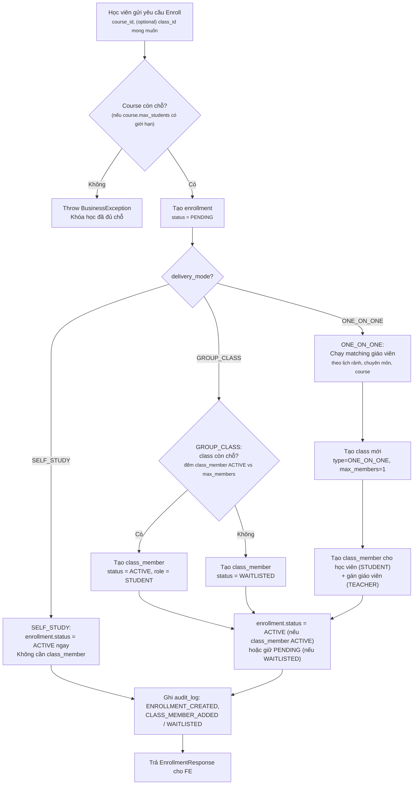
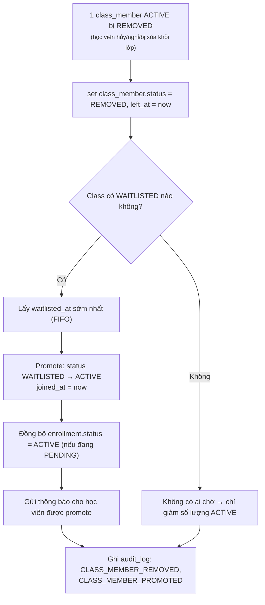
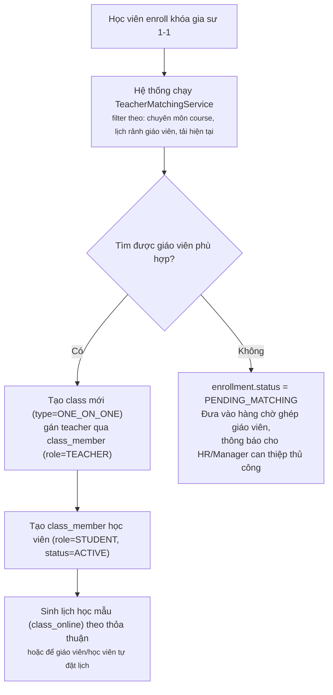
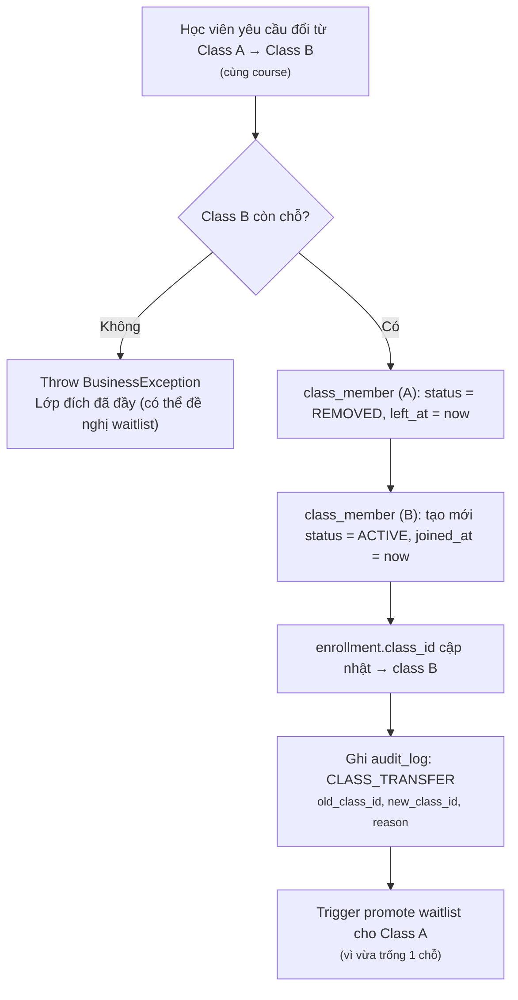

# Module 3 (bổ sung) — Class Member & Capacity Management

> **Đã chốt:** `class_member` khóa theo `(class_id, user_id)` — **không** dùng `course_id` làm khóa. Lý do: `class.course_id` đã có sẵn FK để suy ra course khi cần, còn `enrollment` (course_id + class_id nullable) đã đảm nhận việc trả lời "user thuộc course nào". Để `class_member` khóa theo course sẽ giới hạn 1 user chỉ có 1 role/1 bản ghi trong toàn course — không đúng khi cần track lịch sử chuyển lớp (transfer) hoặc 1 user vừa học nhóm A vừa trợ giảng lớp B cùng course.

## 1. Vấn đề cần giải quyết

Hiện tại đã có:
- `enrollment`: học viên/trợ giảng ghi danh vào **course** (và optionally 1 **class** cụ thể).
- `class`: lớp học, có `max_members`, `type`.
- `class_online`: buổi học online cụ thể trong 1 class.
- `course_teacher`: giáo viên phụ trách **course** (mức tổng quát).

Còn thiếu:
- Bảng roster thực sự của 1 class (`class_member`) — ai đang **thực sự** ở trong lớp, vai trò gì, tình trạng nào (đang học / chờ / đã rời).
- Cơ chế **kiểm soát sức chứa** (capacity) nhất quán giữa 2 hình thức học khác hẳn nhau:
  - **Lớp tự học / lớp nhóm (GROUP)**: nhiều học viên chung 1 lớp, giới hạn bởi `class.max_members`.
  - **Gia sư 1-1 (ONE_ON_ONE)**: mỗi học viên có 1 lớp riêng với 1 giáo viên, `max_members = 1`.
- Đồng bộ trạng thái giữa `enrollment` (mức course) và `class_member` (mức class) khi có waitlist, transfer, drop.
- Audit log cho toàn bộ thao tác thay đổi thành viên/sức chứa.

---

## 2. Schema bổ sung: `class_member`

| Column | Type | Description |
|---|---|---|
| class_id | BIGINT NN, PK, FK → class.id | |
| user_id | BIGINT NN, PK, FK → user.id | |
| role_in_class | TINYINT | STUDENT / ASSISTANT / TEACHER |
| status | TINYINT | ACTIVE / WAITLISTED / REMOVED / COMPLETED |
| joined_at | DATETIME | Thời điểm chính thức vào lớp (ACTIVE) |
| waitlisted_at | DATETIME | Thời điểm vào hàng chờ (nullable) |
| left_at | DATETIME | Thời điểm rời lớp (nullable) |
| created_at / created_by / updated_at / updated_by | | Audit fields |

**Constraint quan trọng:**
- PK composite `(class_id, user_id)` — 1 user chỉ có **1 bản ghi duy nhất** trong 1 class cụ thể (không phân biệt lịch sử qua nhiều dòng như thiết kế ban đầu). Khi user **rời lớp rồi vào lại cùng lớp đó**, cách xử lý: **update lại** bản ghi cũ (reset `status = ACTIVE`, `joined_at = now`, `left_at = null`) thay vì insert mới — vì PK không cho phép 2 dòng cùng `(class_id, user_id)`.
- Nếu cần giữ **lịch sử đầy đủ** từng lần vào/rời 1 class (audit chi tiết hơn `left_at` đơn lẻ), phải trông cậy vào bảng `audit_log` (mục 10) để lưu vết — `class_member` chỉ giữ **trạng thái hiện tại**, không phải lịch sử.
- `UNIQUE (class_id, user_id)` tự nhiên có sẵn nhờ PK, không cần thêm constraint riêng cho WAITLISTED/ACTIVE.
- `class.max_members` = giới hạn số `class_member.status = ACTIVE` trong class đó (không tính WAITLISTED/REMOVED).
- Transfer lớp (mục 7) do đó là: update dòng ở class A thành `REMOVED`, rồi **insert dòng mới** ở class B (khác `class_id` nên không đụng PK) — không phải update tại chỗ.

---

## 3. Phân loại hình thức học (delivery mode)

Đề xuất thêm `course.delivery_mode` (hoặc suy ra từ `class.type` nếu 1 course chỉ chạy 1 hình thức):

| Mode | Mô tả | Cách kiểm soát sức chứa |
|---|---|---|
| `SELF_STUDY` | Học tự học qua video/tài liệu, không thuộc class cụ thể | Kiểm soát ở **course level** — đếm `enrollment.status = ACTIVE` theo `course.max_students` (nếu có giới hạn) |
| `GROUP_CLASS` | Học viên học chung 1 lớp nhóm | Kiểm soát ở **class level** — đếm `class_member.status = ACTIVE` theo `class.max_members` |
| `ONE_ON_ONE` | Gia sư kèm riêng 1-1 | Mỗi học viên có **1 class riêng** (`type = ONE_ON_ONE`, `max_members = 1`), không có khái niệm "đầy chỗ" theo nghĩa nhóm, mà là **matching giáo viên** |

Một course vẫn có thể **vừa có GROUP_CLASS vừa có ONE_ON_ONE** (VD: khóa học có gói học nhóm và gói học kèm riêng) — do đó `delivery_mode` nên đặt ở **class**, không cứng ở course, để linh hoạt.

---

## 4. Luồng tổng quát: Enroll → Xếp lớp → Class Member



**Business rule quan trọng:**
- Check "còn chỗ hay không" và insert `class_member` phải nằm **trong cùng 1 transaction có khóa** (`SELECT ... FOR UPDATE` trên `class` hoặc dùng constraint + retry) để tránh **race condition** khi nhiều học viên enroll cùng lúc vào lớp gần đầy.
- Nếu course vừa có giới hạn ở course-level vừa ở class-level, phải check **cả hai**, thứ tự: course trước (chặn sớm), class sau (chặn theo lớp cụ thể).

---

## 5. Waitlist & tự động promote khi có chỗ trống



**Business rule:**
- Promote **luôn theo FIFO** (`waitlisted_at` sớm nhất trước), không cho phép "chen hàng" trừ khi có business rule ưu tiên riêng (VD: học viên VIP) — nếu có, cần field `priority` bổ sung và nêu rõ trong spec, không ngầm định.
- Việc promote nên chạy bất đồng bộ sau khi transaction xóa member commit thành công (`@TransactionalEventListener(phase = AFTER_COMMIT)`), tránh giữ lock lâu.

---

## 6. Luồng riêng cho gia sư 1-1 (ONE_ON_ONE)



**Business rule:**
- Không dùng chung khái niệm "waitlist theo lớp" cho ONE_ON_ONE — vì mỗi học viên là 1 lớp riêng, "chờ" ở đây là **chờ ghép giáo viên**, cần trạng thái riêng `enrollment.status = PENDING_MATCHING`.
- Nếu giáo viên 1-1 nghỉ/đổi giữa chừng: **không xóa class cũ** — set `class_member` của giáo viên cũ `status = REMOVED`, thêm `class_member` giáo viên mới `role = TEACHER, status = ACTIVE` trong cùng class (giữ lịch sử buổi học `class_online` liên tục). Ghi audit log `CLASS_TEACHER_REASSIGNED`.

---

## 7. Đổi lớp (Transfer) — cho GROUP_CLASS



**Lưu ý:** transfer thực chất là **remove + add**, tận dụng lại đúng luồng waitlist-promote ở mục 5 cho lớp nguồn.

---

## 8. Đồng bộ trạng thái `enrollment` ↔ `class_member`

| enrollment.status | class_member.status tương ứng |
|---|---|
| `PENDING` | `WAITLISTED` hoặc `PENDING_MATCHING` (1-1) |
| `ACTIVE` | `ACTIVE` |
| `COMPLETED` | `COMPLETED` (đồng bộ 2 chiều, set cùng lúc) |
| `DROPPED` | `REMOVED` |
| `SUSPENDED` | giữ nguyên `class_member.status` hiện tại, nhưng khóa quyền truy cập nội dung lớp (kiểm tra tại tầng permission, không đổi status) |

**Business rule:**
- Nguồn sự thật (source of truth) cho "học viên có đang học lớp X không" là `class_member.status = ACTIVE`, không phải `enrollment`.
- `enrollment` là mức **course** (tổng), `class_member` là mức **class** (chi tiết) — 1 enrollment SELF_STUDY sẽ **không có** `class_member` nào cả, đây là hợp lệ, không phải thiếu dữ liệu.

---

## 9. State machine — `class_member.status`

```
(tạo mới)
   ├── ACTIVE        (còn chỗ khi enroll/transfer)
   └── WAITLISTED     (hết chỗ khi enroll)

WAITLISTED → ACTIVE      (được promote khi có chỗ trống)
WAITLISTED → REMOVED     (học viên tự hủy khi đang chờ)
ACTIVE     → REMOVED     (rời lớp / bị xóa / transfer đi lớp khác)
ACTIVE     → COMPLETED   (hoàn thành khóa/lớp)
```

Ngoại lệ duy nhất: `REMOVED → ACTIVE` hoặc `COMPLETED → ACTIVE` được phép nếu học viên **học lại đúng class đó** (vì PK composite không cho insert dòng mới cùng `class_id + user_id`) — coi đây là "re-join", phải ghi audit log rõ ràng (`CLASS_MEMBER_REJOINED`) để phân biệt với join lần đầu, tránh nhầm lẫn khi đọc báo cáo.

---

## 10. Audit log — bắt buộc ghi cho các action sau

| Action | Khi nào ghi |
|---|---|
| `ENROLLMENT_CREATED` | Mỗi lần tạo enrollment mới |
| `CLASS_MEMBER_ADDED` | Học viên/giáo viên được thêm vào class với status ACTIVE |
| `CLASS_MEMBER_WAITLISTED` | Học viên bị đưa vào hàng chờ do lớp đầy |
| `CLASS_MEMBER_PROMOTED` | Waitlist được promote lên ACTIVE |
| `CLASS_MEMBER_REMOVED` | Học viên rời/bị xóa khỏi lớp (kèm reason: DROP/TRANSFER/ADMIN_REMOVE) |
| `CLASS_TRANSFER` | Đổi lớp — ghi cả `old_class_id` và `new_class_id` trong 1 record hoặc 2 record liên kết |
| `CLASS_TEACHER_REASSIGNED` | Đổi giáo viên phụ trách lớp (đặc biệt quan trọng với 1-1) |
| `CLASS_CAPACITY_CHANGED` | HR/Manager sửa `max_members` của 1 class đang chạy |

**Yêu cầu format `audit_log`:** `entity_type = CLASS_MEMBER`, `entity_id`, `action`, `old_value`/`new_value` (JSON snapshot trạng thái trước/sau), `performed_by`, `created_at`. Riêng các action tự động hệ thống sinh ra (promote waitlist) thì `performed_by = SYSTEM`.

---

## 11. Edge cases / nghiệp vụ nâng cao cần làm rõ thêm

1. **Sửa `max_members` khi lớp đang chạy và đã có học viên vượt số mới** (VD: giảm từ 20 xuống 15 nhưng đang có 18 active) — cần quy định: không cho giảm dưới số active hiện tại, hoặc cho phép nhưng đánh dấu "over capacity" và chặn nhận thêm học viên mới cho tới khi tự nhiên giảm xuống.
2. **Xóa cứng (hard delete) `class_member`** — không nên có, luôn soft (`status = REMOVED`) để giữ lịch sử điểm danh (`student_attendance`) và học phí (`tuition_invoice`) liên kết đúng theo từng giai đoạn học.
3. **1 học viên học nhiều class cùng lúc trong 1 course** (VD: vừa học nhóm vừa học thêm 1-1) — được phép, vì `class_member` không giới hạn 1 class/course, chỉ giới hạn 1 bản ghi hiệu lực/class.
4. **Course-level cap vs class-level cap xung đột** — nếu course.max_students nhỏ hơn tổng max_members các class cộng lại, cần chốt rule: cap course luôn là **giới hạn cứng ngoài cùng**, class cap chỉ là chia nhỏ trong giới hạn đó.
5. **Giáo viên 1-1 nghỉ nhưng chưa tìm được người thay** — enrollment nên có trạng thái tạm `SUSPENDED` (không phải `DROPPED`) để không tính là học viên bỏ học trong báo cáo, đồng thời không tính học phí trong giai đoạn gián đoạn.

---

## 12. Bảng ưu tiên triển khai

| Ưu tiên | Hạng mục | Lý do |
|---|---|---|
| 🔴 Cao | `class_member` + kiểm soát capacity GROUP_CLASS | Nền tảng bắt buộc, ảnh hưởng trực tiếp UX đăng ký lớp |
| 🔴 Cao | Đồng bộ `enrollment` ↔ `class_member` | Tránh lệch trạng thái, sai báo cáo học phí/điểm danh |
| 🟡 Trung bình | Waitlist + auto-promote | Cải thiện trải nghiệm, tránh HR xử lý tay |
| 🟡 Trung bình | Luồng ONE_ON_ONE matching + reassign giáo viên | Cần thiết nếu trung tâm có gói học kèm riêng |
| 🟢 Thấp | Transfer lớp tự động qua UI học viên | Có thể để HR xử lý thủ công giai đoạn đầu |
