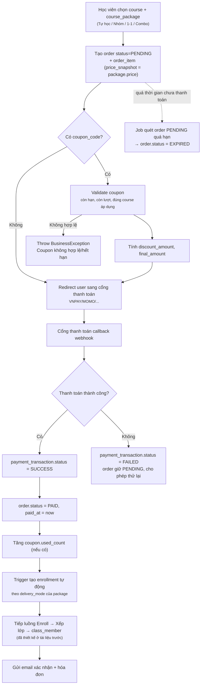
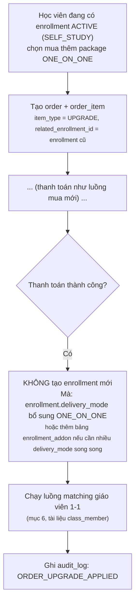
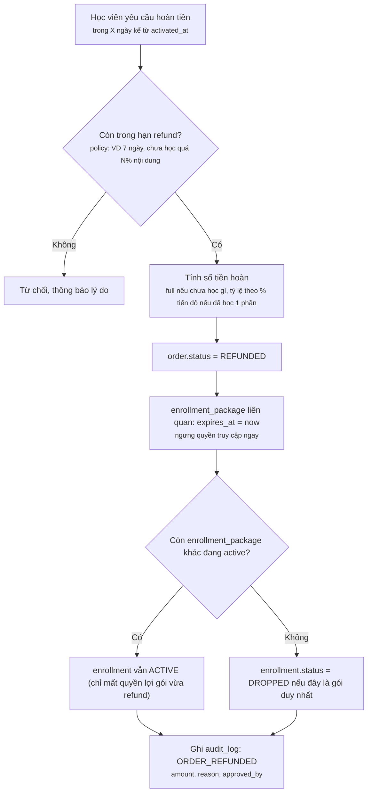
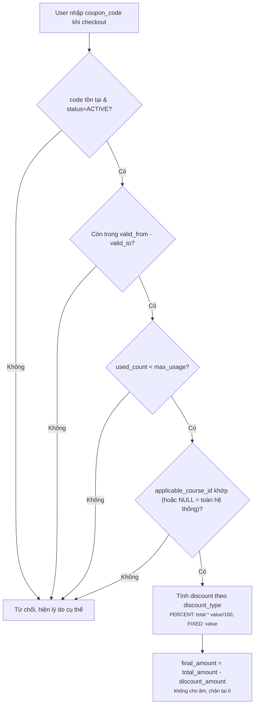
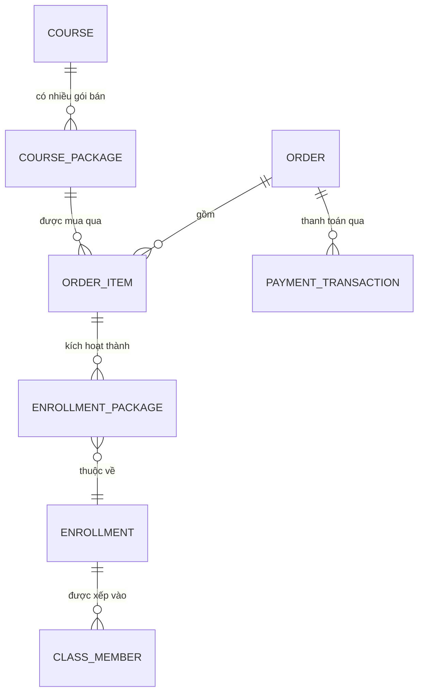

# Module 2 (mở rộng) — Course Package & Bán khóa học

> Bổ sung cho Course Management: course không chỉ là nội dung học mà còn là **sản phẩm bán được**, với nhiều gói khác nhau (tự học / có gia sư 1-1 / nhóm nhỏ / combo...). Tài liệu này thiết kế lớp "thương mại" nằm giữa `course` và `enrollment` đã có, không phá vỡ các luồng `enrollment` ↔ `class_member` đã chốt trước đó.

## 1. Vấn đề cần giải quyết

Hiện tại `course` chỉ mô tả **nội dung** (category, level, section, lesson...). Còn thiếu hoàn toàn lớp **thương mại**:
- 1 course có thể bán theo **nhiều gói khác nhau** với giá khác nhau (tự học rẻ hơn, có gia sư 1-1 đắt hơn).
- Cần đơn hàng, thanh toán, mã giảm giá, hoàn tiền.
- `enrollment` hiện tại được tạo "tay" — cần **tự động tạo enrollment khi thanh toán thành công**, đúng `delivery_mode` của gói đã mua.
- Học viên có thể **mua thêm** (upgrade từ tự học lên có gia sư) mà không mất lịch sử học cũ.

---

## 2. Schema bổ sung

### `course_package` — gói bán của 1 course

| Column | Type | Description |
|---|---|---|
| id | BIGINT | Package ID |
| course_id | BIGINT NN, FK → course.id | |
| name | VARCHAR(100) | VD: "Tự học", "Tự học + Gia sư 1-1", "Nhóm nhỏ 8 người" |
| delivery_mode | TINYINT | SELF_STUDY / GROUP_CLASS / ONE_ON_ONE / COMBO |
| price | DECIMAL | Giá bán |
| original_price | DECIMAL | Giá gốc (hiển thị gạch ngang khi có giảm giá) |
| duration_days | INT | Thời hạn truy cập kể từ ngày kích hoạt (NULL = vĩnh viễn) |
| included_tutor_sessions | INT | Số buổi gia sư đi kèm (NULL nếu không áp dụng, dùng cho ONE_ON_ONE/COMBO) |
| max_group_size | INT | Áp dụng nếu GROUP_CLASS (có thể khác `class.max_members` mặc định) |
| status | TINYINT | ACTIVE / INACTIVE (ngừng bán nhưng người đã mua vẫn dùng được) |
| created_at / created_by / updated_at / updated_by | | Audit fields |

### `order` — đơn hàng

| Column | Type | Description |
|---|---|---|
| id | BIGINT | Order ID |
| user_id | BIGINT NN, FK → user.id | |
| status | TINYINT | PENDING / PAID / CANCELLED / EXPIRED / REFUNDED |
| total_amount | DECIMAL | Tổng trước giảm giá |
| discount_amount | DECIMAL | Số tiền giảm |
| final_amount | DECIMAL | Số tiền phải trả thực tế |
| coupon_code | VARCHAR | Mã áp dụng (nullable) |
| expired_at | DATETIME | Hết hạn thanh toán nếu để PENDING quá lâu |
| paid_at | DATETIME | Thời điểm thanh toán thành công |
| created_at / created_by / updated_at / updated_by | | Audit fields |

### `order_item` — chi tiết đơn hàng

| Column | Type | Description |
|---|---|---|
| id | BIGINT | |
| order_id | BIGINT NN, FK → order.id | |
| course_package_id | BIGINT NN, FK → course_package.id | |
| price_snapshot | DECIMAL | Giá tại thời điểm mua (không đổi dù package sau này đổi giá) |
| item_type | TINYINT | NEW_PURCHASE / UPGRADE / RENEWAL |
| related_enrollment_id | BIGINT | FK → enrollment.id, chỉ có giá trị nếu `item_type = UPGRADE/RENEWAL` |

### `payment_transaction` — giao dịch thanh toán

| Column | Type | Description |
|---|---|---|
| id | BIGINT | |
| order_id | BIGINT NN, FK → order.id | |
| payment_method | VARCHAR | VNPAY / MOMO / BANK_TRANSFER / CASH |
| amount | DECIMAL | |
| status | TINYINT | PENDING / SUCCESS / FAILED |
| transaction_ref | VARCHAR | Mã giao dịch từ cổng thanh toán |
| paid_at | DATETIME | |
| created_at | DATETIME | |

### `coupon` — mã giảm giá

| Column | Type | Description |
|---|---|---|
| id | BIGINT | |
| code | VARCHAR | Unique |
| discount_type | TINYINT | PERCENT / FIXED |
| discount_value | DECIMAL | |
| applicable_course_id | BIGINT | FK → course.id (NULL = áp dụng toàn hệ thống) |
| max_usage | INT | Giới hạn lượt dùng tổng |
| used_count | INT | Số lượt đã dùng |
| valid_from / valid_to | DATETIME | |
| status | TINYINT | ACTIVE / INACTIVE |

**Business rule:** `price_snapshot` trong `order_item` **luôn** lưu giá tại thời điểm mua — giống hệt nguyên tắc `rate_applied` snapshot đã áp dụng ở `teaching_session_payment` (Module HR). Không bao giờ tính lại giá từ `course_package.price` hiện tại.

---

## 3. Luồng mua khóa học (Purchase Flow)



**Business rule quan trọng:**
- **Không** tạo `enrollment` ngay khi tạo `order` — chỉ tạo **sau khi** `order.status = PAID`. Tránh học viên có quyền truy cập khi chưa trả tiền.
- Webhook thanh toán phải **idempotent** (xử lý lại không tạo trùng enrollment) — check `order.status` đã `PAID` thì bỏ qua, không xử lý lần 2.
- `order` hết hạn (`EXPIRED`) do job quét định kỳ, không phải do user action — tránh giữ chỗ ảo trong `course_package` có giới hạn số lượng bán (nếu có).

---

## 4. Luồng mua thêm / nâng cấp gói (Upgrade)

Học viên đã mua `SELF_STUDY`, giờ muốn thêm gói `ONE_ON_ONE` (gia sư) cho cùng course.



**Business rule:**
- 1 `enrollment` về bản chất là "học viên X ghi danh course Y" — khi upgrade, **không tạo enrollment thứ 2 cho cùng course** (tránh trùng lặp báo cáo tiến độ). Thay vào đó cân nhắc:
  - Nếu đơn giản: đổi `enrollment` sang trạng thái phản ánh gói cao nhất đang có (metadata `active_packages` dạng JSON hoặc bảng phụ `enrollment_package (enrollment_id, course_package_id)` nếu cần track chính xác đã mua gói nào).
  - Khuyến nghị: thêm bảng `enrollment_package` (n-n giữa enrollment và course_package đã mua) để không mất lịch sử "học viên này đã mua đúng những gói nào" — quan trọng cho báo cáo doanh thu và hỗ trợ khi có tranh chấp.

### Bổ sung: `enrollment_package`

| Column | Type | Description |
|---|---|---|
| id | BIGINT | |
| enrollment_id | BIGINT NN, FK → enrollment.id | |
| course_package_id | BIGINT NN, FK → course_package.id | |
| order_item_id | BIGINT NN, FK → order_item.id | Truy vết đơn hàng gốc |
| activated_at | DATETIME | |
| expires_at | DATETIME | Tính từ `activated_at + course_package.duration_days` (NULL nếu vĩnh viễn) |

Đây là bảng **then chốt** để trả lời "enrollment này thực chất bao gồm những quyền lợi gì" — 1 `enrollment` có thể có nhiều dòng `enrollment_package` theo thời gian (mua thêm, gia hạn).

---

## 5. Luồng hoàn tiền (Refund)



**Business rule cần chốt rõ trong spec:**
- Chính sách refund theo **% tiến độ đã học** (VD: đã xem >30% bài học thì không hoàn hoặc chỉ hoàn 50%) — cần bảng `refund_policy` cấu hình được (không hard-code), vì trung tâm có thể đổi chính sách theo từng đợt khuyến mãi.
- Refund gói `ONE_ON_ONE` đã dùng vài buổi: hoàn theo `included_tutor_sessions - số buổi đã dạy` (liên kết `teaching_session_payment` bên Module HR để biết đã dạy bao nhiêu buổi — **không** cho hoàn tiền buổi giáo viên đã dạy).

---

## 6. Coupon / giảm giá



**Business rule:** `used_count` tăng chỉ khi `order.status = PAID` thành công (không tăng ngay lúc apply ở bước checkout, tránh coupon bị "giữ chỗ" bởi order không thanh toán).

---

## 7. Khóa học miễn phí & xem thử

- `course_package` có thể có `price = 0` → luồng mua bỏ qua bước thanh toán, `order.status = PAID` ngay lập tức (vẫn tạo `order` để giữ lịch sử thống nhất, không tạo enrollment "chui" ngoài luồng).
- `lesson.is_preview = true` (đã có sẵn) cho phép xem **không cần enrollment/order** — tách biệt hoàn toàn khỏi lớp thương mại này, xử lý ở tầng permission (check `is_preview` trước khi check `enrollment_package`).

---

## 8. Kết nối với thiết kế đã có (enrollment / class_member)



Luồng đầy đủ: `course_package` (bán) → `order`/`payment_transaction` (thanh toán) → `enrollment_package` (kích hoạt quyền lợi) → `enrollment` (ghi danh course) → `class_member` (roster lớp cụ thể).

---

## 9. State machines

### `order.status`
```
PENDING → PAID          (thanh toán thành công)
PENDING → EXPIRED       (quá hạn chưa thanh toán, job tự động)
PENDING → CANCELLED     (user tự hủy trước khi thanh toán)
PAID    → REFUNDED      (hoàn tiền, trong hạn chính sách)
```
Không có chiều `EXPIRED/CANCELLED → PAID` — muốn mua lại thì tạo `order` mới.

### `payment_transaction.status`
```
PENDING → SUCCESS
PENDING → FAILED   (cho phép tạo transaction mới, retry, cùng order)
```

---

## 10. Audit log bổ sung

| Action | Khi nào ghi |
|---|---|
| `ORDER_CREATED` | Tạo order mới |
| `PAYMENT_SUCCESS` / `PAYMENT_FAILED` | Callback từ cổng thanh toán |
| `COUPON_APPLIED` | Coupon được dùng thành công trong 1 order PAID |
| `ORDER_UPGRADE_APPLIED` | Mua thêm gói cho enrollment đã có |
| `ORDER_REFUNDED` | Hoàn tiền, kèm `amount`, `reason`, `approved_by` |
| `ENROLLMENT_PACKAGE_ACTIVATED` | Kích hoạt quyền lợi sau thanh toán |
| `ENROLLMENT_PACKAGE_EXPIRED` | Hết hạn truy cập (do `duration_days` hoặc do refund) |

---

## 11. Edge case / nâng cao cần làm rõ thêm

1. **Combo nhiều course trong 1 đơn** (bundle, VD mua 3 khóa giảm 20%) — hiện `order_item` chỉ trỏ 1 `course_package`/dòng, nhưng 1 `order` có nhiều `order_item` nên **combo nhiều course tự nhiên hỗ trợ được** mà không cần bảng riêng. Combo **1 course nhiều delivery_mode** (VD vừa tự học vừa 1-1) thì nên là **2 `course_package` riêng cùng course**, mua chung 1 order — không gộp thành 1 package phức tạp, giữ mỗi package đơn giản, dễ định giá/quản lý riêng.
2. **`course_package.duration_days` hết hạn nhưng học viên đang học dở** — cần job quét `enrollment_package.expires_at` sắp tới → gửi nhắc gia hạn trước N ngày (giống mẫu cảnh báo hợp đồng sắp hết hạn ở Module HR).
3. **Đổi giá `course_package` giữa chừng có ảnh hưởng người đã mua không?** — Không, vì `price_snapshot` đã lưu, chỉ ảnh hưởng người mua mới.
4. **Học viên được tặng khóa học (không qua order/thanh toán)** — vẫn nên tạo `order` với `payment_method = GIFT/ADMIN_GRANT`, `amount = 0`, để thống nhất luồng kích hoạt `enrollment_package`, tránh có nhánh "tạo enrollment tay" đi vòng qua lớp thương mại.
5. **Giới hạn số lượng bán** (nếu 1 khóa 1-1 chỉ nhận tối đa N học viên do giới hạn giáo viên) — cần thêm `course_package.max_purchases` + đếm `order.status IN (PAID, PENDING)` để chặn bán vượt, tương tự capacity control ở `class_member`.

---

## 12. Bảng ưu tiên triển khai

| Ưu tiên | Hạng mục | Lý do |
|---|---|---|
| 🔴 Cao | `course_package` + `order`/`order_item`/`payment_transaction` | Nền tảng bắt buộc để bán được khóa học |
| 🔴 Cao | Trigger tạo `enrollment`/`enrollment_package` tự động sau thanh toán | Kết nối thương mại với học tập, tránh xử lý tay |
| 🟡 Trung bình | `coupon` | Tăng chuyển đổi, không chặn vận hành cơ bản ban đầu |
| 🟡 Trung bình | Refund policy có cấu hình | Cần thiết khi có tranh chấp, nhưng có thể xử lý thủ công giai đoạn đầu |
| 🟢 Thấp | Combo/bundle nhiều course, giới hạn số lượng bán | Tối ưu doanh thu, làm sau khi core ổn định |
