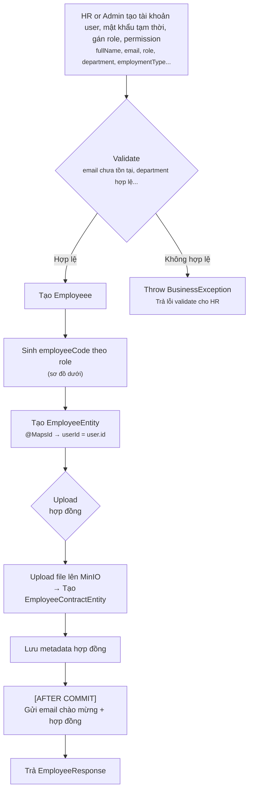
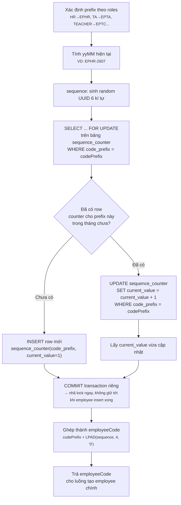
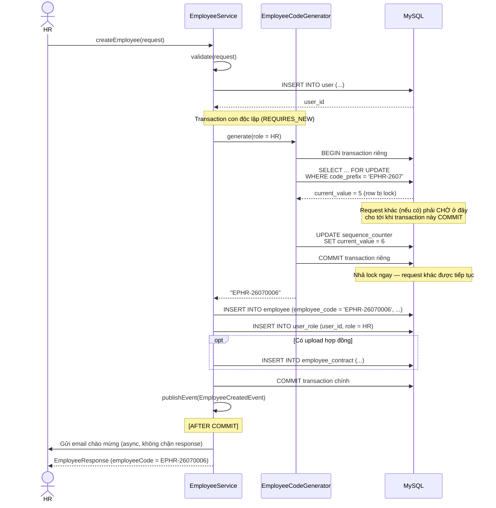
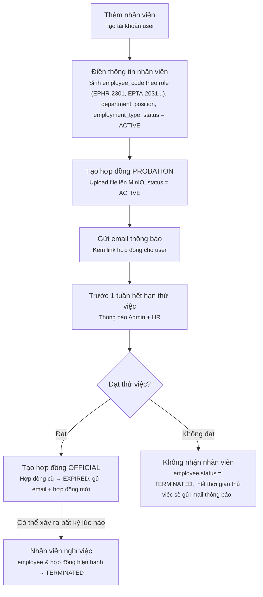
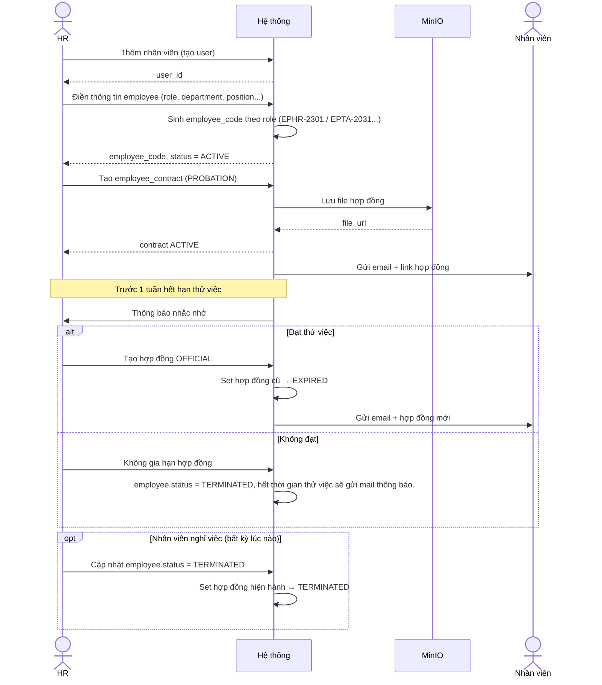

# Module HR Management & Student Management

# PHẦN 1. Module 4 — HR Management (Nhân sự)

## 1. Tổng quan luồng nghiệp vụ

```
User (tài khoản đăng nhập)
   │
   ▼
Employee (hồ sơ nhân sự) ──┬──> Employee Contract (hợp đồng lao động)
                            │
                            ├──> Attendance (chấm công — FULL_TIME)
                            │
                            ├──> Teaching Rate (đơn giá dạy — giảng viên)
                            │        │
                            │        ▼
                            │   Teaching Session Payment (thanh toán theo buổi dạy — PART_TIME)
                            │        │
                            ▼        ▼
                            Salary (bảng lương tổng hợp cuối kỳ)
```

Có 2 nhóm nhân sự với luồng tính công/lương khác nhau:

- **FULL_TIME** (HR, Accountant, Manager, Director...): chấm công qua `attendance` (check-in/check-out) → tính lương theo `base_salary` trong hợp đồng, trừ phạt đi muộn/nghỉ.
- **PART_TIME** (giảng viên, trợ giảng dạy theo buổi): chấm công qua `teaching_session_payment` tính lương qua số buổi dạy, số giờ dạy.

---

## 2. Luồng chi tiết từng bước

1. Tạo Employee: 

- `employeeCode` phải **unique tuyệt đối** trong toàn hệ thống, định dạng: `{PREFIX}-{yyMM}{sequence}` (VD: `EPHR-26070001`).
- `employeeCode` phân biệt với `studentCode`. Employee (EP), Student (ST). EmployeeCode: EP + Role(HR, TC, TA, ...) + '-' {yyMM}{sequence}, sequence thì 'UUID(random(6 số)). Nhiều role thì role sẽ viết lần lượt theo thứ tự role, được thêm. EPHRTA-230123456 
---



 
---

2. Gen `employeeCode`
 
 

 
### Vì sao dùng `SELECT ... FOR UPDATE` thay vì `COUNT(*) + 1`?
 
| Cách | Vấn đề |
|---|---|
| `COUNT(employeeCode LIKE 'EPHR-2607%') + 1` | 2 request đọc cùng lúc → cùng thấy count = 5 → cả 2 cùng sinh `...0006` → trùng, 1 bên bị chặn bởi unique constraint và fail |
| `SELECT ... FOR UPDATE` trên bảng counter riêng | Request thứ 2 phải **chờ** request thứ 1 commit xong mới đọc được giá trị mới nhất → không bao giờ trùng, vì DB tự xếp hàng (row lock) |
 
### Vì sao tách `sequence_counter` thành bảng riêng, không lock trực tiếp trên bảng `employee`?
 
- Nếu lock trực tiếp trên `employee` (VD: `SELECT ... FOR UPDATE` trên toàn bộ row có prefix đó), sẽ **khóa luôn** các thao tác đọc/ghi khác không liên quan trên bảng `employee` trong lúc chờ.
- Bảng `sequence_counter` (chỉ có `code_prefix`, `current_value`) là bảng **nhỏ, thao tác cực nhanh** (1 UPDATE đơn giản) → giữ lock trong thời gian rất ngắn → transaction sinh code không làm nghẽn các HR khác đang thao tác trên bảng `employee`.
- Transaction sinh code dùng `REQUIRES_NEW` (transaction con độc lập) → **commit ngay** sau khi lấy được số thứ tự, nhả lock lập tức, không phải chờ tới khi toàn bộ luồng tạo employee (insert user, employee, contract...) hoàn tất mới nhả lock.
---
 
## 4. Sequence diagram — Toàn bộ luồng tạo Employee (nhấn mạnh phần sinh code)
 

 
---
 
## 5. Bảng thiết kế đề xuất — `sequence_counter`
 
Cần thêm 1 bảng mới để phục vụ cơ chế sinh code an toàn ở trên:
 
| Column | Type | Description |
|---|---|---|
| `code_prefix` | VARCHAR(20) | PK — VD: `EPHR-2607` |
| `current_value` | BIGINT | Số thứ tự hiện tại, tăng dần mỗi lần sinh code mới |
| `updated_at` | DATETIME | Thời điểm cập nhật gần nhất |
 
**Business rule:** `code_prefix` reset theo tháng (vì đã bao gồm `yyMM` trong chính giá trị prefix) — không cần job dọn dẹp gì thêm, mỗi tháng mới tự động tạo row mới bắt đầu từ `current_value = 1`.
 
---
 
## 6. Trường hợp lỗi cần xử lý thêm
 
| Tình huống | Xử lý |
|---|---|
| Transaction sinh code bị timeout (DB deadlock hiếm gặp) | Retry tối đa 3 lần với backoff ngắn (`@Retryable`) |
| `role` không map được prefix nào (enum thiếu case) | Throw `BusinessException` ngay từ bước đầu, không tạo `user` trước rồi mới fail giữa chừng |
| Unique constraint `employee_code` vẫn bị vi phạm (trường hợp cực hiếm nếu có bug logic) | Bắt `DataIntegrityViolationException`, rollback toàn bộ transaction chính, trả lỗi rõ ràng cho HR để thử lại |
 
---
 
## 7. Câu hỏi cần xác nhận
 
1. Bạn có đồng ý thêm bảng `sequence_counter` mới, hay muốn dùng cách khác (VD: DB auto-increment riêng theo prefix, hoặc dùng Redis `INCR` thay vì lock DB)?
2. Nếu hệ thống có traffic tạo nhân viên **rất thấp** (vài người/ngày, không phải hệ thống lớn), cách `COUNT(*) + 1` đơn giản vẫn có thể chấp nhận được về mặt thực tế (rủi ro trùng gần như không xảy ra) — bạn có cần độ an toàn cao (`SELECT FOR UPDATE`) hay ưu tiên đơn giản hóa code?

### Bước 1 — Onboarding nhân viên (`employee` + `employee_contract`)

1. HR tạo tài khoản `user` (nếu chưa có) → tạo `employee` gắn `user_id`, sinh `employee_code` tự động (unique) (cái này sẽ là thêm nhân viên - thì lúc đó sẽ đưa tới tạo tài khoản, xong rồi đến điền các thông tin nhân viên) - Mã sẽ kểu EPHR-2301, phải dựa cả vào role nữa, role là HR thì gán EPHR, nếu là TA thì EPTA-2031, gán `department_id`, `position`, `employment_type` (FULL_TIME/PART_TIME), `start_date`, `status = ACTIVE`. 
2. HR tạo `employee_contract` đầu tiên:
   - `contract_type = PROBATION` (thử việc) thường tạo trước, `base_salary` thử việc thấp hơn chính thức.
   - Upload `file_url` hợp đồng scan/ký số, `signed_at` = thời điểm ký, `status = ACTIVE`.
   - Tạo xong hợp đồng thì phải gửi mail  thông báo tới user cùng với hợp đồng (hoặc link hợp đồng vì lưu trữ ở MInio rồi)
3. Khi hết hạn thử việc phải thông báo cho admin, hr trước 1 tuần → HR tạo hợp đồng mới `contract_type = OFFICIAL`, hoặc không nhận nhân viên này, đồng thời set hợp đồng cũ `status = EXPIRED`. Tạo xong thì gửi thông báo tới email + hợp đồng cho user. 
4. Nếu nhân viên nghỉ việc:
   - `employee.status = TERMINATED`, `end_date` = ngày nghỉ.
   - Hợp đồng hiện hành `employee_contract.status = TERMINATED`.

**Business rule:**
- 1 employee có thể có **nhiều `employee_contract` theo thời gian** (lịch sử: thử việc → chính thức → gia hạn...) nhưng chỉ **1 hợp đồng `ACTIVE` tại 1 thời điểm**.
- `base_salary` dùng để tính lương FULL_TIME lấy từ **hợp đồng đang ACTIVE**, không lấy từ hợp đồng đã `EXPIRED`.


## Flowchart
 

 
---
 
## Sequence diagram
 


### Bước 2A — Chấm công nhân viên FULL_TIME (`attendance`)

Áp dụng cho nhân viên `employment_type = FULL_TIME` (HR, Accountant, Manager, Director, và cả Teacher/Trợ giảng nếu làm fulltime tại trung tâm).

1. Mỗi ngày làm việc, hệ thống (hoặc máy chấm công tích hợp) ghi nhận `check_in_time`, `check_out_time` vào `attendance` với `work_date` tương ứng.
2. Hệ thống tự động tính `status` dựa trên giờ check-in/check-out:
   - `PRESENT`: đi làm đủ giờ, đúng giờ.
   - `LATE`: check-in trễ so với giờ quy định.
   - `HALF_DAY`: chỉ làm nửa ngày.
   - `ABSENT`: không có bản ghi check-in/check-out trong ngày làm việc.
   - `ON_LEAVE`: nghỉ phép có đơn.
3. Cuối kỳ lương, hệ thống tổng hợp số ngày `LATE`/`ABSENT` trong `period` để tính khấu trừ (`salary.deduction`).

**Business rule:**
- Nhân viên `PART_TIME` (giảng viên dạy theo buổi) **không** dùng `attendance` — họ được chấm công/tính lương hoàn toàn qua `teaching_session_payment`.

---

### Bước 2B — Thiết lập đơn giá dạy (`teaching_rate`)

Áp dụng cho giảng viên (`position = Teacher`, `Trợ giảng`).

1. HR/Manager thiết lập đơn giá cho **từng giảng viên + từng lớp học** (`employee_id` + `class_id`):
   - `payment_type = PER_SESSION` (theo buổi) hoặc `PER_HOUR` (theo giờ).
   - `rate` = đơn giá áp dụng.
   - `effective_from` / `effective_to` = khoảng thời gian áp dụng (hỗ trợ điều chỉnh lương theo thời gian mà không mất lịch sử).
2. Khi cần tăng lương cho giảng viên ở 1 lớp, HR **không sửa trực tiếp `rate` cũ** mà:
   - Set `effective_to` của rate cũ = ngày hiện tại, `status = INACTIVE`.
   - Tạo `teaching_rate` mới với `effective_from` = ngày áp dụng mới, `rate` mới, `status = ACTIVE`.

**Business rule:**
- 1 giảng viên có thể có **nhiều `teaching_rate` khác nhau cho nhiều lớp** khác nhau.
- Tại 1 thời điểm, với 1 `(employee_id, class_id)` chỉ nên có **1 rate đang hiệu lực** (`status = ACTIVE` và nằm trong khoảng `effective_from`–`effective_to`).

---

### Bước 3 — Ghi nhận thanh toán & chấm công theo buổi dạy (`teaching_session_payment`)

`teaching_session_payment` đóng **2 vai trò cùng lúc** cho nhóm PART_TIME: vừa là bằng chứng chấm công, vừa là căn cứ tính lương. **Không cần** tạo thêm bản ghi `attendance` riêng cho nhóm này.

1. Sau khi 1 buổi học online (`class_online`) kết thúc, hệ thống tự động (hoặc HR thủ công) tạo bản ghi `teaching_session_payment`:
   - `class_online_id` (unique — mỗi buổi dạy chỉ tính lương 1 lần).
   - `employee_id` = giảng viên dạy buổi đó.
   - `rate_id` = tra cứu `teaching_rate` đang hiệu lực tại thời điểm buổi học diễn ra (theo `class_id` của buổi học + `effective_from/to`).
   - `rate_applied` = **snapshot** giá trị `rate` tại thời điểm tính (lưu lại để không bị ảnh hưởng nếu sau này `teaching_rate` gốc bị sửa).
   - `actual_duration_min` = thời lượng thực tế của buổi dạy (dùng khi `payment_type = PER_HOUR`).
   - `amount`:
     - Nếu `PER_SESSION`: `amount = rate_applied` (cố định theo buổi).
     - Nếu `PER_HOUR`: `amount = rate_applied * (actual_duration_min / 60)`.
   - `status = PENDING` (chờ xác nhận).
2. HR/Manager review buổi dạy (kiểm tra điểm danh, chất lượng buổi học...) → chuyển `status = CONFIRMED`.
3. Đến kỳ trả lương, các bản ghi `CONFIRMED` được tổng hợp vào `salary` → sau khi trả lương thành công, chuyển `status = PAID`.

**Cách xác định "công" của giảng viên PART_TIME trong kỳ:**

```sql
SELECT employee_id, COUNT(*) AS so_buoi_day, SUM(amount) AS tong_tien
FROM teaching_session_payment
WHERE employee_id = :employeeId
  AND status IN ('CONFIRMED', 'PAID')
  AND created_at BETWEEN :periodStart AND :periodEnd
GROUP BY employee_id;
```

**Business rule quan trọng:**
- `rate_applied` **luôn lưu snapshot**, không tính động lại từ `teaching_rate` mỗi lần truy vấn — đảm bảo lịch sử lương không đổi dù sau này đơn giá thay đổi.
- `class_online_id` là unique → tránh trường hợp 1 buổi dạy bị tính lương trùng 2 lần.
- Buổi `class_online` bị hủy trước khi diễn ra → **không có** `teaching_session_payment` được tạo → giảng viên tự động không nhận lương buổi đó, không cần xử lý gì thêm.
- Cân nhắc thêm field `session_date` (denormalize từ `class_online`) vào `teaching_session_payment` để query tính lương theo kỳ nhanh hơn, tránh phải join `class_online` mỗi lần tổng hợp lương.

---

### Bước 4 — Tính lương cuối kỳ (`salary`)

1. Đầu mỗi kỳ lương, hệ thống chạy job tổng hợp lương cho từng `employee_id`, chia theo `employment_type`:

```
Kỳ lương (VD T8/2026)
   │
   ├── FULL_TIME:
   │      base_salary = employee_contract.base_salary (hợp đồng ACTIVE)
   │      deduction   = số ngày LATE/ABSENT trong attendance + BHYT/BHXH + thuế TNCN
   │      total_salary = base_salary + bonus - deduction
   │
   └── PART_TIME:
          base_salary = 0 (không áp dụng)
          thu nhập chính = SUM(teaching_session_payment.amount)
                            WHERE status = CONFIRMED, thuộc kỳ lương này
          deduction = thuế TNCN tính trên tổng thu nhập (nếu có),
                      KHÔNG có phạt đi muộn/nghỉ vì không dùng attendance
          total_salary = SUM(teaching_session_payment.amount) + bonus - deduction
```

2. Kế toán/HR review bảng lương (`status = DRAFT`) → nếu đúng, chuyển `status = APPROVED`.
3. Sau khi chi trả (chuyển khoản/tiền mặt), cập nhật `status = PAID`, ghi nhận `paid_at`.
4. Đồng thời, các bản ghi `teaching_session_payment` liên quan chuyển từ `CONFIRMED` → `PAID`.

**Business rule:**
- Constraint `UNIQUE (employee_id, period)` đảm bảo **mỗi nhân viên chỉ có đúng 1 bảng lương cho 1 kỳ**.
- Không sửa `salary` sau khi đã `PAID` — nếu cần điều chỉnh, tạo bản ghi bù trừ ở kỳ sau, không sửa ngược bản ghi cũ (đảm bảo audit trail).

---

## 3. Sơ đồ trạng thái (state machine)

### `employee_contract.status`
```
PROBATION/OFFICIAL tạo mới → ACTIVE
ACTIVE → EXPIRED (hết hạn hợp đồng, hoặc bị thay bằng hợp đồng mới)
ACTIVE → TERMINATED (nhân viên nghỉ việc giữa hợp đồng)
```

### `teaching_session_payment.status`
```
PENDING (mới tạo sau buổi dạy)
   → CONFIRMED (HR/Manager duyệt)
      → PAID (đã gộp vào salary và chi trả)
```

### `salary.status`
```
DRAFT (mới tính, chưa duyệt)
   → APPROVED (kế toán duyệt)
      → PAID (đã chi trả, paid_at được set)
```

---

## 4. Điểm cần làm rõ thêm (gợi ý cho spec)

1. **Mức phạt cụ thể cho `deduction`** (FULL_TIME): hiện chưa có bảng cấu hình mức phạt đi muộn/nghỉ không phép — cần bổ sung bảng kiểu `payroll_config`.
2. **Buổi dạy chưa có `teaching_rate` hiệu lực**: cần quy định rõ hệ thống chặn tạo `teaching_session_payment` hay tạo với `amount = 0` chờ HR xử lý tay.
3. **Chỉnh sửa lương đã `PAID`**: cần quy trình rõ ràng cho trường hợp phát hiện sai sót sau khi đã trả lương.

---
---

# PHẦN 2. Module 5 — Student Management (Học viên)

## 1. Nguyên tắc xác định `is_minor` (chưa đủ 18 tuổi)

Không lưu `is_minor` như 1 cột tĩnh trong `student_profile`. Thay vào đó, **tính động** từ `date_of_birth` (đặt ở bảng `user`, dùng chung cho mọi loại tài khoản):

```java
int age = Period.between(dateOfBirth, LocalDate.now()).getYears();
boolean isMinor = age < 18;
```

**Lý do bỏ cột tĩnh:**
- Dữ liệu tĩnh dễ bị "stale" — học viên 17 tuổi hôm nay, 1 năm sau vẫn ghi là minor nếu không ai chủ động update.
- Tính động luôn đảm bảo đúng tại mọi thời điểm truy vấn, không cần job/trigger cập nhật định kỳ.

> Nếu vì lý do performance cần cache lại giá trị này, phải có cơ chế tự động recompute (khi load/update `student_profile`, hoặc job quét định kỳ) — không khuyến nghị trừ khi hệ thống có yêu cầu tối ưu rõ ràng.

---

## 2. Luồng nghiệp vụ: Đăng ký tài khoản học viên

```
User điền form đăng ký học viên
        │
        ▼
Nhập thông tin cơ bản: họ tên, email, phone, date_of_birth, ...
        │
        ▼
Hệ thống tính tuổi = (ngày hiện tại - date_of_birth)
        │
        ├── Tuổi >= 18 (is_minor = false)
        │        │
        │        ▼
        │   Không yêu cầu nhập thông tin guardian
        │   → Tạo user + student_profile, hoàn tất đăng ký
        │
        └── Tuổi < 18 (is_minor = true)
                 │
                 ▼
            Form hiển thị thêm bước bắt buộc: "Thông tin người giám hộ"
                 │
                 ▼
            Nhập: full_name, relationship, phone, email, address
            (bắt buộc tối thiểu: full_name + relationship + phone)
                 │
                 ▼
            Validate: guardian.phone hoặc guardian.email không được để trống hoàn toàn
                 │
                 ▼
            Tạo user + student_profile + guardian, hoàn tất đăng ký
```

### Business rule chi tiết

1. **Nếu `isMinor = true`**: bước nhập `guardian` là **bắt buộc**, không cho submit form nếu thiếu thông tin giám hộ tối thiểu.
2. **Nếu `isMinor = false`**: field guardian **ẩn đi** hoặc **optional** (có thể cho phép học viên trên 18 tuổi thêm người liên hệ khẩn cấp nếu muốn, không bắt buộc).
3. **1 student có thể có nhiều `guardian`** (VD: cả bố và mẹ) — `guardian.student_user_id` là FK 1-nhiều, hỗ trợ đúng trường hợp này. Tối thiểu **1 guardian** nếu học viên là minor, không giới hạn tối đa.

### Validate ở tầng API

```java
public void validateStudentRegistration(StudentRegistrationRequest request) {
    int age = Period.between(request.getDateOfBirth(), LocalDate.now()).getYears();
    boolean isMinor = age < 18;

    if (isMinor && CollectionUtils.isEmpty(request.getGuardians())) {
        throw new BusinessException("Học viên chưa đủ 18 tuổi, vui lòng bổ sung thông tin người giám hộ");
    }

    if (isMinor) {
        for (GuardianRequest g : request.getGuardians()) {
            if (StringUtils.isBlank(g.getFullName()) || StringUtils.isBlank(g.getPhone())) {
                throw new BusinessException("Thông tin người giám hộ cần có họ tên và số điện thoại");
            }
        }
    }
}
```

---

## 3. Luồng nghiệp vụ: Học viên đủ 18 tuổi (chuyển từ minor → adult)

- Học viên đăng ký lúc 17 tuổi (có `guardian`), sau đó sinh nhật đủ 18 tuổi.
- Vì `is_minor` tính **động** theo `date_of_birth`, hệ thống **tự động** nhận diện học viên không còn là minor nữa — **không cần thao tác gì thêm**.
- `guardian` đã nhập trước đó **vẫn giữ nguyên trong DB** (là lịch sử/thông tin liên hệ), không cần xóa. Hệ thống chỉ đơn giản **không bắt buộc** guardian nữa cho các hành động tiếp theo (ký hợp đồng học, xác nhận thanh toán...).

### Ứng dụng `is_minor` vào các nghiệp vụ khác

- **Ký hợp đồng học / đăng ký khóa học**: nếu học viên là minor, hợp đồng cần chữ ký của guardian thay vì học viên tự ký.
- **Thanh toán học phí**: có thể cần xác nhận từ guardian trước khi thanh toán.
- **Liên hệ khẩn cấp**: khi có vấn đề phát sinh, hệ thống ưu tiên liên hệ `guardian.phone` thay vì học viên trực tiếp nếu `is_minor = true`.

---

## 4. Luồng nghiệp vụ: Cập nhật/sửa thông tin học viên

1. HR/Admin hoặc chính học viên có thể cập nhật `student_profile` (education_level, goal, school_name, notes...).
2. Nếu **sửa `date_of_birth`** (đính chính do nhập sai lúc đăng ký) → hệ thống **tính lại `is_minor`** ngay lập tức:
   - Chuyển từ **adult → minor** (hiếm khi xảy ra, chỉ khi sửa sai ngày sinh) → hệ thống yêu cầu bổ sung `guardian` trước khi cho lưu thay đổi.
   - Chuyển từ **minor → adult** → không bắt buộc gì thêm.
3. Với `guardian`: cho phép CRUD độc lập (thêm/sửa/xóa), nhưng **luôn đảm bảo tối thiểu 1 guardian tồn tại nếu học viên hiện đang là minor** — chặn hành động xóa guardian cuối cùng nếu học viên chưa đủ 18 tuổi.

---

## 5. Điều chỉnh schema đề xuất

```markdown
## student_profile

| Column | Type | Description |
|---|---|---|
| user_id | BIGINT | PK, FK → user.id |
| student_code | VARCHAR | Mã học viên (unique) |
| education_level | VARCHAR | Cấp học hiện tại |
| description | VARCHAR | Mô tả |
| goal | VARCHAR | Mục tiêu học tập |
| school_name | VARCHAR | Trường đang học |
| notes | TEXT | Ghi chú |
| created_at / created_by / updated_at / updated_by | | Audit fields |

-- Bỏ cột is_minor, tính động từ user.date_of_birth
-- Yêu cầu: bảng `user` phải có cột date_of_birth (DATE, NOT NULL cho role STUDENT)
```

---
---

# PHẦN 3. Nghiệp vụ nâng cao đề xuất bổ sung

## A. Mở rộng cho Module HR

### 1. Quản lý nghỉ phép (Leave Management)
```
leave_request
├── id
├── employee_id
├── leave_type (ANNUAL / SICK / UNPAID / MATERNITY...)
├── start_date, end_date
├── reason
├── status (PENDING / APPROVED / REJECTED)
├── approved_by, approved_at
```
Nhân viên gửi đơn → Manager duyệt → tự động sinh `attendance` với `status = ON_LEAVE` cho các ngày được duyệt. Có thể thêm `leave_balance` (số ngày phép còn lại/năm).

### 2. Đánh giá hiệu suất giảng viên
```
teaching_evaluation
├── id
├── class_online_id (FK)
├── employee_id (giảng viên được đánh giá)
├── rated_by (student/manager)
├── rating (1-5)
├── comment
```
Dùng để xét tăng `teaching_rate`, hoặc cảnh báo nếu giảng viên có nhiều đánh giá thấp liên tục.

### 3. Quản lý phòng ban & sơ đồ tổ chức
```
department
├── id
├── name
├── manager_id (FK → employee.user_id)
├── parent_department_id (hỗ trợ cây tổ chức)
```

### 4. Cảnh báo hợp đồng sắp hết hạn
Job định kỳ quét `employee_contract.end_date` sắp tới (VD còn 30 ngày) → gửi thông báo cho HR để gia hạn/chấm dứt kịp thời.

### 5. Lịch sử thay đổi lương
```
salary_adjustment_log
├── employee_id
├── old_salary, new_salary
├── effective_date
├── reason (tăng lương định kỳ, thăng chức, kỷ luật...)
├── approved_by
```

### 6. Hoa hồng tuyển sinh
Nếu giảng viên/nhân viên giới thiệu học viên mới → tính hoa hồng riêng, cộng vào `salary.bonus`.

---

## B. Mở rộng cho Module Student

### 1. Enrollment (học viên đang học lớp nào) — **ưu tiên cao**
```
enrollment
├── id
├── student_user_id (FK)
├── class_id (FK)
├── enrolled_at
├── status (ACTIVE / COMPLETED / DROPPED / SUSPENDED)
├── completion_rate (%)
```
Đây gần như là bảng quan trọng nhất còn thiếu — nếu không có, Student Management chưa kết nối được với phần academic.

### 2. Điểm danh học viên (khác `attendance` của nhân viên)
```
student_attendance
├── id
├── student_user_id
├── class_online_id
├── status (PRESENT / ABSENT / LATE)
├── note
```
Dùng để tính tỷ lệ tham gia, cảnh báo học viên nghỉ nhiều, làm căn cứ hoàn/không hoàn học phí.

### 3. Quản lý học phí & công nợ — **ưu tiên cao**
```
tuition_invoice
├── id
├── student_user_id
├── class_id / course_id
├── amount, paid_amount
├── due_date
├── status (UNPAID / PARTIAL / PAID / OVERDUE)
```
Liên kết với `guardian` khi học viên là minor — gửi thông báo nhắc học phí tới `guardian.phone/email` thay vì học viên trực tiếp.

### 4. Xác nhận đồng ý từ guardian (Consent Management)
```
guardian_consent
├── id
├── guardian_id
├── student_user_id
├── consent_type (ENROLLMENT / MEDIA_USAGE / FIELD_TRIP...)
├── status (PENDING / APPROVED / REJECTED)
├── signed_at
```
Quan trọng về mặt pháp lý (bảo vệ trẻ vị thành niên) nếu trung tâm có hoạt động liên quan tới hình ảnh/dữ liệu học viên minor.

### 5. Chăm sóc học viên / CRM nhẹ
```
student_interaction_log
├── id
├── student_user_id
├── type (CALL / EMAIL / MEETING / COMPLAINT)
├── content
├── handled_by (employee_id)
├── created_at
```

### 6. Xếp lớp tự động theo `education_level` / `goal`
Dùng làm input cho gợi ý xếp lớp phù hợp, hoặc filter khi tư vấn viên tìm lớp cho học viên mới.

---

## C. Liên kết chéo giữa 2 module

1. **Đánh giá 2 chiều**: `teaching_evaluation` (giảng viên được học viên đánh giá) kết hợp `student_attendance` → bức tranh đầy đủ về chất lượng lớp học.
2. **Dashboard tổng hợp cho Manager/Director**: kết hợp `salary` (chi phí nhân sự) + `tuition_invoice` (doanh thu học phí) → tính lợi nhuận theo lớp/theo giảng viên/theo tháng.
3. **Cảnh báo tự động**: hợp đồng nhân viên sắp hết hạn, học phí quá hạn, học viên nghỉ học liên tục, giảng viên bị đánh giá thấp liên tục.

---

## D. Bảng ưu tiên triển khai

| Ưu tiên | Tính năng | Lý do |
|---|---|---|
| 🔴 Cao | `enrollment` | Thiếu bảng này thì Student Management chưa kết nối được với phần academic |
| 🔴 Cao | `tuition_invoice` | Core nghiệp vụ của trung tâm đào tạo, ảnh hưởng doanh thu trực tiếp |
| 🟡 Trung bình | `leave_request` | Hoàn thiện luồng HR, tránh HR phải set `attendance` thủ công |
| 🟡 Trung bình | `student_attendance` | Cần cho tính hoàn học phí, đánh giá mức độ tham gia |
| 🟢 Thấp | `guardian_consent`, `teaching_evaluation`, CRM log | Nâng cao trải nghiệm, không chặn vận hành cơ bản |
