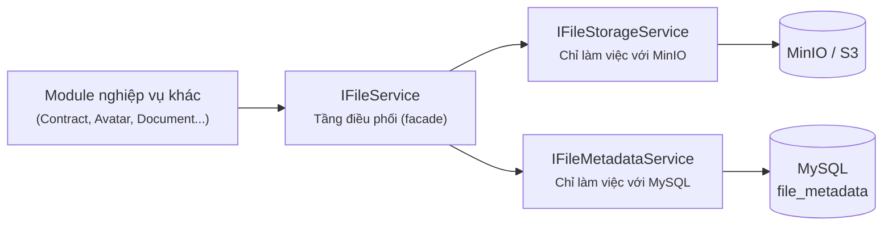
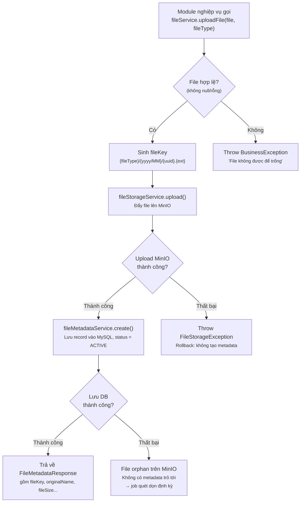
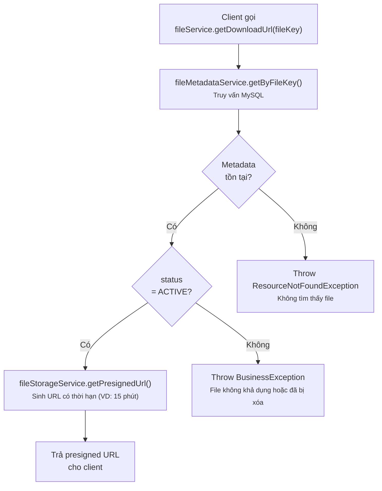
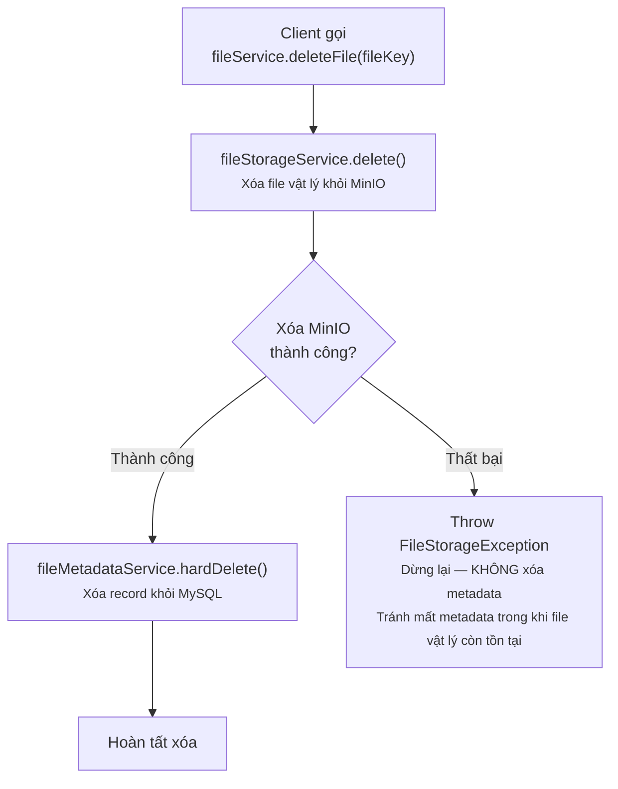
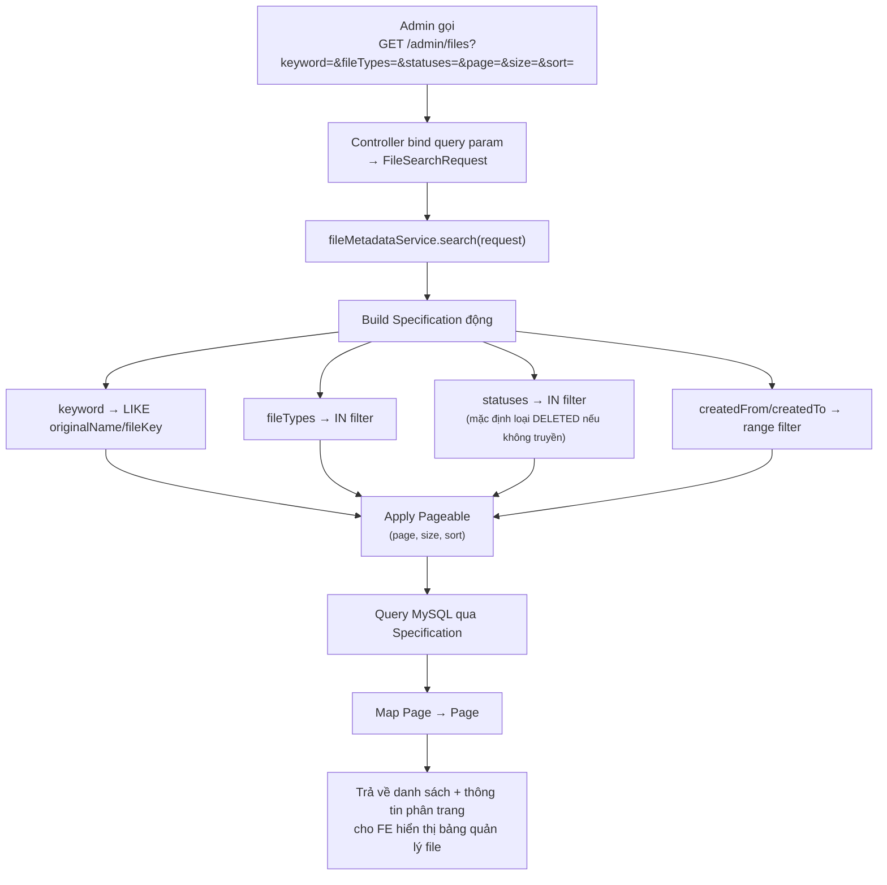

# Sơ đồ luồng — Module quản lý File (Storage + Metadata)

## Kiến trúc 3 tầng

**Nguyên tắc:** Mọi module nghiệp vụ khác chỉ inject `IFileService`, không gọi trực tiếp `IFileStorageService` hoặc `IFileMetadataService`.

---

## 1. Luồng Upload File

**Business rule:**
- Upload MinIO **trước**, ghi metadata DB **sau** — nếu DB fail, chỉ tạo ra file "rác" trên storage (dễ dọn dẹp qua job đối soát), không gây mất mát dữ liệu nghiêm trọng.
- `fileKey` luôn do `IFileService` sinh ra, không cho phép caller tự truyền vào để đảm bảo tính duy nhất và convention đặt tên nhất quán.

---

## 2. Luồng Download / Lấy URL File

**Business rule:**
- Client (FE) tải file **trực tiếp từ MinIO** qua presigned URL, không proxy qua backend → giảm tải cho server ứng dụng.
- Luôn check `status = ACTIVE` trước khi sinh URL, tránh cấp quyền truy cập file đã bị soft-delete.

---

## 3. Luồng Xóa File

**Business rule:**
- Thứ tự bắt buộc: **xóa MinIO trước, xóa DB sau** — ngược lại với luồng upload, vì mục tiêu là tránh để lại metadata "mồ côi" trỏ tới file đã không còn tồn tại (gây lỗi 404 khi client cố tải file theo metadata vẫn còn trong danh sách).
- Cân nhắc dùng `softDelete()` thay vì `hardDelete()` nếu cần giữ lịch sử/audit trail (tùy chính sách nghiệp vụ, VD: hợp đồng đã ký không nên xóa cứng).

---

## 4. Luồng Tìm kiếm / Phân trang File (Admin)

**Business rule:**
- `search()` chỉ thao tác trên `IFileMetadataService` (không đụng tới MinIO) — nhanh, không tốn round-trip tới storage.
- Nếu cần hiển thị presigned URL ngay trong bảng danh sách (để admin bấm xem trực tiếp), nên tách endpoint riêng hoặc bổ sung logic gọi `IFileStorageService.getPresignedUrl()` cho từng item ở tầng `IFileService`, tránh sinh URL cho toàn bộ danh sách nếu không cần thiết (tốn chi phí gọi MinIO không đáng có khi chỉ cần xem metadata).

---

## Tổng hợp exception theo từng luồng

| Luồng | Exception | HTTP Status | Message trả về client |
|---|---|---|---|
| Upload | `BusinessException` | 400 | "File không được để trống" |
| Upload | `FileStorageException` | 500 | "Lỗi hệ thống lưu trữ file, vui lòng thử lại sau" |
| Download | `ResourceNotFoundException` | 404 | "Không tìm thấy file" |
| Download | `BusinessException` | 400 | "File không khả dụng hoặc đã bị xóa" |
| Xóa | `FileStorageException` | 500 | "Lỗi hệ thống lưu trữ file, vui lòng thử lại sau" |
| Tìm kiếm | — | — | Không có exception đặc thù, dùng validate chuẩn của Spring |
