# Module 2: Course Management — AI LMS
## Backend Design Documentation

---

## 1. Sequence Diagrams

### 1.1 Tạo khóa học (Create Course)

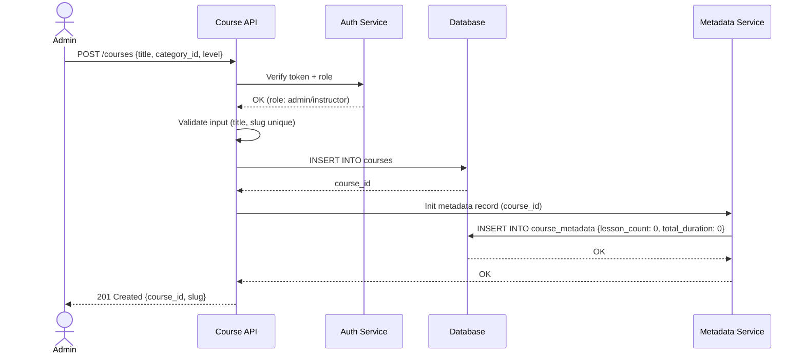

---

### 1.2 Gán / Hủy gán Giảng viên (Assign / Unassign Instructor)

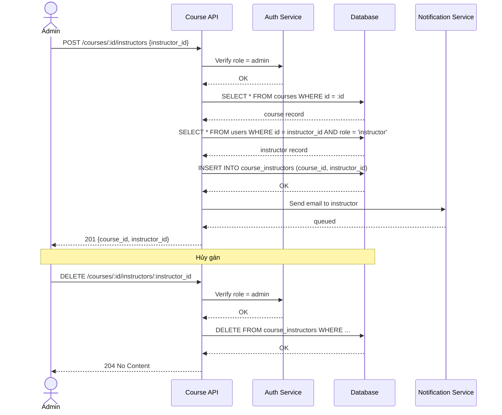

---

### 1.3 Upload & Attach Lesson Resource

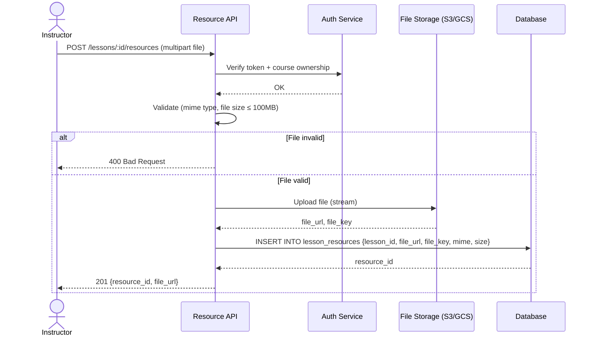

---

### 1.4 Download Lesson Resource (Access Control)

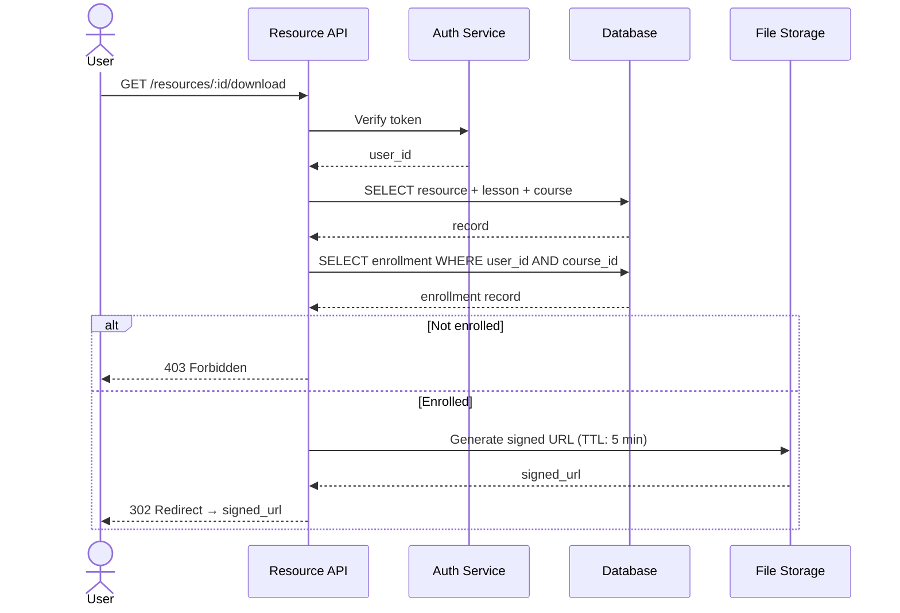

---

### 1.5 Lesson Preview (Free / Locked)

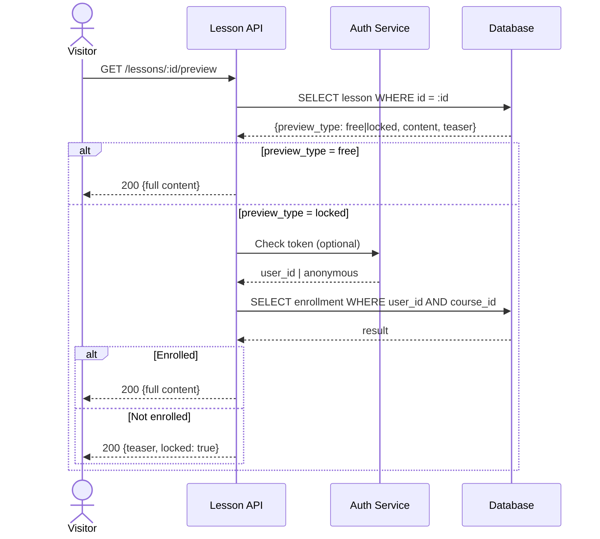

---

## 2. Data Flow Diagrams (DFD)

### 2.1 DFD Level 0 — Tổng quan hệ thống Course Management

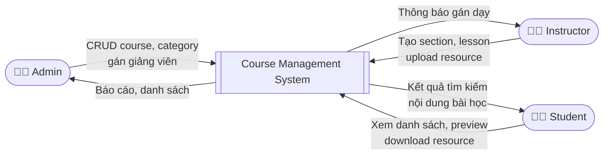

---

### 2.2 DFD Level 1 — Chi tiết luồng dữ liệu

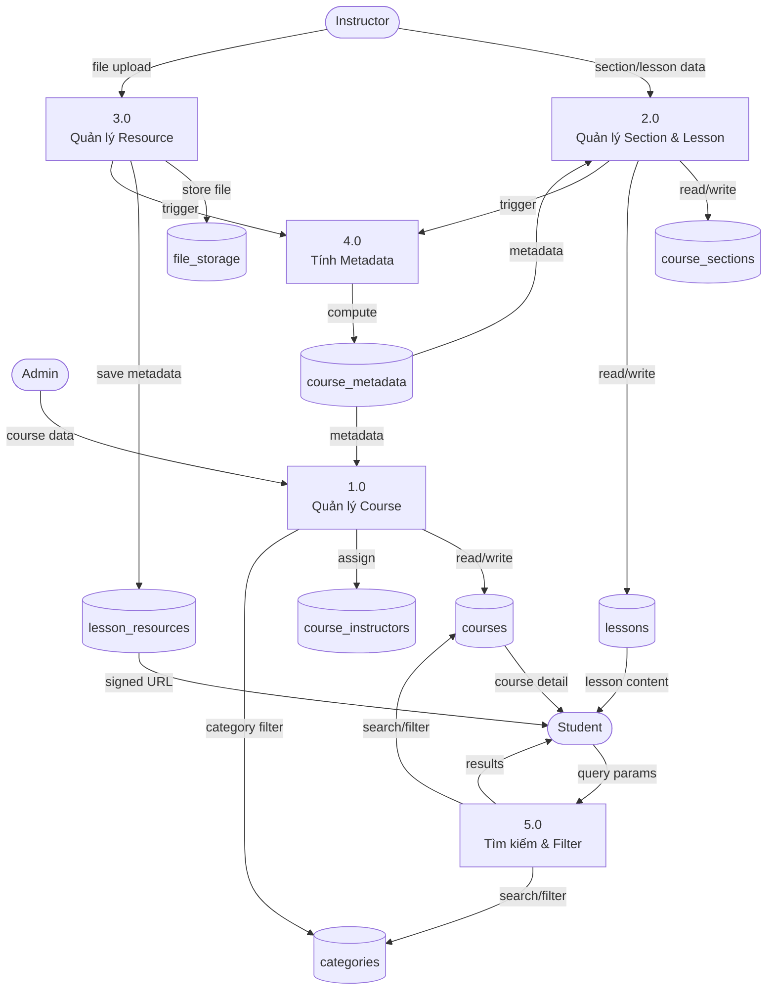

---

### 2.3 DFD Level 2 — Luồng Metadata Computation

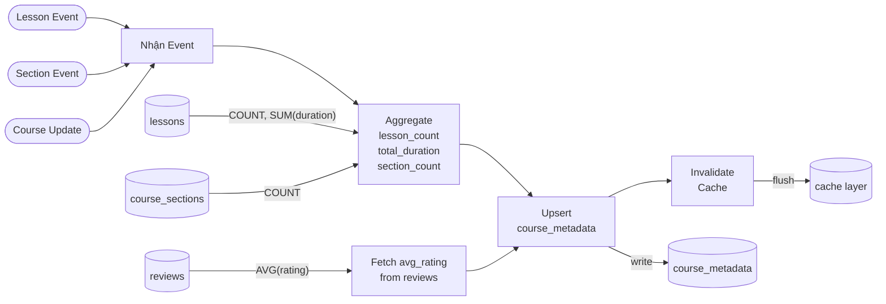

---

## 3. Activity Diagrams

### 3.1 Activity: Tạo và Publish khóa học

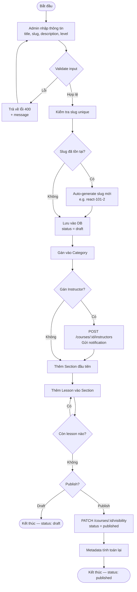

---

### 3.2 Activity: Upload Resource & Gắn vào Lesson

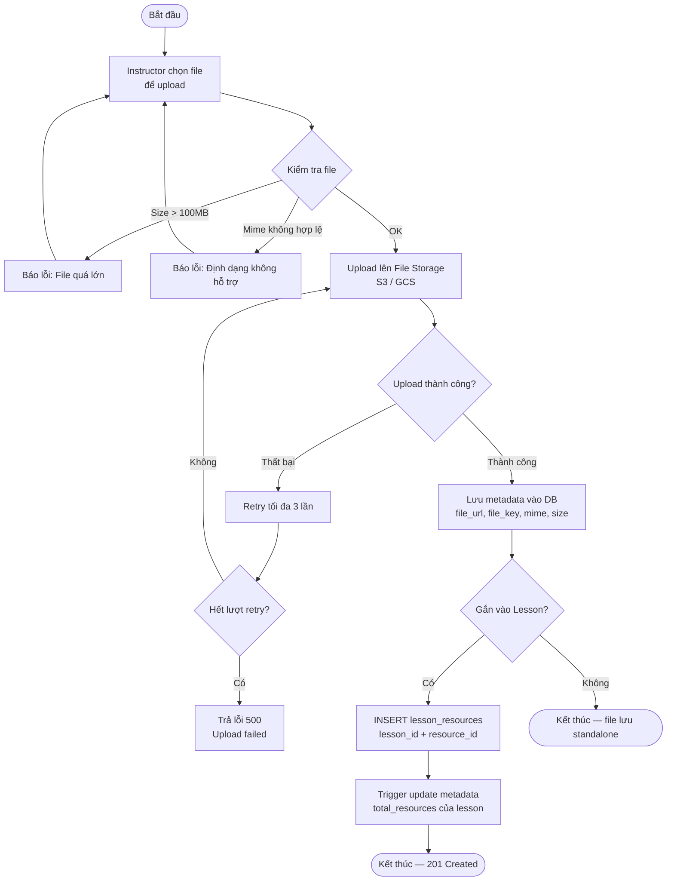

---

### 3.3 Activity: Tìm kiếm & Filter khóa học

```mermaid
flowchart TD
    Start([Người dùng gửi request]) --> A[GET /courses\n?search=&category=&level=&page=]
    A --> B[Parse query params]
    B --> C{Có search keyword?}
    C -- Có --> D[Full-text search\ntrên title + description]
    C -- Không --> E[Lấy toàn bộ courses]
    D --> F[Apply filter]
    E --> F
    F --> G{Có filter category?}
    G -- Có --> H[JOIN categories\nWHERE category_id = ?]
    G -- Không --> I[Skip]
    H --> J[Apply filter level]
    I --> J
    J --> K{Có filter level?}
    K -- Có --> L[WHERE level = beginner/intermediate/advanced]
    K -- Không --> M[Skip]
    L --> N[Apply status filter]
    M --> N
    N --> O[WHERE status = published]
    O --> P[Paginate\nLIMIT + OFFSET]
    P --> Q[Attach metadata\nlesson_count, avg_rating, duration]
    Q --> R[Trả về 200\n{data: [], pagination: {}}]
    R --> End([Kết thúc])
```

---

### 3.4 Activity: Lesson Preview Flow (Free vs Locked)

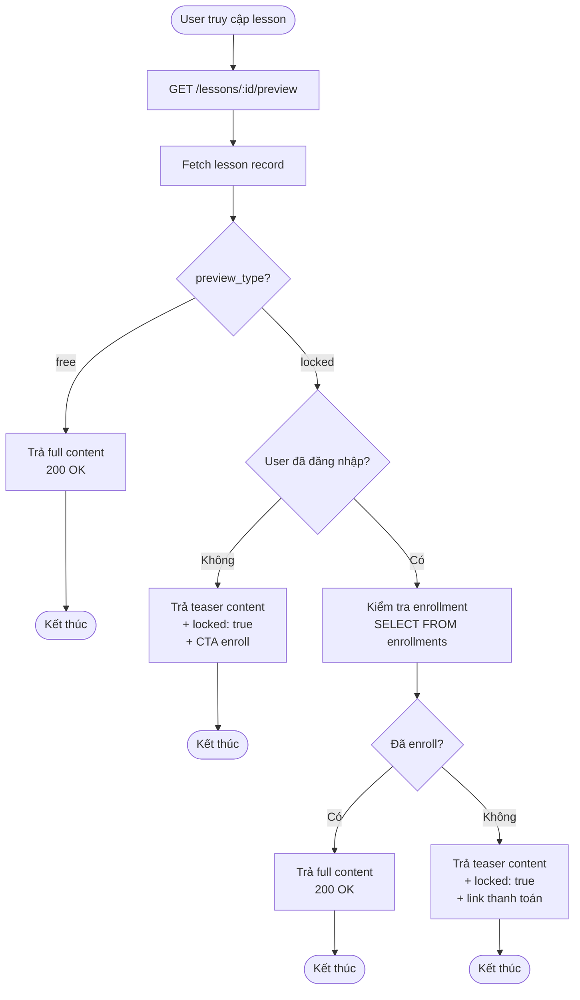

---

## 4. Tổng hợp API Endpoints

| Method | Endpoint | Mô tả |
|--------|----------|-------|
| `POST` | `/courses` | Tạo khóa học |
| `GET` | `/courses` | Danh sách + filter + search |
| `GET` | `/courses/:id` | Chi tiết + metadata |
| `PUT` | `/courses/:id` | Cập nhật |
| `PATCH` | `/courses/:id/visibility` | Ẩn / hiện / draft |
| `DELETE` | `/courses/:id` | Xóa mềm |
| `POST` | `/courses/:id/instructors` | Gán giảng viên |
| `DELETE` | `/courses/:id/instructors/:iid` | Hủy gán |
| `GET` | `/courses/:id/instructors` | Danh sách giảng viên |
| `POST` | `/courses/:id/sections` | Tạo section |
| `GET` | `/courses/:id/sections` | Danh sách section |
| `PUT` | `/sections/:id` | Cập nhật section |
| `DELETE` | `/sections/:id` | Xóa section |
| `PATCH` | `/sections/reorder` | Sắp xếp thứ tự |
| `POST` | `/categories` | Tạo category |
| `GET` | `/categories` | Danh sách |
| `PUT` | `/categories/:id` | Cập nhật |
| `DELETE` | `/categories/:id` | Xóa |
| `GET` | `/categories/:id/courses` | Filter course theo category |
| `POST` | `/sections/:id/lessons` | Tạo bài học |
| `GET` | `/sections/:id/lessons` | Danh sách bài học |
| `GET` | `/lessons/:id` | Chi tiết bài học |
| `PUT` | `/lessons/:id` | Cập nhật |
| `DELETE` | `/lessons/:id` | Xóa |
| `GET` | `/lessons/:id/preview` | Preview free/locked |
| `POST` | `/lessons/:id/resources` | Upload & gắn file |
| `GET` | `/lessons/:id/resources` | Danh sách file |
| `DELETE` | `/resources/:id` | Xóa file |
| `GET` | `/resources/:id/download` | Download (signed URL) |
