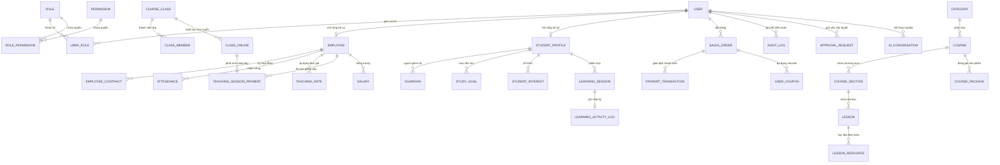
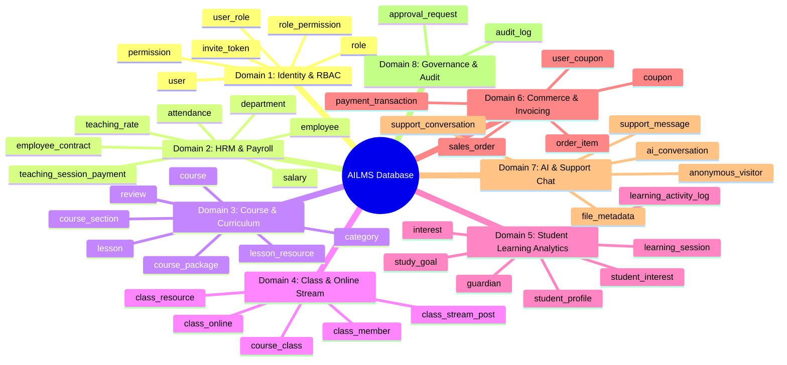

# 🗄️ AILMS Database Architecture & Schema Documentation

<div align="center">


<p align="center">
  <b>Tài liệu Thiết kế Cơ sở Dữ liệu Quan hệ Chuẩn 3NF, Danh mục Migration Phiên bản và Động cơ Sinh Dữ liệu Phát triển</b>
  <br />
  <i>Enterprise Relational Database Design featuring 3NF Normalization, 64-bit Distributed Snowflake IDs, Versioned Migrations, and Domain-driven Data Generators.</i>
</p>

</div>

---

## 1. Sơ đồ Quan hệ Thực thể Toàn hệ thống (Entity Relationship Diagram)

Cơ sở dữ liệu được chuẩn hóa ở dạng **Chuẩn 3 (3NF)** với hơn 30 thực thể quan hệ chặt chẽ, tối ưu hóa chỉ mục B-Tree trên các trường khóa ngoại và các trường tìm kiếm thường xuyên.



---

## 2. Nguyên lý Thiết kế & Chiến lược Định danh (Key Design Decisions)

### 2.1 Chiến lược Sinh Khóa chính (Primary Key Strategy)
1. **Distributed Snowflake ID (64-bit Integer):**
   - Áp dụng cho các bảng có tần suất tạo bản ghi cao và cần tính phân tán: `user`, `course`, `lesson`, `course_class`, `class_online`, `learning_activity_log`, `sales_order`, `payment_transaction`, `audit_log`, `file_metadata`.
   - **Ưu điểm:** Khóa chính tăng theo thời gian (time-ordered), hiệu năng ghi B-Tree Index tối ưu, không lộ thông tin số lượng bản ghi tuần tự (ngăn chặn tấn công Enumeration ID).
2. **Auto-Increment / Small IDs:**
   - Áp dụng cho các bảng danh mục tương đối tĩnh: `department`, `role`, `permission`, `category`, `interest`.
3. **Composite Primary Keys (Bảng liên kết n-n):**
   - Áp dụng cho các bảng trung gian không có thuộc tính định danh riêng: `user_role(user_id, role_id)`, `role_permission(role_id, permission_id)`, `course_teacher(course_id, employee_id)`, `interest_category(interest_id, category_id)`.

### 2.2 Tách biệt Lưu trữ Nhị phân và Metadata
- Cơ sở dữ liệu **tuyệt đối không lưu trữ Binary Blob** (video, ảnh, PDF hợp đồng).
- File vật lý được đẩy lên **MinIO Object Storage**; MySQL chỉ quản lý metadata trong bảng `file_metadata` (`file_key`, `file_size`, `mime_type`, `usage_type`, `status=ACTIVE/SOFT_DELETED`).

### 2.3 Quản lý Nhật ký Biến đổi Dữ liệu JSON (Audit Logging)
- Bảng `audit_log` lưu trữ snapshot `old_value` và `new_value` dưới dạng kiểu dữ liệu `JSON`, cho phép truy vết và so sánh Diff dữ liệu giữa các phiên bản mà không cần tạo bảng audit riêng cho từng module.

---

## 3. Phân rã 8 Domain Nghiệp vụ Cốt lõi



---

## 📜 4. Danh mục Bản ghi Migration Tuần tự (Versioned Migrations)

Toàn bộ các thay đổi cấu trúc bảng được lưu trữ dưới dạng các tệp SQL Migration có phiên bản tuần tự từ `v1` đến `v22` trong thư mục `database/`:

| Phiên bản | Tên tệp Migration | Mục đích & Thay đổi chính |
| :---: | :--- | :--- |
| `v1` | `v1_create_class_stream_and_resource_tables.sql` | Khởi tạo bảng bảng tin lớp học (`class_stream_post`) và tài nguyên lớp (`class_resource`). |
| `v2` | `v2_update_class_online_sessions.sql` | Bổ sung mã buổi học, provider phòng họp Google Meet, URL ghi hình và tóm tắt buổi dạy. |
| `v3` | `v3_add_course_code.sql` | Bổ sung mã khóa học `code` (unique) chuẩn hóa định dạng `{PREFIX}-{ID}`. |
| `v4` | `v4_create_ai_conversation_tables.sql` | Khởi tạo bảng lưu vết lịch sử hội thoại của trợ lý AI Copilot. |
| `v5` | `v5_extend_ai_conversation_history.sql` | Bổ sung cột phân vùng `scope` và đánh giá phản hồi (`feedback`) trong hội thoại AI. |
| `v6` | `v6_course_commerce_momo_one_on_one.sql` | Bổ sung trường ảnh thu nhỏ khóa học, hỗ trợ gói học kèm 1-1 và khóa ngoại giao dịch. |
| `v7` | `v7_add_paypal_gateway_fields.sql` | Bổ sung các trường lưu PayPal Request ID và Capture ID phục vụ khớp lệnh thanh toán. |
| `v8` | `v8_add_paypal_refund_fields.sql` | Bổ sung khóa Idempotent và Refund ID cho quy trình hoàn tiền tự động qua PayPal. |
| `v9` | `v9_add_vouchers_invoices_and_class_deadlines.sql` | Khởi tạo bảng sở hữu voucher `user_coupon` và hạn chót nộp bài tập/quiz. |
| `v10` | `v10_link_interests_to_categories.sql` | Thiết lập bảng liên kết n-n giữa sở thích học viên (`interest`) và danh mục khóa học (`category`). |
| `v11` | `v11_cart_enrollment_package_and_class_discussion.sql` | Bổ sung ghi chú nhu cầu học 1-1 trong giỏ hàng và trạng thái quyền ghi danh theo gói học. |
| `v12` | `v12_fix_quiz_status_and_invoice_storage.sql` | Chuẩn hóa enum trạng thái bài quiz và cấu trúc lưu trữ hóa đơn điện tử PDF. |
| `v13` | `v13_repair_combo_package_class_links.sql` | Cập nhật liên kết lớp học cho các gói học Combo đa thành phần. |
| `v14` | `v14_add_refund_approval_reason.sql` | Bổ sung trường lý do phê duyệt hoàn tiền (`request_reason`) trong `approval_request`. |
| `v15` | `v15_add_employee_bio.sql` | Bổ sung trường tiểu sử / giới thiệu năng lực giảng dạy (`bio`) cho nhân sự. |
| `v16` | `v16_create_public_support_chat.sql` | Khởi tạo bảng định danh khách vãng lai (`anonymous_visitor`) và phiên hỗ trợ trực tuyến. |
| `v17` | `v17_support_visitor_snowflake_and_policy.sql` | Chuyển đổi định danh khách sang Snowflake ID và quản lý quy chế hỗ trợ trong DB. |
| `v18` | `v18_add_class_session_cancellation.sql` | Lưu vết lý do hủy buổi học, thời điểm hủy và người thực hiện hủy lịch dạy. |
| `v19` | `v19_support_response_timeout.sql` | Bổ sung mốc thời gian phản hồi hỗ trợ để tự động đóng phiên sau 20 phút không tương tác. |
| `v20` | `v20_move_support_policy_to_file_metadata.sql` | Chuyển đổi tài liệu chính sách sang quản lý qua `file_metadata` và lưu trên MinIO S3. |
| `v21` | `v21_add_support_contact_name.sql` | Bổ sung họ tên và email định danh khách vãng lai trong hàng đợi tư vấn viên. |
| `v22` | `v22_expand_file_usage_type_for_policy.sql` | Mở rộng enum `usage_type` trong `file_metadata` hỗ trợ lưu trữ tệp quy chế (`POLICY`). |

---

## 🛠 5. Động cơ Sinh Dữ liệu Phát triển (`database/gen_data/`)

Thư mục `database/gen_data/` chứa bộ script Python chuyên dụng để sinh dữ liệu mẫu giả lập toàn diện môi trường doanh nghiệp thực tế.

```mermaid
flowchart LR
    Start["python database/gen_data/main.py"] --> AuthSeed["1. Department, Roles & Permissions"]
    AuthSeed --> UserSeed["2. Users, Employees & Contracts"]
    UserSeed --> StudentSeed["3. Student Profiles, Goals & Interests"]
    StudentSeed --> CourseSeed["4. Categories, Courses, Sections & Lessons"]
    CourseSeed --> ClassSeed["5. Classes, Online Sessions & Attendance"]
    ClassSeed --> CommerceSeed["6. Packages, Orders, Coupons & Payroll"]
    CommerceSeed --> Complete["Database Seeded Successfully!"]
```



### Cách chạy Generator nạp dữ liệu mẫu:
```bash
cd database/gen_data

# Cài đặt thư viện kết nối MySQL
pip install -r requirements.txt

# Thực thi sinh toàn bộ dữ liệu mẫu theo thứ tự phụ thuộc
python main.py
```

---

## 💾 6. Hướng dẫn Sao lưu & Phục hồi Cơ sở Dữ liệu

### 1. Sao lưu Cơ sở dữ liệu (Export Dump)
```bash
docker exec ailms-mysql-docker \
  mysqldump -u root -p123456 --single-transaction --quick ailms > backup_ailms.sql
```

### 2. Phục hồi Cơ sở dữ liệu (Import Dump)
```bash
docker exec -i ailms-mysql-docker \
  mysql -u root -p123456 ailms < backup_ailms.sql
```

---

<div align="center">
  <sub>Tài liệu Kiến trúc Cơ sở Dữ liệu <b>AI Personalized LMS</b> — Thiết kế và chuẩn hóa bởi <b>Vũ Tiến Đạt</b>.</sub>
</div>
