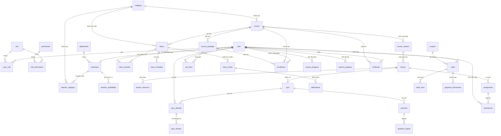

# 🗄️ DATABASE SCHEMA DOCUMENTATION - AI PERSONALIZED LMS

Tài liệu thiết kế cơ sở dữ liệu chi tiết cho dự án **AI-Personalized LMS Backend**. Hệ thống sử dụng cơ sở dữ liệu quan hệ **MySQL** với cơ chế sinh khóa chính **Snowflake ID (64-bit Long)** và trường dùng chung `BaseEntity`.

---

## 📌 1. Bảng Dùng Chung & Hệ Thống Core

### 1.1 Base Entity (Các cột audit dùng chung cho các bảng)
Hầu hết các bảng dữ liệu chính đều kế thừa từ `BaseEntity`:

| Tên trường | Kiểu dữ liệu | Ràng buộc | Mô tả |
|---|---|---|---|
| `created_at` | DATETIME / TIMESTAMP | NOT NULL | Thời điểm tạo bản ghi |
| `created_by` | BIGINT | NULLABLE | ID người tạo bản ghi |
| `updated_at` | DATETIME / TIMESTAMP | NULLABLE | Thời điểm cập nhật cuối cùng |
| `updated_by` | BIGINT | NULLABLE | ID người cập nhật cuối cùng |
| `is_deleted` | BOOLEAN / TINYINT(1) | DEFAULT FALSE | Cờ xóa mềm (Soft delete) |

---

## 🔐 2. Phân Hệ Người Dùng & Phân Quyền (Identity & RBAC)

### 2.1 Bảng `user` (Tài khoản người dùng)
* **Khóa chính**: `id` (BIGINT - Snowflake ID)

| Tên trường | Kiểu dữ liệu | Ràng buộc | Mô tả |
|---|---|---|---|
| `id` | BIGINT | PK, AUTO_INCREMENT=FALSE | ID người dùng |
| `username` | VARCHAR(100) | NOT NULL, UNIQUE | Tên đăng nhập |
| `password_hash` | VARCHAR(255) | NOT NULL | Mật khẩu mã hóa BCrypt |
| `email` | VARCHAR(150) | NOT NULL, UNIQUE | Email người dùng |
| `full_name` | VARCHAR(150) | NOT NULL | Họ và tên |
| `phone` | VARCHAR(20) | NULLABLE | Số điện thoại |
| `avatar_url` | VARCHAR(500) | NULLABLE | Đường dẫn ảnh đại diện |
| `status` | VARCHAR(30) | DEFAULT 'ACTIVE' | Trạng thái: `ACTIVE`, `INACTIVE`, `BLOCKED`, `PENDING_VERIFICATION` |
| `role_type` | VARCHAR(30) | NOT NULL | Vai trò chính: `ADMIN`, `STUDENT`, `TEACHER`, `STAFF`, `PARENT` |
| `last_login_at` | DATETIME | NULLABLE | Thời điểm đăng nhập gần nhất |

### 2.2 Bảng `role` (Vai trò hệ thống)
* **Khóa chính**: `id` (BIGINT)

| Tên trường | Kiểu dữ liệu | Ràng buộc | Mô tả |
|---|---|---|---|
| `id` | BIGINT | PK | ID vai trò |
| `code` | VARCHAR(50) | NOT NULL, UNIQUE | Mã vai trò (VD: `ROLE_ADMIN`, `ROLE_TEACHER`) |
| `name` | VARCHAR(100) | NOT NULL | Tên vai trò |
| `description` | VARCHAR(255) | NULLABLE | Mô tả vai trò |
| `is_system` | BOOLEAN | DEFAULT FALSE | Vai trò hệ thống mặc định |

### 2.3 Bảng `permission` (Quyền hạn chi tiết)
* **Khóa chính**: `id` (BIGINT)

| Tên trường | Kiểu dữ liệu | Ràng buộc | Mô tả |
|---|---|---|---|
| `id` | BIGINT | PK | ID quyền |
| `code` | VARCHAR(100) | NOT NULL, UNIQUE | Mã quyền (VD: `COURSE_CREATE`, `USER_UPDATE`) |
| `name` | VARCHAR(150) | NOT NULL | Tên hiển thị quyền |
| `module` | VARCHAR(50) | NOT NULL | Phân hệ thuộc về (COURSE, USER, CLASS, v.v.) |
| `description` | VARCHAR(255) | NULLABLE | Mô tả chi tiết |

### 2.4 Bảng `user_role` (Liên kết Người dùng - Vai trò)
* **Khóa chính phức hợp**: (`user_id`, `role_id`)

| Tên trường | Kiểu dữ liệu | Ràng buộc | Mô tả |
|---|---|---|---|
| `user_id` | BIGINT | PK, FK -> `user.id` | ID người dùng |
| `role_id` | BIGINT | PK, FK -> `role.id` | ID vai trò |

### 2.5 Bảng `role_permission` (Liên kết Vai trò - Quyền)
* **Khóa chính phức hợp**: (`role_id`, `permission_id`)

| Tên trường | Kiểu dữ liệu | Ràng buộc | Mô tả |
|---|---|---|---|
| `role_id` | BIGINT | PK, FK -> `role.id` | ID vai trò |
| `permission_id` | BIGINT | PK, FK -> `permission.id` | ID quyền |

### 2.6 Bảng `invite_token` (Mã mời gia nhập hệ thống)
* **Khóa chính**: `id` (BIGINT)

| Tên trường | Kiểu dữ liệu | Ràng buộc | Mô tả |
|---|---|---|---|
| `id` | BIGINT | PK | ID token |
| `token` | VARCHAR(255) | NOT NULL, UNIQUE | Chuỗi token mời |
| `email` | VARCHAR(150) | NOT NULL | Email người được mời |
| `role_type` | VARCHAR(30) | NOT NULL | Vai trò gán khi đăng ký |
| `expires_at` | DATETIME | NOT NULL | Thời gian hết hạn |
| `used_at` | DATETIME | NULLABLE | Thời gian đã sử dụng |

---

## 📚 3. Phân Hệ Khóa Học & Nội Dung (Course & Curriculum)

### 3.1 Bảng `category` (Danh mục khóa học)
* **Khóa chính**: `id` (BIGINT)

| Tên trường | Kiểu dữ liệu | Ràng buộc | Mô tả |
|---|---|---|---|
| `id` | BIGINT | PK | ID danh mục |
| `code` | VARCHAR(50) | NOT NULL, UNIQUE | Mã danh mục |
| `name` | VARCHAR(150) | NOT NULL | Tên danh mục |
| `description` | TEXT | NULLABLE | Mô tả danh mục |
| `parent_id` | BIGINT | NULLABLE, FK -> `category.id` | ID danh mục cha (cây danh mục) |
| `status` | VARCHAR(20) | DEFAULT 'ACTIVE' | `ACTIVE`, `INACTIVE` |

### 3.2 Bảng `course` (Khóa học)
* **Khóa chính**: `id` (BIGINT)

| Tên trường | Kiểu dữ liệu | Ràng buộc | Mô tả |
|---|---|---|---|
| `id` | BIGINT | PK | ID khóa học |
| `category_id` | BIGINT | NOT NULL, FK -> `category.id` | Danh mục thuộc về |
| `code` | VARCHAR(50) | NOT NULL, UNIQUE | Mã khóa học |
| `name` | VARCHAR(255) | NOT NULL | Tên khóa học |
| `slug` | VARCHAR(255) | NOT NULL, UNIQUE | Slug đường dẫn web |
| `description` | LONGTEXT | NULLABLE | Mô tả nội dung khóa học |
| `level` | VARCHAR(30) | DEFAULT 'BEGINNER' | `BEGINNER`, `INTERMEDIATE`, `ADVANCED` |
| `price` | DECIMAL(15,2) | DEFAULT 0.00 | Giá niêm yết chính thức |
| `suggested_price` | DECIMAL(15,2) | NULLABLE | Giá đề xuất bởi giảng viên |
| `status` | VARCHAR(30) | DEFAULT 'DRAFT' | `DRAFT`, `PENDING_APPROVAL`, `PUBLISHED`, `REJECTED`, `ARCHIVED` |
| `rejection_reason` | TEXT | NULLABLE | Lý do từ chối duyệt |
| `thumbnail_url` | VARCHAR(500) | NULLABLE | Ảnh đại diện khóa học |
| `created_by_user_id` | BIGINT | NULLABLE, FK -> `user.id` | Giảng viên/Admin tạo |
| `avg_rating` | DOUBLE | DEFAULT 0.0 | Đánh giá trung bình |
| `review_count` | INT | DEFAULT 0 | Tổng số lượt đánh giá |
| `max_students` | INT | NULLABLE | Sức chứa tối đa (Self-study) |
| `certificate_condition_type` | VARCHAR(50) | DEFAULT 'PERCENT_COMPLETED' | Điều kiện cấp chứng chỉ |
| `certificate_pass_threshold` | DOUBLE | DEFAULT 80.0 | Ngưỡng hoàn thành (%) |

### 3.3 Bảng `course_section` (Chương / Phần học)
* **Khóa chính**: `id` (BIGINT)

| Tên trường | Kiểu dữ liệu | Ràng buộc | Mô tả |
|---|---|---|---|
| `id` | BIGINT | PK | ID phần học |
| `course_id` | BIGINT | NOT NULL, FK -> `course.id` | Khóa học chứa phần này |
| `title` | VARCHAR(255) | NOT NULL | Tiêu đề phần học |
| `order_index` | INT | DEFAULT 0 | Thứ tự sắp xếp |
| `status` | VARCHAR(20) | DEFAULT 'ACTIVE' | `ACTIVE`, `INACTIVE` |

### 3.4 Bảng `lesson` (Bài học)
* **Khóa chính**: `id` (BIGINT)

| Tên trường | Kiểu dữ liệu | Ràng buộc | Mô tả |
|---|---|---|---|
| `id` | BIGINT | PK | ID bài học |
| `section_id` | BIGINT | NOT NULL, FK -> `course_section.id` | Chương chứa bài học |
| `name` | VARCHAR(100) | NULLABLE | Tiêu đề bài học |
| `content_type` | VARCHAR(20) | NULLABLE | Loại bài học: `VIDEO`, `PDF`, `TEXT`, `QUIZ`, `ASSIGNMENT` |
| `content_url` | VARCHAR(500) | NULLABLE | URL ngoài hoặc object key MinIO của nội dung chính |
| `description` | TEXT | NULLABLE | Nội dung mô tả hoặc block editor JSON |
| `duration_min` | INT | NULLABLE | Thời lượng học ước tính, dùng cho nội dung đọc/quiz/bài tập |
| `duration_sec` | INT | NULLABLE | Thời lượng media thực tế theo giây, dùng cho VIDEO/AUDIO |
| `order_index` | INT | DEFAULT 0 | Thứ tự bài học |
| `preview_type` | VARCHAR(30) | NULLABLE | Loại xem thử |
| `status` | VARCHAR(20) | DEFAULT 'ACTIVE' | `ACTIVE`, `INACTIVE` |

### 3.5 Bảng `lesson_resource` (Tài liệu đính kèm bài học)
* **Khóa chính**: `id` (BIGINT)

| Tên trường | Kiểu dữ liệu | Ràng buộc | Mô tả |
|---|---|---|---|
| `id` | BIGINT | PK | ID tài liệu |
| `lesson_id` | BIGINT | NOT NULL, FK -> `lesson.id` | Bài học liên kết |
| `title` | VARCHAR(255) | NOT NULL | Tên tài liệu |
| `resource_type` | VARCHAR(50) | NULLABLE | Loại tài liệu (PDF, ZIP, SLIDE, ...) |
| `file_url` | VARCHAR(500) | NULLABLE | Đường dẫn tải tệp |
| `file_metadata_id` | BIGINT | NULLABLE, FK -> `file_metadata.id` | Quản lý file MinIO |
| `status` | VARCHAR(20) | DEFAULT 'ACTIVE' | `ACTIVE`, `INACTIVE` |

### 3.6 Bảng `course_teacher` (Giảng viên phụ trách khóa học)
* **Khóa chính phức hợp**: (`course_id`, `teacher_id`)

| Tên trường | Kiểu dữ liệu | Ràng buộc | Mô tả |
|---|---|---|---|
| `course_id` | BIGINT | PK, FK -> `course.id` | ID khóa học |
| `teacher_id` | BIGINT | PK, FK -> `employee.user_id` | ID nhân sự giảng viên |
| `assigned_at` | DATETIME | NOT NULL | Ngày phân công |

### 3.7 Bảng `review` (Đánh giá khóa học)
* **Khóa chính**: `id` (BIGINT)

| Tên trường | Kiểu dữ liệu | Ràng buộc | Mô tả |
|---|---|---|---|
| `id` | BIGINT | PK | ID bài đánh giá |
| `course_id` | BIGINT | NOT NULL, FK -> `course.id` | Khóa học được đánh giá |
| `user_id` | BIGINT | NOT NULL, FK -> `user.id` | Học viên đánh giá |
| `rating` | INT | NOT NULL | Số sao (1 đến 5) |
| `comment` | TEXT | NULLABLE | Nội dung nhận xét |
| `teacher_id` | BIGINT | NULLABLE, FK -> `user.id` | Giáo viên chính được nhận xét trong lượt học |
| `teacher_rating` | INT | NULLABLE | Số sao dành riêng cho giáo viên (1 đến 5) |
| `teacher_comment` | TEXT | NULLABLE | Nội dung nhận xét riêng dành cho giáo viên |
| `status` | VARCHAR(20) | DEFAULT 'ACTIVE' | Trạng thái hiển thị |

---

## 👨‍🏫 4. Phân Hệ Nhân Sự & Giảng Viên (HR & Teacher Management)

### 4.1 Bảng `department` (Phòng ban)
* **Khóa chính**: `id` (BIGINT)

| Tên trường | Kiểu dữ liệu | Ràng buộc | Mô tả |
|---|---|---|---|
| `id` | BIGINT | PK | ID phòng ban |
| `code` | VARCHAR(50) | NOT NULL, UNIQUE | Mã phòng ban (VD: `DEPT_ACADEMIC`) |
| `name` | VARCHAR(150) | NOT NULL | Tên phòng ban |
| `description` | TEXT | NULLABLE | Mô tả |
| `status` | VARCHAR(20) | DEFAULT 'ACTIVE' | Trạng thái |

### 4.2 Bảng `employee` (Hồ sơ nhân sự / Giảng viên)
* **Khóa chính**: `user_id` (Shared PK với `user.id`)

| Tên trường | Kiểu dữ liệu | Ràng buộc | Mô tả |
|---|---|---|---|
| `user_id` | BIGINT | PK, FK -> `user.id` | ID người dùng nhân viên |
| `employee_code` | VARCHAR(50) | NOT NULL, UNIQUE | Mã nhân viên (VD: `EMP001`) |
| `department_id` | BIGINT | NULLABLE, FK -> `department.id` | Phòng ban trực thuộc |
| `position` | VARCHAR(100) | NULLABLE | Chức danh công việc |
| `bio` | TEXT | NULLABLE | Phần giới thiệu công khai của nhân sự/giảng viên |
| `employment_type` | VARCHAR(30) | NOT NULL | `FULL_TIME`, `PART_TIME`, `CONTRACT`, `INTERNSHIP` |
| `start_date` | DATETIME | NULLABLE | Ngày bắt đầu làm việc |
| `end_date` | DATETIME | NULLABLE | Ngày kết thúc hợp đồng |
| `status` | VARCHAR(30) | DEFAULT 'ACTIVE' | `ACTIVE`, `PROBATION`, `SUSPENDED`, `TERMINATED` |

### 4.3 Bảng `teacher_category` (Chuyên môn giảng dạy của GV)
* **Khóa chính**: `id` (BIGINT)

| Tên trường | Kiểu dữ liệu | Ràng buộc | Mô tả |
|---|---|---|---|
| `id` | BIGINT | PK | ID chuyên môn |
| `employee_id` | BIGINT | NOT NULL, FK -> `employee.user_id` | ID giảng viên |
| `category_id` | BIGINT | NOT NULL, FK -> `category.id` | Danh mục chuyên môn |
| `assigned_by` | BIGINT | NULLABLE | Người phân công |
| `unassigned_at` | DATETIME | NULLABLE | Thời điểm hủy gán |
| `status` | VARCHAR(20) | DEFAULT 'ACTIVE' | Trạng thái |

### 4.4 Bảng `teacher_availability` (Lịch rảnh của GV cho lớp 1-1)
* **Khóa chính**: `id` (BIGINT)

| Tên trường | Kiểu dữ liệu | Ràng buộc | Mô tả |
|---|---|---|---|
| `id` | BIGINT | PK | ID lịch rảnh |
| `employee_id` | BIGINT | NOT NULL, FK -> `employee.user_id` | ID giảng viên |
| `day_of_week` | INT | NOT NULL | Thứ trong tuần (1=Mon, ..., 7=Sun) |
| `start_time` | TIME | NOT NULL | Giờ bắt đầu rảnh |
| `end_time` | TIME | NOT NULL | Giờ kết thúc rảnh |
| `status` | VARCHAR(20) | DEFAULT 'ACTIVE' | Trạng thái |

### 4.5 Bảng `employee_contract` (Hợp đồng lao động)
* **Khóa chính**: `id` (BIGINT)

| Tên trường | Kiểu dữ liệu | Ràng buộc | Mô tả |
|---|---|---|---|
| `id` | BIGINT | PK | ID hợp đồng |
| `employee_id` | BIGINT | NOT NULL, FK -> `employee.user_id` | ID nhân sự |
| `contract_number` | VARCHAR(100) | NOT NULL, UNIQUE | Số hợp đồng |
| `contract_type` | VARCHAR(50) | NOT NULL | Loại hợp đồng |
| `start_date` | DATETIME | NOT NULL | Ngày hiệu lực |
| `end_date` | DATETIME | NULLABLE | Ngày hết hạn |
| `base_salary` | DECIMAL(15,2) | NOT NULL | Lương cơ bản |
| `status` | VARCHAR(20) | DEFAULT 'ACTIVE' | Trạng thái hợp đồng |

### 4.6 Bảng `salary` & `salary_detail` (Bảng lương & Chi tiết lương)
* **Khóa chính**: `id` (BIGINT)

| Bảng | Tên trường | Kiểu dữ liệu | Ràng buộc | Mô tả |
|---|---|---|---|---|
| `salary` | `id` | BIGINT | PK | ID bảng lương |
| `salary` | `employee_id` | BIGINT | NOT NULL, FK -> `employee.user_id` | ID nhân viên |
| `salary` | `month` | INT | NOT NULL | Tháng tính lương |
| `salary` | `year` | INT | NOT NULL | Năm tính lương |
| `salary` | `total_salary` | DECIMAL(15,2) | NOT NULL | Tổng lương thực nhận |
| `salary` | `status` | VARCHAR(30) | DEFAULT 'DRAFT' | `DRAFT`, `APPROVED`, `PAID` |
| `salary_detail` | `id` | BIGINT | PK | ID chi tiết |
| `salary_detail` | `salary_id` | BIGINT | NOT NULL, FK -> `salary.id` | Thuộc bảng lương |
| `salary_detail` | `type` | VARCHAR(50) | NOT NULL | `BASE_SALARY`, `TEACHING_ALLOWANCE`, `BONUS`, `DEDUCTION` |
| `salary_detail` | `amount` | DECIMAL(15,2) | NOT NULL | Số tiền (+/-) |
| `salary_detail` | `note` | VARCHAR(255) | NULLABLE | Ghi chú |

### 4.7 Bảng `teaching_rate` & `teaching_session_payment` (Thù lao giảng dạy)
* **Khóa chính**: `id` (BIGINT)

| Bảng | Tên trường | Kiểu dữ liệu | Ràng buộc | Mô tả |
|---|---|---|---|---|
| `teaching_rate` | `id` | BIGINT | PK | ID đơn giá |
| `teaching_rate` | `employee_id` | BIGINT | NOT NULL, FK -> `employee.user_id` | ID giảng viên |
| `teaching_rate` | `delivery_mode` | VARCHAR(30) | NOT NULL | `GROUP_CLASS`, `ONE_ON_ONE` |
| `teaching_rate` | `rate_per_hour` | DECIMAL(15,2) | NOT NULL | Mức thù lao mỗi giờ |
| `teaching_session_payment` | `id` | BIGINT | PK | ID thanh toán buổi dạy |
| `teaching_session_payment` | `employee_id` | BIGINT | NOT NULL | ID giảng viên |
| `teaching_session_payment` | `class_online_id` | BIGINT | NOT NULL, FK -> `class_online.id` | Buổi học đã dạy |
| `teaching_session_payment` | `amount` | DECIMAL(15,2) | NOT NULL | Thù lao buổi đó |
| `teaching_session_payment` | `status` | VARCHAR(30) | DEFAULT 'PENDING' | `PENDING`, `CALCULATED`, `PAID` |

### 4.8 Bảng `leave_request` (Đơn xin nghỉ phép)
* **Khóa chính**: `id` (BIGINT)

| Tên trường | Kiểu dữ liệu | Ràng buộc | Mô tả |
|---|---|---|---|
| `id` | BIGINT | PK | ID đơn nghỉ phép |
| `employee_id` | BIGINT | NOT NULL, FK -> `employee.user_id` | ID nhân sự xin nghỉ |
| `leave_type` | VARCHAR(50) | NOT NULL | `ANNUAL`, `SICK`, `UNPAID`, `MATERNITY` |
| `start_date` | DATETIME | NOT NULL | Thời gian bắt đầu nghỉ |
| `end_date` | DATETIME | NOT NULL | Thời gian kết thúc nghỉ |
| `reason` | TEXT | NULLABLE | Lý do xin nghỉ |
| `status` | VARCHAR(30) | DEFAULT 'PENDING' | `PENDING`, `CONFIRMED`, `REJECTED` |

---

## 🏫 5. Phân Hệ Lớp Học & Đào Tạo (Class & Delivery Modes)

### 5.1 Bảng `class` (Lớp học)
* **Khóa chính**: `id` (BIGINT)

| Tên trường | Kiểu dữ liệu | Ràng buộc | Mô tả |
|---|---|---|---|
| `id` | BIGINT | PK | ID lớp học |
| `course_id` | BIGINT | NOT NULL, FK -> `course.id` | Khóa học liên quan |
| `category_id` | BIGINT | NOT NULL, FK -> `category.id` | Danh mục môn học |
| `name` | VARCHAR(255) | NOT NULL | Tên lớp học |
| `package_type` | VARCHAR(30) | NOT NULL | Hình thức học: `SELF_STUDY`, `GROUP_CLASS`, `ONE_ON_ONE` |
| `max_members` | INT | DEFAULT 30 | Sức chứa tối đa |
| `current_member_count` | INT | DEFAULT 0 | Số lượng học viên hiện tại |
| `start_date` | DATETIME | NULLABLE | Ngày khai giảng |
| `end_date` | DATETIME | NULLABLE | Ngày bế giảng |
| `status` | TINYINT | DEFAULT 1 | `1` (OPEN/READY), `2` (IN_PROGRESS), `3` (COMPLETED), `0` (CANCELLED) |

### 5.2 Bảng `class_member` (Thành viên lớp học: GV & HV)
* **Khóa chính phức hợp**: (`class_id`, `user_id`)

| Tên trường | Kiểu dữ liệu | Ràng buộc | Mô tả |
|---|---|---|---|
| `class_id` | BIGINT | PK, FK -> `class.id` | ID lớp học |
| `user_id` | BIGINT | PK, FK -> `user.id` | ID người dùng (GV hoặc HV) |
| `role_in_class` | VARCHAR(30) | NOT NULL | `TEACHER`, `STUDENT` |
| `status` | VARCHAR(30) | DEFAULT 'ACTIVE' | `ACTIVE`, `INACTIVE`, `WAITLISTED`, `REMOVED` |
| `joined_at` | DATETIME | NULLABLE | Ngày tham gia lớp |
| `left_at` | DATETIME | NULLABLE | Ngày rời lớp / hủy |
| `waitlisted_at` | DATETIME | NULLABLE | Thời điểm xếp hàng chờ (Waitlist FIFO) |

### 5.3 Bảng `class_schedule` (Thời khóa biểu định kỳ của lớp)
* **Khóa chính**: `id` (BIGINT)

| Tên trường | Kiểu dữ liệu | Ràng buộc | Mô tả |
|---|---|---|---|
| `id` | BIGINT | PK | ID khung giờ |
| `class_id` | BIGINT | NOT NULL, FK -> `class.id` | Lớp học áp dụng |
| `day_of_week` | INT | NOT NULL | Thứ trong tuần (1-7) |
| `start_time` | TIME | NOT NULL | Giờ bắt đầu |
| `end_time` | TIME | NOT NULL | Giờ kết thúc |
| `status` | VARCHAR(20) | DEFAULT 'ACTIVE' | Trạng thái |

### 5.4 Bảng `class_online` (Buổi học trực tuyến / Live Class)
* **Khóa chính**: `id` (BIGINT)

| Tên trường | Kiểu dữ liệu | Ràng buộc | Mô tả |
|---|---|---|---|
| `id` | BIGINT | PK | ID buổi học |
| `class_id` | BIGINT | NOT NULL, FK -> `class.id` | Lớp học |
| `title` | VARCHAR(255) | NOT NULL | Chủ đề buổi học |
| `meeting_link` | VARCHAR(500) | NULLABLE | Link Zoom/Google Meet |
| `scheduled_at` | DATETIME | NOT NULL | Thời gian diễn ra |
| `duration_min` | INT | DEFAULT 90 | Thời lượng (phút) |
| `recording_url` | VARCHAR(500) | NULLABLE | Video xem lại buổi học |
| `status` | VARCHAR(20) | DEFAULT 'ACTIVE' | Trạng thái buổi học |

### 5.5 Bảng `attendance` (Điểm danh học viên)
* **Khóa chính**: `id` (BIGINT)

| Tên trường | Kiểu dữ liệu | Ràng buộc | Mô tả |
|---|---|---|---|
| `id` | BIGINT | PK | ID bản ghi điểm danh |
| `class_online_id` | BIGINT | NOT NULL, FK -> `class_online.id` | Buổi học trực tuyến |
| `student_id` | BIGINT | NOT NULL, FK -> `user.id` | Học viên |
| `status` | VARCHAR(30) | DEFAULT 'ABSENT' | `PRESENT`, `ABSENT`, `LATE`, `EXCUSED` |
| `check_in_at` | DATETIME | NULLABLE | Thời điểm điểm danh |
| `note` | VARCHAR(255) | NULLABLE | Ghi chú |

### 5.6 Bảng `waitlist` (Danh sách chờ khi lớp đầy)
* **Khóa chính**: `id` (BIGINT)

| Tên trường | Kiểu dữ liệu | Ràng buộc | Mô tả |
|---|---|---|---|
| `id` | BIGINT | PK | ID bản ghi chờ |
| `class_id` | BIGINT | NOT NULL, FK -> `class.id` | Lớp học |
| `user_id` | BIGINT | NOT NULL, FK -> `user.id` | Học viên chờ |
| `waitlisted_at` | DATETIME | NOT NULL | Thời gian bắt đầu chờ |
| `status` | VARCHAR(30) | DEFAULT 'WAITING' | `WAITING`, `PROMOTED`, `CANCELLED` |

---

## 🛒 6. Phân Hệ Thương Mại & Thanh Toán (Commerce & Payment)

### 6.1 Bảng `course_package` (Gói bán khóa học)
* **Khóa chính**: `id` (BIGINT)

| Tên trường | Kiểu dữ liệu | Ràng buộc | Mô tả |
|---|---|---|---|
| `id` | BIGINT | PK | ID gói bán |
| `course_id` | BIGINT | NOT NULL, FK -> `course.id` | Khóa học tương ứng |
| `class_id` | BIGINT | NULLABLE, FK -> `class.id` | Gán sẵn lớp cho `GROUP_CLASS`; một lớp có thể được nhiều gói tham chiếu |
| `name` | VARCHAR(255) | NOT NULL | Tên gói học (Gói Tự học, Gói Lớp Nhóm, Gói 1-1) |
| `description` | TEXT | NULLABLE | Mô tả chi tiết quyền lợi gói |
| `price` | DECIMAL(15,2) | NOT NULL | Giá bán thực tế của gói |
| `duration_days` | INT | DEFAULT 365 | Thời hạn truy cập (ngày) |
| `delivery_mode` | VARCHAR(30) | NOT NULL | `SELF_STUDY`, `GROUP_CLASS`, `ONE_ON_ONE` |
| `status` | VARCHAR(30) | DEFAULT 'ACTIVE' | `ACTIVE`, `INACTIVE` |

### 6.2 Bảng `cart_item` (Giỏ hàng người dùng)
* **Khóa chính**: `id` (BIGINT)

| Tên trường | Kiểu dữ liệu | Ràng buộc | Mô tả |
|---|---|---|---|
| `id` | BIGINT | PK | ID mục giỏ hàng |
| `user_id` | BIGINT | NOT NULL, FK -> `user.id` | Học viên mua |
| `course_package_id` | BIGINT | NOT NULL, FK -> `course_package.id` | Gói học được chọn |
| `added_at` | DATETIME | NOT NULL | Thời điểm thêm vào giỏ |

### 6.3 Bảng `coupon` (Mã giảm giá)
* **Khóa chính**: `id` (BIGINT)

| Tên trường | Kiểu dữ liệu | Ràng buộc | Mô tả |
|---|---|---|---|
| `id` | BIGINT | PK | ID coupon |
| `code` | VARCHAR(50) | NOT NULL, UNIQUE | Mã khuyến mãi (VD: `SUMMER2026`) |
| `discount_type` | VARCHAR(30) | NOT NULL | `PERCENTAGE` hoặc `FIXED_AMOUNT` |
| `discount_value` | DECIMAL(15,2) | NOT NULL | Giá trị giảm (% hoặc VNĐ) |
| `min_order_value` | DECIMAL(15,2) | DEFAULT 0 | Giá trị đơn tối thiểu |
| `max_discount_amount` | DECIMAL(15,2) | NULLABLE | Số tiền giảm tối đa (với %) |
| `start_date` | DATETIME | NOT NULL | Ngày bắt đầu áp dụng |
| `end_date` | DATETIME | NOT NULL | Ngày hết hạn |
| `usage_limit` | INT | NULLABLE | Giới hạn tổng số lần sử dụng |
| `used_count` | INT | DEFAULT 0 | Số lần đã dùng |
| `status` | VARCHAR(20) | DEFAULT 'ACTIVE' | Trạng thái coupon |
| `distribution_scope` | VARCHAR(30) | NOT NULL, DEFAULT 'NONE' | `NONE`, `ALL_STUDENTS`, `SELECTED_STUDENTS` |

Coupon có thể áp dụng nhiều khóa học qua bảng liên kết `coupon_course(coupon_id, course_id)`; bảng này dùng khóa chính kép và khóa ngoại tới `coupon`, `course`.

### 6.4 Bảng `order` & `order_item` (Đơn hàng & Chi tiết đơn hàng)
* **Khóa chính**: `id` (BIGINT)

| Bảng | Tên trường | Kiểu dữ liệu | Ràng buộc | Mô tả |
|---|---|---|---|---|
| `order` | `id` | BIGINT | PK | ID đơn hàng |
| `order` | `order_code` | VARCHAR(50) | NOT NULL, UNIQUE | Mã đơn hàng duy nhất |
| `order` | `user_id` | BIGINT | NOT NULL, FK -> `user.id` | Người đặt hàng |
| `order` | `total_amount` | DECIMAL(15,2) | NOT NULL | Tổng tiền trước giảm |
| `order` | `discount_amount` | DECIMAL(15,2) | DEFAULT 0 | Số tiền được giảm giá |
| `order` | `final_amount` | DECIMAL(15,2) | NOT NULL | Số tiền thanh toán cuối |
| `order` | `coupon_id` | BIGINT | NULLABLE, FK -> `coupon.id` | Mã giảm giá đã áp dụng |
| `order` | `user_coupon_id` | BIGINT | NULLABLE, FK -> `user_coupon.id` | Quyền voucher cụ thể của học viên |
| `order` | `status` | VARCHAR(30) | DEFAULT 'PENDING' | `PENDING`, `PAID`, `CANCELLED`, `REFUNDED` |
| `order_item` | `id` | BIGINT | PK | ID chi tiết |
| `order_item` | `order_id` | BIGINT | NOT NULL, FK -> `order.id` | Thuộc đơn hàng nào |
| `order_item` | `course_package_id` | BIGINT | NOT NULL, FK -> `course_package.id` | Gói học trong đơn |
| `order_item` | `price` | DECIMAL(15,2) | NOT NULL | Giá gói tại thời điểm mua |
| `order_item` | `discount_snapshot` | DECIMAL(15,2) | NOT NULL | Phần giảm giá phân bổ cho dòng |
| `order_item` | `final_price` | DECIMAL(15,2) | NOT NULL | Thành tiền dòng sau voucher |

### 6.4.1 Bảng `user_coupon` (Ví voucher học viên)

| Tên trường | Kiểu dữ liệu | Ràng buộc | Mô tả |
|---|---|---|---|
| `id` | BIGINT | PK | ID quyền voucher |
| `user_id` | BIGINT | FK -> `user.id` | Học viên được cấp |
| `coupon_id` | BIGINT | FK -> `coupon.id` | Coupon gốc |
| `status` | VARCHAR(20) | NOT NULL | `AVAILABLE`, `RESERVED`, `USED`, `EXPIRED` |
| `reserved_order_id` | BIGINT | NULLABLE | Order PENDING đang giữ voucher |
| `used_order_id` | BIGINT | NULLABLE | Order đã capture sử dụng voucher |
| `reserved_at`, `used_at` | DATETIME | NULLABLE | Mốc vòng đời voucher |

**Unique:** `(user_id, coupon_id)`.

### 6.5 Bảng `payment_transaction` (Giao dịch thanh toán)
* **Khóa chính**: `id` (BIGINT)

| Tên trường | Kiểu dữ liệu | Ràng buộc | Mô tả |
|---|---|---|---|
| `id` | BIGINT | PK | ID giao dịch |
| `order_id` | BIGINT | NOT NULL, FK -> `order.id` | Đơn hàng cần thanh toán |
| `transaction_code` | VARCHAR(100) | NULLABLE | Mã giao dịch cổng thanh toán (PAYPAL/VNPAY/Banking) |
| `payment_method` | VARCHAR(50) | NOT NULL | Phương thức (PAYPAL, VNPAY, BANK_TRANSFER, CASH) |
| `amount` | DECIMAL(15,2) | NOT NULL | Số tiền giao dịch |
| `status` | VARCHAR(30) | DEFAULT 'PENDING' | `PENDING`, `SUCCESS`, `FAILED`, `REFUNDED` |
| `transacted_at` | DATETIME | NULLABLE | Thời điểm giao dịch hoàn tất |
| `paypal_capture_id` | VARCHAR(100) | UNIQUE, NULLABLE | ID capture PayPal đã thanh toán |
| `paypal_refund_request_id` | VARCHAR(100) | UNIQUE, NULLABLE | Khóa idempotent của yêu cầu refund |
| `paypal_refund_id` | VARCHAR(100) | UNIQUE, NULLABLE | ID refund do PayPal xác nhận |
| `refund_amount` | DECIMAL(15,2) | NULLABLE | Số tiền thực tế đã hoàn theo gateway |
| `refund_currency` | VARCHAR(3) | NULLABLE | Currency của refund |
| `refund_reason` | VARCHAR(255) | NULLABLE | Lý do hoàn tiền |
| `refunded_at` | DATETIME | NULLABLE | Thời điểm PayPal hoàn tiền hoàn tất |

### 6.6 Bảng `enrollment` & `enrollment_package` (Ghi danh học viên)
* **Khóa chính**: `id` (BIGINT)

| Bảng | Tên trường | Kiểu dữ liệu | Ràng buộc | Mô tả |
|---|---|---|---|---|
| `enrollment` | `id` | BIGINT | PK | ID bản ghi ghi danh |
| `enrollment` | `user_id` | BIGINT | NOT NULL, FK -> `user.id` | Học viên |
| `enrollment` | `course_id` | BIGINT | NOT NULL, FK -> `course.id` | Khóa học ghi danh |
| `enrollment` | `package_id` | BIGINT | NOT NULL, FK -> `course_package.id` | Gói học đã mua |
| `enrollment` | `enrolled_at` | DATETIME | NOT NULL | Ngày kích hoạt ghi danh |
| `enrollment` | `expired_at` | DATETIME | NULLABLE | Ngày hết hạn quyền truy cập |
| `enrollment` | `status` | TINYINT | DEFAULT 1 | `1` (ACTIVE), `2` (PENDING_MATCHING), `0` (EXPIRED/CANCELLED) |
| `enrollment_package` | `id` | BIGINT | PK | Bảng phụ nối enrollment - package |
| `enrollment_package` | `status` | VARCHAR(20) | NOT NULL, DEFAULT `ACTIVE` | Trạng thái quyền riêng của gói: `ACTIVE`, `REFUNDED`, `CANCELLED`, `REVOKED`, `EXPIRED` |

---

## 📝 7. Phân Hệ Kiểm Tra & Đánh Giá (Quiz, Assignment, Assessment)

### 7.1 Bảng `quiz` (Bài kiểm tra trắc nghiệm)
* **Khóa chính**: `id` (BIGINT)

| Tên trường | Kiểu dữ liệu | Ràng buộc | Mô tả |
|---|---|---|---|
| `id` | BIGINT | PK | ID bài quiz |
| `lesson_id` | BIGINT | NOT NULL, FK -> `lesson.id` | Thuộc bài học nào |
| `class_id` | BIGINT | NULLABLE, FK -> `class.id` | Lớp được giao riêng |
| `title` | VARCHAR(255) | NOT NULL | Tiêu đề quiz |
| `description` | TEXT | NULLABLE | Hướng dẫn làm bài |
| `pass_score` | DOUBLE | DEFAULT 50.0 | Điểm tối thiểu để đạt (% hoặc điểm) |
| `time_limit_minutes` | INT | DEFAULT 30 | Thời gian làm bài (phút, 0=không giới hạn) |
| `max_attempts` | INT | DEFAULT 3 | Số lần làm bài tối đa |
| `due_at` | DATETIME | NULLABLE | Hạn làm quiz/lịch thi |
| `status` | VARCHAR(20) | DEFAULT 'ACTIVE' | Trạng thái |

### 7.2 Bảng `question` (Câu hỏi trắc nghiệm)
* **Khóa chính**: `id` (BIGINT)

| Tên trường | Kiểu dữ liệu | Ràng buộc | Mô tả |
|---|---|---|---|
| `id` | BIGINT | PK | ID câu hỏi |
| `quiz_id` | BIGINT | NOT NULL, FK -> `quiz.id` | Bài quiz chứa câu hỏi |
| `question_text` | LONGTEXT | NOT NULL | Nội dung câu hỏi |
| `question_type` | VARCHAR(30) | NOT NULL | `SINGLE_CHOICE`, `MULTIPLE_CHOICE`, `TRUE_FALSE` |
| `points` | DOUBLE | DEFAULT 1.0 | Trọng số điểm câu hỏi |
| `order_index` | INT | DEFAULT 0 | Thứ tự câu hỏi |

### 7.3 Bảng `question_option` (Đáp án lựa chọn)
* **Khóa chính**: `id` (BIGINT)

| Tên trường | Kiểu dữ liệu | Ràng buộc | Mô tả |
|---|---|---|---|
| `id` | BIGINT | PK | ID tùy chọn đáp án |
| `question_id` | BIGINT | NOT NULL, FK -> `question.id` | Câu hỏi tương ứng |
| `option_text` | TEXT | NOT NULL | Nội dung đáp án |
| `is_correct` | BOOLEAN | DEFAULT FALSE | Đáp án đúng hay sai |
| `order_index` | INT | DEFAULT 0 | Thứ tự hiển thị |

### 7.4 Bảng `quiz_attempt` & `quiz_answer` (Lượt làm bài & Câu trả lời)
* **Khóa chính**: `id` (BIGINT)

| Bảng | Tên trường | Kiểu dữ liệu | Ràng buộc | Mô tả |
|---|---|---|---|---|
| `quiz_attempt` | `id` | BIGINT | PK | ID lượt làm bài |
| `quiz_attempt` | `quiz_id` | BIGINT | NOT NULL, FK -> `quiz.id` | Bài quiz |
| `quiz_attempt` | `user_id` | BIGINT | NOT NULL, FK -> `user.id` | Học viên làm bài |
| `quiz_attempt` | `score` | DOUBLE | DEFAULT 0.0 | Điểm đạt được |
| `quiz_attempt` | `passed` | BOOLEAN | DEFAULT FALSE | Kết quả Đạt / Không đạt |
| `quiz_attempt` | `started_at` | DATETIME | NOT NULL | Thời điểm bắt đầu |
| `quiz_attempt` | `completed_at` | DATETIME | NULLABLE | Thời điểm nộp bài |
| `quiz_attempt` | `status` | VARCHAR(30) | DEFAULT 'IN_PROGRESS' | `IN_PROGRESS`, `COMPLETED`, `TIMED_OUT` |
| `quiz_answer` | `id` | BIGINT | PK | ID câu trả lời học viên |
| `quiz_answer` | `attempt_id` | BIGINT | NOT NULL, FK -> `quiz_attempt.id` | Thuộc lượt làm bài |
| `quiz_answer` | `question_id` | BIGINT | NOT NULL, FK -> `question.id` | Câu hỏi |
| `quiz_answer` | `selected_option_ids` | VARCHAR(500) | NULLABLE | Chuỗi ID các option được chọn (JSON/CSV) |
| `quiz_answer` | `is_correct` | BOOLEAN | DEFAULT FALSE | Trả lời đúng không |
| `quiz_answer` | `score_earned` | DOUBLE | DEFAULT 0.0 | Điểm nhận được cho câu này |

### 7.5 Bảng `assignment` & `submission` (Bài tập tự luận & Bài nộp)
* **Khóa chính**: `id` (BIGINT)

| Bảng | Tên trường | Kiểu dữ liệu | Ràng buộc | Mô tả |
|---|---|---|---|---|
| `assignment` | `id` | BIGINT | PK | ID bài tập tự luận |
| `assignment` | `lesson_id` | BIGINT | NOT NULL, FK -> `lesson.id` | Bài học liên quan |
| `assignment` | `class_id` | BIGINT | NULLABLE, FK -> `class.id` | Lớp được giao riêng |
| `assignment` | `title` | VARCHAR(255) | NOT NULL | Tiêu đề bài tập |
| `assignment` | `description` | LONGTEXT | NULLABLE | Đề bài / Yêu cầu chi tiết |
| `assignment` | `max_score` | DOUBLE | DEFAULT 10.0 | Thang điểm tối đa |
| `assignment` | `due_date` | DATETIME | NULLABLE | Hạn nộp bài |
| `assignment` | `status` | VARCHAR(20) | DEFAULT 'ACTIVE' | Trạng thái bài tập |
| `submission` | `id` | BIGINT | PK | ID bài nộp |
| `submission` | `assignment_id` | BIGINT | NOT NULL, FK -> `assignment.id` | Thuộc bài tập nào |
| `submission` | `student_id` | BIGINT | NOT NULL, FK -> `user.id` | Học viên nộp |
| `submission` | `file_url` | VARCHAR(500) | NULLABLE | File bài làm đính kèm |
| `submission` | `file_metadata_id` | BIGINT | NULLABLE, FK -> `file_metadata.id` | Quản lý file |
| `submission` | `submitted_at` | DATETIME | NOT NULL | Thời gian nộp |
| `submission` | `score` | DOUBLE | NULLABLE | Điểm được chấm |
| `submission` | `feedback` | TEXT | NULLABLE | Nhận xét của giáo viên |
| `submission` | `graded_by` | BIGINT | NULLABLE, FK -> `user.id` | Giáo viên chấm bài |
| `submission` | `graded_at` | DATETIME | NULLABLE | Thời điểm chấm |
| `submission` | `status` | VARCHAR(30) | DEFAULT 'SUBMITTED' | `SUBMITTED`, `GRADED`, `RESUBMIT_REQUIRED` |

---

## 📊 8. Phân Hệ Tiến Độ & Cá Nhân Hóa AI (Progress & Personalization)

### 8.1 Bảng `course_progress` (Tiến độ tổng quan khóa học)
* **Khóa chính**: `id` (BIGINT)

| Tên trường | Kiểu dữ liệu | Ràng buộc | Mô tả |
|---|---|---|---|
| `id` | BIGINT | PK | ID tiến độ khóa |
| `user_id` | BIGINT | NOT NULL, FK -> `user.id` | Học viên |
| `course_id` | BIGINT | NOT NULL, FK -> `course.id` | Khóa học |
| `overall_progress_percent` | DOUBLE | DEFAULT 0.0 | Phần trăm tiến độ hoàn thành (0 - 100%) |
| `completed_lessons_count` | INT | DEFAULT 0 | Số bài học đã xong |
| `total_lessons_count` | INT | DEFAULT 0 | Tổng số bài học |
| `status` | VARCHAR(30) | DEFAULT 'IN_PROGRESS' | `IN_PROGRESS`, `COMPLETED` |
| `completed_at` | DATETIME | NULLABLE | Ngày hoàn thành khóa học |

### 8.2 Bảng `lesson_progress` (Tiến độ bài học từng phần)
* **Khóa chính**: `id` (BIGINT)

| Tên trường | Kiểu dữ liệu | Ràng buộc | Mô tả |
|---|---|---|---|
| `id` | BIGINT | PK | ID tiến độ bài |
| `user_id` | BIGINT | NOT NULL, FK -> `user.id` | Học viên |
| `lesson_id` | BIGINT | NOT NULL, FK -> `lesson.id` | Bài học |
| `progress_percent` | DOUBLE | DEFAULT 0.0 | Tiến độ bài học (% xem video/đọc) |
| `video_watched_seconds` | INT | DEFAULT 0 | Số giây video đã xem |
| `attempt_count` | INT | DEFAULT 1 | Số lần mở học bài này |
| `started_at` | DATETIME | NOT NULL | Lần đầu truy cập bài |
| `last_accessed_at` | DATETIME | NOT NULL | Truy cập gần nhất |
| `completed_at` | DATETIME | NULLABLE | Ngày bài học đạt status COMPLETED (≥80%) |
| `status` | VARCHAR(30) | DEFAULT 'IN_PROGRESS' | `IN_PROGRESS`, `COMPLETED` |

### 8.3 Bảng `learning_session` & `learning_activity_log` (Nhật ký học tập)
* **Khóa chính**: `id` (BIGINT)

| Bảng | Tên trường | Kiểu dữ liệu | Ràng buộc | Mô tả |
|---|---|---|---|---|
| `learning_session` | `id` | BIGINT | PK | ID phiên học |
| `learning_session` | `user_id` | BIGINT | NOT NULL, FK -> `user.id` | Học viên |
| `learning_session` | `lesson_id` | BIGINT | NOT NULL, FK -> `lesson.id` | Bài học |
| `learning_session` | `started_at` | DATETIME | NOT NULL | Thời gian mở học |
| `learning_session` | `ended_at` | DATETIME | NULLABLE | Thời gian đóng/rời |
| `learning_session` | `duration_seconds` | INT | DEFAULT 0 | Tổng thời gian học trong phiên |
| `learning_session` | `device_info` | VARCHAR(255) | NULLABLE | Thông tin thiết bị (Browser/OS) |
| `learning_activity_log` | `id` | BIGINT | PK | ID log hành vi |
| `learning_activity_log` | `user_id` | BIGINT | NOT NULL, FK -> `user.id` | Học viên |
| `learning_activity_log` | `activity_type` | VARCHAR(50) | NOT NULL | `WATCH_VIDEO`, `SUBMIT_QUIZ`, `DOWNLOAD_DOC`, ... |
| `learning_activity_log` | `target_type` | VARCHAR(50) | NULLABLE | `LESSON`, `QUIZ`, `ASSIGNMENT` |
| `learning_activity_log` | `target_id` | BIGINT | NULLABLE | ID đối tượng tác động |
| `learning_activity_log` | `payload` | LONGTEXT | NULLABLE | Dữ liệu bổ sung (JSON) |
| `learning_activity_log` | `logged_at` | DATETIME | NOT NULL | Thời gian ghi nhận |

### 8.4 Bảng `certificate` (Chứng chỉ học viên)
* **Khóa chính**: `id` (BIGINT)

| Tên trường | Kiểu dữ liệu | Ràng buộc | Mô tả |
|---|---|---|---|
| `id` | BIGINT | PK | ID chứng chỉ |
| `certificate_code` | VARCHAR(100) | NOT NULL, UNIQUE | Mã tra cứu chứng chỉ (VD: `CERT-2026-88899`) |
| `user_id` | BIGINT | NOT NULL, FK -> `user.id` | Học viên sở hữu |
| `course_id` | BIGINT | NOT NULL, FK -> `course.id` | Khóa học đã hoàn thành |
| `issued_at` | DATETIME | NOT NULL | Ngày cấp chứng chỉ |
| `pdf_url` | VARCHAR(500) | NULLABLE | File PDF chứng chỉ tải về |

### 8.5 Bảng `student_profile`, `study_goal`, `interest`, `student_interest` (Hồ sơ cá nhân hóa học viên)
* **Khóa chính**: `user_id` hoặc `id`

| Bảng | Tên trường | Kiểu dữ liệu | Ràng buộc | Mô tả |
|---|---|---|---|---|
| `student_profile` | `user_id` | BIGINT | PK, FK -> `user.id` | ID học viên |
| `student_profile` | `bio` | TEXT | NULLABLE | Giới thiệu bản thân |
| `student_profile` | `learning_goals` | TEXT | NULLABLE | Mục tiêu học tập cá nhân |
| `student_profile` | `target_outcome` | VARCHAR(255) | NULLABLE | Kết quả mong muốn |
| `student_profile` | `has_goal` | BOOLEAN | DEFAULT FALSE | Đã thiết lập mục tiêu chưa |
| `student_profile` | `notes` | TEXT | NULLABLE | Ghi chú từ cố vấn |
| `study_goal` | `id` | BIGINT | PK | ID mục tiêu |
| `study_goal` | `user_id` | BIGINT | NOT NULL, FK -> `user.id` | Học viên đặt mục tiêu |
| `study_goal` | `goal_type` | VARCHAR(50) | NOT NULL | Loại mục tiêu (HOURS_PER_WEEK, COURSE_COUNT, ...) |
| `study_goal` | `target_value` | VARCHAR(100) | NOT NULL | Giá trị mục tiêu (VD: "10 hours") |
| `study_goal` | `start_date` | DATE | NULLABLE | Ngày bắt đầu |
| `study_goal` | `end_date` | DATE | NULLABLE | Ngày hạn chót |
| `study_goal` | `status` | VARCHAR(30) | DEFAULT 'IN_PROGRESS' | `IN_PROGRESS`, `ACHIEVED`, `EXPIRED` |
| `interest` | `id` | BIGINT | PK | ID sở thích |
| `interest` | `code` | VARCHAR(50) | NOT NULL, UNIQUE | Mã chủ đề quan tâm (AI, WEB, MOBILE, ...) |
| `interest` | `name` | VARCHAR(100) | NOT NULL | Tên chủ đề |
| `interest_category` | `interest_id` | BIGINT | PK, FK -> `interest.id` | Sở thích cố định |
| `interest_category` | `category_id` | BIGINT | PK, FK -> `category.id` | Danh mục khóa học cố định được đề xuất |
| `student_interest` | `user_id` | BIGINT | PK, FK -> `user.id` | ID học viên |
| `student_interest` | `interest_id` | BIGINT | PK, FK -> `interest.id` | ID sở thích chọn |

### 8.6 Bảng `guardian` (Phụ huynh / Người giám hộ)
* **Khóa chính**: `id` (BIGINT)

| Tên trường | Kiểu dữ liệu | Ràng buộc | Mô tả |
|---|---|---|---|
| `id` | BIGINT | PK | ID bản ghi người giám hộ |
| `student_id` | BIGINT | NOT NULL, FK -> `user.id` | Học viên tương ứng |
| `full_name` | VARCHAR(150) | NOT NULL | Họ và tên phụ huynh |
| `relationship` | VARCHAR(50) | NOT NULL | Mối quan hệ (Cha, Mẹ, Anh, Chị, ...) |
| `phone` | VARCHAR(20) | NOT NULL | Số điện thoại liên hệ |
| `email` | VARCHAR(150) | NULLABLE | Email phụ huynh nhận báo cáo |

---

## 🛠️ 9. Phân Hệ Hệ Thống, Duyệt & Quản Lý File (System & Files)

### 9.1 Bảng `approval_request` (Yêu cầu phê duyệt quy trình: Duyệt khóa học, Đổi lớp, Đổi GV)
* **Khóa chính**: `id` (BIGINT)

| Tên trường | Kiểu dữ liệu | Ràng buộc | Mô tả |
|---|---|---|---|
| `id` | BIGINT | PK | ID yêu cầu duyệt |
| `target_type` | VARCHAR(50) | NOT NULL | `COURSE_PUBLISH`, `CLASS_TRANSFER_REQUEST`, `TEACHER_CHANGE_REQUEST`, `LEAVE_REQUEST`, `REFUND_ORDER` |
| `target_id` | BIGINT | NOT NULL | ID đối tượng cần duyệt |
| `approver_id` | BIGINT | NULLABLE, FK -> `user.id` | Người duyệt / Admin / HR |
| `status` | VARCHAR(30) | DEFAULT 'PENDING' | `PENDING`, `CONFIRMED`, `REJECTED` |
| `comment` | TEXT | NULLABLE | Nhận xét / Lý do từ chối |
| `request_reason` | VARCHAR(255) | NULLABLE | Lý do gốc của yêu cầu, giữ nguyên khi người duyệt ghi chú quyết định |
| `decided_at` | DATETIME | NULLABLE | Thời điểm đưa ra quyết định |

### 9.2 Bảng `audit_log` (Nhật ký thay đổi dữ liệu hệ thống)
* **Khóa chính**: `id` (BIGINT)

| Tên trường | Kiểu dữ liệu | Ràng buộc | Mô tả |
|---|---|---|---|
| `id` | BIGINT | PK | ID log |
| `action` | VARCHAR(100) | NOT NULL | Hành động (CREATE, UPDATE, DELETE, PUBLISH, ...) |
| `entity_name` | VARCHAR(100) | NOT NULL | Tên đối tượng (COURSE, CLASS, USER, ORDER) |
| `entity_id` | BIGINT | NOT NULL | ID bản ghi bị thay đổi |
| `performed_by` | BIGINT | NULLABLE, FK -> `user.id` | Người thực hiện hành động |
| `old_value` | LONGTEXT | NULLABLE | Dữ liệu cũ trước khi thay đổi (JSON) |
| `new_value` | LONGTEXT | LONGTEXT | Dữ liệu mới sau khi thay đổi (JSON) |
| `created_at` | DATETIME | NOT NULL | Thời điểm ghi log |

### 9.3 Bảng `file_metadata` (Quản lý tập tin đính kèm MinIO)
* **Khóa chính**: `id` (BIGINT)

| Tên trường | Kiểu dữ liệu | Ràng buộc | Mô tả |
|---|---|---|---|
| `id` | BIGINT | PK | ID file |
| `file_name` | VARCHAR(255) | NOT NULL | Tên file lưu trên hệ thống / MinIO |
| `original_name` | VARCHAR(255) | NOT NULL | Tên file gốc người dùng tải lên |
| `file_size` | BIGINT | NOT NULL | Kích thước file (bytes) |
| `content_type` | VARCHAR(100) | NOT NULL | Định dạng MIME (application/pdf, image/png, ...) |
| `storage_path` | VARCHAR(500) | NOT NULL | Đường dẫn trong MinIO bucket |
| `bucket_name` | VARCHAR(100) | NOT NULL | Tên bucket MinIO |
| `checksum` | VARCHAR(100) | NULLABLE | Mã hash kiểm tra toàn vẹn |
| `uploaded_by` | BIGINT | NULLABLE, FK -> `user.id` | Người tải lên |

---

## 🔗 10. Sơ Đồ Mối Quan Hệ Giữa Các Bảng Chi Tiết (Mermaid ERD)

---

> [!NOTE]
> Tất cả các bảng trên đều được thiết kế chuẩn hóa (3NF) tương thích hoàn toàn 100% với các `@Entity` JPA Java trong codebase backend `ai-personalized-lms`.

## Migration v4-v5: Course Commerce, PayPal và matching 1-1

Nguồn migration: `database/v4_course_commerce_momo_one_on_one.sql`, `database/v5_add_paypal_gateway_fields.sql`, `database/v6_add_paypal_refund_fields.sql`.

- Khóa học có ảnh đại diện, mục tiêu và yêu cầu đầu vào.
- Lớp phân biệt `STANDARD`, `ONE_ON_ONE_TRIAL`, `ONE_ON_ONE`; buổi học phân biệt `REGULAR`, `TRIAL`.
- Các cột MoMo v4 được giữ vì tương thích schema cũ; PayPal dùng các ID create/capture/refund, số tiền/currency gateway và thời điểm refund. Refund ID và refund request ID là unique.
- `enrollment(user_id, course_id)` và `enrollment_package(order_item_id)` là unique để capture PayPal lặp không cấp quyền nhiều lần.
- `one_on_one_request` chứa state machine, nhu cầu, nhận xét buổi thử, assignee, lớp/buổi thử và `version`.
- `one_on_one_rejected_instructor(request_id, instructor_id)` ngăn người đã bị từ chối nhận lại cùng request.

## Migration v9: Cart draft, quyền package và thảo luận lớp

- `cart_item.one_on_one_needs` lưu draft JSON của form 1-1 theo đúng package trong giỏ.
- `enrollment_package.status` là nguồn quyết định quyền sau refund/cancel/revoke/expire.

## Support chat

`anonymous_visitor.id` dùng Snowflake `BIGINT`, liên kết với `support_conversation.visitor_id`. Policy guided là tài liệu MinIO trong `policies/`; `file_metadata.usage_type = POLICY` và bản `ACTIVE` mới nhất xác định phiên bản hiện hành.

Ảnh đại diện khóa học được lưu trong MinIO và quản lý qua `file_metadata` với `usage_type = COURSE_THUMBNAIL`, `reference_entity_type = Course` và `reference_entity_id = course.id`.

`support_conversation` lưu riêng `last_hr_message_at`, `last_visitor_message_at`, `close_requested_at` để countdown đóng phiên không phụ thuộc audit `updated_at`.

`support_conversation.full_name` và `email` bắt buộc với yêu cầu mới để supporter nhận diện khách; số điện thoại là tùy chọn và không hiển thị trên card hàng đợi.

`support_chat_message.message_type` có `TEXT`, `QUICK_REPLIES`, `COURSE_RESULTS`, `RESOURCE_CARD`, `ATTACHMENT`, `SYSTEM`. `metadata` JSON lưu card course/category/package đã xác thực hoặc metadata file MinIO; attachment tối đa 10MB và chỉ hợp lệ ở conversation `ACTIVE`. Thay đổi không cần migration mới vì hai cột đã dùng `VARCHAR`/`JSON` từ v14.

`support_hr_presence` là trạng thái hệ thống: heartbeat 30 giây, timeout 90 giây. Workload mở làm trạng thái thành `ONLINE_BUSY`; không có workload là `ONLINE_AVAILABLE`. Ticket ưu tiên người available, sau đó vào hàng đợi cá nhân của người busy có workload thấp nhất; supporter offline làm ticket quay lại queue chung.
- `class_stream_post` hỗ trợ `QUESTION`, `DISCUSSION`, `ANNOUNCEMENT`, ghim, khóa bình luận và ẩn.
- `class_stream_comment` lưu bình luận/trả lời có audit và phân trang theo bài đăng.

## Migration v23: Chuẩn hóa hình thức gói học

- Hệ thống chỉ chấp nhận `SELF_STUDY`, `GROUP_CLASS`, `ONE_ON_ONE`.
- Dữ liệu hình thức cũ có lớp được chuyển sang `GROUP_CLASS`; có buổi gia sư nhưng không có lớp được chuyển sang `ONE_ON_ONE`; phần còn lại chuyển sang `SELF_STUDY`.
- Sau migration, chỉ package `GROUP_CLASS` được tham chiếu lớp và sức chứa tiếp tục dựa trên `class_member`.
