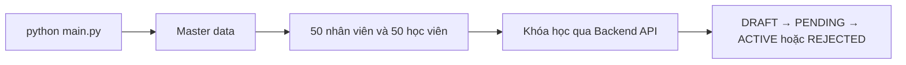

# Hướng dẫn sinh dữ liệu báo cáo AILMS

`main.py` là entrypoint duy nhất của bộ dữ liệu báo cáo cuối cùng. Script chạy dữ liệu theo đúng thứ tự phụ thuộc, dùng MySQL cho dữ liệu danh mục và hồ sơ, MinIO cho file thật, đồng thời gọi Backend API cho toàn bộ quy trình biên soạn khóa học.

## 1. Phạm vi pipeline



| Giai đoạn | Dữ liệu | Cách ghi |
| :--- | :--- | :--- |
| `static` | Department, role, permission, category, interest, coupon, degree | Transaction MySQL |
| `identity` | User, role, employee, contract, student profile, guardian, study goal, teacher category và lịch rảnh | Transaction MySQL và asset MinIO có bù trừ |
| `course-content` | Course, section, lesson, video, PDF, quiz, assignment, package và workflow duyệt | REST API Backend; không ghi trực tiếp MySQL/MinIO |

Các module Python theo từng bảng là thành phần nội bộ được `main.py` điều phối, không phải entrypoint độc lập.

Kế hoạch mở rộng pipeline để sinh hành trình học viên, thanh toán, hoàn thành khóa học và đánh giá nằm tại [`learner-lifecycle-plan.md`](./learner-lifecycle-plan.md). Đây là tài liệu kế hoạch; phase tương ứng chỉ được xem là triển khai xong sau khi API và validation được bổ sung.

## 2. Điều kiện trước khi chạy

- Docker Compose đã khởi động MySQL, MinIO và Backend.
- Backend dùng `SPRING_JPA_HIBERNATE_DDL_AUTO=update` hoặc `validate`; tuyệt đối không dùng `create`/`create-drop` vì restart sẽ xóa dữ liệu vừa sinh.
- Database đã có schema hiện hành và đã áp dụng migration `v23`, `v24`, `v25`, `v26`.
- Các asset trong `database/gen_data/file/` còn đầy đủ.
- Dùng Python 3.12 trong virtual environment riêng.
- Tài khoản `teacher01` và `admin.report` của dataset dùng mật khẩu demo cục bộ; không đưa mật khẩu môi trường thật vào source.

## 3. Chuẩn bị môi trường

Từ thư mục gốc dự án:

```bash
docker compose up -d --build

cd database/gen_data
python3 -m venv .venv
source .venv/bin/activate
python3 -m pip install -r requirements.txt
```

`main.py` tự đọc file `.env` ở thư mục gốc, ánh xạ `MYSQL_*`, `MINIO_ROOT_*` sang cấu hình generator và đổi hostname Docker `minio:9000` thành `127.0.0.1:9000` khi chạy trên host. Chỉ cần export thủ công khi muốn ghi đè cấu hình mặc định:

```bash
export DB_HOST=127.0.0.1
export DB_PORT=3306
export MINIO_ENDPOINT=http://127.0.0.1:9000
export AILMS_API_BASE_URL=http://localhost:8080/api
export AILMS_SEED_PASSWORD='your_overridden_local_seed_password'
```

Nếu không override, generator dùng các actor `teacher01`, `admin.report` và mật khẩu demo chung do chính identity dataset tạo ra.

## 4. Áp dụng migration bắt buộc

Chạy từ thư mục gốc dự án sau khi đã nạp `.env`:

```bash
docker compose exec -T -e MYSQL_PWD="$MYSQL_ROOT_PASSWORD" \
  mysql mysql -uroot "$MYSQL_DATABASE" \
  < database/v23_remove_combo_delivery_mode.sql

docker compose exec -T -e MYSQL_PWD="$MYSQL_ROOT_PASSWORD" \
  mysql mysql -uroot "$MYSQL_DATABASE" \
  < database/v24_expand_degree_qualification_types.sql

docker compose exec -T -e MYSQL_PWD="$MYSQL_ROOT_PASSWORD" \
  mysql mysql -uroot "$MYSQL_DATABASE" \
  < database/v25_add_course_thumbnail_file_usage.sql

docker compose exec -T -e MYSQL_PWD="$MYSQL_ROOT_PASSWORD" \
  mysql mysql -uroot "$MYSQL_DATABASE" \
  < database/v26_add_lesson_media_duration_seconds.sql
```

## 5. Chạy bộ dữ liệu cuối cùng

Từ `database/gen_data/`, chạy toàn bộ pipeline bằng một lệnh:

```bash
python main.py
```

Đây là lệnh chuẩn cho bộ dữ liệu cuối cùng; không cần chạy thêm runner Python nào khác.

Có thể kiểm tra riêng master data mà không commit:

```bash
python main.py --phase static --dry-run
```

Hoặc chạy lại một giai đoạn cụ thể:

```bash
python main.py --phase static
python main.py --phase identity
python main.py --phase course-content
```

Khi chạy riêng `identity`, master data phải tồn tại. Khi chạy riêng `course-content`, dữ liệu identity phải tồn tại và Backend phải truy cập được tại `AILMS_API_BASE_URL`.

## 6. Tính an toàn và khả năng chạy lại

- Master data và identity dùng natural key để cập nhật hoặc bỏ qua dữ liệu đã tồn tại.
- Identity chỉ commit sau khi xác nhận đủ 100 user, 50 employee, 50 student, avatar, hợp đồng và dữ liệu cá nhân hóa.
- Nếu identity lỗi, transaction MySQL rollback và object MinIO vừa upload được xóa bù trừ.
- Course content tìm khóa học bằng slug ổn định và gọi đúng endpoint nghiệp vụ của Backend.
- Quiz lấy 5 câu trắc nghiệm, đáp án và 5 đề tự luận từ `file/course/kiemtra.pdf`; header, footer và số trang được loại bỏ trước khi gửi API.
- Video dùng `ffprobe` để ghi `duration_sec` thật; sidebar không dùng `duration_min` ước tính để hiển thị độ dài video.
- Khóa `ACTIVE` cũ thiếu assessment hoặc có nội dung seed lỗi được chuyển về chế độ sửa, đồng bộ lại rồi đi qua quy trình duyệt một lần nữa.
- Giai đoạn `course-content` chỉ báo thành công sau khi API học viên trả đủ câu hỏi, bài tập và Backend tải được từng video MinIO với MIME `video/*`.
- Không tắt Backend trong lúc chạy giai đoạn `course-content`.
- Không chạy đồng thời hai tiến trình `main.py` trên cùng một database.

## 7. Xử lý lỗi thường gặp

| Lỗi | Nguyên nhân | Cách xử lý |
| :--- | :--- | :--- |
| `Connection refused` tới MySQL | MySQL chưa healthy hoặc sai `DB_HOST`/`DB_PORT` | Kiểm tra `docker compose ps` và cổng `3306` |
| `Access denied` MySQL | Chưa ánh xạ `MYSQL_*` sang `DB_*` | Nạp lại khối biến môi trường ở mục 3 |
| Thiếu qualification type | Chưa áp dụng migration `v24` | Chạy `v24_expand_degree_qualification_types.sql` |
| MinIO authentication failed | Sai access key/secret hoặc MinIO chưa healthy | Kiểm tra `MINIO_ROOT_USER`, `MINIO_ROOT_PASSWORD` và cổng `9000` |
| Backend login thất bại | Chưa chạy identity hoặc sai mật khẩu seed | Chạy `--phase identity`, sau đó kiểm tra biến `AILMS_SEED_*` |
| Giảng viên chưa có category | Identity chưa hoàn tất | Chạy lại `python main.py --phase identity` |
| API course trả `404`/`500` | Backend chưa chạy hoặc migration/schema chưa đồng bộ | Kiểm tra Backend tại `http://localhost:8080/api/v1/courses/active-count` |
| `API học viên chưa hiển thị đủ câu hỏi` | Backend đang chạy image cũ hoặc quiz/assignment chưa được publish khi duyệt course | Build lại Backend rồi chạy `python main.py --phase course-content` |
| `Không tải được asset` hoặc MIME video sai | Object MinIO thiếu, metadata sai hoặc Backend/MinIO chưa đồng bộ | Kiểm tra MinIO, build lại Backend và chạy lại riêng `course-content` |
