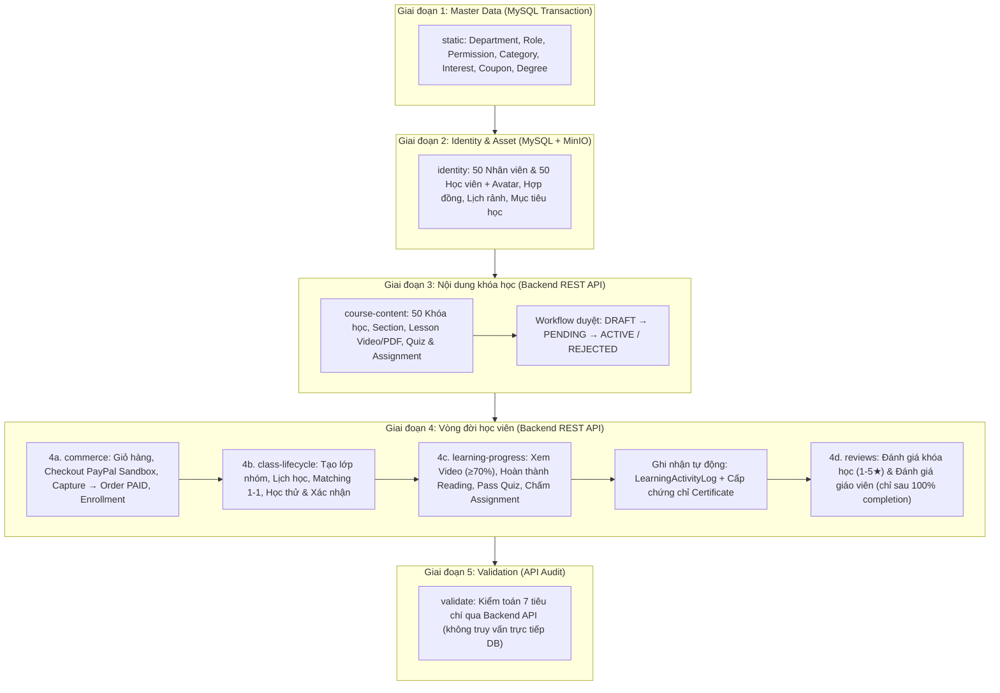

# Hướng dẫn sinh dữ liệu báo cáo AILMS

`main.py` là entrypoint duy nhất của bộ dữ liệu báo cáo hoàn chỉnh cho hệ thống AI Personalized LMS. Script chạy dữ liệu theo đúng thứ tự phụ thuộc, sử dụng MySQL cho dữ liệu cấu hình/hồ sơ, MinIO cho asset thực tế, và gọi **100% REST API nghiệp vụ của Backend** cho toàn bộ quy trình biên soạn khóa học, thanh toán PayPal, ghép lớp, học tập, đánh giá và cấp chứng chỉ.

---

## 1. Kiến trúc Pipeline 5 Giai đoạn



---

## 2. Bảng tổng hợp các Giai đoạn & Module

| Giai đoạn | Lệnh CLI (`--phase`) | Mô tả nghiệp vụ | Cơ chế thực thi |
| :--- | :--- | :--- | :--- |
| **1. Master data** | `static` | Phòng ban, quyền hạn, danh mục, sở thích, mã giảm giá, trình độ | Transaction MySQL |
| **2. Identity** | `identity` | 50 nhân viên, 50 học viên, hồ sơ cá nhân, ảnh đại diện, hợp đồng lao động | Transaction MySQL & Upload MinIO có bù trừ khi rollback |
| **3. Course Content** | `course-content` | 50 khóa học (`COURSES_50`), video bài giảng, bài đọc PDF, quiz 5 câu trắc nghiệm, bài tập tự luận, tạo gói học và quy trình phê duyệt | Backend REST API (`Teacher` & `Admin`) |
| **4a. Commerce** | `commerce` | 50 học viên mua 3–5 gói học; giỏ hàng, áp dụng coupon, tạo đơn hàng PayPal Sandbox và capture tự động | `POST /v1/orders/checkout` & `POST /v1/payments/paypal/capture` |
| **4b. Class Lifecycle** | `class-lifecycle` | Tạo lớp nhóm `GROUP_CLASS`, gán giảng viên, xếp lịch tuần; Quy trình 1-1: ghép gia sư, tạo lớp thử, nộp nhận xét buổi thử và học viên xác nhận | `ClassController`, `HrOneOnOneController`, `InstructorOneOnOneController`, `StudentOneOnOneController` |
| **4c. Learning Progress** | `learning-progress` | Hoàn thành 100% curriculum cho tất cả enrollment: xem video ≥70%, hoàn thành PDF, thi đạt quiz, nộp bài tập & giáo viên chấm điểm. Tự động kích hoạt `LearningActivityLog` và cấp chứng chỉ | `StudentLearningController`, `AssessmentController` |
| **4d. Reviews** | `reviews` | Đánh giá khóa học (1–5 sao) và đánh giá giảng viên kèm nhận xét chi tiết sau khi hoàn tất khóa học; tự động cập nhật `avgRating` | `ReviewController` |
| **Full Lifecycle** | `learner-lifecycle` | Thực thi liên hoàn 4 giai đoạn con: `commerce` → `class-lifecycle` → `learning-progress` → `reviews` → `validate` | Backend REST API |
| **5. Validation** | `validate` | Kiểm toán đối soát 7 hạng mục dữ liệu: Khóa học, Học viên, Gói học, Đơn hàng PAID, Đánh giá, Enrollment và Lớp học | Backend REST API |

---

## 3. Tuân thủ Logic Backend: Activity Log & Audit Log

Tất cả các hành động trong giai đoạn `learner-lifecycle` đều được thực hiện qua **REST API thật của Backend**, kích hoạt các luồng nghiệp vụ chuẩn:

1. **Ràng buộc Đánh giá (Review Rules)**:
   - Backend [`ReviewService`](file:///home/datbritget/Documents/project-ai-lms/ai-personalized-lms/backend/ailms/src/main/java/com/ailms/service/imp/ReviewService.java) kiểm tra bắt buộc `enrollment.status == 1` hoặc `enrollment.completedAt != null`. Nếu học viên chưa hoàn thành 100% khóa học, Backend từ chối với lỗi `400 Bad Request`.
   - Mỗi cặp `(course_id, user_id)` chỉ được đánh giá 1 lần duy nhất (`existsByCourseIdAndUserId`).
   - Tự động liên kết và đánh giá giáo viên chính của lớp hoặc khóa học (`resolveTeacher`).
   - Tự động tính toán lại điểm đánh giá trung bình `avgRating` và `reviewCount` của khóa học.

2. **Nhật ký Hoạt động Học tập (`learning_activity_log`)**:
   - Khi học viên hoàn thành từng bài học, Backend tự động ghi nhận bản ghi `LESSON_COMPLETED` qua `recordLessonCompletion`.
   - Phục vụ biểu đồ nhiệt học tập, chuỗi ngày học (streak) và tự động đánh giá mục tiêu học tập (`studyGoalService.evaluateUserGoals`).

3. **Hệ thống Audit Log (`audit_log`)**:
   - Tự động ghi nhận thông qua Spring Event `AuditLogEvent` + `AuditLogListener`:
     - Xác thực: `LOGIN`, `REGISTER`, `CHANGE_PASSWORD`.
     - Thương mại: `ADD_TO_CART`, `CHECKOUT`, `PAYPAL_CAPTURE`.
     - Học tập: `SUBMIT_QUIZ_ATTEMPT`, `GRADE_SUBMISSION`, `GENERATE_CERTIFICATE`.
     - Đánh giá: `CREATE_REVIEW`.

---

## 4. Điều kiện trước khi chạy

- Docker Compose đã khởi động MySQL, MinIO và Backend Spring Boot:
  ```bash
  docker compose up -d --build
  ```
- Backend sử dụng `SPRING_JPA_HIBERNATE_DDL_AUTO=update` hoặc `validate`.
- Database đã áp dụng các migration bắt buộc (`v23`, `v24`, `v25`, `v26`).
- Thư mục tài nguyên `database/gen_data/file/` còn đầy đủ (`baidoc.pdf`, `kiemtra.pdf`, `c1.jpg`, `c2.jpg`, `c3.jpg`, `mau1.mp4`, `mau2.mp4`, `mau3.mp4`, avatar...).
- Môi trường Python 3.12 trong virtual environment riêng.

---

## 5. Chuẩn bị môi trường

Từ thư mục gốc dự án:

```bash
cd database/gen_data
python3 -m venv .venv
source .venv/bin/activate
python3 -m pip install -r requirements.txt
```

`main.py` tự động nạp cấu hình từ `.env` ở thư mục gốc. Bạn có thể ghi đè nếu cần:

```bash
export DB_HOST=127.0.0.1
export DB_PORT=3306
export MINIO_ENDPOINT=http://127.0.0.1:9000
export AILMS_API_BASE_URL=http://localhost:8080/api
export AILMS_SEED_PASSWORD='Password@123'
```

---

## 6. Hướng dẫn chạy

### Chạy toàn bộ Pipeline từ đầu đến cuối

```bash
python main.py --phase all
```

### Chạy riêng vòng đời học viên (sau khi đã có Identity & Khóa học)

```bash
python main.py --phase learner-lifecycle
```

### Chạy từng giai đoạn riêng lẻ

```bash
# Giai đoạn 1: Master data
python main.py --phase static

# Giai đoạn 2: User, Employee, Student, MinIO Assets
python main.py --phase identity

# Giai đoạn 3: Khóa học & Nội dung học
python main.py --phase course-content

# Giai đoạn 4a: Mua hàng & Thanh toán
python main.py --phase commerce

# Giai đoạn 4b: Lớp học & Quy trình 1-1
python main.py --phase class-lifecycle

# Giai đoạn 4c: Hoàn thành bài học
python main.py --phase learning-progress

# Giai đoạn 4d: Đánh giá khóa học & giáo viên
python main.py --phase reviews

# Giai đoạn 5: Kiểm toán dữ liệu
python main.py --phase validate
```

---

## 7. Cấu trúc Thư mục Module Generator

```text
database/gen_data/
├── main.py                     # Entry point duy nhất điều phối toàn bộ 5 giai đoạn
├── course_catalog_50.py        # Catalog 50 khóa học đa ngành (40 Active, 4 Draft, 3 Pending, 3 Rejected)
├── course_content_catalog.py   # Catalog 6 khóa học ban đầu
├── course_content_api.py       # API Client & Seed nội dung khóa học, Section, Lesson, Quiz, Assignment
├── commerce_api.py             # Seed Mua hàng: Checkout PayPal Sandbox & Capture, Order PAID, Enrollment
├── class_lifecycle_api.py      # Seed Lớp nhóm & Chu trình 1-1 (Matching → Trial → Review → Accept)
├── learning_progress_api.py    # Seed Tiến độ học 100%, Quiz answers, Assignment grading
├── review_api.py               # Seed Đánh giá khóa học & giáo viên (chỉ sau 100% completion)
├── lifecycle_validation.py     # Module kiểm toán 7 tiêu chí chất lượng dữ liệu
├── asset_storage.py            # Quản lý upload MinIO và cơ chế bù trừ (compensation)
├── db.py                       # Kết nối MySQL & Snowflake ID generator
└── file/                       # Tài nguyên nhị phân gốc (Video, PDF, Ảnh thumbnail, Avatar)
```

---

## 8. Tính an toàn và Idempotency (Khả năng chạy lại)

- **Natural Key Check**: Mọi entity đều được kiểm tra sự tồn tại (qua mã khóa học, email, order, enrollment) trước khi tạo mới.
- **Không sinh trùng**: Chạy lại `--phase all` hoặc bất kỳ phase nào nhiều lần không làm nhân bản dữ liệu hay lỗi ràng buộc Unique.
- **Rollback an toàn**: Nếu xảy ra lỗi ở giai đoạn MySQL, transaction sẽ rollback và các file MinIO tải lên trong phiên sẽ được dọn dẹp bù trừ tự động.
- **Tuân thủ phân quyền**: Các API được gọi đúng vai trò thông qua JWT token của từng actor (`Admin`, `Teacher`, `HR`, `Student`).
