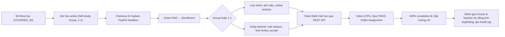

# Đặc tả & Triển khai Vòng đời Học viên (Learner Lifecycle)

> **Trạng thái:** ĐÃ TRIỂN KHAI HOÀN TẤT (IMPLEMENTED). Đã hoàn thành mã nguồn 8 module, tích hợp entrypoint `main.py`, tuân thủ 100% contract Backend Spring Boot REST API và kiểm thử cú pháp sạch.

Tài liệu này đặc tả toàn bộ vòng đời học viên đã được hiện thực hóa trong pipeline sinh dữ liệu của AILMS, mở rộng từ 3 giai đoạn cơ bản (`static`, `identity`, `course-content`) lên 5 giai đoạn hoàn chỉnh:



## 1. Phạm vi và nguyên tắc

- Tăng catalog lên tối thiểu 50 khóa học.
- Dùng tối thiểu 50 học viên đã sinh ở phase `identity`.
- Sinh order, payment, enrollment, lớp học, lịch học, tiến độ học và review.
- Chỉ tạo đánh giá sau khi học viên hoàn thành khóa học.
- Ưu tiên REST API/service nghiệp vụ Backend; không chèn trực tiếp review, payment thành công hoặc progress 100% vào database.
- Không tạo `COMBO`; chỉ sử dụng các hình thức còn được hỗ trợ sau migration loại bỏ combo.
- Không tạo attempt, enrollment hoặc review trùng khi chạy lại.
- Không dùng mock data ở Frontend; generator chỉ tạo dữ liệu Backend có thể truy vấn.

## 2. Khảo sát contract Backend trước khi code

Lập mapping từ nghiệp vụ đến controller/service/DTO thực tế:

| Nghiệp vụ | Cần xác định | Điều kiện thành công |
| --- | --- | --- |
| Course/package | API tạo, workflow và package active | Course/package tồn tại và bán được |
| Cart/order | Thêm giỏ, tạo order, coupon | Order thuộc đúng student/package |
| Payment | Endpoint sandbox/success hoặc callback nội bộ | Transaction success, order `PAID` |
| Enrollment | Cách tạo sau thanh toán | Student truy cập được curriculum |
| Group class | Tạo lớp, gán teacher, thêm student, lịch | Các portal cùng thấy lớp/lịch |
| One-on-one | Ghép, trial, accept teacher | Trial hoàn tất, teacher được chấp nhận |
| Learning | Progress, complete lesson | Progress do Backend tự tính |
| Quiz | Attempt và submit | Attempt `PASSED` |
| Assignment | Submit, chấm/duyệt | Submission hợp lệ |
| Review | Điều kiện course/teacher review | Review sau completion, không trùng |

Nếu chưa có API công khai ổn định, xác định service nghiệp vụ hoặc adapter phù hợp trước khi triển khai; không tự thêm trạng thái database mà Backend không công nhận.

## 3. Mở rộng lên 50 khóa học

### 3.1. Catalog

- Mở rộng catalog hiện tại từ 6 lên 50 mã duy nhất.
- Mỗi khóa có category, interest, thumbnail, mô tả, mục tiêu và teacher hợp lệ.
- Phân bổ workflow dự kiến:
  - 40 khóa `ACTIVE`.
  - 4 khóa `DRAFT`.
  - 3 khóa `PENDING`.
  - 3 khóa `REJECTED`.
- Chỉ khóa `ACTIVE` được chọn cho cohort mua và học.
- Mỗi khóa có package bán được; group/1-1 phải thỏa validation Backend.

### 3.2. Curriculum

Mỗi khóa active cần có:

- 3–5 section và 6–10 lesson.
- Video lấy từ `database/gen_data/file/course/`, duration lấy bằng `ffprobe`.
- Reading/document lấy từ asset hiện có.
- Quiz có câu hỏi, lựa chọn, đáp án đúng và điểm; không dùng PDF thay cho quiz runtime.
- Assignment có đề bài và quy trình submit/chấm.
- Final assessment gắn đúng lesson/section để completion và certificate nhận diện.

## 4. Cohort học viên và enrollment

- Dùng tối thiểu 50 student ở phase `identity`.
- Mỗi student mua 3–5 khóa active; mục tiêu 150–250 enrollment.
- Dùng seed cố định để phân bổ tái lập.
- Phân bổ nhiều student vào cùng course để có rating và nhận xét.
- Tìm theo natural key (student, package/course, order) trước khi tạo.

## 5. Luồng mua hàng và thanh toán

Với từng student–package:

1. Đăng nhập bằng tài khoản student đã seed.
2. Lấy package active từ Backend.
3. Thêm package vào cart.
4. Tạo order.
5. Áp dụng coupon hợp lệ nếu cần.
6. Checkout/payment theo contract Backend.
7. Xác minh order `PAID`, transaction `SUCCESS` và enrollment được tạo.
8. Xác minh student truy cập được curriculum.

Khi chạy lại, order đã `PAID`, payment success hoặc enrollment đã tồn tại thì dùng lại; không tạo giao dịch thứ hai.

## 6. Lớp học, ghép teacher và trial

### 6.1. Group class

- Tạo hoặc dùng group class tương ứng package.
- Gán teacher/TA qua API phân công.
- Thêm student sau payment.
- Tạo lịch lặp hàng tuần, không vượt thời gian khóa học hoặc số buổi.
- Kiểm tra student schedule, teacher schedule và trang quản lý lớp.

### 6.2. One-on-one

Thứ tự bắt buộc:

```text
payment_success
→ enrollment
→ one_on_one_request
→ teacher_matched
→ trial_session_created
→ trial_completed
→ student_accepts_teacher
→ class_activated
→ recurring_sessions
```

- Trial lấy thời gian từ request/availability của student và qua validation Backend.
- HR đổi lịch qua API hiện có.
- Student chỉ accept/đổi teacher khi trial đủ điều kiện kết thúc.
- Trial không tạo teaching payment nếu nghiệp vụ hiện hành không tính thù lao.

## 7. Hoàn thành bài học theo Backend

Với mỗi enrollment, lấy curriculum từ API và xử lý tuần tự:

### Video

- Gửi progress theo nhiều mốc, không cập nhật trực tiếp database.
- Đạt tối thiểu 70% duration hoặc ngưỡng Backend.
- Sau completion vẫn cho phép xem lại video.

### Reading/document

- Gọi endpoint progress/complete hiện có.
- Chỉ hoàn thành khi Backend chấp nhận lesson type.

### Quiz

1. Lấy question/options từ API.
2. Tạo attempt.
3. Chọn đáp án đúng từ dữ liệu đã kiểm chứng.
4. Submit.
5. Xác minh `PASSED`.

### Assignment

1. Tạo submission từ đề bài thật.
2. Upload file nếu API yêu cầu.
3. Submit.
4. Gọi luồng chấm/duyệt của teacher/TA.
5. Xác minh lesson được tính completion.

Không set trực tiếp `progress = 100`. Chỉ kết luận hoàn thành khi Backend trả enrollment 100%.

## 8. Sinh đánh giá và nhận xét

Chỉ gọi Review API sau khi:

- Enrollment thuộc đúng student.
- Course progress đạt 100%.
- Quiz cuối khóa pass nếu bắt buộc.
- Assignment bắt buộc đã được chấm/duyệt.
- Teacher hợp lệ nếu tạo teacher review.
- Chưa có review cùng student/course.

Review gồm:

- Rating và nhận xét course.
- Rating và nhận xét teacher.
- Thời điểm sau completion.
- Nội dung đa dạng nhưng tái lập theo seed.

Mục tiêu:

- 150–250 course reviews.
- 100–200 teacher reviews.
- Mỗi active course có nhiều đánh giá.
- Không có review trước completion hoặc review trùng.

## 9. Module và CLI dự kiến

```text
database/gen_data/
├── course_catalog_50.py
├── commerce_api.py
├── enrollment_api.py
├── class_lifecycle_api.py
├── learning_progress_api.py
├── quiz_attempt_api.py
├── assignment_submission_api.py
├── review_api.py
└── lifecycle_validation.py
```

CLI dự kiến:

```bash
python main.py --phase learner-lifecycle
python main.py --phase learner-lifecycle --courses 50 --students 50 --courses-per-student 4
python main.py --phase reviews
```

Các phase hiện có vẫn giữ tương thích:

```bash
python main.py --phase static
python main.py --phase identity
python main.py --phase course-content
```

## 10. Validation sau khi sinh

### API/business

- [ ] Có tối thiểu 50 khóa học, trong đó đủ khóa active.
- [ ] Package active bán được.
- [ ] Order `PAID`, payment `SUCCESS`.
- [ ] Enrollment đúng student/course.
- [ ] Group/1-1 có teacher, lớp và lịch hợp lệ.
- [ ] Trial đúng trạng thái nếu là one-on-one.
- [ ] Video đạt ngưỡng completion.
- [ ] Quiz có attempt `PASSED`.
- [ ] Assignment có submission/chấm hợp lệ.
- [ ] Enrollment đạt 100%.
- [ ] Review tạo sau completion.

### Toàn vẹn

- [ ] Không trùng order, enrollment, attempt hoặc review.
- [ ] Không review trước completion.
- [ ] Không payment success cho order không tồn tại.
- [ ] Không lịch vượt thời gian kết thúc.
- [ ] Không teaching payment cho trial nếu trial không tính thù lao.
- [ ] Rating hiển thị nhất quán ở Student, Teacher và Admin.

## 11. Lộ trình chạy và kiểm thử

1. Một course, một student: mua → thanh toán → học → review.
2. Năm course, mười student: kiểm tra phân bổ và chống trùng.
3. Đầy đủ 50 course, 50 student.
4. Chạy lại phase để kiểm tra idempotency.
5. Chạy validation độc lập và xuất thống kê.
6. Chạy test Python của `database/gen_data`.
7. Nếu đổi contract Backend, chạy test/compile Backend trước full pipeline.

## 12. Tiêu chí hoàn thành

Phase chỉ hoàn tất khi:

- Dữ liệu đi qua đúng workflow Backend.
- 50 khóa học có curriculum hợp lệ.
- Student đã thanh toán và có enrollment.
- Lesson, quiz, assignment hoàn thành qua API.
- Enrollment đạt 100%.
- Course review và teacher review hợp lệ.
- Chạy lại không tạo bản ghi trùng.
- Validation pass và lỗi còn lại được ghi rõ trong log/báo cáo.

