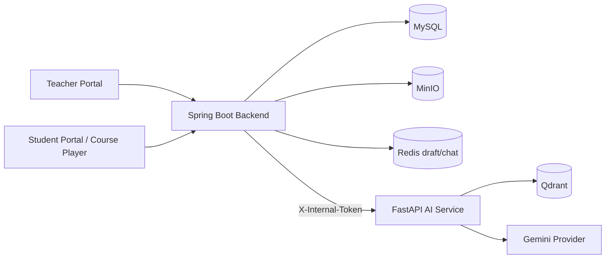
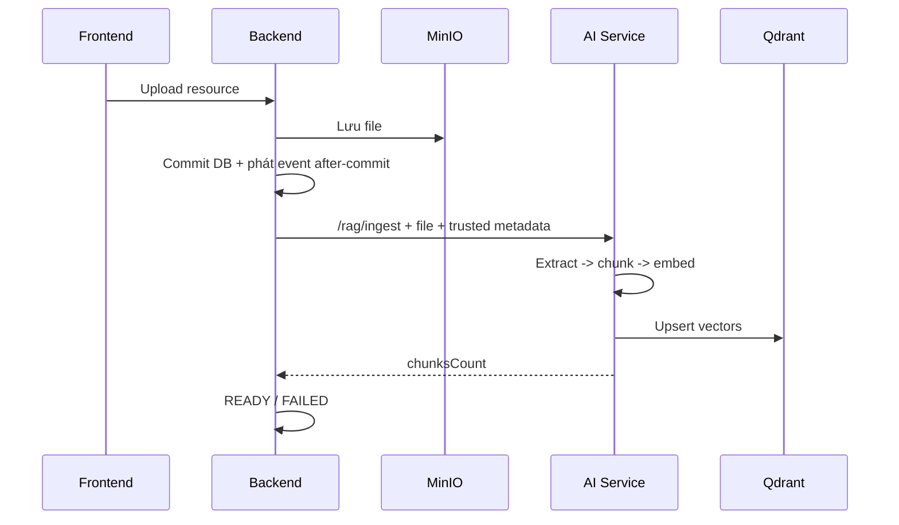
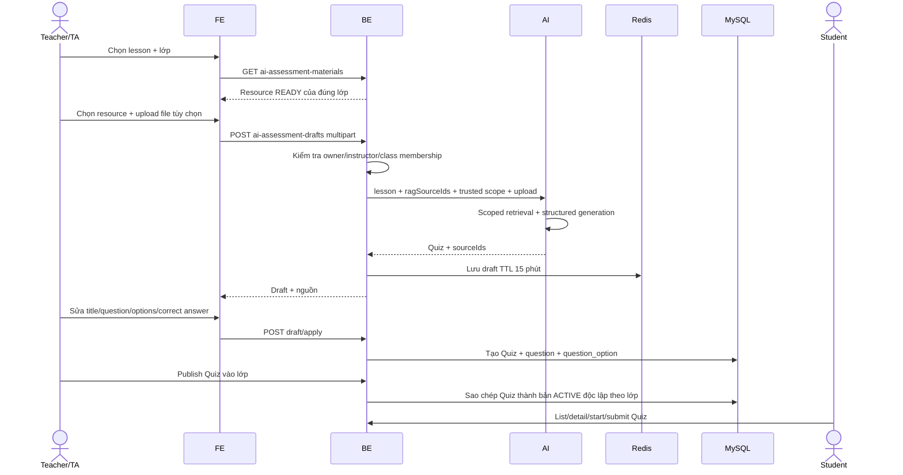

# AI Learning Assessment & Scoped Chat — Thiết kế và triển khai

## 1. Trạng thái

Hai luồng đã được triển khai xuyên suốt Database, Backend, AI Service và Frontend:

1. Giáo viên tạo Quiz từ nội dung lesson, tài liệu đã có trong lớp và file upload bổ sung; review/chỉnh sửa rồi phát hành vào lớp.
2. Học viên chat thời gian thực với RAG bị giới hạn theo lesson, lớp hoặc khóa học đã ghi danh.

Nguyên tắc quan trọng nhất: **không gửi toàn bộ kho tài liệu lên model trong mỗi câu hỏi**. Tài liệu bền vững được ingest một lần vào Qdrant; lúc sinh Quiz hoặc chat chỉ gửi khóa scope và lấy các chunk liên quan. File upload tức thời vẫn được đọc in-memory vì chưa phải tài liệu của lớp.

Sơ đồ kỹ thuật đầy đủ của ingestion, local embedding 384 chiều, scoped retrieval, chat SSE và assessment nằm tại [rag-system-flow.md](./rag-system-flow.md).

## 2. Kiến trúc đã triển khai



Ranh giới trách nhiệm:

- Frontend chỉ gọi Backend.
- Backend xác thực JWT, enrollment, class membership, quyền Teacher/TA và quan hệ course/class/lesson.
- AI Service không nhận quyền do Frontend tự khai báo; chỉ dùng context Backend đã xác thực.
- Qdrant giữ chunk và metadata scope, không thay thế MySQL nghiệp vụ hay MinIO.
- Prompt, nội dung tài liệu và dữ liệu cá nhân không được ghi log.

## 3. Tối ưu RAG tài liệu lớp

### 3.1. Tài liệu bền vững

Khi tạo `ClassResource` hoặc `LessonResource`:



`ClassResource` có vòng đời:

```text
PENDING -> PROCESSING -> READY
                     \-> FAILED -> retry -> PROCESSING
```

Metadata Qdrant chính:

```json
{
  "sourceId": "class-resource-123",
  "module": "TRAINING",
  "courseId": "10",
  "classId": "20",
  "lessonId": null,
  "allowedRoles": ["ROLE_STUDENT", "ROLE_TEACHER", "ROLE_TA", "ROLE_ADMIN"]
}
```

Khi resource bị xóa, Backend phát event xóa toàn bộ vector theo `sourceId`. Nếu ingest lỗi, file vẫn còn trong MinIO và UI cho phép retry.

### 3.2. Tài liệu upload tức thời

- Tối đa 3 file/request, 10 MB/file.
- Chỉ nhận PDF, DOCX, PNG, JPEG.
- Backend gửi base64 sang AI Service trong request hiện tại.
- AI Service extract/OCR in-memory và không tự lưu vào Qdrant.

Cách này phù hợp với file dùng một lần. Nếu file cần tái sử dụng, giáo viên nên upload vào lớp để được ingest một lần và truy xuất theo RAG.

### 3.3. Ngân sách context

- Assessment lấy tối đa 8 chunk phù hợp cho mỗi source đã chọn.
- Source được lọc chính xác theo `sourceId + classId + courseId + allowedRoles`.
- Chunk trùng được loại bỏ trước khi dựng prompt.
- Tổng context assessment giới hạn 80.000 ký tự.
- Không có chunk cho một source đã chọn thì request fail-closed; AI không tự bịa từ kiến thức ngoài nguồn.

## 4. Luồng tạo, review và phát hành Quiz



### 4.1. API giáo viên

| Method | Endpoint | Chức năng |
|---|---|---|
| `GET` | `/api/v1/authoring/lessons/{lessonId}/ai-assessment-materials?classId={classId}` | Resource lớp và trạng thái RAG |
| `POST` | `/api/v1/authoring/lessons/{lessonId}/ai-assessment-drafts` | Sinh draft từ RAG + upload |
| `POST` | `/api/v1/authoring/ai-assessment-drafts/{draftId}/apply` | Apply nội dung đã review |
| `POST` | `/api/v1/teacher/classes/{classId}/quizzes/{sourceQuizId}/publish` | Phát hành bản sao Quiz vào lớp |
| `GET` | `/api/v1/teacher/classes/{classId}/quizzes` | Danh sách Quiz đã giao |
| `PATCH` | `/api/v1/teacher/classes/{classId}/quizzes/{classQuizId}` | Sửa lịch/lượt làm/chính sách kết quả |
| `POST` | `/api/v1/teacher/classes/{classId}/quizzes/{classQuizId}/close` | Đóng Quiz |
| `POST` | `/api/v1/classes/{classId}/resources/{resourceId}/rag/retry` | Retry resource FAILED |

Request sinh draft là `multipart/form-data`:

| Field | Quy tắc |
|---|---|
| `assessmentType` | `QUIZ`, `ASSIGNMENT`, `BOTH` |
| `questionCount` | 3–15 |
| `classId` | Bắt buộc khi có `resourceIds` |
| `resourceIds` | Field lặp, tối đa 10, không trùng |
| `materials` | Field file lặp, tối đa 3 |

Ví dụ apply draft đã chỉnh sửa:

```json
{
  "applyQuiz": true,
  "applyAssignment": false,
  "quiz": {
    "title": "Quiz chương 1",
    "questions": [
      {
        "content": "Nội dung câu hỏi đã review",
        "questionType": "SINGLE_CHOICE",
        "points": 1,
        "explanation": "Giải thích",
        "options": [
          {"content": "A", "isCorrect": true},
          {"content": "B", "isCorrect": false}
        ]
      }
    ]
  }
}
```

Backend kiểm tra lại số câu, nội dung, điểm, loại câu hỏi và số đáp án đúng trước khi claim draft. Người khác không thể đọc hoặc làm mất draft. Draft chỉ được apply một lần.

### 4.2. Phát hành theo lớp

Không tạo bảng `class_quiz_assignment` riêng. Bản phát hành là một hàng `quiz` độc lập:

- `source_quiz_id`: Quiz nguồn trong Course Builder/thư viện.
- `class_id`: lớp nhận Quiz.
- `available_from`, `due_at`, `max_attempts`, `show_result_after_submit`.
- Questions/options được sao chép atomically để sửa Quiz nguồn không đổi đề đã giao.
- Không cho phát hành trùng một Quiz nguồn đang ACTIVE vào cùng lớp.
- `close` chuyển bản Quiz lớp sang `INACTIVE`.

### 4.3. API học viên

| Method | Endpoint | Chức năng |
|---|---|---|
| `GET` | `/api/v1/student/quizzes` | Quiz chung + Quiz đúng lớp, trạng thái và quyền bắt đầu |
| `GET` | `/api/v1/student/quizzes/{quizId}` | Nội dung Quiz đã mở, không có đáp án đúng/explanation |
| `POST` | `/api/v1/student/quizzes/{quizId}/attempts` | Tạo hoặc lấy lại attempt đang làm |
| `POST` | `/api/v1/student/quiz-attempts/{attemptId}/submit` | Nộp attempt thuộc chính JWT |

Backend chặn các trường hợp:

- Chưa ghi danh course hoặc không còn là STUDENT ACTIVE của lớp.
- Quiz DRAFT/INACTIVE, chưa đến giờ mở hoặc đã quá hạn.
- Hết lượt làm.
- Attempt thuộc học viên khác, đã nộp hoặc hết thời gian.
- `showResultAfterSubmit=false`: danh sách và UI không lộ `bestScore`, `passed`, đáp án hay explanation.

## 5. AI Chat học viên theo scope

### 5.1. Request từ Frontend

```json
{
  "question": "Giải thích phần này dễ hiểu hơn",
  "courseId": "10",
  "lessonId": "40",
  "retrievalScope": "LESSON_ONLY",
  "module": "TRAINING",
  "route": "/learn/courses/10/lessons/40"
}
```

Frontend không gửi `classId` như một quyền truy cập. Backend suy ra class từ enrollment của học viên và ghi context đã xác thực vào conversation.

### 5.2. Scope

| Scope | Filter bắt buộc |
|---|---|
| `LESSON_ONLY` | `module=TRAINING`, `courseId`, `lessonId`, `visibility=COURSE`, role |
| `CLASS_MATERIALS` | `module=TRAINING`, `courseId`, `classId`, `visibility=CLASS`, role |
| `COURSE_MATERIALS` | `module=TRAINING`, `courseId`, `visibility=COURSE`, role |
| `GENERAL` | Không truy vấn Qdrant; trả lời bằng kiến thức chung |

`visibility=COURSE` ở scope toàn khóa học cố ý loại tài liệu riêng của các lớp khác cùng course. `GENERAL` bỏ qua RAG ngay cả khi router phân loại câu hỏi thành `KNOWLEDGE`, tránh truy xuất chéo tài liệu đào tạo.

### 5.3. Conversation isolation

`ai_conversation` lưu `course_id`, `class_id`, `lesson_id`, `retrieval_scope`. Backend từ chối dùng lại conversation khi context mới khác context đã lưu. Frontend tự tạo conversation mới khi course, lesson hoặc scope thay đổi.

### 5.4. SSE và UX

- Token được render theo thời gian thực.
- Metadata cuối stream chứa route, grounding và source đã qua filter.
- Citation hiển thị title, page, score và source scope.
- Nút Stop hủy request nhưng giữ phần text đã nhận.
- Message lỗi có nút Retry.
- File/ảnh đính kèm vẫn mang `courseId`, `lessonId`, `retrievalScope`; Backend xác thực lại như chat text.
- Course Player mặc định `LESSON_ONLY`; người học có thể chọn tài liệu lớp, toàn course hoặc kiến thức chung.
- Các quick prompt gồm tóm tắt bài, tiến độ và gợi ý bước học tiếp theo.

## 6. Database migration

Migration: `database/v29_ai_class_learning_scope.sql`.

Thay đổi chính:

- `class_resource`: `rag_status`, `rag_chunks_count`, `rag_error` và index trạng thái; resource cũ được đánh dấu `FAILED` để giáo viên chủ động retry.
- `quiz`: `source_quiz_id`, `available_from`, `show_result_after_submit`, index lớp/source/lịch và FK tự tham chiếu.
- `ai_conversation`: `course_id`, `class_id`, `lesson_id`, `retrieval_scope` và index context.

Phải chạy migration trước khi khởi động backend mới.

## 7. Ma trận kiểm thử bắt buộc

### Assessment/RAG

| Case | Kỳ vọng |
|---|---|
| Resource đúng lớp + READY | Được chọn và retrieve đúng source |
| Resource lớp khác | `403` |
| Resource PENDING/PROCESSING/FAILED | `400`, UI không cho chọn |
| Resource ID thiếu/trùng/>10 | `400` |
| Upload rỗng/sai MIME/>10 MB/>3 file | `400` |
| RAG source không có chunk | Fail-closed, không tạo draft |
| AI output sai schema | Không lưu Redis/DB |
| Draft hết hạn/đã apply | `400` |
| Người khác apply draft | `403`, draft không bị consume |
| Edited Quiz thiếu đáp án đúng | `400`, draft còn nguyên |
| Publish khác course/không quản lý lớp | `400/403` |
| Publish trùng ACTIVE | `400` |
| Student khác lớp đọc/start | `404/403` |
| Chưa mở/quá hạn/hết lượt | Không tạo attempt |
| Result hidden | Không lộ điểm/pass/đáp án |

### Chat

| Case | Kỳ vọng |
|---|---|
| LESSON_ONLY thiếu course/lesson | Reject schema/context |
| CLASS_MATERIALS thiếu class membership | `403/400` |
| Lesson thuộc course khác | `403` |
| Enrollment bị hủy | `403` |
| Qdrant lỗi | Stream không làm lộ dữ liệu; trả fallback/error phù hợp |
| REQUIRED không có chunk | Thông báo chưa có tài liệu, source rỗng |
| GENERAL | Retriever không được gọi |
| Đổi lesson/scope | Conversation mới |
| Dùng conversation khác context | `400` |
| Client abort | Dừng stream, giữ phần đã nhận |

## 8. Lệnh kiểm tra

```bash
cd backend/ailms
./mvnw test
./mvnw -DskipTests compile

cd ../../ai-service
.venv/bin/pytest

cd ../frontend/ailms-frontend
npm run build
npm run lint

cd ../..
git diff --check
```

### 8.1. Kết quả xác minh triển khai

| Phạm vi | Kết quả |
|---|---|
| Backend unit/service/controller | `120` test pass, `2` test skip khi loại `AilmsApplicationTests.contextLoads` |
| Backend application context | Không chạy độc lập được khi local MySQL chưa bật; lỗi kết nối JDBC, không phải assertion của feature |
| AI Service assessment/chat/RAG | `33` test pass khi loại test cache catalog cũ |
| AI Service focused feature suite | `17` test pass |
| AI Service format | `black --check` pass trên toàn bộ file Python thay đổi |
| Frontend production | `tsc -b && vite build` pass |
| Frontend feature lint | Pass cho API assessment, modal generate/publish, student attempt và toàn bộ file chat trọng tâm |
| Frontend full-repository lint | Còn `11.110` lỗi legacy trên toàn source tree; không phát sinh từ riêng feature này |
| Diff hygiene | `git diff --check` pass |

Full `pytest` của AI Service dừng ở `tests/test_catalog.py::test_embed_query_caching`, là test cache catalog có sẵn và không thuộc assessment/chat/RAG mới. Full backend application context cần MySQL/Redis/MinIO/Qdrant theo cấu hình local. Vì vậy CI hoặc môi trường Docker đầy đủ vẫn phải chạy lại hai nhóm integration này trước production.

## 9. Checklist triển khai môi trường

1. Backup MySQL và chạy `v29_ai_class_learning_scope.sql`.
2. Deploy AI Service trước để nhận contract assessment/chat/ingest mới.
3. Deploy Backend và xác nhận `X-Internal-Token` khớp AI Service.
4. Deploy Frontend.
5. Retry các `ClassResource` cũ cần dùng cho AI để tạo vector và chuyển `READY`.
6. Smoke test một luồng: upload resource → READY → generate → edit → apply → publish → student start/submit.
7. Smoke test bốn scope chat bằng hai học viên thuộc hai lớp khác nhau để xác nhận không rò rỉ chéo lớp.
