# Luồng RAG chi tiết của AILMS

## 1. Phạm vi tài liệu

Tài liệu này mô tả đúng luồng RAG đang được triển khai trong hệ thống AILMS, gồm:

- Nạp `ClassResource` và `LessonResource` vào Qdrant.
- Trích xuất PDF, DOCX, TXT, Markdown và ảnh.
- Chunking, local embedding 384 chiều và idempotent upsert.
- Scoped retrieval cho AI Chat học viên.
- Truy xuất tài liệu lớp để sinh Quiz/Assignment.
- Xóa, retry, phân quyền, citation và các nhánh lỗi.

Hệ thống hiện dùng `FastEmbed` với model `sentence-transformers/paraphrase-multilingual-MiniLM-L12-v2`. `GeminiEmbedder` 768 chiều vẫn tồn tại trong mã nguồn nhưng không phải embedder mặc định của ingestion, retrieval và long-term memory.

## 2. Kiến trúc RAG tổng thể

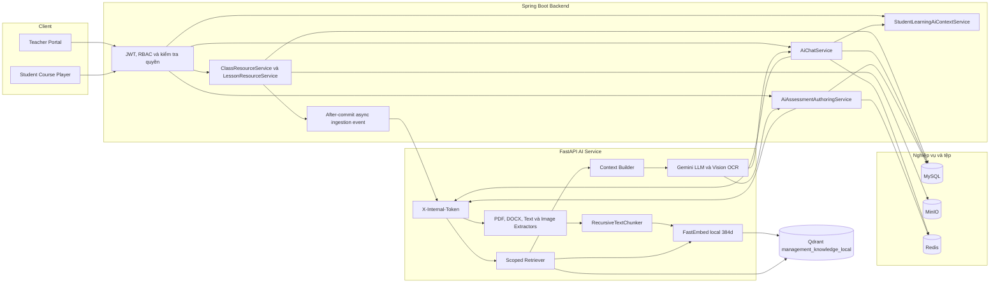

Nguyên tắc ranh giới:

- Frontend không gọi trực tiếp AI Service hoặc Qdrant.
- Backend là nơi xác thực JWT, quyền truy cập course/class/lesson và trạng thái enrollment.
- AI Service chỉ nhận request nội bộ có `X-Internal-Token`.
- AI Service không truy cập trực tiếp MySQL nghiệp vụ.
- MySQL lưu metadata và trạng thái; MinIO lưu file gốc; Qdrant chỉ lưu vector, chunk text và metadata phục vụ lọc.

## 3. Luồng ingestion tài liệu

### 3.1. Luồng từ upload đến Qdrant

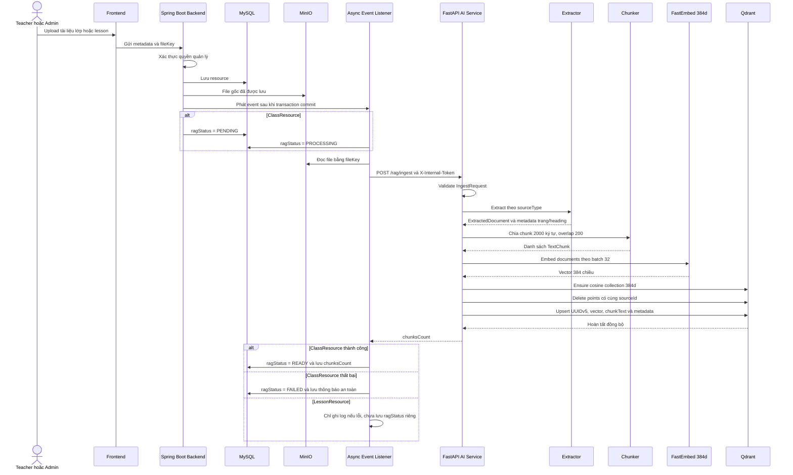

Backend xử lý event bất đồng bộ sau commit, nhưng endpoint `/rag/ingest` của AI Service vẫn xử lý đồng bộ trong chính request nội bộ đó.

### 3.2. Chọn extractor

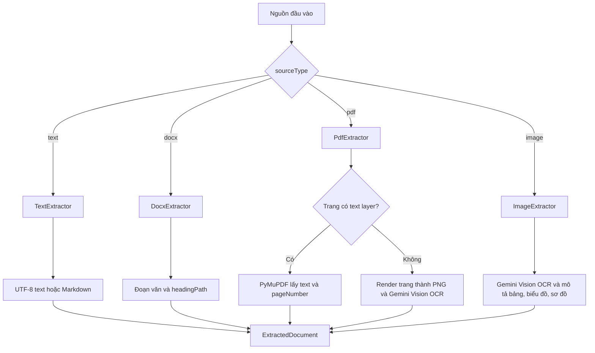

Local RAG không embedding trực tiếp byte ảnh/PDF. Hệ thống dùng Gemini Vision để chuyển phần ảnh hoặc trang scan thành text, sau đó text mới được chunk và embedding local.

### 3.3. Chunking và embedding

```mermaid
flowchart LR
    Document["ExtractedDocument"] --> Segment["Duyệt từng segment"]
    Segment --> Normalize["Chuẩn hóa khoảng trắng"]
    Normalize --> Split["Ưu tiên ngắt đoạn, câu rồi khoảng trắng"]
    Split --> Window["Chunk tối đa 2000 ký tự"]
    Window --> Overlap["Overlap 200 ký tự"]
    Overlap --> Metadata["Giữ pageNumber hoặc headingPath"]
    Metadata --> Passage["Thêm prefix passage:"]
    Passage --> FastEmbed["FastEmbed ONNX, batch 32"]
    FastEmbed --> MiniLM["paraphrase-multilingual-MiniLM-L12-v2"]
    MiniLM --> Vector["Vector float 384 chiều"]
```

Cấu hình hiện tại:

| Thuộc tính | Giá trị |
|---|---|
| Model local | `sentence-transformers/paraphrase-multilingual-MiniLM-L12-v2` |
| Runtime | `fastembed.TextEmbedding` |
| Dimension | `384` |
| Batch size | `32` |
| Chunk size | `2000` ký tự |
| Chunk overlap | `200` ký tự |
| Distance | Cosine |
| RAG collection | `management_knowledge_local` |

### 3.4. Idempotent upsert

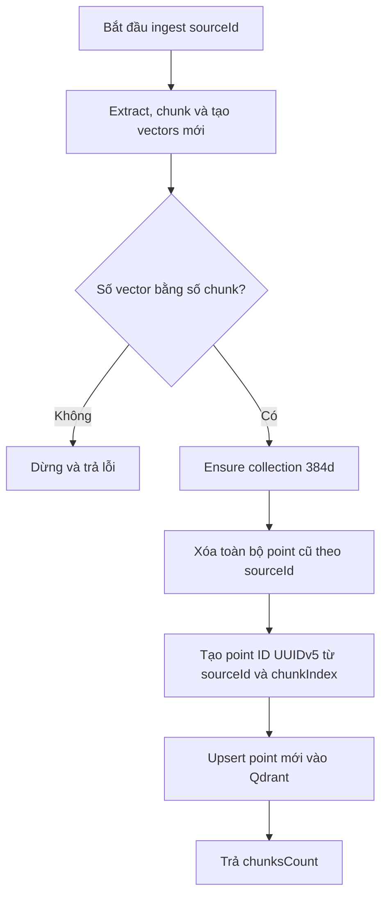

Point ID ổn định giúp cùng một `sourceId + chunkIndex` không sinh point ngẫu nhiên sau mỗi lần ingest. Nếu đổi model embedding, kể cả model mới vẫn tạo 384 chiều, phải reindex toàn bộ vì không gian vector giữa hai model không tương thích.

## 4. Metadata và phân vùng tài liệu

### 4.1. Payload của ClassResource

```json
{
  "sourceId": "class-resource-123",
  "sourceType": "pdf",
  "resourceId": "123",
  "module": "TRAINING",
  "domain": "class_resource",
  "courseId": "10",
  "classId": "20",
  "visibility": "CLASS",
  "allowedRoles": [
    "ROLE_STUDENT",
    "ROLE_TEACHER",
    "ROLE_TA",
    "ROLE_ADMIN"
  ],
  "chunkIndex": 0,
  "chunkText": "Nội dung chunk...",
  "pageNumber": 1,
  "title": "Giáo trình lớp"
}
```

### 4.2. Payload của LessonResource

```json
{
  "sourceId": "lesson-resource-456",
  "sourceType": "docx",
  "resourceId": "456",
  "module": "TRAINING",
  "domain": "lesson_resource",
  "courseId": "10",
  "sectionId": "30",
  "lessonId": "40",
  "visibility": "COURSE",
  "allowedRoles": [
    "ROLE_STUDENT",
    "ROLE_TEACHER",
    "ROLE_TA",
    "ROLE_ADMIN"
  ],
  "chunkIndex": 0,
  "chunkText": "Nội dung chunk...",
  "headingPath": "Chương 1 > Bài 1",
  "title": "Tài liệu bài học"
}
```

`visibility=CLASS` ngăn tài liệu riêng của một lớp xuất hiện trong scope course hoặc lesson. `visibility=COURSE` cho phép tài liệu lesson được dùng trong phạm vi lesson hoặc toàn khóa học nhưng không làm lộ tài liệu lớp khác.

## 5. Luồng AI Chat dùng scoped RAG

### 5.1. Xác thực context ở Backend

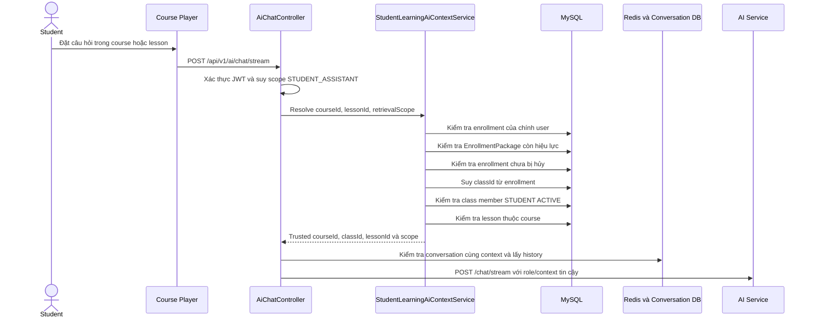

Frontend không gửi `classId` như bằng chứng phân quyền. Backend tự suy ra `classId` từ enrollment của chính học viên.

### 5.2. Selective RAG trong AI Service

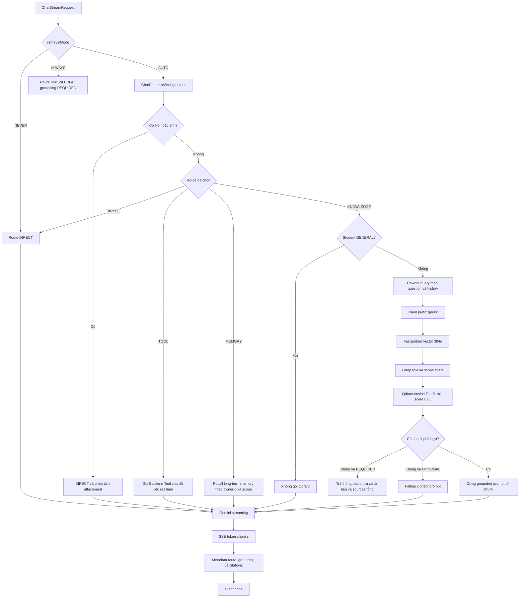

### 5.3. Filter theo retrieval scope

Mọi truy vấn knowledge đều có `allowedRoles` lấy từ JWT ở Backend và bổ sung role `ALL`.

| Retrieval scope | Qdrant filter bắt buộc | Ý nghĩa |
|---|---|---|
| `LESSON_ONLY` | `module=TRAINING`, `courseId`, `lessonId`, `visibility=COURSE`, `allowedRoles` | Chỉ lấy tài liệu đúng lesson trong course đang học |
| `CLASS_MATERIALS` | `module=TRAINING`, `courseId`, `classId`, `visibility=CLASS`, `allowedRoles` | Chỉ lấy tài liệu riêng của lớp học viên |
| `COURSE_MATERIALS` | `module=TRAINING`, `courseId`, `visibility=COURSE`, `allowedRoles` | Lấy học liệu dùng chung của course, loại tài liệu riêng của lớp |
| `GENERAL` | Không gọi Qdrant | Chỉ dùng kiến thức chung của model |

### 5.4. Luồng trả lời và citation

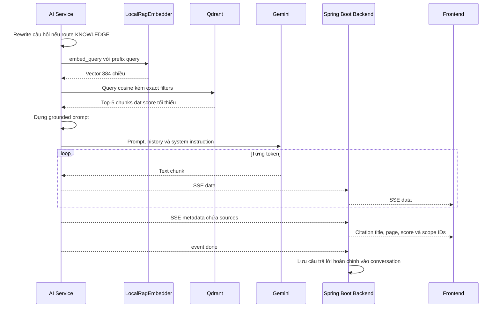

Citation chỉ được tạo từ những point thực sự vượt qua filter và score threshold. Metadata citation có thể gồm `sourceId`, `chunkId`, `title`, `sourceType`, `score`, `courseId`, `classId`, `lessonId`, `sectionId` và `pageNumber`.

## 6. Luồng RAG sinh Quiz và Assignment

### 6.1. Kết hợp tài liệu lớp và upload tạm

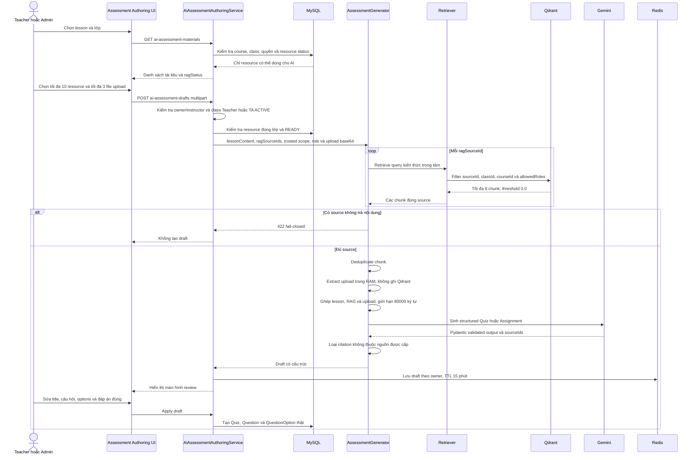

Tài liệu lớp đã ingest không được tải lại toàn bộ lên model. Request chỉ mang `ragSourceIds`; AI Service truy xuất các chunk cần thiết từ Qdrant. File upload dùng một lần được extract trong RAM và không upsert vào Qdrant.

### 6.2. So sánh retrieval của chat và assessment

| Thuộc tính | AI Chat | AI Assessment |
|---|---|---|
| Query | Câu hỏi đã rewrite | Tiêu đề lesson và yêu cầu tìm kiến thức trọng tâm |
| Số kết quả | Tối đa 5 chunk | Tối đa 8 chunk trên mỗi source |
| Score threshold | `0.65` mặc định | `0.0` để lấy đủ nội dung của source giáo viên chủ động chọn |
| Filter | Role và retrieval scope | `sourceId + classId + courseId + role` |
| Không có chunk | Grounding REQUIRED fail; OPTIONAL fallback direct | Fail-closed toàn request |
| Context limit | Theo context builder và history | Tổng source text tối đa 80.000 ký tự |
| Citation | Trả trong SSE metadata | `sourceIds` trên từng câu hỏi |

## 7. Vòng đời ClassResource RAG

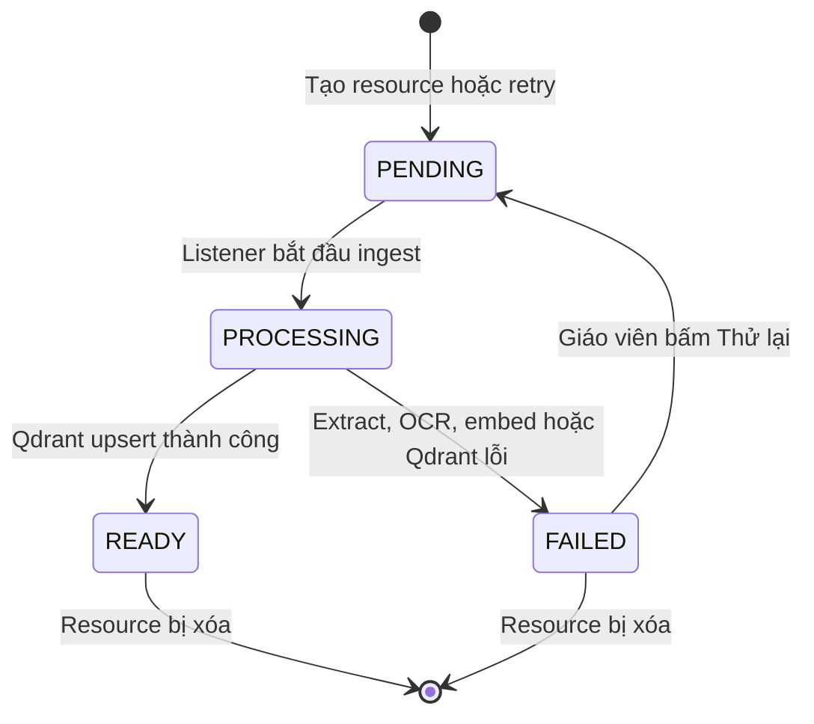

Quy tắc hiện tại:

- Chỉ `ClassResource` lưu `ragStatus`, `ragChunksCount` và `ragError` trong MySQL.
- Chỉ resource `READY` được chọn làm nguồn sinh assessment.
- Endpoint retry chỉ chấp nhận resource `FAILED`, tránh tạo nhiều ingestion đồng thời.
- Khi resource bị xóa, Backend gọi `DELETE /rag/sources/{sourceId}` để xóa toàn bộ point theo source.
- `LessonResource` được ingest/xóa bằng event tương tự nhưng chưa có trạng thái RAG riêng để hiển thị trên UI.

## 8. Long-term memory và conversation history

Long-term memory dùng local embedding 384 chiều nhưng là collection khác với kho tài liệu RAG.

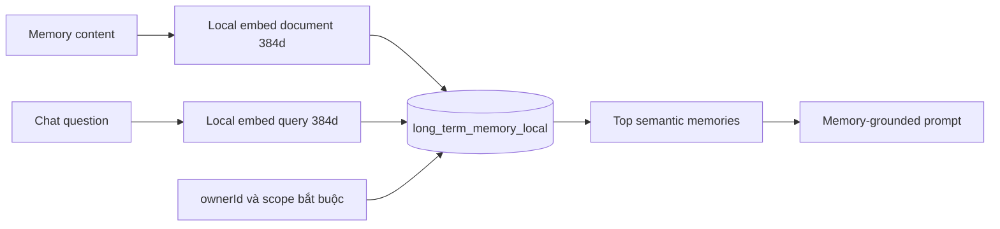

Không được nhầm ba loại dữ liệu:

| Dữ liệu | Nơi lưu | Mục đích |
|---|---|---|
| File gốc | MinIO | Download, quản lý tài liệu và ingest lại |
| Metadata nghiệp vụ và conversation | MySQL | Quyền, trạng thái, owner, course/class/lesson và lịch sử bền vững |
| Chat buffer và assessment draft | Redis | History ngắn hạn và draft TTL |
| Document chunks | Qdrant `management_knowledge_local` | Scoped semantic retrieval |
| Long-term memories | Qdrant `long_term_memory_local` | Recall theo `ownerId + scope` |
| Public catalog vectors | Qdrant `public_catalog_local_*` | Semantic search khóa học/danh mục công khai |

Chat history không tự động đồng nghĩa với long-term memory. Conversation được lưu trong MySQL/Redis; chỉ dữ liệu được ghi qua memory flow mới nằm trong `long_term_memory_local`.

## 9. Xử lý lỗi và chống rò rỉ dữ liệu

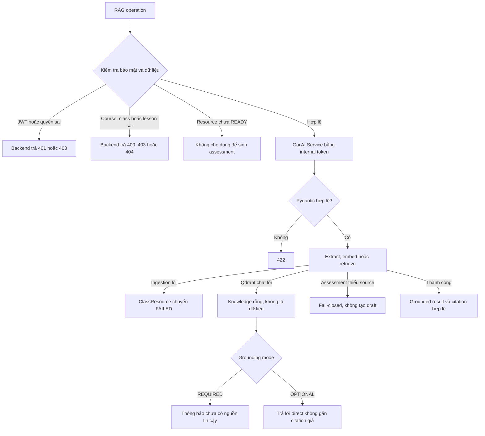

Các lớp bảo vệ chính:

1. Frontend không quyết định quyền truy cập Qdrant.
2. Backend xác thực user và xây trusted context.
3. AI Service xác thực `X-Internal-Token` và schema Pydantic.
4. Qdrant search dùng exact payload filter cùng cosine similarity.
5. Chat chỉ trả citation từ kết quả retrieval thật.
6. Assessment loại `sourceIds` lạ do model sinh.
7. Log không ghi nội dung prompt, tài liệu hoặc dữ liệu cá nhân nhạy cảm.

## 10. Endpoint liên quan

### 10.1. API Frontend gọi Backend

| Method | Endpoint | Vai trò trong RAG |
|---|---|---|
| `POST` | `/api/v1/classes/{classId}/resources` | Tạo metadata tài liệu lớp và phát event ingestion |
| `GET` | `/api/v1/classes/{classId}/resources` | Xem resource và trạng thái RAG |
| `POST` | `/api/v1/classes/{classId}/resources/{resourceId}/rag/retry` | Retry resource `FAILED` |
| `DELETE` | `/api/v1/classes/{classId}/resources/{resourceId}` | Xóa resource và vector theo sourceId |
| `POST` | `/api/v1/ai/chat/stream` | Scoped chat dạng SSE |
| `POST` | `/api/v1/ai/chat/file/stream` | Chat với file upload dùng một lần |
| `GET` | `/api/v1/authoring/lessons/{lessonId}/ai-assessment-materials` | Lấy nguồn RAG lớp cho assessment |
| `POST` | `/api/v1/authoring/lessons/{lessonId}/ai-assessment-drafts` | Sinh draft từ RAG và upload tạm |

### 10.2. API nội bộ Backend gọi AI Service

| Method | Endpoint | Vai trò |
|---|---|---|
| `POST` | `/rag/ingest` | Extract, chunk, embed và upsert đồng bộ |
| `DELETE` | `/rag/sources/{sourceId}` | Xóa mọi vector của một nguồn |
| `POST` | `/rag/search` | Semantic search nội bộ có role filter |
| `POST` | `/chat/stream` | Selective RAG và SSE generation |
| `POST` | `/assessments/generate` | Scoped retrieval và structured assessment generation |

## 11. Tóm tắt ngắn để báo cáo

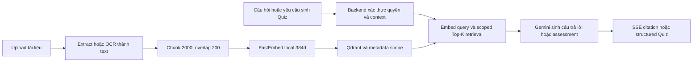

Có thể trình bày ngắn gọn:

> AILMS ingest tài liệu một lần bằng pipeline Extract/OCR → Chunk → FastEmbed local 384 chiều → Qdrant. Khi học viên chat hoặc giáo viên sinh Quiz, hệ thống không gửi lại toàn bộ kho tài liệu mà chỉ embedding câu hỏi, lọc vector theo role/course/class/lesson, lấy các chunk liên quan rồi mới đưa context cho Gemini. Backend giữ toàn bộ quyền nghiệp vụ, AI Service chỉ xử lý request nội bộ và Qdrant chỉ đóng vai trò semantic retrieval.

## 12. Source of truth trong mã nguồn

- AI ingestion: [`../ai-service/app/rag/ingestion_pipeline.py`](../ai-service/app/rag/ingestion_pipeline.py)
- Extractors: [`../ai-service/app/rag/extractors/`](../ai-service/app/rag/extractors/)
- Local embedder: [`../ai-service/app/catalog/local_embedder.py`](../ai-service/app/catalog/local_embedder.py)
- RAG embedder adapter: [`../ai-service/app/rag/embedder.py`](../ai-service/app/rag/embedder.py)
- Retriever: [`../ai-service/app/rag/retriever.py`](../ai-service/app/rag/retriever.py)
- Qdrant store: [`../ai-service/app/vector_store/qdrant_store.py`](../ai-service/app/vector_store/qdrant_store.py)
- Chat routing: [`../ai-service/app/routers/chat.py`](../ai-service/app/routers/chat.py)
- Assessment generation: [`../ai-service/app/services/assessment_generator.py`](../ai-service/app/services/assessment_generator.py)
- Backend class ingestion listener: [`../backend/ailms/src/main/java/com/ailms/event/ClassResourceKnowledgeSyncListener.java`](../backend/ailms/src/main/java/com/ailms/event/ClassResourceKnowledgeSyncListener.java)
- Backend lesson ingestion listener: [`../backend/ailms/src/main/java/com/ailms/event/LessonResourceKnowledgeSyncListener.java`](../backend/ailms/src/main/java/com/ailms/event/LessonResourceKnowledgeSyncListener.java)
- Student scope validation: [`../backend/ailms/src/main/java/com/ailms/service/imp/StudentLearningAiContextService.java`](../backend/ailms/src/main/java/com/ailms/service/imp/StudentLearningAiContextService.java)

