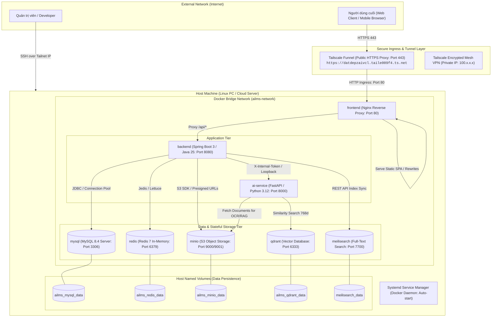
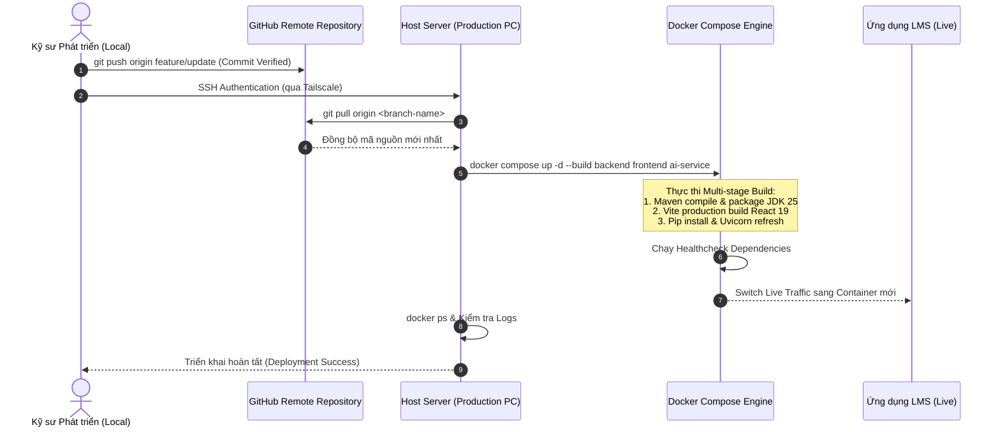
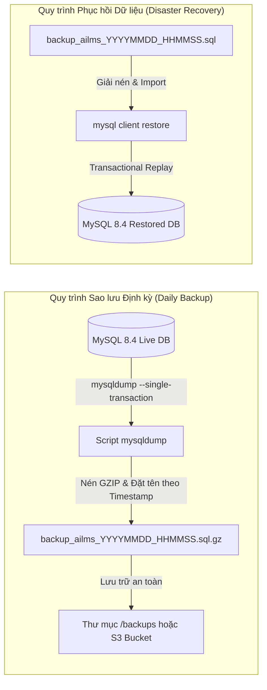
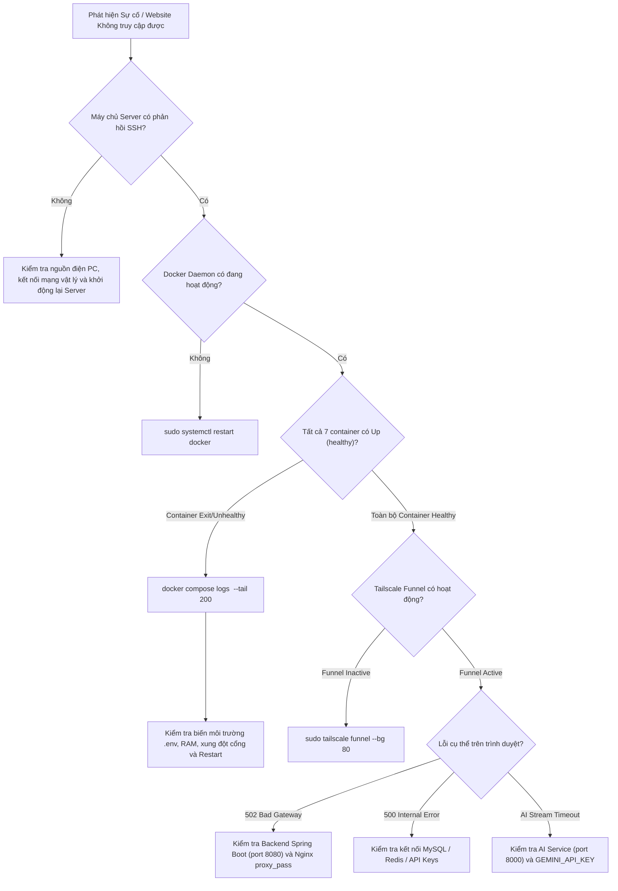

# 🖥️ AI Personalized LMS — Server & Infrastructure Operation Guide

<div align="center">


<p align="center">
  <b>Tài liệu Hướng dẫn Quản trị Máy chủ, Vận hành Hạ tầng Container và Quy trình Triển khai Hệ thống (DevOps & Server Operations)</b>
</p>

</div>

---

## 1. Kiến trúc Hạ tầng & Định tuyến Lưu lượng (Network Ingress Topology)

Toàn bộ hệ thống được triển khai trên nền tảng máy chủ Linux theo mô hình Container hóa hoàn chỉnh. Lưu lượng từ Internet được định tuyến an toàn qua **Tailscale Funnel (HTTPS Termination)** tới **Nginx Reverse Proxy** và phân phối vào mạng nội bộ **`ailms-network`**.



---

## 2. Truy cập Quản trị Máy chủ (Server Access)

### 2.1 Truy cập qua Mạng Tailscale VPN (Khuyên dùng)
```bash
# Truy cập qua địa chỉ Tailscale IP
ssh <username>@100.x.x.x

# Hoặc qua hostname máy chủ
ssh <username>@ailms-server
```

### 2.2 Di chuyển đến thư mục dự án & Kiểm tra biến môi trường
```bash
cd /home/datbritget/Documents/project-ai-lms/ai-personalized-lms

# Kiểm tra file cấu hình môi trường sản xuất
ls -la .env
```

---

## 3. Vận hành Vòng đời Dịch vụ (Docker Compose Orchestration)

### 3.1 Khởi động Toàn bộ Hệ sinh thái (Cold Start)
```bash
# Khởi chạy toàn bộ 7 dịch vụ ở chế độ background
docker compose up -d

# Theo dõi tiến trình khởi tạo và healthcheck
docker compose ps
```

*Trạng thái mong đợi sau khi toàn bộ healthcheck hoàn tất:*
```text
NAME                     IMAGE                      STATUS                    PORTS
ailms-frontend           ai-personalized-lms-fe     Up (healthy)              0.0.0.0:80->80/tcp
ailms-backend            ai-personalized-lms-be     Up (healthy)              0.0.0.0:8080->8080/tcp
ailms-ai-service         ai-personalized-lms-ai     Up (healthy)              127.0.0.1:8000->8000/tcp
ailms-mysql-docker       mysql:8.4                  Up (healthy)              0.0.0.0:3306->3306/tcp
ailms-redis-docker       redis:7-alpine             Up (healthy)              6379/tcp
ailms-meilisearch-docker getmeili/meilisearch:v1.15 Up (healthy)              0.0.0.0:7700->7700/tcp
ailms-qdrant-docker      qdrant/qdrant:v1.15.4      Up (healthy)              0.0.0.0:6333->6333/tcp
ailms-minio-docker       minio/minio:latest         Up (healthy)              0.0.0.0:9000->9000/tcp, 0.0.0.0:9001->9001/tcp
```

### 3.2 Khởi động lại Từng Dịch vụ Độc lập (Zero-Disruption Restart)
```bash
# Khởi động lại Backend Core (khi cập nhật cấu hình hoặc kiểm toán)
docker compose restart backend

# Khởi động lại AI Service
docker compose restart ai-service

# Khởi động lại Frontend Nginx
docker compose restart frontend
```

### 3.3 Tắt Hệ thống An toàn (Graceful Shutdown)
```bash
# Dừng container và giải phóng tài nguyên CPU/RAM (Dữ liệu trong volumes được bảo toàn)
docker compose down

# Tắt máy chủ từ xa an toàn
sudo shutdown -h now
```

---

## 4. Quy trình Cập nhật & Triển khai (Continuous Deployment Pipeline)



### Các lệnh thực thi triển khai:
```bash
# Bước 1: Kéo mã nguồn mới nhất
git pull

# Bước 2: Build lại các container có thay đổi mã nguồn
docker compose up -d --build

# Bước 3: Dọn dẹp các Docker image không sử dụng (Dangling Images)
docker image prune -f
```

---

## 5. Quản trị Cơ sở Dữ liệu & Khôi phục Thảm họa (Backup & Disaster Recovery)



### 5.1 Lệnh Tạo Bản sao lưu Cơ sở Dữ liệu (Full Database Backup)
```bash
# Tạo file backup có gắn timestamp
BACKUP_NAME="backup_ailms_$(date +%Y%m%d_%H%M%S).sql"

docker exec ailms-mysql-docker \
  mysqldump -u root -p"${MYSQL_ROOT_PASSWORD}" \
  --single-transaction --quick --databases ailms > "${BACKUP_NAME}"

echo "Đã tạo bản backup thành công: ${BACKUP_NAME}"
```

### 5.2 Lệnh Phục hồi Cơ sở Dữ liệu (Database Restore)
```bash
# Phục hồi dữ liệu từ bản sao lưu chỉ định
docker exec -i ailms-mysql-docker \
  mysql -u root -p"${MYSQL_ROOT_PASSWORD}" ailms < backup_ailms_20260814_150000.sql
```

---

## 6. Vận hành Tailscale Funnel & Kiểm tra Ingress

Tailscale Funnel đóng vai trò là cổng **HTTPS Ingress công khai** chuyển tiếp lưu lượng từ Internet vào cổng 80 của Nginx trên máy chủ.

```bash
# 1. Kiểm tra trạng thái mạng Tailscale
tailscale status

# 2. Kiểm tra trạng thái Funnel Ingress
tailscale funnel status
```

*Nếu Funnel bị tắt hoặc cần khởi động lại:*
```bash
# Bật chuyển tiếp cổng 80 ra Internet
sudo tailscale funnel --bg 80
```

---

## 7. Giám sát & Quản lý Nhật ký (Observability & Logging)

### 7.1 Xem Logs theo thời gian thực (Real-time Stream Logs)
```bash
# Theo dõi log Backend Core
docker logs -f ailms-backend --tail 100

# Theo dõi log AI Microservice
docker logs -f ailms-ai-service --tail 100

# Theo dõi log Nginx Frontend
docker logs -f ailms-frontend --tail 100

# Theo dõi log MySQL Server
docker logs -f ailms-mysql-docker --tail 100
```

### 7.2 Giám sát Tiêu thụ Tài nguyên Phần cứng (Resource Monitoring)
```bash
# Xem mức sử dụng CPU, RAM, Network I/O của toàn bộ 7 container
docker stats --no-stream
```

---

## 8. Tự động Phục hồi sau Sự cố (Self-Healing & Auto-Restart)

Hệ thống được thiết lập cơ chế tự phục hồi sau khi mất điện hoặc máy chủ khởi động lại:

1. **Systemd Service:** Kích hoạt Docker daemon khởi động cùng hệ điều hành:
   ```bash
   sudo systemctl enable docker
   ```
2. **Container Restart Policy:** Toàn bộ dịch vụ trong `docker-compose.yml` được cấu hình:
   ```yaml
   restart: always
   ```

---

## 🚨 9. Quy trình Xử lý Sự cố (Troubleshooting Decision Tree)



---

## 10. Bảng Tra cứu Lệnh Nhanh (Operations Cheat Sheet)

| Tác vụ | Lệnh thực thi nhanh |
| :--- | :--- |
| **Khởi chạy toàn bộ** | `docker compose up -d` |
| **Dừng toàn bộ** | `docker compose down` |
| **Rebuild & Update** | `git pull && docker compose up -d --build` |
| **Kiểm tra trạng thái** | `docker compose ps` |
| **Xem log realtime Backend** | `docker logs -f ailms-backend --tail 100` |
| **Xem log realtime AI** | `docker logs -f ailms-ai-service --tail 100` |
| **Kiểm tra Tailscale Funnel** | `tailscale funnel status` |
| **Kích hoạt Tailscale Funnel** | `sudo tailscale funnel --bg 80` |
| **Backup MySQL nhanh** | `docker exec ailms-mysql-docker mysqldump -u root -p ailms > backup.sql` |
| **Dọn dẹp Docker rác** | `docker system prune -f` |

---

<div align="center">
  <sub>Tài liệu Vận hành Hệ thống <b>AI Personalized LMS</b> — Duy trì bởi Đội ngũ Kỹ thuật.</sub>
</div>
