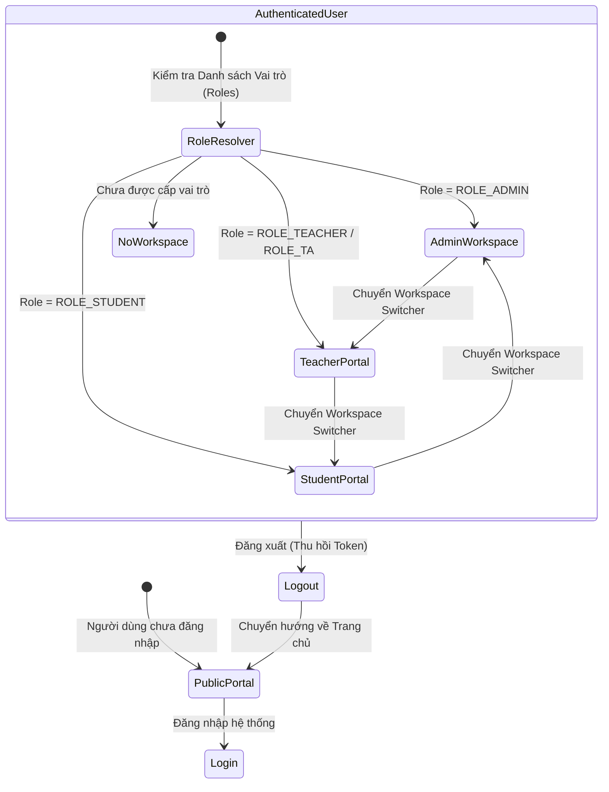
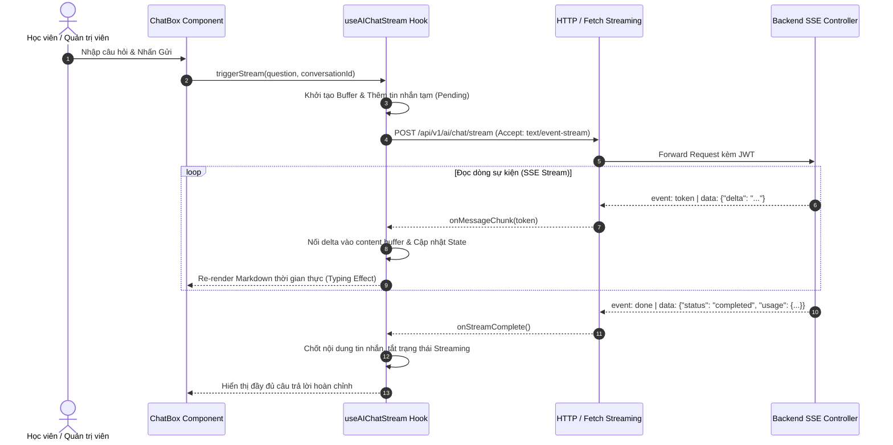

# ⚛️ AI Personalized LMS — Frontend Client (SPA)

<div align="center">


<p align="center">
  <b>Giao diện Ứng dụng Học tập Thông minh Đa Không gian làm việc (Multi-Portal Single Page Application)</b>
  <br />
  <i>Modern, High-Performance Frontend Architecture built with React 19, TypeScript, Tailwind CSS v4, shadcn/ui, Zustand, and Real-time SSE Streaming.</i>
</p>

</div>

---

## 1. Kiến trúc Tổng thể Frontend (Frontend Architecture)

Frontend được xây dựng theo mô hình **Component-Driven & Modular Architecture**, phân chia rõ ràng giữa tầng hiển thị (**Presentational Components**), tầng điều phối trạng thái (**Global Stores & Custom Hooks**), tầng giao tiếp dữ liệu (**Domain API Clients**) và cơ chế truyền phát dữ liệu thời gian thực (**Server-Sent Events**).

```mermaid
flowchart TD
    subgraph BrowserRuntime ["Browser Runtime (Client Tier)"]
        Router["React Router DOM v6 (Route Guards & Protected Routes)"]
        
        subgraph MultiPortalLayouts ["Multi-Portal Layout System"]
            AdminLayout["Admin Workspace Layout (Sidebar, Header, Breadcrumbs)"]
            TeacherLayout["Teacher Portal Layout (Course Builder, Grading, Classes)"]
            StudentLayout["Student Portal Layout (Dashboard, Schedule, Goals)"]
            PublicLayout["Public / Landing Layout (Catalog, Course Detail, Auth)"]
        end
        
        subgraph StateManagement ["Global State & Hooks (Zustand)"]
            AuthStore["useAuthStore (JWT, UserProfile, Roles)"]
            WorkspaceStore["useWorkspaceStore (Active Role Context)"]
            CartStore["useCartStore (Items, Vouchers, Checkout)"]
            SSEHook["useAIChatStream (SSE Chunk Buffer & Token State)"]
        end

        subgraph ComponentSystem ["Design System & UI Components"]
            ShadcnUI["shadcn/ui Primitives (Dialog, DataTable, Popover, Select,...)"]
            RHF["React Hook Form + Zod Resolvers (Type-Safe Forms)"]
            CoursePlayer["Course Video Player + Heartbeat Tracker (30s)"]
        end
    end

    subgraph ServiceLayer ["API Client & Network Layer"]
        AxiosClient["Axios HTTP Client (JWT Interceptor, Refresh Token, Error Mapping)"]
        SSEClient["EventSource / Fetch Streaming Client (SSE)"]
    end

    subgraph BackendAPI ["Spring Boot Backend Core"]
        REST["RESTful API Endpoints (/api/v1/*)"]
        SSEEndpoint["AI Chat Stream (/api/v1/ai/chat/stream)"]
    end

    Router --> MultiPortalLayouts
    MultiPortalLayouts --> ComponentSystem
    ComponentSystem <--> StateManagement
    
    StateManagement --> ServiceLayer
    ComponentSystem --> ServiceLayer
    
    AxiosClient -->|JSON Requests / Responses| REST
    SSEClient <-->|Real-time Token Stream (SSE)| SSEEndpoint
```

---

## 2. Các Phân hệ Không gian làm việc (Multi-Portal Architecture)

Hệ thống cho phép người dùng chuyển đổi mượt mà giữa các không gian làm việc (**Dynamic Workspace Switcher**) mà không cần đăng nhập lại, tự động áp dụng phân quyền giao diện theo ma trận Role & Permission:



### 1. Admin Workspace (`/admin/*`)
- **Quản trị Định danh & Phân quyền:** Ma trận Role & Permission (`PermissionMatrix`), gán quyền động, quản lý User và cấp phát Token kích hoạt tài khoản.
- **Quản lý Nhân sự (HRM) & Hợp đồng:** Quản lý hồ sơ nhân viên, mã nhân viên `{PREFIX}-{yyMM}-{SEQ}`, hợp đồng lao động, chấm công Full-time và bảng lương.
- **Trung tâm Phê duyệt (Approval Center):** Máy trạng thái duyệt xuất bản khóa học, hợp đồng, đơn nghỉ phép kèm ghi nhận **Audit Log Diff**.
- **Quản trị Tài chính & Đơn hàng:** Thống kê doanh thu, quản lý đơn hàng, coupon giảm giá và hoàn tiền.
- **Thùng rác Hợp nhất (Unified Trash System):** Khôi phục (Restore) hoặc Xóa vĩnh viễn (Hard Delete) với công cụ kiểm tra ràng buộc dữ liệu con.

### 2. Teacher / Instructor Portal (`/teacher/*`)
- **Course Builder Shell:** Soạn thảo chương trình học trực quan, chia chương mục (`Section`), bài học (`Lesson`), tải lên học liệu và cấu hình điều kiện cấp chứng chỉ.
- **Chấm điểm & Đánh giá:** Quản lý ngân hàng câu hỏi, bài thi Quiz trắc nghiệm, chấm bài tập tự luận (`Assignment Grading`).
- **Quản lý Lớp học & Buổi dạy:** Nhận lớp giảng dạy theo danh mục (`Suggested Classes`), điểm danh học viên và theo dõi thu nhập theo buổi dạy online.

### 3. Student Portal (`/student/*`)
- **Dashboard Học tập Cá nhân hóa:** Thống kê khóa học đang học, bài học tiếp theo, tiến độ tổng quan.
- **Onboarding Mục tiêu & Streak Tracking:** Thiết lập mục tiêu học tập (`Study Goal`), theo dõi chuỗi học liên tục (`Current Streak` / `Longest Streak`) kết hợp **Page Visibility API & Heartbeat Tracking 30s**.
- **Course Player:** Trình phát video bài giảng chuyên nghiệp, quản lý trạng thái khóa/mở bài học (`Free Preview` vs `Locked`), tài liệu đính kèm và thảo luận.
- **Cổng Thanh toán & Khóa học:** Giỏ hàng, áp dụng Voucher khuyến mãi, thanh toán PayPal Sandbox Idempotent và tải hóa đơn điện tử PDF.

---

## 3. Cơ chế AI Chat Streaming thời gian thực (Server-Sent Events)

Frontend triển khai Custom Hook chuyên dụng xử lý luồng sự kiện **Server-Sent Events (SSE)**, giúp giải mã và render trực tiếp dữ liệu dạng dòng (Markdown, Code Syntax Highlighting) với hiệu ứng gõ chữ tự nhiên.


---

## 4. Design System & Chuẩn mực Giao diện

- **Thư viện UI Lõi:** Sử dụng **shadcn/ui** xây dựng trên nền tảng **Radix UI Primitives** đảm bảo khả năng tiếp cận chuẩn mực (WAI-ARIA Accessibility).
- **Bộ màu & Typography:** Sử dụng Tailwind CSS v4 với hệ màu HSL linh hoạt, tối ưu tương phản thị giác, hệ thống Typography rõ ràng.
- **Quản lý Form an toàn kiểu dữ liệu (Type-Safe Forms):** Kết hợp **React Hook Form** và **Zod Schema Validation** cho mọi thao tác nhập liệu:
  ```ts
  const loginSchema = z.object({
    usernameOrEmail: z.string().min(1, "Vui lòng nhập tài khoản hoặc email"),
    password: z.string().min(6, "Mật khẩu phải chứa ít nhất 6 ký tự"),
  });
  type LoginFormValues = z.infer<typeof loginSchema>;
  ```
- **Xử lý trạng thái tải & dữ liệu rỗng (UX States):** Mọi bảng dữ liệu và trang chi tiết đều có trạng thái **Skeleton Loading**, **Empty State minh họa** và **Toast Notification phản hồi tức thì**.

---

## 5. Cấu hình Môi trường & Hướng dẫn Khởi chạy

### 1. Yêu cầu hệ thống
- **Node.js:** Phiên bản 20.x hoặc 22.x LTS trở lên.
- **Trình quản lý gói:** `npm` (hoặc `pnpm` / `yarn`).

### 2. Cài đặt thư viện
```bash
cd frontend/ailms-frontend
npm install
```

### 3. Khởi chạy máy chủ phát triển (Development Server)
```bash
npm run dev
```
*Giao diện sẽ khởi chạy tại `http://localhost:5173`. Toàn bộ request `/api/*` sẽ được Vite Proxy tự động chuyển hướng về Backend `http://localhost:8080`.*

### 4. Kiểm tra mã nguồn & Đóng gói sản phẩm (Build & Lint)
```bash
# Kiểm tra lỗi cú pháp TypeScript và ESLint
npm run lint

# Đóng gói sản xuất (Production Build)
npm run build

# Xem trước bản build tĩnh
npm run preview
```

---

## 6. Đóng gói Container với Docker & Nginx

Frontend được tối ưu hóa thông qua **Multi-stage Dockerfile**:
1. **Stage 1 (Builder):** Sử dụng `node:20-alpine` để cài đặt dependencies và thực thi lệnh `npm run build`.
2. **Stage 2 (Production Server):** Sử dụng `nginx:alpine-slim` gọn nhẹ (dung lượng < 30MB) để serve các tệp tĩnh và cấu hình rewrite `try_files $uri $uri/ /index.html;` phục vụ Single Page Application routing.

```bash
# Build Docker image độc lập
docker build -t ailms-frontend:latest .

# Chạy container
docker run -d -p 80:80 --name ailms-frontend ailms-frontend:latest
```

---

<div align="center">
  <sub>Được phát triển với tiêu chuẩn UI/UX bởi <b>Vũ Tiến Đạt</b></sub>
</div>
